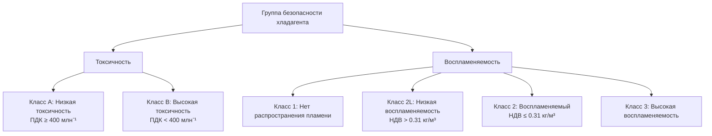

# Выбор хладагента и его свойства для инженеров HVAC

Выбор хладагента влияет на производительность системы, безопасность, соответствие экологическим требованиям и эксплуатационные расходы. Это руководство охватывает классификацию хладагентов, свойства, экологические показатели и критерии выбора согласно стандарту ASHRAE 34.

## Система нумерации хладагентов ASHRAE

**Формат:** R-[число][буква]

**Органические соединения (ХФУ, ГХФУ, ГФУ, ГФО):**
- Первая цифра: (количество атомов углерода) - 1
- Вторая цифра: (количество атомов водорода) + 1
- Третья цифра: количество атомов фтора
- Буквенный суффикс (a, b, c): обозначение изомера

**Примеры:**
- R-134a: C₂H₂F₄ (1,1,1,2-тетрафторэтан)
- R-410A: Зеотропная смесь R-32/R-125 (50/50 масс.)
- R-407C: Зеотропная смесь

**Неорганические соединения:**
- R-717: Аммиак (NH₃)
- R-718: Вода (H₂O)
- R-744: Углекислый газ (CO₂)

## Классификация безопасности (ASHRAE 34)

**Группы безопасности:**

| Группа | Токсичность | Воспламеняемость | Примеры |
|--------|------------|-----------------|---------|
| A1 | Низкая | Нет | R-134a, R-410A, R-404A, R-407C |
| A2L | Низкая | Низкая | R-32, R-454B, R-1234yf, R-1234ze |
| A2 | Низкая | Воспламеняемый | R-152a, R-290 (пропан) |
| A3 | Низкая | Высокая | R-290, R-600a (изобутан), R-1270 |
| B1 | Высокая | Нет | R-123 |
| B2 | Высокая | Воспламеняемый | Аммиак (R-717) |

## Показатели воздействия на окружающую среду

**Потенциал разрушения озона (ОДП):**

Относительно R-11 (ХФУ-11 = 1,0)

- **ХФУ:** ОДП = 0,6–1,0 (снят с производства)
- **ГХФУ:** ОДП = 0,01–0,1 (снимается с производства)
- **ГФУ:** ОДП = 0 (без хлора)
- **ГФО:** ОДП = 0

**Потенциал глобального потепления (ПГП):**

Относительно CO₂ за 100-летний период (CO₂ = 1)

| Хладагент | ОДП | ПГП (AR5) | Статус |
|-----------|-----|----------|--------|
| R-11 (ХФУ) | 1,0 | 4 660 | Запрещен |
| R-12 (ХФУ) | 1,0 | 10 200 | Запрещен |
| R-22 (ГХФУ) | 0,055 | 1 760 | Снятие с производства |
| R-134a (ГФУ) | 0 | 1 300 | Ограничен |
| R-404A (ГФУ) | 0 | 3 920 | Ограничен |
| R-410A (ГФУ) | 0 | 2 088 | Текущий стандарт |
| R-407C (ГФУ) | 0 | 1 770 | Текущий стандарт |
| R-32 (ГФУ) | 0 | 677 | Низкий ПГП |
| R-454B (смесь ГФО) | 0 | 466 | Низкий ПГП |
| R-1234yf (ГФО) | 0 | 4 | Очень низкий ПГП |
| R-1234ze (ГФО) | 0 | 7 | Очень низкий ПГП |
| R-744 (CO₂) | 0 | 1 | Природный |
| R-717 (NH₃) | 0 | <1 | Природный |
| R-290 (пропан) | 0 | 3 | Природный |

## Термофизические свойства

### Распространенные хладагенты для HVAC (при испарении 4,4 °C, конденсации 37,8 °C)

| Хладагент | P_испар (кПа) | P_конд (кПа) | Коэффициент давления | Температура на выходе (°C) | COP |
|-----------|---------------|--------------|-------------------|--------------------|-----|
| R-134a | 255 | 857 | 3,36 | 52 | 5,2 |
| R-410A | 819 | 2 358 | 2,88 | 57 | 5,5 |
| R-407C | 547 | 1 577 | 2,88 | 54 | 5,3 |
| R-32 | 684 | 1 943 | 2,84 | 63 | 5,7 |
| R-454B | 693 | 1 952 | 2,82 | 54 | 5,6 |
| R-22 | 472 | 1 354 | 2,87 | 57 | 5,4 |

### Объемная холодопроизводительность

**Холодопроизводительность на единицу объема:**

$$Q_v = \frac{\dot{m}_r (h_1 - h_4)}{v_1}$$

Где $v_1$ = удельный объем на входе компрессора (м³/кг)

| Хладагент | Объемная холодопроизводительность (кДж/м³) | Размер компрессора (относительно R-22) |
|-----------|-------------------------------------------|----------------------------------------|
| R-22 | 1 949 | 1,00 (базовое значение) |
| R-134a | 1 014 | 1,93 |
| R-410A | 2 741 | 0,71 |
| R-407C | 1 879 | 1,04 |
| R-32 | 3 082 | 0,63 |
| R-717 (аммиак) | 8 014 | 0,24 |

Более высокая объемная холодопроизводительность = меньший компрессор для одинакового охлаждения

## Выбор по приложениям

### Кондиционирование воздуха в жилых помещениях

**Текущий стандарт:** R-410A (A1, ПГП 2088)

**Варианты замены:**
- R-32 (A2L, ПГП 677): Более высокая эффективность, слегка воспламеняемый
- R-454B (A2L, ПГП 466): Прямая замена, более низкое давление

**Переход:** Новое оборудование переходит на низкогвп хладагенты A2L

### Коммерческое охлаждение

**Текущие стандарты:**
- Универсальные стеллажи: R-404A, R-407A (высокий ПГП)
- Витрины: R-404A, R-134a

**Варианты замены:**
- R-448A (A1, ПГП 1273): Модификация R-404A
- R-449A (A1, ПГП 1282): Модификация R-404A
- R-744 (CO₂): Трансверсальные системы для холодного климата
- R-290 (пропан): Небольшие герметичные системы (ограничения по зарядке)

### Системы охлажденной воды

**Текущий стандарт:** R-134a (A1, ПГП 1300)

**Варианты замены:**
- R-513A (A1, ПГП 573): Прямая замена R-134a
- R-1234ze (A2L, ПГП 7): Новое оборудование
- R-1233zd (B1, ПГП 7): Охладители низкого давления

### Промышленное охлаждение

**Текущий стандарт:** R-717 (аммиак, B2, ПГП <1)

**Преимущества:**
- Отличные термодинамические свойства
- Нулевой ПГП
- Низкая стоимость

**Недостатки:**
- Токсичен (ПДК 25 млн⁻¹)
- Воспламеняемый
- Требует строгих мер безопасности

**Альтернатива:** R-744 (CO₂) для каскадных систем

## Нормативные требования к хладагентам

**Монреальский протокол (1987):** Снятие с производства веществ, разрушающих озон
- ХФУ: Запрещены с 1996 г.
- ГХФУ (R-22): Запрет на производство 2020 г.

**Киотское поправка (2016):** Поэтапный отказ от ГФУ
- График сокращения, взвешенный по ПГП
- Сокращение на 85% к 2036 г. (развитые страны)

**Программа EPA SNAP:** Запрещает высокогвп хладагенты в конкретных приложениях

**Регламент ЕС по газам с ФП:** Система квот ГФУ, запреты на обслуживание высокогвп

## Смеси хладагентов

**Азеотропная:** Ведет себя как одно вещество (постоянная точка кипения)
- Пример: R-507A (R-125/R-143a 50/50)

**Зеотропная:** Перепад температур при фазовом переходе
- Пример: R-407C (перепад ~5,6 °C)
- Требует тщательной зарядки (только жидкость)

**Влияние перепада температур:**
- Снижает эффективность теплопередачи
- Усложняет управление перегревом
- Влияет на проектирование системы

## Итоговые критерии выбора

1. **Безопасность:** Соответствие строительным кодексам, ограничениям по зарядке
2. **Окружающая среда:** Минимизация ПГП, соответствие нормативам
3. **Производительность:** COP, холодопроизводительность, рабочие давления
4. **Совместимость:** Тип масла, материалы, существующее оборудование
5. **Доступность:** Региональное предложение, стоимость
6. **Будущестойкость:** Тренды в нормативах

---

**Связанные технические руководства:**
- Цикл паровой компрессии
- Выбор и производительность компрессоров
- Расчеты холодильной нагрузки

**Ссылки:**
- ASHRAE Standard 34: Designation and Safety Classification of Refrigerants
- ASHRAE Handbook of Refrigeration, Chapter 29: Refrigerants
- EPA Significant New Alternatives Policy (SNAP) Program
- AHRI Guideline N: Assignment of Refrigerant Container Colors
