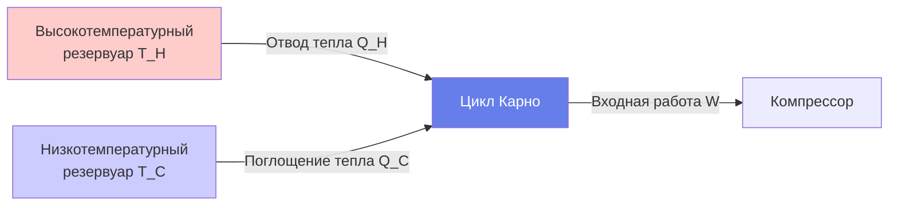
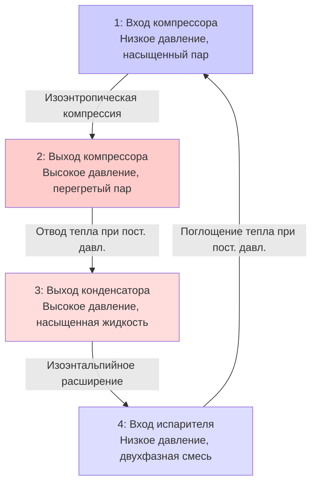

# Термодинамические циклы для инженеров HVAC

Термодинамические циклы преобразуют тепловую энергию в механическую работу (энергетические циклы) или передают тепло из холодного резервуара в горячий (холодильные циклы). Понимание пределов эффективности цикла, поведения компонентов и оптимизации производительности позволяет правильно выбирать и эксплуатировать оборудование HVAC.

## Цикл Карно — идеальный эталон

Цикл Карно представляет максимальную теоретическую эффективность для любого теплового двигателя или холодильника, работающего между двумя температурными резервуарами.

### Эффективность теплового двигателя Карно

$$\eta_{Carnot} = 1 - \frac{T_C}{T_H}$$

Где:
- $\eta_{Carnot}$ = коэффициент полезного действия (безразмерный)
- $T_C$ = абсолютная температура холодного резервуара (K)
- $T_H$ = абсолютная температура горячего резервуара (K)

**Физический смысл:** Ни один реальный цикл не может превысить эффективность Карно. Чем больше разница температур, тем выше потенциальная эффективность.

### COP холодильного цикла Карно

$$COP_{Carnot,cooling} = \frac{T_C}{T_H - T_C}$$

$$COP_{Carnot,heating} = \frac{T_H}{T_H - T_C}$$

Где COP = коэффициент производительности (безразмерный, выше — лучше).

**Ключевое понимание:** COP холодильного цикла снижается с увеличением температурного перепада $(T_H - T_C)$. Это объясняет, почему кондиционеры работают интенсивнее (потребляют больше энергии) в чрезвычайно жаркие дни.

## Цикл Ранкина — генерация пара

Цикл Ранкина обеспечивает работу паровых турбин в крупных системах когенерации (ТЭЦ) и центральных отопительных установках.

### Компоненты цикла Ранкина

1. **Котёл**: подвод тепла при постоянном давлении, преобразование воды в перегретый пар
2. **Турбина**: изоэнтропическое расширение, производство механической работы
3. **Конденсатор**: отвод тепла при постоянном давлении, конденсация пара в жидкость
4. **Насос**: изоэнтропическая компрессия, возврат конденсата в давление котла

### Эффективность цикла Ранкина

$$\eta_{Rankine} = \frac{W_{net}}{Q_{in}} = \frac{(h_1 - h_2) - (h_4 - h_3)}{h_1 - h_4}$$

Где:
- $h$ = удельная энтальпия (кДж/кг)
- Состояние 1: вход турбины (высокое давление, высокая температура перегретого пара)
- Состояние 2: выход турбины (низкое давление, насыщенный пар)
- Состояние 3: вход насоса (низкое давление, насыщенная жидкость)
- Состояние 4: выход насоса (высокое давление, сжатая жидкость)

**Типичные значения:**
- Простой цикл Ранкина: 30–40% эффективности
- Цикл Ранкина с повторным нагревом: 40–45% эффективности
- Комбинированный цикл (газовая турбина + пар): 55–60% эффективности

### Расчётный пример: анализ цикла Ранкина

**Дано:**
Система паровой турбины:
- Выход котла: 4,14 МПа, 426,7°C (состояние 1)
- Давление конденсатора: 6,9 кПа (состояния 2, 3)
- Изоэнтропическая эффективность турбины: 85%
- Изоэнтропическая эффективность насоса: 90%

Из таблиц пара:
- $h_1 = 3 282$ кДж/кг (перегретый пар при 4,14 МПа, 426,7°C)
- $h_{2s} = 2 189$ кДж/кг (изоэнтропическое расширение до 6,9 кПа)
- $h_3 = 163$ кДж/кг (насыщенная жидкость при 6,9 кПа)
- $h_{4s} = 165$ кДж/кг (изоэнтропическая компрессия до 4,14 МПа)

**Найти:** фактическую эффективность цикла

**Решение:**

Шаг 1: расчёт фактической работы турбины.

$$h_2 = h_1 - \eta_t(h_1 - h_{2s}) = 3 282 - 0,85(3 282 - 2 189) = 2 336 \text{ кДж/кг}$$

Шаг 2: расчёт фактической работы насоса.

$$h_4 = h_3 + \frac{h_{4s} - h_3}{\eta_p} = 163 + \frac{165 - 163}{0,90} = 165 \text{ кДж/кг}$$

Шаг 3: расчёт чистой выходной работы.

$$w_{net} = (h_1 - h_2) - (h_4 - h_3) = (3 282 - 2 336) - (165 - 163) = 944 \text{ кДж/кг}$$

Шаг 4: расчёт входного тепла.

$$q_{in} = h_1 - h_4 = 3 282 - 165 = 3 117 \text{ кДж/кг}$$

Шаг 5: расчёт коэффициента полезного действия.

$$\eta = \frac{w_{net}}{q_{in}} = \frac{944}{3 117} = 0,303 = 30,3\%$$

**Ответ:** эффективность цикла = 30,3%

**Инженерное понимание:** неэффективность компонентов снижает идеальную эффективность цикла. Потери в турбине снижают выходную работу на 15%, тогда как неэффективность насоса незначительна (сжатие жидкости требует минимальных затрат работы по сравнению с расширением пара). Более высокие температуры котла и более низкие давления конденсатора повышают эффективность, но сталкиваются с ограничениями материалов и температуры охлаждающей воды.

## Цикл паровой компрессии холодильного оборудования

Цикл паровой компрессии — основа воздушного кондиционирования, холодильного оборудования и тепловых насосов.

### Идеальный цикл паровой компрессии

### Метрики производительности холодильного цикла

**COP охлаждения:**

$$COP_{cooling} = \frac{Q_L}{W_{comp}} = \frac{h_1 - h_4}{h_2 - h_1}$$

**COP отопления (тепловой насос):**

$$COP_{heating} = \frac{Q_H}{W_{comp}} = \frac{h_2 - h_3}{h_2 - h_1}$$

Где:
- $Q_L$ = холодильная мощность (кВт)
- $Q_H$ = тепловая мощность (кВт)
- $W_{comp}$ = мощность компрессора (кВт)

**Коэффициент энергетической эффективности (EER):**

$$EER = \frac{Q_L \text{ (кВт)}}{W_{comp} \text{ (кВт)}}$$

**Сезонный коэффициент энергетической эффективности (SEER):**
взвешенное среднее значение EER в течение типичного сезона охлаждения (выше — лучше).

**Типичные значения:**
- Жилое кондиционирование: SEER 3,8–6,0, EER 2,9–4,0
- Коммерческий чиллер: COP 4,0–6,5
- Тепловой насос (отопление): COP 2,5–4,5 (HSPF 2,3–3,9)

## Отклонения реальных циклов от идеального

### Неэффективность компрессора

Изоэнтропическая эффективность учитывает реальную компрессию:

$$\eta_{comp} = \frac{h_{2s} - h_1}{h_2 - h_1}$$

Где $h_{2s}$ — идеальная энтальпия на выходе.

Типичные эффективности компрессоров:
- Поршневые: 70–80%
- Спиральные: 65–75%
- Винтовые: 70–85%
- Центробежные: 75–85%

### Перепады давления

- **Линия всасывания**: потеря 7–14 кПа снижает мощность
- **Линия нагнетания**: потеря 14–34 кПа увеличивает мощность
- **Линия жидкости**: минимальное воздействие при переохлаждении

### Перегрев и переохлаждение

**Перегрев** (выход испарителя):
- гарантирует только пар на входе в компрессор
- типично: 5,6–8,3°C выше насыщения

**Переохлаждение** (выход конденсатора):
- гарантирует только жидкость на устройстве расширения
- типично: 5,6–11,1°C ниже насыщения
- преимущества: увеличивает мощность, предотвращает испарение газа

## Анализ эксергии

Эксергия количественно определяет потенциал работы энергии относительно условий окружающей среды.

**Эксергия теплопередачи:**

$$Ex = Q\left(1 - \frac{T_0}{T}\right)$$

Где $T_0$ = абсолютная температура окружающей среды.

**Значимость:**
- высокотемпературное тепло имеет высокую эксергию (может эффективно производить работу)
- низкотемпературное тепло имеет низкую эксергию (ограниченный потенциал работы)
- системы HVAC, согласующие температуры источников/приёмников, минимизируют разрушение эксергии

## Практические приложения

### Выбор оборудования

1. **Эффективность чиллера**: выбирайте чиллеры с COP > 5,0 для соответствия энергетическим кодексам
2. **Точка баланса теплового насоса**: рассчитайте, где COP теплового насоса равен COP электрического сопротивления (COP = 1,0)
3. **Производительность при частичной нагрузке**: оцените IPLV (интегральное значение при частичной нагрузке) для фактических условий работы

### Проектирование системы

1. **Минимизация температурного перепада**: уменьшите $(T_H - T_C)$ для максимизации COP
   - используйте сброс управления: снижайте температуру охлаждённой воды при снижении нагрузок
   - увеличивайте температуру воды конденсатора в холодную погоду

2. **Преимущества переохлаждения**: каждое переохлаждение на 0,5°C повышает мощность примерно на 0,5%

3. **Управление перегревом**: поддерживайте 5,6–8,3°C перегрева для оптимальной мощности без риска гидравлического удара

## Типичные ошибки проектирования

- **игнорирование реальной эффективности компонентов**: идеальный COP цикла переоценивает производительность на 30–50%
- **переоборудование**: снижает эффективность при частичной нагрузке и потери при циклировании
- **фиксированные уставки**: упущенные сбережения от стратегий сброса (охлаждённая вода, вода конденсатора)
- **чрезмерный перегрев**: снижает мощность и эффективность
- **недостаточное переохлаждение**: образование испарений газа снижает мощность

## Резюме

Термодинамические циклы определяют пределы производительности оборудования HVAC:

- **Цикл Карно** устанавливает теоретический максимум эффективности/COP
- **Цикл Ранкина** обеспечивает паровые турбины в системах ТЭЦ (30–40% эффективности)
- **Цикл паровой компрессии** доминирует в холодильном оборудовании и кондиционировании воздуха
- **COP** количественно определяет эффективность холодильного цикла: выше COP = лучше производительность
- **Реальные циклы** отклоняются от идеального из-за неэффективности компонентов и перепадов давления
- **Анализ эксергии** выявляет, где происходит деградация энергии в системах

Понимание термодинамики циклов позволяет правильно подбирать размеры оборудования, предсказывать производительность и оптимизировать энергопотребление.

---

**Связанные технические руководства:**
- Основы теплопередачи
- Проектирование холодильного цикла
- Анализ производительности чиллера
- Технология теплового насоса

**Ссылки:**
- ASHRAE Handbook of Fundamentals, глава 2: Термодинамика и циклы холодильного оборудования
- ASHRAE Handbook of HVAC Systems and Equipment, глава 38: Компрессоры
- Moran, M.J., Shapiro, H.N., Fundamentals of Engineering Thermodynamics, 8th Edition
