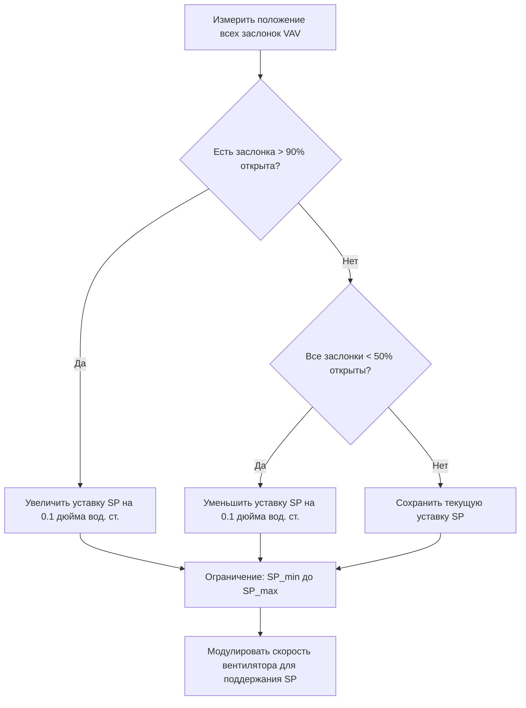

# Проектирование систем с переменным расходом для инженеров HVAC

Системы с переменным расходом модулируют воздушный или водяной поток в соответствии с фактической нагрузкой, что снижает энергопотребление вентиляторов и насосов на 30–60% по сравнению с системами постоянного объема. Правильное проектирование требует понимания минимальных пределов расхода, коэффициентов одновременности и стратегий управления.

## Экономия энергии вентиляторами

**Законы подобия для вентиляторов:**

$$\frac{CFM_2}{CFM_1} = \frac{RPM_2}{RPM_1}$$

$$\frac{Power_2}{Power_1} = \left(\frac{RPM_2}{RPM_1}\right)^3$$

**При 50% воздушного потока:**

$$Power_{50\%} = 0.5^3 = 0.125 = 12.5\%$$ от полной мощности

**Экономия энергии:** снижение на 87.5% при половинном расходе

<h3>Пример 1: Экономия энергии VAV</h3>

**Исходные данные:**
- Расчетный воздушный поток: 20 000 CFM (33 980 м³/ч)
- Мощность вентилятора при полной нагрузке: 15 л.с. (11.19 кВт)
- Средний рабочий воздушный поток: 60% от расчетного
- Часы работы: 4 000 часов/год
- Стоимость электроэнергии: 0.12 $/кВт·ч

**Найти:** Годовая экономия энергии по сравнению с системой постоянного объема

**Решение:**

Мощность при переменной скорости на 60% потока:

$$Power_{60\%} = 15 \times 0.6^3 = 15 \times 0.216 = 3.24 \text{ л.с.} (2.42 \text{ кВт})$$

Экономия энергии в час:

$$\Delta E = (15 - 3.24) \times 0.746 = 8.76 \text{ кВт}$$

Годовая экономия:

$$Savings = 8.76 \times 4000 \times 0.12 = 4 205 \text{ \$}$$

**Ответ:** 4 205 $/год экономии энергии (снижение на 76%)

## Проектирование системы VAV

### Минимальный воздушный поток

**Причины для минимального потока:**
1. Обеспечение требований по вентиляции (ASHRAE 62.1)
2. Поддержание циркуляции воздуха
3. Предотвращение стратификации
4. Обеспечение эффективности диффузоров

**Типичный минимум:** 30–50% от расчетного воздушного потока

**Расчет:**

$$CFM_{min} = \max\left(CFM_{ventilation}, 0.3 \times CFM_{design}\right)$$

### Коэффициент одновременности

**Не все зоны находятся в пиковой нагрузке одновременно**

**Системный коэффициент одновременности:**

$$Diversity = \frac{\sum CFM_{design,zones}}{CFM_{AHU,actual}}$$

**Типичные значения:**
- Офисные здания: 1.2–1.4
- Школы: 1.1–1.3
- Больницы: 1.0–1.1 (меньше одновременности)

**Влияние:** Позволяет уменьшить размеры воздухообрабатывающих агрегатов (AHU) и воздуховодов

### Управление статическим давлением

**Расположение уставочного значения:** на расстоянии 2/3 от вентилятора до самого удаленного терминала

**Стратегия управления:**

$$SP_{setpoint} = SP_{design} \times \left(\frac{CFM_{actual}}{CFM_{design}}\right)^2$$

**Сброс статического давления:**
- Мониторинг положения всех дроссельных заслонок VAV
- Если все заслонки открыты менее чем на 90%, снизить уставку статического давления
- Экономия энергии вентилятора без потери качества управления

## Независимые от давления терминалы VAV

**Преимущества:**
- Поддержание расчетного воздушного потока независимо от колебаний давления в воздуховоде
- Упрощенная балансировка
- Лучшая стабильность управления

**Компоненты:**
- Датчик воздушного потока (давление сетки или термоанемометр)
- Контроллер с уставкой воздушного потока
- Регулирующая заслонка с приводом

**Управление:**

$$Damper\% = f\left(CFM_{setpoint} - CFM_{measured}\right)$$

## Переменный первичный поток холодной воды

**Заменяет схему «постоянный первичный / переменный вторичный»** на единый контур с переменным потоком

**Преимущества:**
- Устранение первичных насосов
- Снижение сложности трубопроводов
- Снижение первоначальных затрат и энергопотребления

**Требования:**
1. **Минимальный поток через чиллеры:** Использовать байпасный клапан или трехходовой клапан
2. **Изоляция чиллеров:** Двухходовые клапаны на каждом чиллере
3. **Управление дифференциальным давлением:** Поддержание 103–138 кПа (15–20 psi) по системе

**Расчет минимального потока:**

$$GPM_{min,chiller} = 0.6–0.9 \text{ м/с} \times A_{evaporator}$$

Обычно составляет 30–50% от расчетного потока

## Экономия энергии насосами

**Законы подобия для насосов:**

$$\frac{GPM_2}{GPM_1} = \frac{RPM_2}{RPM_1}$$

$$\frac{Head_2}{Head_1} = \left(\frac{RPM_2}{RPM_1}\right)^2$$

$$\frac{Power_2}{Power_1} = \left(\frac{RPM_2}{RPM_1}\right)^3$$

**Переменная скорость vs. постоянная скорость:**

<h3>Пример 2: Энергопотребление насоса при частичной нагрузке</h3>

**Исходные данные:**
- Расчетный расход: 500 GPM (1893 л/мин) при напоре 60 футов (18.3 м)
- Расход при частичной нагрузке: 250 GPM (946 л/мин) (50%)
- КПД насоса: 75%

**Найти:** Экономия мощности при использовании ЧРП по сравнению с дроссельным клапаном

**Решение:**

**Постоянная скорость с дроссельным клапаном:**

Мощность не меняется (все еще перекачка против напора 18,3 м)

$$Power_{constant} = \frac{500 \times 18,3}{3960 \times 0,75} = 10,1 \text{ л.с.}$$

**Переменная скорость:**

Отношение скоростей: 50%

Напор при 50% расхода:

$$Head_{50\%} = 18,3 \times 0,5^2 = 4,58 \text{ м}$$

$$Power_{variable} = \frac{250 \times 4,58}{3960 \times 0,75} = 1,26 \text{ л.с.}$$

**Экономия:** $(10,1 - 1,26) / 10,1 = 87,5\%$

**Ответ:** Экономия энергии 87,5% при использовании ЧРП на 50% расхода

## Подбор и выбор ЧРП

**ЧРП должен соответствовать двигателю:**
- Напряжение (230 В, 460 В и т.д.)
- Ток (номинальный ток полной нагрузки по табличке)
- Номинальная мощность в лошадиных силах

**Типичный КПД:**
- 95–97% при полной нагрузке
- 92–95% при нагрузке 50%

**Митигация гармоник:**
- Использовать дроссели на входе (импеданс 3–5%)
- Или пассивные фильтры гармоник

## Практические соображения проектирования

1. **Проектирование воздуховодов:** Размерировать с учетом фактического разнообразия, а не суммы пиковых значений
2. **Минимальный расход:** Проверить требования к вентиляции при всех режимах нагрузки
3. **Перепускные заслонки:** Избегать — приводят к потере энергии
4. **Датчики давления:** Размещать в репрезентативном месте (точка на 2/3 пути)
5. **Пусконаладка:** Проверить минимальный расход, коэффициенты разнообразия и стратегии пересчета

---

**Связанные технические руководства:**
- Стратегии управления HVAC
- Выбор и характеристики вентиляторов
- Расчет статического давления в воздуховодах

**Ссылки:**
- Справочник ASHRAE по системам и оборудованию HVAC, Глава 48: Системы с переменным расходом
- Руководство ASHRAE 36: Высокоэффективные последовательности работы для систем HVAC
- Taylor Engineering: «Оптимизация проектирования и управления холодильными установками»
