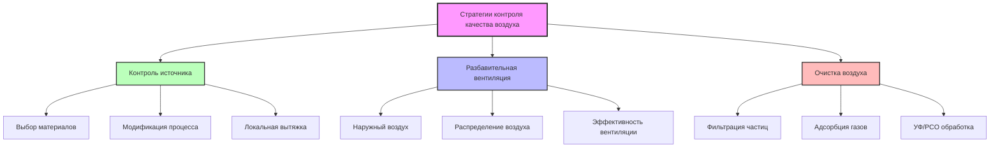
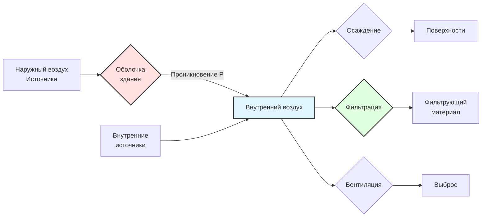

# Управление качеством внутреннего воздуха

Управление качеством внутреннего воздуха представляет собой критически важную дисциплину контроля окружающей среды здания, оказывающую прямое влияние на здоровье занимающихся, когнитивную производительность и производительность труда. Современная практика управления качеством воздуха интегрирует инженерию вентиляции, контроль источников загрязнения, технологии очистки воздуха и непрерывный мониторинг для поддержания приемлемого качества воздуха в занимаемых пространствах.

## Фундаментальные параметры качества внутреннего воздуха

### Массовый баланс загрязнителей

Установившаяся концентрация загрязнителя в хорошо перемешиваемой зоне следует фундаментальному уравнению массового баланса:

$$C_{ss} = \frac{S + Q_{oa} C_{oa}}{Q_{oa} + kV}$$

Где:
- $C_{ss}$ = установившаяся концентрация в помещении (мкг/м³)
- $S$ = интенсивность образования загрязнителя (мкг/ч)
- $Q_{oa}$ = расход наружного воздуха для вентиляции (м³/ч)
- $C_{oa}$ = концентрация в наружном воздухе (мкг/м³)
- $k$ = константа деградации/удаления первого порядка (ч⁻¹)
- $V$ = объем помещения (м³)

Это уравнение демонстрирует три основные стратегии контроля: снижение источника (уменьшение $S$), разбавительная вентиляция (увеличение $Q_{oa}$) и активное удаление (увеличение $k$ путем фильтрации или адсорбции).

### Углекислый газ как индикатор вентиляции

CO₂ служит суррогатным показателем разбавления биологических выбросов занимающихся. Установившаяся концентрация CO₂ выше уровня наружного воздуха:

$$C_{CO_2} - C_{CO_2,oa} = \frac{N \cdot G}{Q_{oa}}$$

Где:
- $N$ = количество занимающихся
- $G$ = интенсивность образования CO₂ на человека (л/ч·человек)
- Типичные значения $G$: 18 л/ч (сидячая работа), 38 л/ч (умеренная активность), 75 л/ч (тяжелая работа)

Для целевой концентрации CO₂ в помещении 1000 ppm при концентрации наружного воздуха 400 ppm требуемый расход наружного воздуха на человека:

$$\frac{Q_{oa}}{N} = \frac{G}{(C_{CO_2} - C_{CO_2,oa}) \times 10^6} \times \frac{10^6 \text{ л}}{м^3}$$

При подстановке $G = 18$ л/ч·человек и разности 600 ppm получается приблизительно 30 м³/ч·человек (8,5 л/с·человек) минимальной вентиляции.

## Пути соответствия ASHRAE 62.1

### Процедура определения объема вентиляции

Процедура определения объема вентиляции (VRP) предписывает минимальный наружный воздух на основе оккупантности и площади пола. Расход наружного воздуха в зоне дыхания:

$$V_{bz} = R_p \cdot P_z + R_a \cdot A_z$$

Где:
- $V_{bz}$ = расход наружного воздуха в зоне дыхания (л/с или CFM)
- $R_p$ = расход наружного воздуха на человека (л/с·человек или CFM/человек)
- $P_z$ = численность зоны (люди)
- $R_a$ = расход наружного воздуха на единицу площади (л/с·м² или CFM/м²)
- $A_z$ = площадь пола зоны (м² или м²)

Для нескольких зон с центральной системой приема наружного воздуха приток наружного воздуха в систему:

$$V_{ot} = \sum_{all zones} \frac{V_{oz}}{E_z} + V_{ou}$$

Где:
- $V_{ot}$ = приток наружного воздуха (л/с)
- $V_{oz}$ = наружный воздух зоны (л/с)
- $E_z$ = эффективность распределения воздуха в зоне (обычно 0,8–1,2)
- $V_{ou}$ = наружный воздух неконд. пространства (л/с)

| Тип помещения | $R_p$ (л/с·человек) | $R_a$ (л/с·м²) | Типичное применение |
|------------|-------------------|----------------|---------------------|
| Офисное помещение | 2,5 | 0,3 | Общее офисное помещение, конференц-залы |
| Аудитории | 5,0 | 0,3 | Образовательные помещения, возраст 9+ |
| Розничная торговля | 3,8 | 0,3 | Торговые залы, выставка товаров |
| Спортзал | 10 | 0,3 | Спортсооружения, пространства для упражнений |
| Конференц-залы | 2,5 | 0,3 | Совещательные комнаты <13 м² на человека |
| Приготовление пищи | 3,8 | 0,9 | Коммерческие кухни |
| Лаборатории | 5,0 | 0,9 | Общие лабораторные пространства |

### Процедура качества воздуха

Процедура качества воздуха требует демонстрации того, что концентрации загрязнителей остаются ниже максимально допустимых уровней. Для каждого загрязнителя $i$:

$$C_i \leq C_{max,i}$$

Требуемый расход наружного воздуха с учетом напряженности источника, концентрации наружного воздуха и механизмов удаления:

$$Q_{oa} = \frac{S_i - kV(C_{max,i} - C_{oa,i})}{C_{max,i} - C_{oa,i}}$$

Процедура качества воздуха допускает сниженный наружный воздух, если контроль источника, очистка воздуха или другие методы достигают приемлемых уровней загрязнителей. Проверка требует измерения или валидированного моделирования, демонстрирующего соответствие.

## Показатели производительности качества внутреннего воздуха

### Эффективность вентиляции

Эффективность воздухообмена характеризует, насколько эффективно воздух вентиляции достигает занимаемых зон:

$$\epsilon_a = \frac{C_e - C_s}{C_r - C_s}$$

Где:
- $\epsilon_a$ = эффективность воздухообмена
- $C_e$ = концентрация в вытяжном воздухе
- $C_s$ = концентрация в приточном воздухе
- $C_r$ = средняя концентрация в помещении

Значения: $\epsilon_a > 1,0$ указывает лучшее перемешивание, чем идеальное, $\epsilon_a = 1,0$ представляет идеальное перемешивание, $\epsilon_a < 1,0$ указывает на коротконые замыкания.

Эффективность удаления загрязнителей оценивает очищение от загрязнения:

$$\epsilon_c = \frac{C_r - C_s}{C_{breathing} - C_s}$$

Где $C_{breathing}$ представляет концентрацию загрязнителя в зоне дыхания.

### Проникновение и осаждение частиц

Концентрация частиц в помещении зависит от источников снаружи, эффективности проникновения, осаждения и фильтрации:

$$\frac{dC_p}{dt} = P \cdot \lambda_v (C_{p,oa} - C_p) + \frac{S_p}{V} - \lambda_d C_p - \eta_f \lambda_r C_p$$

При установившемся состоянии ($dC_p/dt = 0$):

$$C_p = \frac{P \lambda_v C_{p,oa} + S_p/V}{\lambda_v + \lambda_d + \eta_f \lambda_r}$$

Где:
- $P$ = коэффициент проникновения в здание (0,4–1,0)
- $\lambda_v$ = скорость вентиляции (ч⁻¹)
- $\lambda_d$ = скорость осаждения (ч⁻¹, обычно 0,1–0,6 для PM₂.₅)
- $\eta_f$ = эффективность фильтрации
- $\lambda_r$ = скорость рециркуляции (ч⁻¹)
- $S_p$ = интенсивность образования частиц в помещении (мкг/ч)

## Влияние на здоровье и оценка воздействия

### Соотношения доза-ответ

Доза ингаляционного воздействия интегрирует концентрацию и интенсивность дыхания во времени:

$$D = \int_0^t C(t) \cdot BR(t) \cdot dt$$

Для постоянной концентрации и интенсивности дыхания:

$$D = C \cdot BR \cdot t$$

Где:
- $D$ = вдыхаемая доза (мкг или мг)
- $C$ = концентрация загрязнителя (мкг/м³)
- $BR$ = интенсивность дыхания (м³/ч, обычно 0,5–0,7 м³/ч сидячая, 1,5–2,5 м³/ч активная)
- $t$ = продолжительность воздействия (ч)

Осаженная доза в респираторном тракте зависит от размера частиц, характера дыхания и эффективности осаждения:

$$D_{dep} = D \cdot \eta_{dep}(d_p, Q_b)$$

Где $\eta_{dep}$ варьируется от 10–30 % для частиц 0,1–1,0 мкм до 70–90 % для частиц >5 мкм.

## Сравнение: традиционный и основанный на производительности подход к качеству воздуха

| Аспект | Процедура определения объема вентиляции | Процедура качества воздуха |
|--------|---------------------------|---------------|
| **Подход** | Предписывающее разбавление | Проверка производительности |
| **Сложность проектирования** | Низкая - табличный поиск | Высокая - детальный анализ |
| **Гибкость** | Ограниченная - фиксированные объемы | Высокая - инновационные решения |
| **Наружный воздух** | Минимальные предписанные объемы | Оптимизирован для поддержания C < C_max |
| **Контроль источника** | Предполагаются стандартные материалы | Явно количественно определены и учтены |
| **Очистка воздуха** | Не учитывается для снижения наруж. воздуха | Может снизить требования к наруж. воздуху |
| **Проверка** | Измерение расхода воздуха | Измерение концентрации загрязнителя |
| **Влияние на энергию** | Фиксированная энергия вентиляции | Потенциальное значительное снижение |
| **Применение** | Стандартные здания | Уникальные здания, герметичные оболочки |
| **Риск** | Ниже - установленный подход | Выше - требует валидации |

## Стратегии мониторинга и контроля

### Комплексный мониторинг качества воздуха

Комплексная оценка качества воздуха требует одновременного измерения нескольких параметров. Критические измерения включают:

**Температура и влажность**: Тепловой комфорт согласно ASHRAE 55 (20–26 °C, 30–60 % отн. влажности) и предотвращение плесени (относительная влажность поверхности <80 %).

**Концентрация CO₂**: Индикатор адекватности вентиляции. Целевой показатель <1000 ppm для хорошего качества воздуха, <800 ppm для улучшенной когнитивной производительности. Вентиляция с управлением по требованию модулирует наружный воздух на основе концентрации CO₂ в реальном времени:

$$Q_{oa}(t) = Q_{oa,min} + K \cdot (C_{CO_2}(t) - C_{setpoint})$$

**Взвешенные вещества**: Концентрации массы PM₂.₅ и PM₁₀. Рекомендация ВОЗ: 15 мкг/м³ (среднее за 24 ч) для PM₂.₅. Счет частиц дифференцирует размерные фракции.

**Летучие органические соединения**: Скрининг общего VOC через PID или датчики оксидов металлов. Определение отдельных VOC требует ГХ-МС для количественного определения формальдегида, бензола, толуола.

**Отношения давления**: Поддерживать положительное давление (+2,5–12,5 Па) в чистых помещениях относительно окружающих зон для предотвращения проникновения загрязнителей.

### Иерархия контроля

1. **Исключение**: Удаление источников загрязнителей путем замены материалов или переработки
2. **Замещение**: Замена материалов с высокой эмиссией низкоэмиссионными альтернативами
3. **Инженерные средства контроля**: Локальная вытяжная вентиляция в точке образования
4. **Административные средства контроля**: Планирование оккупантности, процедуры обслуживания
5. **Разбавительная вентиляция**: Подача общего наружного воздуха в качестве последней защиты
6. **Средства индивидуальной защиты**: Последняя мера при экстремальном воздействии

## Интеграция с системами здания

Управление качеством воздуха требует координации между системами здания. Системы HVAC обеспечивают основной контроль через подачу наружного воздуха, фильтрацию и разбавление загрязнителей. Проектирование оболочки здания контролирует инфильтрацию, проникновение влаги и проникновение наружных загрязнителей. Нагнетание давления в пространстве предотвращает перекрестное загрязнение между зонами с управлением перепадом давления. Управление влажностью через удаление конденсата охлаждающей катушки и дополнительное осушение предотвращает микробное усиление. Проектирование распределения воздуха обеспечивает адекватную эффективность воздухообмена и предотвращает застойные зоны.

Оптимальная стратегия качества воздуха балансирует результаты для здоровья, потребление энергии, капитальные затраты и операционную сложность. Продвинутые здания интегрируют датчики качества воздуха в реальном времени с системами автоматизации зданий для чутких управлений, достигая превосходного качества воздуха при минимизации потерь энергии благодаря точной подаче вентиляции, согласованной с фактической оккупантностью и уровнями загрязнения.

## Ссылки на стандарты

- **ASHRAE 62.1**: Вентиляция для приемлемого качества внутреннего воздуха
- **ASHRAE 55**: Тепловые условия окружающей среды для человека
- **ASHRAE 52.2**: Метод испытания устройств очистки воздуха общей вентиляции на эффективность удаления по размеру частиц
- **ASHRAE 145.1**: Лабораторный метод испытания для оценки производительности систем очистки воздуха от газообразных веществ
- **ISO 16000**: Внутренний воздух (части 1–40, охватывающие методы измерения)
- **Рекомендации ВОЗ по качеству воздуха**: Пределы концентрации загрязнителей внутреннего воздуха

## Заключение

Управление качеством внутреннего воздуха интегрирует физико-основанное проектирование вентиляции, контроль источников загрязнителей и непрерывный мониторинг для поддержания здоровой внутренней среды. Эволюция от предписывающих объемов вентиляции к процедурам качества воздуха на основе производительности позволяет оптимизировать решения, балансирующие защиту здоровья с энергетической эффективностью. Успешная реализация требует понимания фундаментальных принципов массопередачи, применения надлежащих технологий измерения и координации нескольких систем здания для достижения комплексного контроля загрязнителей.
