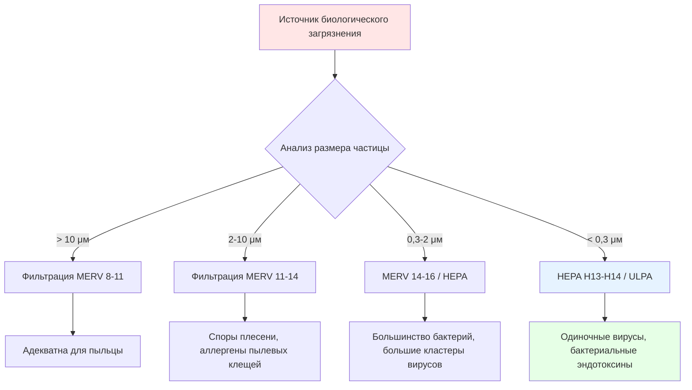

## Обзор

Биологические загрязнения представляют собой разнообразную категорию переносимых по воздуху частиц, которые включают жизнеспособные организмы (бактерии, вирусы, грибы) и биологически производные материалы (пыльца, аллергены, эндотоксины, микотоксины). Эти загрязнения варьируются от 0,01 до 100 микрометров в размере и представляют различные риски для здоровья - от легких аллергических реакций до серьезных респираторных инфекций.

Эффективное управление требует многоуровневого подхода, сочетающего контроль источника, разбавляющую вентиляцию, фильтрацию и, при необходимости, активную дезинфекцию с использованием ультрафиолетового бактерицидного облучения (UVGI). Выбор стратегий управления зависит от характеристик загрязнения, требований занятого пространства и уровней допустимого риска.

## Характеристики биологических загрязнений

### Распределение размеров и поведение

Биологические частицы демонстрируют различные диапазоны размеров, которые определяют их поведение при переносе по воздуху и восприимчивость к захвату:

| Тип загрязнения | Диапазон размеров частиц | Скорость осаждения | Основной метод контроля |
|-----------------|------------------------|-------------------|------------------------|
| Вирусы (переносимые по воздуху) | 0,01-0,3 μм | Незначительно (часы в воздухе) | Фильтрация HEPA/ULPA, UVGI |
| Бактерии (одиночные клетки) | 0,3-10 μм | 0,001-0,3 м/с | Фильтрация MERV 13-16, UVGI |
| Споры плесени | 2-20 μм | 0,01-1,0 м/с | Фильтрация MERV 11-14 |
| Пыльцевые зёрна | 10-100 μм | 0,3-3,0 м/с | Фильтрация MERV 8-11 |
| Аллергены пылевых клещей | 5-20 μм (фекальные частицы) | 0,1-0,5 м/с | Фильтрация MERV 11-13 |

Скорость осаждения на конец следует закону Стокса для частиц в режиме вязкого потока:

$$V_s = \frac{g d_p^2 (\rho_p - \rho_a)}{18 \mu}$$

Где:
- $V_s$ = скорость осаждения (м/с)
- $g$ = ускорение свободного падения (9,81 м/с²)
- $d_p$ = диаметр частицы (м)
- $\rho_p$ = плотность частицы (обычно 1000-1200 кг/м³ для биологического материала)
- $\rho_a$ = плотность воздуха (1,2 кг/м³ при стандартных условиях)
- $\mu$ = динамическая вязкость воздуха (1,81 × 10⁻⁵ Па·с при 20°C)

Частицы меньше 5 μм остаются в воздухе в течение длительных периодов, облегчая дальний перенос через системы вентиляции и требуя усиленной фильтрации или дезинфекции для эффективного управления.

### Жизнеспособность и чувствительность к окружающей среде

Биологические загрязнения реагируют на условия окружающей среды:

**Эффекты относительной влажности:**
- Вирусы: Максимальная выживаемость при ОВ < 40% или ОВ > 70%, минимум при 40-70% ОВ
- Бактерии: Оптимальная выживаемость при ОВ > 60%, сниженная жизнеспособность ниже 40% ОВ
- Рост плесени: Требует ОВ > 60% на поверхностях, оптимально 75-95% ОВ
- Пыльца: Невизнеспособна, аллергенна независимо от условий окружающей среды

**Чувствительность к температуре:**
Большинство патогенов демонстрируют сниженную жизнеспособность при повышенных температурах (> 35°C) или длительном холодном воздействии (< 5°C), хотя выживание в состоянии покоя усложняет стратегии искоренения.

## Стратегии фильтрации

### Выбор фильтра по типу загрязнения

### Эффективность MERV (Minimum Efficiency Reporting Value)

Стандарт ASHRAE 52.2 определяет производительность фильтра в трех диапазонах размеров частиц, относящихся к биологическим загрязнениям:

| Рейтинг MERV | E₁ (0,3-1 μм) | E₂ (1-3 μм) | E₃ (3-10 μм) | Захват биологического загрязнения |
|------------|--------------|------------|-------------|----------------------------------|
| MERV 8 | < 20% | < 70% | ≥ 70% | Пыльца, крупные споры плесени |
| MERV 11 | 20-65% | 65-80% | ≥ 80% | Большинство спор плесени, аллергены пылевых клещей |
| MERV 13 | 50-85% | ≥ 85% | ≥ 90% | Большинство бактерий, крупные вирусные капли |
| MERV 14 | 75-90% | ≥ 90% | ≥ 90% | Улучшенный захват бактерий |
| MERV 16 | ≥ 95% | ≥ 95% | ≥ 95% | Мелкие бактерии, кластеры вирусов |

ASHRAE 62.1 рекомендует минимальную фильтрацию MERV 8 для общих коммерческих приложений, с MERV 13 указана для медицинских и высокорискованных сред.

### Фильтрация HEPA для критических приложений

Фильтры высокой эффективности для удаления частиц (HEPA) достигают минимальных спецификаций эффективности при наиболее проникающем размере частиц (MPPS), обычно 0,1-0,3 μм:

$$E_{HEPA} = 1 - \frac{C_{downstream}}{C_{upstream}}$$

Где:
- $E_{HEPA}$ = эффективность фильтра (безразмерная)
- $C$ = концентрация частиц (частиц/м³)

Классификация HEPA согласно ISO 29463:

- **H13:** ≥ 99,95% эффективности при MPPS (< 0,05% проникновения)
- **H14:** ≥ 99,995% эффективности при MPPS (< 0,005% проникновения)
- **U15 (ULPA):** ≥ 99,9995% эффективности при MPPS (< 0,0005% проникновения)

Фильтрация HEPA обеспечивает необходимую защиту в:
- Больничные палаты изоляции (изоляция от переносимой по воздуху инфекции)
- Фармацевтические производственные чистые помещения
- Лаборатории биобезопасности уровня 3 и 4
- Сельскохозяйственные объекты биобезопасности (контроль PRRS, птичьего гриппа)

### Рассмотрение потерь давления

Установка фильтра увеличивает статическое давление в системе, требуя анализа производительности вентилятора:

$$\Delta P_{filter} = K \cdot Q^n$$

Где:
- $\Delta P_{filter}$ = потери давления фильтра (Па)
- $K$ = коэффициент сопротивления, зависящий от типа фильтра и загрузки
- $Q$ = расход воздуха (м³/с)
- $n$ = показатель (обычно 1,8-2,0 для турбулентного потока)

| Тип фильтра | Начальная потеря давления | Конечная потеря давления | Интервал замены |
|------------|-------------------------|----------------------|-----------------|
| MERV 8 | 50-75 Па | 200 Па | 3-6 месяцев |
| MERV 13 | 75-150 Па | 300 Па | 3-6 месяцев |
| MERV 16 | 150-250 Па | 450 Па | 6-12 месяцев |
| HEPA H13 | 250-350 Па | 600 Па | 12-24 месяца |

Датчики дифференциального давления контролируют загрузку фильтра, запуская замену при достижении конечной потери давления для предотвращения чрезмерного потребления энергии и потенциального обхода фильтра.

## Ультрафиолетовое бактерицидное облучение (UVGI)

### Принципы облучения UV-C

Ультрафиолетовый свет на длине волны 254 нм (UV-C) инактивирует микроорганизмы, повреждая нуклеиновые кислоты (ДНК/РНК), предотвращая репликацию. Бактерицидная эффективность зависит от воздействия УФ дозы:

$$D = I \cdot t$$

Где:
- $D$ = УФ доза (мДж/см² или μW·s/см²)
- $I$ = УФ интенсивность на целевой поверхности (мВт/см²)
- $t$ = время воздействия (секунды)

### Восприимчивость по типам организмов

Различные микроорганизмы требуют различные УФ дозы для инактивации:

| Организм | УФ доза для 90% инактивации (D₉₀) | УФ доза для 99,9% инактивации |
|----------|--------------------------------|------------------------------|
| E. coli (бактерии) | 3-6 мДж/см² | 9-18 мДж/см² |
| Staphylococcus aureus | 2-5 мДж/см² | 6-15 мДж/см² |
| Туберкулез микобактерии | 6-10 мДж/см² | 18-30 мДж/см² |
| Вирус гриппа | 3-6 мДж/см² | 9-18 мДж/см² |
| SARS-CoV-2 (COVID-19) | 4-6 мДж/см² | 12-18 мДж/см² |
| Aspergillus niger (плесень) | 60-120 мДж/см² | 180-360 мДж/см² |

### Системы UVGI в воздуховодах

Внутриканальные УФ системы облучают воздушные потоки в блоках обработки воздуха, обычно расположенные после охлаждающих катушек:

**Расчет дозы:**

$$D = \frac{I_0 \cdot A_{lamp}}{Q} \cdot \eta$$

Где:
- $I_0$ = мощность УФ лампы (Вт)
- $A_{lamp}$ = эффективная площадь зоны облучения (м²)
- $Q$ = расход воздуха (м³/с)
- $\eta$ = коэффициент эффективности системы (0,15-0,30 с учетом геометрии, отражательной способности, старения лампы)

**Параметры проектирования:**
- Расстояние между лампами: 0,3-0,6 м для равномерного охвата облучения
- Скорость воздуха: 2,5-5 м/с через зону облучения
- Время воздействия: обычно 0,1-0,5 секунд
- Требуемая интенсивность: 20-50 мВт/см² для контроля бактерий, 50-200 мВт/см² для спор плесени

### Системы UVGI верхней комнаты

Системы верхней комнаты создают зону дезинфекции в верхней части занятых пространств, полагаясь на естественное перемешивание воздуха для циркуляции воздуха в помещении через УФ поле:

**Требования к перемешиванию:**

Постоянная времени циркуляции воздуха в помещении определяет эффективность:

$$\tau_{mixing} = \frac{V}{Q_{circulation}}$$

Где:
- $\tau_{mixing}$ = постоянная времени перемешивания (секунды)
- $V$ = объем помещения (м³)
- $Q_{circulation}$ = скорость циркуляции воздуха через верхнюю зону (м³/с)

Для эффективного снижения переносимых патогенов требуются скорости циркуляции, достигающие 6-12 полных смен воздуха в час через верхнюю зону, обычно достигаемые посредством тепловой конвекции или потолочных вентиляторов.

**Соображения безопасности:**
- Предел воздействия на жильцов: 0,2 μW/см² согласно пороговому значению ACGIH
- Высота установки: Минимум 2,1 м от пола
- Экраны приборов: Направляют УФ вверх, предотвращая воздействие на уровне глаз
- Предупреждающие знаки: Требуются согласно правилам OSHA

### Обслуживание УФ ламп

Выход УФ-C лампы снижается при длительной работе из-за старения люминофора и истощения ртути:

$$I(t) = I_0 \cdot e^{-\lambda t}$$

Где:
- $I(t)$ = выход УФ в момент времени $t$ (Вт)
- $I_0$ = начальный выход УФ (Вт)
- $\lambda$ = постоянная скорости деградации (обычно 8-12% на 1000 часов)
- $t$ = время работы (часы)

Стандартные графики обслуживания заменяют лампы ежегодно (примерно 8000-9000 часов работы), когда выход снижается до 70-80% от начальной интенсивности. УФ датчики обеспечивают непрерывный мониторинг для критических приложений, запуская замену, когда выход падает ниже минимальных эффективных уровней.

## Разбавление на основе вентиляции

### Генерирование и удаление загрязнения

Концентрация загрязнения в установившемся состоянии в хорошо перемешиваемом пространстве следует уравнению баланса масс:

$$C_{ss} = \frac{G}{Q \cdot E}$$

Где:
- $C_{ss}$ = концентрация в установившемся состоянии (организмы/м³ или КОЕ/м³)
- $G$ = скорость генерирования загрязнения (организмы/с)
- $Q$ = скорость вентиляции наружного воздуха (м³/с)
- $E$ = эффективность вентиляции (обычно 0,8-1,2)

### Переходное затухание концентрации

После устранения источника загрязнения концентрация затухает экспоненциально:

$$C(t) = C_0 \cdot e^{-\frac{Q \cdot E}{V} \cdot t}$$

Где:
- $C(t)$ = концентрация в момент времени $t$
- $C_0$ = начальная концентрация
- $V$ = объем помещения (м³)
- $t$ = прошедшее время (секунды)

Скорость смены воздуха $(ACH = \frac{Q \cdot 3600}{V})$ определяет время очистки. Достижение 99% удаления загрязнения требует:

$$t_{99\%} = \frac{4,6 \cdot V}{Q \cdot E}$$

Для типичного офисного помещения (ACH = 2 ч⁻¹, E = 1,0) для 99% удаления требуется примерно 2,3 часа.

### Улучшенные стратегии вентиляции

**Увеличенный наружный воздух:**
Стандарт ASHRAE 62.1 указывает минимальные скорости наружного воздуха 2,5 л/с/человека для офисных помещений. Улучшенная вентиляция при 5-10 л/с/человека пропорционально снижает концентрацию загрязнения, но увеличивает потребление энергии.

**Системы выделенного наружного воздуха (DOAS):**
Разделяют вентиляцию от теплового кондиционирования, позволяя постоянно поддерживать подачу наружного воздуха независимо от нагрузок охлаждения/отопления, одновременно обеспечивая эффективное осушение и фильтрацию наружного воздуха перед распределением.

**Вентиляция вытеснением:**
Вводит холодный, чистый воздух на уровне пола, позволяя тепловой плавучести переносить загрязнения вверх для высокоуровневого выпуска. Достигает эффективности вентиляции (E) 1,2-1,8, обеспечивая 20-80% снижение концентрации загрязнения в дыхательной зоне по сравнению с смешивающей вентиляцией.

## Управление влагой для предотвращения плесени

### Критический порог относительной влажности

Рост плесени на строительных поверхностях требует устойчивой повышенной влажности:

- **Порог роста:** ОВ > 60% на поверхности в течение > 24-48 часов
- **Оптимальный рост:** ОВ 75-95% на поверхности
- **Прорастание:** Обычно требует ОВ > 85% для прорастания спор

Относительная влажность поверхности отличается от ОВ воздуха в помещении из-за эффектов температуры:

$$RH_{surface} = RH_{air} \cdot \frac{P_{sat}(T_{air})}{P_{sat}(T_{surface})}$$

Где:
- $P_{sat}$ = давление насыщенного пара при указанной температуре (Па)

Холодные поверхности (тепловые мосты, изолированные трубы, внешние стены) демонстрируют повышенную поверхностную ОВ даже при контролируемой ОВ воздуха в помещении, требуя стратегий изоляции и термических разделения.

### Методы контроля влажности

**Требуемая емкость осушения:**

$$\dot{m}_{removal} = \dot{m}_{generation} + \dot{m}_{infiltration} + \dot{m}_{ventilation}$$

Где:
- $\dot{m}$ = скорость потока влаги (кг/с)

| Стратегия | Скрытая емкость | Применение | Потребление энергии |
|-----------|-----------------|-----------|-------------------|
| Охлаждающая катушка на основе хладагента | 0,5-1,5 кВт на кВт чувствительного | Стандартные системы HVAC | Связано с чувствительным охлаждением |
| Адсорбционное осушение | 2-8 г/кг обработанного воздуха | Приложения с высокой скрытой нагрузкой | 2500-4000 кДж/кг удаленной воды |
| Переохлаждение с повторным нагревом | 1-3 кВт на кВт чувствительного | Точный контроль влажности | Штраф 20-40% на энергию повторного нагрева |
| Осушение тепловой трубой | 0,8-1,8 кВт на кВт чувствительного | Энергоэффективный контроль влажности | Увеличение энергии 10-15% в сравнении со стандартом |

Стандарт ASHRAE 62.1 рекомендует поддерживать внутреннюю относительную влажность между 30-60% для комфорта жильцов и управления биологическими загрязнениями.

## Интегрированные стратегии управления

Эффективное управление биологическими загрязнениями сочетает несколько подходов:

**Базовая защита (генеральный коммерческий):**
- Фильтрация MERV 11-13
- Минимальные скорости вентиляции согласно ASHRAE 62.1
- Контроль ОВ 30-60%
- Регулярное обслуживание и чистка катушек

**Улучшенная защита (здравоохранение, школы):**
- Фильтрация MERV 13-16
- Увеличенная вентиляция наружного воздуха (150-200% от минимума)
- UVGI в воздуховодах после охлаждающих катушек
- Контроль ОВ 40-60%
- Ежеквартальная чистка и проверка воздуховодов

**Максимальная защита (палаты изоляции, биобезопасность):**
- Фильтрация HEPA H13-H14
- Системы 100% наружного воздуха (без рециркуляции)
- Комбинированная UVGI в воздуховодах и верхней комнате
- Изоляция с отрицательным давлением (-2,5 до -8 Па)
- Непрерывный мониторинг качества воздуха

Выбор и интенсивность мер управления масштабируются в соответствии с уровнем риска загрязнения, уязвимостью жильцов и нормативными требованиями, сбалансированными с учетом капитальных затрат и соображений постоянного потребления энергии.

## Ссылки

- Стандарт ASHRAE 62.1: Вентиляция для приемлемого качества внутреннего воздуха
- Стандарт ASHRAE 52.2: Методика испытания устройств очистки вентиляционного воздуха для определения эффективности удаления по размеру частиц
- Рекомендации CDC по контролю инфекций в окружающей среде в учреждениях здравоохранения
- Критерии NIOSH для рекомендуемого стандарта: Профессиональное воздействие ультрафиолетового излучения
- ISO 29463: Высокоэффективные фильтры и фильтровальные материалы для удаления частиц из воздуха
