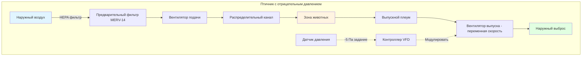
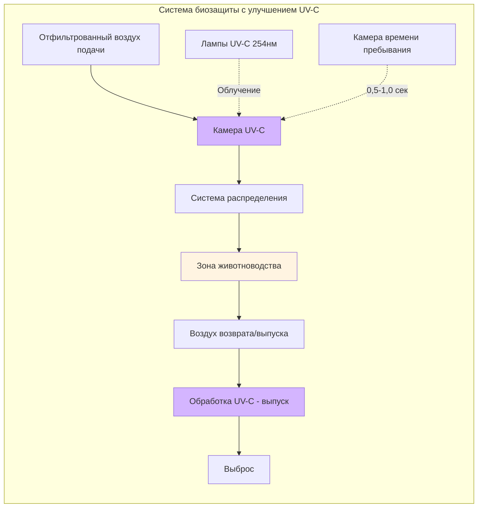

## Обзор систем фильтрации в животноводстве и птицеводстве

Системы фильтрации в животноводстве и птицеводстве представляют критическое пересечение инженерии HVAC и управления здоровьем животных. Эти системы предотвращают передачу воздушных патогенов в объекты концентрированного животноводства (CAFOs), племенные хозяйства и исследовательские учреждения. Эффективная фильтрация биозащиты сочетает механическую фильтрацию, ультрафиолетовое бактерицидное облучение (UVGI) и контролируемые перепады давления для создания барьеров против вирусных, бактериальных и грибковых угроз.

Экономическое воздействие вспышек болезней в популяциях животных с высокой концентрацией — таких как птичий грипп в птицеводстве или репродуктивно-респираторный синдром свиней (PRRS) — оправдывает существенные инвестиции в инженерный контроль качества воздуха. Современные системы биозащиты в животноводстве должны уравновешивать исключение патогенов с необходимыми уровнями вентиляции для отвода метаболического тепла и контроля влажности в условиях высокой плотности животноводства.

## Требования к эффективности фильтрации

Приложения биозащиты в животноводстве требуют высокоэффективной частичной фильтрации для улавливания биоаэрозолей, содержащих патогены. Значение минимальной эффективности отчетности (MERV) или классификация ISO 16890 определяют способность удаления частиц.

### Эффективность улавливания частиц

Эффективность фильтрации следует теории проникновения:

$$\eta = 1 - e^{-\left(\frac{4\alpha EL}{(1-\alpha)\pi d_f}\right)}$$

Где:
- $\eta$ = дробная эффективность фильтрации (безразмерная)
- $\alpha$ = плотность упаковки материала фильтра (безразмерная)
- $E$ = эффективность одного волокна (безразмерная)
- $L$ = толщина фильтра (м)
- $d_f$ = диаметр волокна (м)

Для приложений биозащиты, нацеленных на вирусные частицы (0,02–0,3 мкм) и бактериальные аэрозоли (0,5–5 мкм), обычно указывается MERV 14–16 или HEPA фильтрация (≥99,97% эффективность при 0,3 мкм).

### Классификация уровней биозащиты

**Высокая биозащита (исследовательские объекты/племенное поголовье):**
- HEPA фильтрация (H13-H14): 99,97–99,995% при MPPS
- Предварительная фильтрация: MERV 14 минимум
- Конечный перепад давления: -5–12,5 Па

**Средняя биозащита (коммерческое производство):**
- Фильтрация MERV 14–16: 75–95% при 0,3 мкм
- Предварительная фильтрация: MERV 8–11
- Перепад давления: -2,5–5 Па

**Стандартная биозащита (общая защита):**
- Фильтрация MERV 11–13
- Допустима защита с положительным давлением
- Концентрация на поддержании норм вентиляции

## Интенсивность воздухообмена и проектирование вентиляции

Животноводческие объекты требуют значительных норм вентиляции для управления нагревом и влажностью при поддержании фильтрации биозащиты.

### Минимальная норма вентиляции

Требуемая интенсивность обмена наружным воздухом зависит от теплопродукции животных и оболочки здания:

$$Q_{min} = \frac{q_{sensible}}{c_p \rho_{air} \Delta T}$$

Где:
- $Q_{min}$ = минимальная норма потока воздуха (м³/с)
- $q_{sensible}$ = явная теплопродукция животными (Вт)
- $c_p$ = удельная теплоемкость воздуха = 1006 Дж/(кг·К)
- $\rho_{air}$ = плотность воздуха ≈ 1,2 кг/м³ в стандартных условиях
- $\Delta T$ = допустимое увеличение температуры (К)

### Воздухообмены в час

Объекты биозащиты обычно работают с:

$$ACH = \frac{Q_{min} \times 3600}{V_{building}}$$

Где:
- $ACH$ = воздухообмены в час (ч⁻¹)
- $V_{building}$ = объем здания (м³)

Типичные диапазоны ACH:
- Птичники-бройлерники: 6–12 ACH (зимний минимум до летнего максимума)
- Свиноводческие помещения для опороса: 8–20 ACH
- Высокобиозащитные исследовательские объекты: 15–20 ACH с выпуском HEPA

## Системы биозащиты с отрицательным давлением

Вентиляция с отрицательным давлением предотвращает инфильтрацию нефильтрованного воздуха путем поддержания давления в здании ниже атмосферного.

### Расчет перепада давления

Требуемый перепад давления для предотвращения инфильтрации через утечки в здании:

$$\Delta P = \rho_{air} \frac{v^2}{2} \times C_d$$

Где:
- $\Delta P$ = перепад давления (Па)
- $v$ = скорость через путь утечки (м/с)
- $C_d$ = коэффициент расхода ≈ 0,6–0,8 для трещин в здании

Типичные спецификации поддерживают -5–12,5 Па отрицательного давления относительно наружного воздуха.

## Приложения HEPA фильтрации

Фильтры высокоэффективного удаления частиц (HEPA) обеспечивают максимальную биозащиту для животных с высокой стоимостью.

### Рассмотрения проектирования системы HEPA

**Спецификации фильтра:**
- Минимальная эффективность: 99,97% при 0,3 мкм MPPS (классификация H13)
- Начальный перепад давления: 200–250 Па
- Конечный перепад давления: 500–600 Па
- Скорость у лица: 1,27–2,54 м/с

**Требования предварительной фильтрации:**
HEPA фильтры требуют защиты выше по потоку для максимизации срока службы:
1. Стадия предварительного фильтра 1: MERV 8–11 (эффективность 30–65%)
2. Стадия предварительного фильтра 2: MERV 14–15 (эффективность 75–90%)
3. Финальная стадия: HEPA H13-H14

### Приложение HEPA в птицефабрике

Современные высокобиозащитные птицефабрики внедряют HEPA фильтрацию для предотвращения передачи птичьего гриппа:

**Конфигурация системы:**
- Конструкция стены фильтра с несколькими модулями HEPA
- Индивидуальный мониторинг давления фильтра
- Резервная емкость вентилятора для обслуживания
- Норма воздушного потока: 0,85–1,13 м³/мин на м² площади пола

## Ультрафиолетовое бактерицидное облучение UV-C

Ультрафиолетовое бактерицидное облучение дополняет механическую фильтрацию путем инактивации патогенов в потоке воздуха.

### Расчет дозы UV-C

Эффективность бактерицидности зависит от доставляемой UV дозы:

$$D_{UV} = I \times t$$

Где:
- $D_{UV}$ = UV доза (μW·s/cm² или мДж/см²)
- $I$ = интенсивность UV-C при 254 нм (μW/cm²)
- $t$ = время экспозиции (с)

Требуемые дозы для 90% инактивации (D₉₀):
- Вирус птичьего гриппа: 2000–4000 μW·s/cm²
- Вирус ньюкаслской болезни: 3000–6000 μW·s/cm²
- Бактерия E. coli: 3000–6000 μW·s/cm²

### Параметры проектирования

**Проектирование камеры:**
- Скорость потока воздуха: 2,5–4,0 м/с
- Время пребывания: 0,5–1,0 секунды
- Интенсивность лампы: 40–80 μW/cm² на центральной линии камеры
- Расстояние между лампами: 0,3–0,6 м в центре

## Примеры практического внедрения

### Практический пример: Высокобиозащитный свиноводческий комплекс

**Спецификации объекта:**
- Объем здания: 15 000 м³
- Емкость животных: 1200 свиноматок
- Норма вентиляции: 51 м³/с летний максимум

**Система биозащиты:**
1. Трёхстадийная фильтрация:
   - Предварительный MERV 8 фильтр (начальная эффективность 25%)
   - Вторичный MERV 14 (эффективность 85% при 0,3 мкм)
   - Финальный MERV 16 (эффективность 95% при 0,3 мкм)
2. Отрицательное давление: -10 Па
3. Воздухообмены: 12,2 ACH при максимальной вентиляции
4. Дополнительная обработка UV-C при подаче

**Результаты:**
- Нулевые обнаружения вируса PRRS за трёхлетний период мониторинга
- Замена фильтра: 8–12 месяцев для финальной стадии
- Мощность вентилятора: 18,7 кВт общая

### Практический пример: Птичник-бройлерник с HEPA защитой

**Спецификации объекта:**
- Площадь пола: 1200 м²
- Емкость птиц: 30 000 бройлеров
- Вентиляция: 0,94 м³/мин на м² площади пола в пиковый период

**Стена HEPA фильтра:**
- 48 модулей HEPA, каждый 0,6 м × 0,6 м × 0,29 м
- Общая площадь фильтра: 17,3 м²
- Скорость у лица: 2,03 м/с
- Перепад давления: 225 Па начальный

**Производительность:**
- Биозащита поддерживалась во время региональной вспышки AI
- Срок службы фильтра: 14–18 месяцев в среднем
- Дополнительная мощность вентилятора: 7,5 кВт

## Интеграция со стандартами ASHRAE

Хотя стандарт ASHRAE 62.1 (Вентиляция для приемлемого качества внутреннего воздуха) в первую очередь касается занятости людьми, системы биозащиты в животноводстве применяют релевантные принципы:

**Применимые положения:**
- Мониторинг доставки наружного воздуха
- Протоколы обслуживания фильтра (раздел 6.1.4)
- Эксплуатация системы вентиляции во время занятости
- Проверка производительности устройств очистки воздуха

**Сельскохозяйственные специфичные рекомендации:**
- ASABE EP270.5: Проектирование систем вентиляции птичников и животноводческих сооружений
- MWPS-32: Механические системы вентиляции животноводческих сооружений
- NPIP (Национальная программа совершенствования птицы) протоколы биозащиты

## Соображения обслуживания и эксплуатации

**Критерии замены фильтра:**
- Перепад давления превышает 2× начального сопротивления
- Визуальная проверка выявляет повреждение среды
- Обнаружена проверка биозащиты (мониторинг патогенов)
- Замена по времени: 6–18 месяцев в зависимости от приложения

**Мониторинг системы:**
- Датчики дифференциального давления: точность ±25 Па
- Измерение потока воздуха: ±10% от проектировки
- Давление в здании: непрерывный мониторинг с тревогой при отклонении ±2,5 Па
- Интенсивность лампы UV-C: годовая проверка радиометром

**Анализ затрат:**
Начальная установка для средней биозащиты (MERV 14–16):
- Корпуса фильтров и среда: $40–75/м² площади пола
- Дополнительная емкость вентилятора: $25–50/м² площади пола
- Управление и мониторинг: $15–30/м² площади пола

Годовые эксплуатационные затраты:
- Замена фильтра: $8–20/м² площади пола
- Дополнительная энергия: $5–15/м² площади пола
- Замена лампы UV-C: $2–5/м² площади пола (при необходимости)

---

**Связанные темы:**
- Проектирование и выбор HEPA фильтров
- Управление системами с отрицательным давлением
- Ультрафиолетовое бактерицидное облучение
- Протоколы биозащиты в здравоохранении
- Системы промышленной фильтрации воздуха
