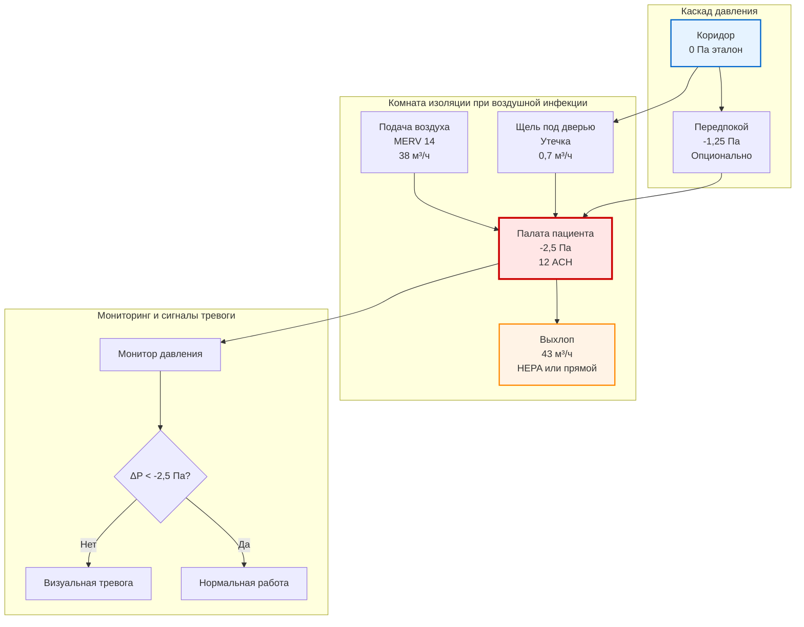
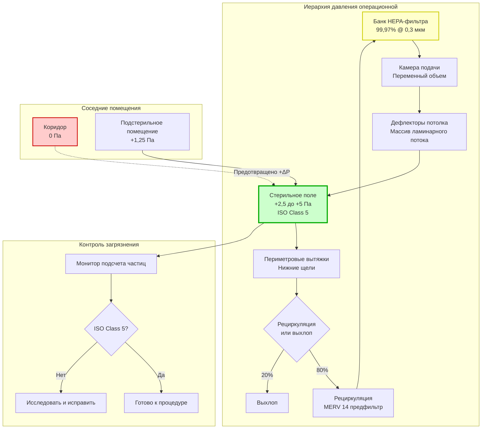

Системы биозащиты вентиляции здравоохранения представляют наиболее критическое применение инженерии контроля инфекций, где проектирование вентиляции напрямую влияет на результаты лечения пациентов и показатели внутрибольничной передачи. ASHRAE Standard 170, Рекомендации CDC по контролю инфекций окружающей среды в медицинских учреждениях и Рекомендации Facility Guidelines Institute (FGI) устанавливают комплексные требования к направлению воздушного потока, эффективности фильтрации, соотношениям давления и кратности воздухообмена во множестве клинических помещений.

## Требования вентиляции ASHRAE 170

ASHRAE Standard 170: Вентиляция медицинских учреждений определяет минимальные наружные воздушные смены, общие воздушные смены, соотношения давления и требования фильтрации для 62 отдельных типов помещений здравоохранения. Эти требования уравновешивают контроль инфекций, разбавление запахов и удаление анестетических газов при сохранении энергоэффективности.

### Критическая классификация помещений

| Тип помещения | Давление | Мин. ОА ACH | Мин. общее ACH | Рециркуляция | Фильтрация подачи | Фильтрация выхлопа |
|------------|----------|------------|---------------|---------------|-------------------|-------------------|
| Изоляция при воздушной инфекции (AII) | Отрицательное | 2 | 12 | Запрещена | MERV 14 | HEPA или прямой выхлоп |
| Защитная среда (PE) | Положительное | 2 | 12 | Разрешена | HEPA | MERV 14 |
| Операционная | Положительное | 3 | 20 | Разрешена | HEPA | MERV 14 |
| Кабинет осмотра отделения неотложной помощи | Отрицательное | 2 | 12 | Запрещена | MERV 14 | MERV 14 |
| Люкс бронхоскопии | Отрицательное | 2 | 12 | Запрещена | MERV 14 | HEPA или выхлоп |
| Морг | Отрицательное | 2 | 12 | Запрещена | MERV 14 | HEPA или выхлоп |
| Палата общего профиля | Равное/Положительное | 2 | 6 | Разрешена | MERV 14 | MERV 8 |
| Отделение интенсивной терапии | Положительное | 2 | 6 | Разрешена | MERV 14 | MERV 14 |
| Фармацевтический чистый класс (ISO 7) | Положительное | По расч. | 30+ | HEPA рециркуляция | HEPA | MERV 14 |

**Требования к перепаду давления:** ±2,5 Па (±0,01 дюйма вод. ст.) минимум между критическими помещениями и соседними зонами. Постоянный мониторинг с визуальными или звуковыми сигналами тревоги обязателен.

**Расчет кратности воздухообмена:**

$$\text{ACH} = \frac{Q_{total}}{V_{room}}$$

Где:
- ACH = кратность воздухообмена (ч⁻¹)
- $Q_{total}$ = общий расход воздуха (м³/ч)
- $V_{room}$ = объем помещения (м³)

Для комнаты изоляции при воздушной инфекции объемом 11,3 м³, требующей 12 ACH:

$$Q_{total} = 12 \times 11,3 = 135,6 \text{ м³/ч}$$

## Проектирование комнаты изоляции при воздушной инфекции

Комнаты изоляции при воздушной инфекции (AIIR) содержат пациентов с подозреваемым или подтвержденным туберкулезом, корью, ветряной оспой, SARS-CoV-2 или другими воздушно-капельными патогенами. Отрицательное давление предотвращает выход инфекционного аэрозоля в коридоры и соседние палаты пациентов.

### Поддержание перепада давления

Перепад давления между изолирующей комнатой и коридором возникает из-за превышения выхлопного воздушного потока над подачей. Перепад давления на проемах оболочки здания:

$$\Delta P = \frac{\rho Q_{leak}^2}{2 C_d^2 A_{leak}^2}$$

Упрощенно для приложений HVAC с использованием эмпирического коэффициента потока:

$$Q_{leak} = C \cdot A_{leak} \cdot \sqrt{\Delta P}$$

Где:
- $Q_{leak}$ = утечка воздуха, поддерживающая перепад давления (м³/ч)
- $C$ = коэффициент потока (типично 1400-2600 м³/(ч·м²·√Па) для щелей дверей)
- $A_{leak}$ = эффективная площадь утечки (м²)
- $\Delta P$ = перепад давления (Па)

Для AIIR с щелью под дверью 25 мм на ширину 0,9 м (площадь 0,0225 м²), поддерживающей -2,5 Па:

$$Q_{leak} = 2000 \times 0,0225 \times \sqrt{2,5} = 0,71 \text{ м³/ч}$$

Общий выхлоп должен превышать подачу на величину утечки плюс запас безопасности:

$$Q_{exhaust} = Q_{supply} + Q_{leak} + Q_{safety}$$

Типичное проектирование: подача 38 м³/ч, выхлоп 43 м³/ч обеспечивает -2,5 Па перепад.

### Снижение риска инфекции через вентиляцию

Уравнение Wells-Riley количественно определяет вероятность воздушной инфекции на основе интенсивности вентиляции. Риск инфекции для восприимчивого человека:

$$P = 1 - e^{-\frac{Iqpt}{Q}}$$

Где:
- $P$ = вероятность инфекции
- $I$ = количество инфицированных
- $q$ = скорость образования квант (инфекционные дозы/ч, характеристика патогена)
- $p$ = легочная вентиляция восприимчивого лица (м³/ч, типично 0,6 м³/ч)
- $t$ = время воздействия (ч)
- $Q$ = расход вентиляции помещения (м³/ч)

Перестановка для определения интенсивности вентиляции при целевом риске инфекции:

$$Q = \frac{-Iqpt}{\ln(1-P)}$$

Для пациента с туберкулезом ($q$ ≈ 12 квант/ч), воздействие 8 часов, целевой риск инфекции <1%:

$$Q = \frac{-1 \times 12 \times 0,6 \times 8}{\ln(1-0,01)} = \frac{-57,6}{-0,01005} = 5,731 \text{ м³/ч}$$

Этот теоретический расчет демонстрирует, что для высокоинфекционных пациентов изоляция в помещении с отрицательным давлением с HEPA-фильтрацией или прямым выхлопом предотвращает загрязнение коридора, а не полагается исключительно на разбавление.

## Проектирование комнаты защитной среды

Комнаты защитной среды (PE) размещают тяжело иммунокомпрометированных пациентов (реципиентов гемопоэтической трансплантации стволовых клеток, нейтропеничных пациентов), требующих защиты от грибков окружающей среды, особенно *Aspergillus*. Положительное давление с HEPA-фильтрацией предотвращает инфильтрацию спор.

### Производительность HEPA-фильтра

HEPA-фильтры улавливают ≥99,97% частиц размером 0,3 мкм, наиболее проникающий размер частиц (MPPS). Конидии *Aspergillus* размером 2-3 мкм обеспечивают >99,99% эффективность улавливания.

Проникновение через HEPA-фильтр:

$$P_{filter} = 1 - \eta_{HEPA} = 1 - 0,9997 = 0,0003$$

Для помещения, снабжаемого на 100% HEPA-отфильтрованным наружным воздухом при 12 ACH, концентрация спор в установившемся режиме:

$$C_{indoor} = \frac{C_{outdoor} \cdot P_{filter} \cdot Q}{Q + k \cdot V}$$

При условии пренебрежимого распада спор ($k$ ≈ 0) и наружной концентрации 1000 спор/м³:

$$C_{indoor} = 1000 \times 0,0003 = 0,3 \text{ спор/м³}$$

Целевой показатель для комнат PE: <1 спор/м³. HEPA-фильтрация снижает окружающие грибковые нагрузки на 3-4 порядка.

### Контроль положительного давления

Комнаты PE поддерживают +2,5 Па относительно передпокоя и +5,0 Па относительно коридора. Это требует расхода подачи, превышающего выхлоп и инфильтрацию:

$$Q_{supply} = Q_{exhaust} + Q_{leak,pressure}$$

В отличие от комнат с отрицательным давлением, где перепад поддерживается выхлопным вентилятором, положительное давление опирается на вентилятор подачи с модулируемым выхлопом для установления перепада.

**Каскад давления для оптимальной защиты:**

Коридор (0 Па) → Передпокой (+2,5 Па) → Комната PE (+5,0 Па)

Это обеспечивает направленный воздушный поток из чистых в потенциально загрязненные зоны. Открытие двери временно нарушает давление, требуя быстрого восстановления. Контроль VFD вентилятора подачи поддерживает заданное значение при нарушениях.

## Вентиляция операционных

Операционные требуют положительного давления (минимум +2,5 Па) для предотвращения попадания воздуха из коридора, содержащего кожную флору, в стерильное поле. Общие воздушные смены: минимум 20 ACH, при этом наружный воздух 3 ACH. HEPA-фильтрация подачи обязательна для ортопедической имплантации, сердечно-сосудистых и других высокорисковых процедур.

### Однонаправленный воздушный поток для ультрачистых сред

Системы ламинарного потока подают HEPA-отфильтрованный воздух в однонаправленном режиме над хирургическим полем со скоростью 25-35 воздушных смен в час через дефлектор потолка. Чистота ISO Class 5 (<3520 частиц ≥0,5 мкм на м³) достижима в критической зоне.

Расход подачи для ламинарной системы:

$$Q_{laminar} = V_{face} \cdot A_{diffuser}$$

Где:
- $V_{face}$ = фасадная скорость (типично 0,30-0,45 м/с)
- $A_{diffuser}$ = площадь фасада дефлектора (м²)

Для массива дефлекторов 2,8 м × 2,8 м (7,84 м²) при 0,38 м/с:

$$Q_{laminar} = 0,38 \times 7,84 = 2,98 \text{ м³/с} = 10,7 \text{ тыс. м³/ч}$$

Этот высокообъемный однонаправленный поток уносит частицы от хирургического места, снижая показатели инфекции ран при замене суставов и операциях на сердце.

## Проектирование передпокоя и каскада давления

Передпокои обеспечивают буферные зоны между изолирующими комнатами и коридорами, предотвращая нарушение давления при открытии дверей. Существуют две конфигурации:

**Каскад положительное-отрицательное-положительное (для AIIR):**
Коридор (0 Па) → Передпокой положительный (+1,25 Па) → AIIR (-2,5 Па)

**Каскад положительное-положительное-положительное (для PE):**
Коридор (0 Па) → Передпокой (+2,5 Па) → Комната PE (+5,0 Па)

Рекомендации CDC позволяют исключить передпокой, если дверь AIIR остается закрытой, кроме периодов входа/выхода, и помещение поддерживает -2,5 Па постоянно. Рекомендации FGI требуют передпокой для нового строительства.

### Восстановление давления при открытии двери

Открытие двери создает внезапное уравнивание давления. Время восстановления повторного установления перепада зависит от объема помещения и чистого воздушного потока:

$$t_{recovery} = \frac{V_{room} \cdot \ln(C_0/C_t)}{Q_{net}}$$

Для распада загрязнителя из начальной концентрации $C_0$ к целевой $C_t$ (типично 99% удаления):

$$t_{99\%} = \frac{4,6 \cdot V_{room}}{Q_{net}}$$

AIIR объемом 11,3 м³ с чистым выхлопом 7,1 м³/ч:

$$t_{99\%} = \frac{4,6 \times 11,3}{7,1} = 7,3 \text{ минуты}$$

Быстрое восстановление давления (<1 минуты к -2,5 Па) требует адекватной емкости выхлопного вентилятора и правильного уплотнения дверей.

## Проектирование и выпуск выхлопной системы

Обработка выхлопа AIIR зависит от емкости выхлопа учреждения и местоположения наружного выпуска:

**Вариант 1: HEPA-фильтрация перед рециркуляцией** (не рекомендуется CDC)
Выхлоп → HEPA-фильтр → Система возвратного воздуха

**Вариант 2: Прямой выхлоп наружу**
Выхлоп → Выделенный воздуховод → Выпуск на крышу с анализом рассеивания

**Вариант 3: HEPA-фильтрация перед выхлопом**
Выхлоп → HEPA-фильтр → Выхлопный воздуховод → Наружный выпуск

CDC рекомендует варианты 2 или 3. Выпуск на крышу требует скорости выхлопа >12,7 м/с и расположения, обеспечивающего отсутствие загрязнения воздухозаборов. Моделирование рассеивания по ASHRAE Fundamentals подтверждает разбавление до безопасных уровней.

Расположение выхлопного вентилятора критично: размещение ниже по потоку от HEPA-фильтра (если используется) для поддержания отрицательного давления в загрязненном воздуховоде. Корпус фильтра с входом и выходом через мешок позволяет безопасную замену фильтра без загрязнения помещения.

## Пуск и непрерывная проверка

Начальный пуск по ASHRAE 170 и ASHRAE Guideline 1.1 включает:

1. **Проверка воздушного потока:** Измерение подачи, выхлопа и утечки воздуха с использованием откалиброванного анемометра горячей проволоки или балометра
2. **Тестирование перепада давления:** Проверка манометром ±2,5 Па минимум при закрытой и открытой дверях
3. **Расчет кратности воздухообмена:** Подтверждение соответствия общей и наружной воздушной кратности минимальным требованиям
4. **Проверка целостности фильтра:** Сканирование DOP или PAO HEPA-фильтров с проверкой ≤0,01% проникновения
5. **Время восстановления давления:** Тест открытия двери, измеряющий время повторного установления перепада
6. **Визуализация дыма:** Подтверждение направленного воздушного потока при открытии двери
7. **Функциональность сигналов тревоги:** Проверка активации сигнала тревоги монитора давления при выходе перепада за допустимый диапазон

**Требования непрерывного мониторинга:**

- Перепад давления: Дисплей реального времени снаружи каждого критического помещения с визуальной/звуковой тревогой
- Интенсивность воздушного потока: Опционально, но рекомендуется для проверки подачи и выхлопа
- Перепад давления фильтра: Мониторит загрузку фильтра, замена при превышении конечного ΔP
- Температура и влажность: Поддержание 20-24°C, 30-60% относительной влажности по ASHRAE 170

Ежедневный визуальный осмотр мониторов давления клиническим персоналом обеспечивает немедленное уведомление об отказе HVAC. Ежемесячные проверки фильтров и квартальные функциональные тесты обеспечивают устойчивую производительность.

## Интеграция с протоколами предотвращения инфекций

Эффективность биозащиты HVAC зависит от координации с клиническими практиками контроля инфекций:

- **Размещение пациентов:** Симптоматичные пациенты в AIIR в ожидании диагностического подтверждения
- **Соответствие СИЗ:** Респираторы N95 для медицинских работников, входящих в AIIR независимо от вентиляции
- **Управление дверями:** Минимизация открытия дверей; использование передпокоя для подготовки предметов снабжения
- **Когортирование:** Группирование пациентов с одинаковым патогеном при недостаточной емкости AIIR
- **Экологическое очищение:** HEPA-фильтрованные вакуумные очистители предотвращают передачу из поверхности в воздух
- **Инфекционный контроль при строительстве:** Временные барьеры и отрицательное давление во время ремонта в занятых зонах по ICRA (оценка риска контроля инфекций)

Инженерные средства контроля обеспечивают критический уровень защиты, но не могут заменить административный контроль и надлежащие клинические практики. Комплексное предотвращение инфекций интегрирует несколько барьеров для достижения максимального снижения риска.

## Соображения проектирования для возникающих патогенов

Недавний опыт пандемии подчеркивает необходимость адаптируемой вентиляции медицинских учреждений:

**Емкость расширения:** Проектирование палат общего профиля с инфраструктурой для быстрого преобразования в AIIR (емкость выхлопа, положения воздуховодов, точки мониторинга давления)

**Доля наружного воздуха:** Более высокие процентные значения наружного воздуха (50-100%) снижают рециркуляцию инфекционного аэрозоля во время вспышек

**Портативная HEPA-фильтрация:** Дополнительные блоки обеспечивают временное улучшение; обеспечение адекватного CADR для объема помещения

**Верхняя UVGI:** Дополнительная инактивация в высокорисковых зонах (отделения неотложной помощи, зоны ожидания) без требования инфраструктуры AIIR

**Гибкое зонирование:** Возможность переконфигурации соотношений давления и путей воздушного потока на основе характеристик патогена и численности пациентов

Предусмотренные будущим медицинские учреждения включают адаптируемость, избыточность и мониторинг для реагирования на известные и возникающие воздушные угрозы при сохранении энергоэффективности во время обычных операций.
