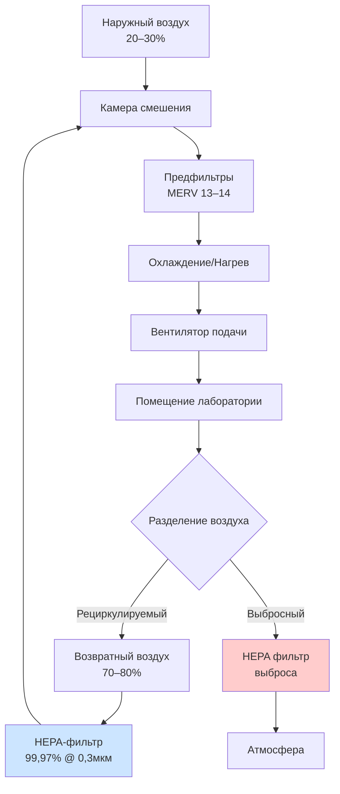
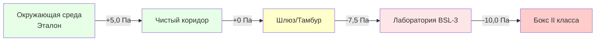

## Обзор

Конфигурации систем вентиляции для биолабораторий должны сбалансировать требования изоляции, энергоэффективность и операционную безопасность. Выбор однопроходных, циркуляционных или гибридных систем зависит от уровня биобезопасности (BSL), характеристик патогена, ограничений объекта и соответствия нормативным требованиям CDC/NIH по биобезопасности и стандартам ANSI/AIHA Z9.5.

## Однопроходные системы (100% выброс)

Однопроходные конфигурации обеспечивают максимальную изоляцию, исключая любую возможность рециркуляции. Весь воздух проходит через помещение один раз и выбрасывается через HEPA-фильтрацию.

### Характеристики проектирования

**Траектория потока воздуха:**
- 100% наружный воздух подачи
- Полный выброс без возвратного воздуха
- HEPA-фильтрация на выбросе (минимум 99,97% при 0,3 мкм)
- Дополнительная HEPA-фильтрация подачи для BSL-3/BSL-4

**Применение:**
- Лаборатории BSL-3 и BSL-4
- Исследования высокорискованных патогенов
- Объекты с выбранными агентами
- Объекты, требующие максимальной биоизоляции

**Энергетические соображения:**

Однопроходные системы создают значительные энергетические потери. Нагрев и охлаждение 100% наружного воздуха требует приблизительно на 30-50% больше энергии, чем системы циркуляции. Годовые затраты на энергию для однопроходной лаборатории на 1700 CFM (2,8 м³/ч) могут превышать 15000-25000 долларов США в умеренном климате.

### Управление давлением

Однопроходные системы поддерживают помещения лаборатории при отрицательном давлении относительно прилегающих площадей. Типичные перепады давления:

| Классификация помещения | Перепад давления | Воздухообмены в час |
|---------------------|----------------------|------------------|
| Лаборатория BSL-2 | -2,5–5,0 Па | 6–12 ACH |
| Лаборатория BSL-3 | -7,5–10,0 Па | 10–15 ACH |
| Лаборатория BSL-4 | -10,0–15,0 Па | 12–20 ACH |

## Системы циркуляции с HEPA-фильтрацией

Циркуляция снижает потребление энергии за счет повторного использования кондиционированного воздуха. Эта конфигурация разрешена для объектов BSL-1 и BSL-2 при установке HEPA-фильтрации в цепи циркуляции.

### Архитектура системы

**Распределение потока воздуха:**
- Минимум 20–30% наружного воздуха
- 70–80% возвратного воздуха с HEPA-фильтрацией
- Выбросный воздух с HEPA-фильтрацией перед выпуском
- Непрерывный мониторинг целостности фильтра

**Критерии циркуляции (согласно рекомендациям CDC):**
- Ограничено применением BSL-1 и BSL-2
- HEPA-фильтры должны обеспечивать минимум 99,97% эффективность
- Мониторинг перепада давления на фильтрах
- Автоматическое отключение при отказе фильтра
- Ежегодное тестирование установленных фильтров методом DOP/PAO

### Соображения по рекуперации энергии

Рекуперация энергии запрещена, если она позволяет перекрестное загрязнение между потоками выброса и подачи. Однако специализированные системы рекуперации тепла с двойными стенками и обнаружением утечек приемлемы для определенных применений BSL-2.

## Гибридные системы

Гибридные конфигурации объединяют однопроходные и циркуляционные стратегии в одном объекте, оптимизируя изоляцию и использование энергии по зонам.

### Зональный подход

**Зоны высокой изоляции (однопроходные):**
- Лаборатории BSL-3/BSL-4
- Процедурные кабинеты с аэрозольными операциями
- Прозекторские
- Помещения центрифуг

**Зоны низкого риска (циркуляция):**
- Лаборатории BSL-1/BSL-2
- Офисные помещения
- Вспомогательные области
- Коридоры (при положительном давлении)

### Требования изоляции

Физическое и контрольное разделение между зонами предотвращает перекрестное загрязнение:
- Отдельные приточно-вытяжные установки по зонам
- Отсутствие общих воздуховодов между уровнями изоляции
- Независимые системы управления и мониторинга
- Соблюдение каскада давления посредством взаимной блокировки

## Проектирование каскада давления

Каскады давления устанавливают направленный поток воздуха от чистых к загрязненным помещениям, предотвращая миграцию патогенов.

### Иерархия каскада

### Параметры реализации

**Целевые перепады давления:**
- Минимум 2,5 Па между соседними зонами
- Увеличено до 7,5–10,0 Па для помещений высокой изоляции
- Визуальные индикаторы (магнелические манометры) при каждом переходе
- Звуковые/визуальные сигналы тревоги при потере давления

**Балансировка подачи/выброса:**

Управление давлением достигается за счет дисбаланса объемного потока:

\[ \Delta P \propto (Q_{exhaust} - Q_{supply}) \]

Для лаборатории площадью 93 м² при давлении -7,5 Па выброс обычно превышает подачу на 250–500 CFM (425–850 м³/ч), в зависимости от характеристик утечки оболочки.

## Конфигурации шлюзов

Шлюзы обеспечивают физические и атмосферные барьеры между зонами изоляции.

### Типы

**Погружающийся пузырь (отрицательное давление):**
- Шлюз при более отрицательном давлении, чем соседние помещения
- Воздух течет внутрь с обеих сторон
- Предотвращает выход загрязненного воздуха
- Требуется для BSL-3/BSL-4

**Поднимающийся пузырь (положительное давление):**
- Шлюз при положительном давлении
- Предотвращает проникновение загрязнения в чистые помещения
- Используется в зонах защитного оборудования

**Нейтральное давление:**
- Давление между соседними зонами
- Направленный поток поддерживается последовательным открытием дверей
- Распространено в применении BSL-2

### Операционные элементы управления

- Взаимная блокировка дверей (максимум одна открыта)
- Временная задержка между открытиями дверей (минимум 10–15 секунд)
- Проверка потока воздуха перед разблокировкой двери
- Возможность обхода для аварийного выхода

## Мониторинг и проверка

Непрерывный мониторинг обеспечивает поддержание каскада и целостность системы.

**Критические параметры:**
- Перепад давления (точность ±1,3 Па)
- Расходы воздуха (допуск ±10%)
- Перепад давления HEPA-фильтра (начальный и тренд)
- Воздухообмены в помещении в час

**Пороги тревоги:**
- Отклонение давления, превышающее 1,3 Па от установки
- Снижение расхода ниже 90% проектного значения
- Перепад давления HEPA-фильтра, превышающий 150% начального

## Нормативное соответствие

Конфигурации систем должны удовлетворять множественным нормативным базам:

**Биобезопасность в микробиологических и биомедицинских лабораториях (BMBL) CDC/NIH:**
- Определяет требования изоляции по уровню биобезопасности
- Задает минимальные воздухообмены
- Предписывает расположение HEPA-фильтрации

**ANSI/AIHA Z9.5:**
- Стандарты проектирования вентиляции лабораторий
- Методологии проверки расхода воздуха
- Требования пусконаладки

**Регламент выбранных агентов (42 CFR часть 73):**
- Повышенная физическая безопасность
- Системы резервной изоляции
- Требования непрерывного мониторинга

## Критерии выбора системы

| Фактор | Однопроходная | Циркуляция | Гибридная |
|--------|-------------|---------------|--------|
| Начальная стоимость | Высокая | Средняя | Высокая |
| Операционная стоимость | Наивысшая | Наименьшая | Средняя |
| Уровень изоляции | Максимальная | Ограниченная (BSL-1/2) | Оптимизированная |
| Энергоэффективность | Низкая | Отличная | Хорошая |
| Нормативное принятие | Универсальное | Ограниченное | Гибкое |

---

**Ссылки:**
- CDC/NIH. *Биобезопасность в микробиологических и биомедицинских лабораториях*, 6-е издание
- ANSI/AIHA Z9.5-2012, *Вентиляция лабораторий*
- ASHRAE. *Руководство по проектированию HVAC для больниц и клиник*, 2-е издание
