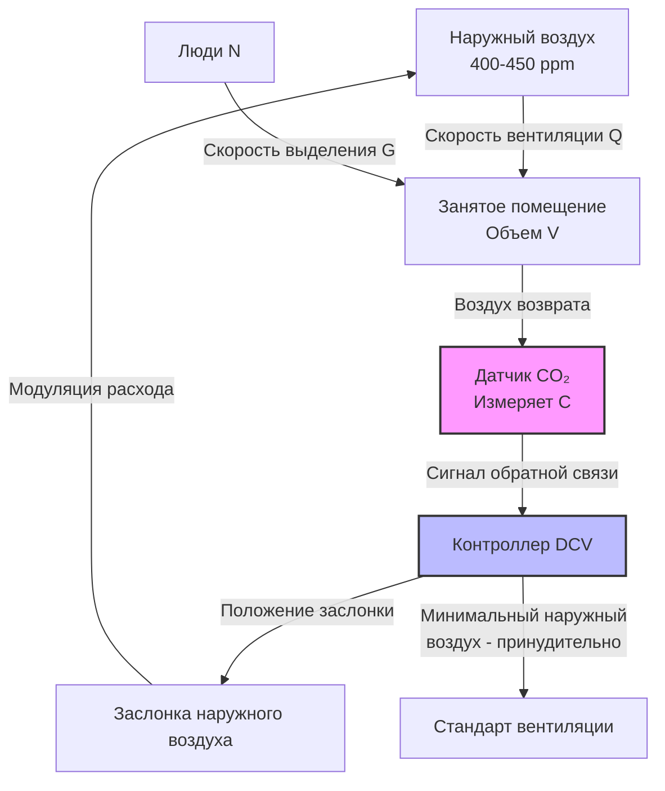

## Фундаментальные принципы

Спрос-управляемая вентиляция (DCV) модулирует скорость подачи наружного воздуха на основе фактической занятости помещения, а не проектной занятости. Диоксид углерода (CO₂) служит эффективным показателем биоэффлювентов, выделяемых людьми, и метаболических загрязнителей. Уравнение материального баланса, описывающее концентрацию CO₂ в вентилируемом помещении:

$$\frac{dC}{dt} = \frac{N \cdot G - Q(C - C_o)}{V}$$

Где:
- $C$ = концентрация CO₂ внутри помещения (ppm)
- $t$ = время (часы)
- $N$ = количество людей
- $G$ = скорость выделения CO₂ на одного человека (м³/ч·ppm или л/с·ppm)
- $Q$ = скорость вентиляции (м³/ч или л/с)
- $C_o$ = концентрация CO₂ на улице (обычно 400-450 ppm)
- $V$ = объем помещения (м³)

При установившихся условиях ($dC/dt = 0$) требуемая скорость вентиляции для поддержания целевой концентрации CO₂:

$$Q = \frac{N \cdot G}{C_{target} - C_o}$$

Стандарт ASHRAE 62.1 признает DCV приемлемой стратегией вентиляции для помещений с переменной и непредсказуемой занятостью при условии, что датчики CO₂ остаются откалиброваны и система управления реагирует надлежащим образом.

## Скорость выделения CO₂

Выделение CO₂ в результате метаболизма человека варьируется в зависимости от уровня активности и скорости метаболизма:

| Уровень активности | Скорость метаболизма (met) | Выделение CO₂ (л/ч·чел) | Выделение CO₂ (м³/ч·ppm/чел) |
|-------------------|---------------------------|------------------------|------------------------------|
| Сидя в покое | 1,0 | 18-20 | 0,0305-0,0339 |
| Офисная работа | 1,2 | 21-24 | 0,0356-0,0407 |
| Легкая активность | 1,6-2,0 | 28-35 | 0,0475-0,0594 |
| Умеренные физические упражнения | 3,0-4,0 | 60-80 | 0,1018-0,1358 |
| Интенсивные физические упражнения | 5,0-7,0 | 100-140 | 0,1697-0,2375 |

Для типичных офисных помещений обычно применяется стандартная скорость выделения 0,3 л/с (0,0101 м³/ч·ppm) на одного человека.

## Технология датчиков и их размещение

### Датчики на основе недиспергирующей инфракрасной спектроскопии (NDIR)

Датчики NDIR измеряют концентрацию CO₂ на основе инфракрасного поглощения на длине волны 4,26 мкм. Молекулы CO₂ поглощают определенные инфракрасные частоты пропорционально концентрации. Закон Бера-Ламберта описывает поглощение:

$$I = I_0 e^{-\alpha C L}$$

Где:
- $I$ = интенсивность передаваемого света
- $I_0$ = интенсивность падающего света
- $\alpha$ = коэффициент поглощения
- $C$ = концентрация CO₂
- $L$ = длина оптического пути

**Характеристики датчика:**
- Точность: ±50 ppm или ±3% от показания
- Диапазон: 0-2000 ppm (стандартный) или 0-5000 ppm (расширенный)
- Время отклика: 60-120 секунд
- Интервал калибровки: 2-5 лет (самокалибрирующиеся) или ежегодно (ручная)
- Температурный диапазон работы: 0-50°C

### Стратегическое размещение датчиков

1. **Воздуховод возврата**: Один датчик в воздуховоде возврата измеряет средние условия в помещении
2. **Зона дыхания**: На высоте 0,9-1,8 м от пола в занятой зоне
3. **Вдали от источников**: На минимальном расстоянии 1,8 м от вытяжных решеток, открываемых окон или групп людей
4. **Репрезентативное расположение**: Площадь, отражающая среднюю занятость помещения

## Стратегии управления

### Пропорциональное управление

Скорость вентиляции регулируется пропорционально концентрации CO₂ выше уровня наружного воздуха:

$$Q = Q_{min} + K(C - C_o)$$

Где:
- $Q_{min}$ = минимальная скорость вентиляции в соответствии с кодексом
- $K$ = коэффициент пропорциональности (м³/ч·ppm или л/с·ppm)
- $C$ = измеренная концентрация CO₂ внутри помещения

### Управление по уставке

Заслонки наружного воздуха модулируют, чтобы поддерживать концентрацию CO₂ внутри помещения на уровне или ниже уставки (обычно 1000-1200 ppm):

$$Q = Q_{min} \text{ когда } C \leq C_{setpoint}$$
$$Q = Q_{design} \text{ когда } C > C_{setpoint}$$

### Управление с переброской

Уставка переключается на основе наружной температуры или нагрузки охлаждения для оптимизации потребления энергии при сохранении качества воздуха.

## Требования проектирования в соответствии с ASHRAE 62.1

**Минимальный расход наружного воздуха**: Системы DCV должны обеспечивать расход наружного воздуха в зоне дыхания, требуемый стандартом ASHRAE 62.1 при условиях проектной занятости:

$$V_{bz} = R_p \cdot P_z + R_a \cdot A_z$$

Где:
- $V_{bz}$ = расход наружного воздуха в зоне дыхания (м³/ч)
- $R_p$ = норма подачи наружного воздуха на одного человека (м³/ч·чел)
- $P_z$ = население зоны (проектная занятость)
- $R_a$ = норма подачи наружного воздуха на единицу площади (м³/ч·м²)
- $A_z$ = площадь пола зоны (м²)

**Требования к датчикам:**
- Размещены в воздуховоде возврата или в зоне дыхания
- Точность в пределах ±75 ppm от фактической концентрации
- Обслуживаются и откалибрированы в соответствии со спецификациями производителя

**Применимые помещения**: Помещения с проектной занятостью ≥25 человек/93 м² и переменной занятостью (аудитории, конференц-залы, театры, рестораны).

## Анализ экономии энергии

Годовая экономия энергии от внедрения DCV:

$$E_{savings} = \rho \cdot c_p \cdot \Delta T \cdot (Q_{design} - Q_{avg}) \cdot h_{occupied} \cdot \eta_{system}$$

Где:
- $\rho$ = плотность воздуха (1,2 кг/м³)
- $c_p$ = удельная теплоемкость воздуха (1,005 кДж/кг·К)
- $\Delta T$ = разница температур между наружным и внутренним воздухом
- $Q_{design}$ = расход вентиляции при проектировании
- $Q_{avg}$ = средний расход вентиляции при управлении DCV
- $h_{occupied}$ = годовое количество часов занятости
- $\eta_{system}$ = коэффициент эффективности системы

Типичная экономия энергии составляет 20-60% энергии, связанной с вентиляционным отоплением и охлаждением, в зависимости от:
- Климатической зоны
- Вариативности занятости
- Типа помещения
- Графика работы

## Сравнение производительности

| Параметр | Постоянная вентиляция | Система DCV |
|----------|----------------------|------------|
| Скорость подачи наружного воздуха | Постоянная (проектная занятость) | Переменная (фактическая занятость) |
| Потребление энергии | Базовый уровень | Снижение на 20-60% |
| Начальная стоимость | Ниже | 10 500-21 000 руб. на зону |
| Операционная стоимость | Выше | Ниже (за счет экономии энергии) |
| Поддержание качества воздуха | Постоянное | Эквивалентное при проектной занятости |
| Обслуживание датчиков | Не требуется | Проверка ежегодной калибровки |
| Соответствие кодексу | ASHRAE 62.1 | ASHRAE 62.1 (с датчиками) |
| Оптимальные применения | Стабильная занятость | Переменная занятость |

## Особенности реализации

**Калибровка датчиков**: Самокалибрирующиеся датчики используют логику ABC (Automatic Background Calibration), предполагая периодический контакт с концентрацией наружного воздуха. Ручная калибровка с эталонным газом (400 ppm или 1000 ppm) обеспечивает более высокую точность.

**Переопределение минимальной вентиляции**: Системы должны обеспечивать требуемую кодексом минимальную вентиляцию независимо от показаний CO₂ для решения проблем неорганических загрязнителей (выбросы материалов, чистящие средства).

**Время отклика**: Алгоритмы контроллера должны учитывать задержку датчика (60-120 секунд) и динамику смешивания для предотвращения колебаний или недолгого затухания.

**Многозонные системы**: Каждая зона требует отдельного датчика или пропорционального распределения на основе репрезентативных мест отбора проб.

**Проверка при запуске**: Функциональное тестирование подтверждает точность датчика, отклик управления, подачу минимального расхода воздуха и функциональность сигнализации при различных уровнях занятости.

## Интеграция с системой автоматизации зданий

Современные системы DCV интегрируются с системами автоматизации зданий (BAS) для обеспечения:
- Мониторинга CO₂ в реальном времени и сигнализации
- Автоматической компенсации дрейфа датчика
- Координированного управления с циклами экономайзера
- Оптимизации расписания на основе занятости
- Отслеживания потребления энергии
- Удаленной диагностики и проверки калибровки

Синергия между спрос-управляемой вентиляцией на основе CO₂ и другими мерами по сбережению энергии (экономайзеры, переменный расход воздуха, рекуперация тепла) максимизирует как качество внутреннего воздуха, так и энергоэффективность в различных типах зданий и климатических условиях.
