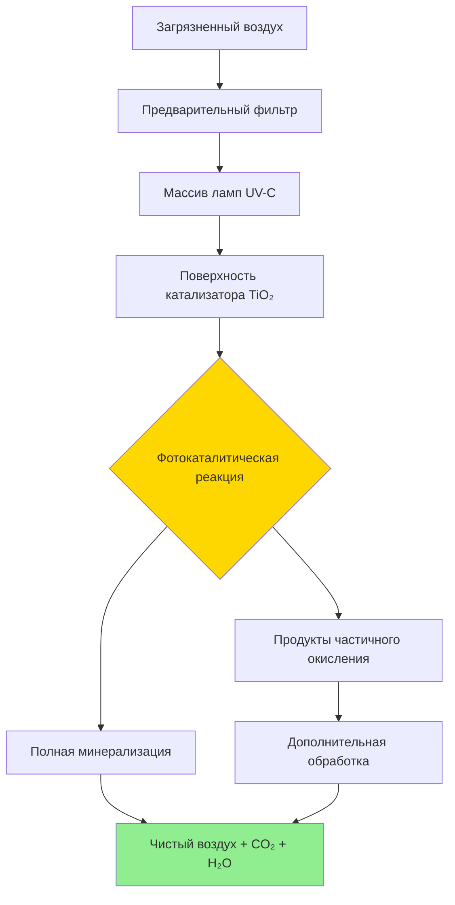

# Системы контроля газообразных загрязнений

Контроль газообразных загрязнений решает проблему удаления загрязнителей молекулярного масштаба, которые не могут быть захвачены фильтрами для твёрдых частиц. Эти системы удаляют летучие органические соединения (ЛОС), запахи и химические раздражители посредством адсорбции, окисления или фотокаталитического разрушения. Выбор зависит от типа загрязнителя, концентрации, требуемой эффективности удаления и эксплуатационных ограничений.

## Механизмы физической адсорбции

### Системы с активированным углём

Активированный уголь удаляет газообразные загрязнители посредством физической адсорбции на высокопористой матрице с удельной поверхностью (800-1200 м²/г). Силы Ван-дер-Ваальса привлекают и удерживают молекулы в микропористой структуре. Эффективность зависит от:

**Свойства углерода:**
- Удельная поверхность и распределение пор по размерам
- Размер частиц (4×6, 4×8 или 4×10 меш типичны)
- Объёмная плотность (влияет на глубину слоя и перепад давления)
- Содержание влаги (вода конкурирует за места адсорбции)

**Условия эксплуатации:**
- Скорость фильтрации (типично 76-152 м/мин)
- Глубина слоя (5-10 см для приложений HVAC)
- Относительная влажность (эффективность снижается выше 50% ОВ)
- Температура (ёмкость адсорбции уменьшается при повышенных температурах)

### Изотермы адсорбции

Зависимость между концентрацией адсорбата и загрузкой следует моделям изотерм:

**Изотерма Ленгмюра (монослойное покрытие):**
```
q = (q_max × K × C) / (1 + K × C)

Где:
q = загрузка адсорбента (г загрязнителя/г углерода)
q_max = максимальная ёмкость адсорбции
K = константа равновесия адсорбции
C = концентрация загрязнителя (мг/м³)
```

**Изотерма Фрейндлиха (многослойное, гетерогенные поверхности):**
```
q = K_f × C^(1/n)

Где:
K_f = константа Фрейндлиха
n = фактор интенсивности адсорбции (типично 1-10)
```

Эти изотермы прогнозируют ёмкость углерода при определённых концентрациях загрязнителя и позволяют выполнить расчеты по калибровке слоя среды.

### Анализ прорыва

Прорыв происходит, когда волна адсорбции достигает выходного края, вызывая повышение концентрации на выходе. Кривая прорыва характеризует срок службы фильтра:

**Ключевые параметры:**
| Параметр | Определение | Значимость |
|----------|------------|-----------|
| Точка прорыва | Концентрация на выходе достигает 5-10% входной | Порог замены среды |
| Точка насыщения | Концентрация на выходе равна входной | Полное истощение |
| Зона массопередачи | Область активной адсорбции | Определяет требуемую глубину слоя |
| Срок службы | Время до прорыва | Частота замены |

**Оценка времени прорыва:**
```
t_b = (ρ_b × V × q × W_f) / (Q × C_in)

Где:
t_b = время прорыва (часы)
ρ_b = объёмная плотность (г/л)
V = объём слоя (л)
q = ёмкость адсорбции (г/г)
W_f = коэффициент рабочей ёмкости (0,3-0,6)
Q = расход воздуха (л/ч)
C_in = входная концентрация (г/л)
```


## Химическая адсорбция и окисление

### Импрегнированный углерод

Стандартный активированный уголь показывает низкую эффективность на низкомолекулярные соединения (формальдегид, аммиак, сероводород). Импрегнирование реактивными химикатами обеспечивает хемосорбцию:

**Обычные имплегранты:**
- Йодид калия (для паров ртути)
- Соединения серы (для ртути и мышьяка)
- Фосфорная кислота (для аммиака)
- Оксиды металлов (для сероводорода)

### Среда с перманганатом калия

Сферы оксида алюминия, импрегнированные KMnO₄, окисляют загрязнители посредством окислительно-восстановительных реакций, а не физической адсорбции. Перманганат обеспечивает окислительную ёмкость, которая преобразует восстановленные соединения серы, альдегиды и другие окисляемые вещества в менее вредные продукты.

**Преимущества:**
- Эффективен при высокой влажности (без штрафа за влажность)
- Более низкий перепад давления, чем уголь при эквивалентной эффективности
- Длительный срок службы для удаления альдегидов

**Ограничения:**
- Более высокая начальная стоимость
- Специфичен для окисляемых соединений
- Образование фиолетовой пыли требует нисходящей фильтрации

## Фотокаталитическое окисление (PCO)

### Конструкция системы UV-PCO

Фотокаталитическое окисление использует UV-C радиацию (254 нм) для активации каталитических поверхностей диоксида титана (TiO₂). Энергия фотона создаёт пары электрон-дырка, которые генерируют гидроксильные радикалы и ионы супероксида. Эти активные виды окисляют органические соединения до CO₂ и H₂O.

**Компоненты системы:**
1. Массив ламп UV-C (длина волны для дезинфекции)
2. Подложка с покрытием TiO₂ (сотовая или гофрированная)
3. Площадь поверхности катализатора (типично 30-50 м² на единицу)
4. Камера времени пребывания (0,5-2 секунды)

**Факторы эффективности:**
- Интенсивность UV на поверхности катализатора (мВт/см²)
- Загрузка катализатора и состояние активации
- Молекулярная структура загрязнителя (ароматические соединения устойчивы к окислению)
- Относительная влажность (30-50% оптимально)
- Скорость воздуха через реактор (ниже = лучше)



**Кинетика окисления:**
```
Скорость = k × I^n × C / (1 + K_ads × C)

Где:
k = константа скорости
I = интенсивность UV
n = порядок по интенсивности света (0,5-1,0)
C = концентрация загрязнителя
K_ads = константа адсорбции
```

## Конструкция системы газофазной фильтрации

### Матрица выбора среды

| Тип загрязнителя | Активированный уголь | Среда KMnO₄ | UV-PCO | Комбинированная система |
|------------------|----------------------|-------------|---------|------------------------|
| ЛОС (высокая МВ) | Отличный | Плохой | Хороший | Отличный |
| Формальдегид | Удовлетворительный | Отличный | Отличный | Отличный |
| Озон | Удовлетворительный | Отличный | Плохой | Хороший |
| Запахи | Отличный | Удовлетворительный | Хороший | Отличный |
| Кислые газы | Удовлетворительный (импрегнированный) | Отличный | Плохой | Отличный |

### Стратегии конфигурации

**Последовательное расположение:**
Фильтр для твёрдых частиц → Уголь → KMnO₄ → HEPA (если требуется)

Удаляет частицы сначала (предотвращает засорение среды), адсорбирует ЛОС, окисляет активные виды, захватывает частицы из химической среды.

**Параллельное расположение:**
Отдельные потоки воздуха, обработанные оптимальной средой, затем смешиваются.

**Гибридные системы:**
Предварительная адсорбция на углероде → Разрушение UV-PCO → Полирующий фильтр

Снижает пиковую нагрузку на реактор PCO при достижении высокой эффективности удаления.

## Протокол испытаний ASHRAE 145.2

Стандарт ASHRAE 145.2 предусматривает лабораторные методы испытаний для оценки эффективности газофазных систем очистки воздуха. Ключевые параметры испытаний:

**Условия воздействия:**
- Тип и концентрация загрязнителя
- Скорость фильтрации (типично 2,5 м/с)
- Температура (23°C ± 1°C)
- Относительная влажность (45% ± 5%)

**Метрики эффективности:**
- Однопроходная эффективность при разных концентрациях
- Время прорыва до 50% эффективности
- Перепад давления на протяжении срока службы
- Образование побочных продуктов (озон, альдегиды)

Результаты испытаний позволяют сравнивать технологии и прогнозировать эффективность установленных систем при определённых условиях эксплуатации.

## Выбор стратегии удаления ЛОС

### Рамки принятия решений

**Для низкой концентрации, широкого спектра ЛОС (<1 ppm):**
Стандартный активированный уголь с адекватной глубиной слоя. Размер для срока службы 6-12 месяцев в соответствии с расчётами прорыва.

**Для формальдегида и низкомолекулярных альдегидов:**
Среда с перманганатом калия или системы UV-PCO. Углерод один обеспечивает недостаточную ёмкость.

**Для сред с высокой влажностью (>60% ОВ):**
Среда KMnO₄ или UV-PCO. Стандартный уголь теряет 40-60% ёмкости выше 50% ОВ.

**Для удаления озона:**
Активированный уголь (неимпрегнированный) или среда с диоксидом марганца. Системы PCO могут генерировать озон как побочный продукт.

**Для максимальной эффективности удаления:**
Последовательная конфигурация: Уголь → UV-PCO → KMnO₄. Первоначальная адсорбция снижает нагрузку на PCO, окисление разрушает адсорбированные виды и загрязнители прорыва, финальная стадия окисления захватывает остатки.

## Перепад давления и энергетические соображения

Газофазные фильтры создают значительное статическое давление в системах обработки воздуха:

**Типичные перепады давления:**
- Слой углерода 5 см: 30-61 Па
- Слой углерода 10 см: 61-122 Па
- Среда KMnO₄: 20-41 Па
- Реактор UV-PCO: 10-30 Па

**Влияние энергии вентилятора:**
```
ΔМощность = (Q × Δp) / (6356 × η)

Где:
ΔМощность = дополнительная мощность вентилятора (л.с.)
Q = расход воздуха (куб. фут/мин)
Δp = дополнительный перепад давления (дюйм вод. ст.)
η = эффективность вентилятора (типично 0,65-0,75)
```

Для системы с расходом 10 000 куб. фут/мин (283 м³/мин) с добавленным 1,0 дюйм вод. ст. (249 Па) от газофазной фильтрации:
```
ΔМощность = (10 000 × 1,0) / (6356 × 0,70) = 2,25 л.с.

Годовая стоимость энергии = 2,25 л.с. × 0,746 кВт/л.с. × 8760 ч × 0,12 €/кВт·ч
                            = 1 770 €/год
```

Этот энергетический штраф должен быть сбалансирован с преимуществами удаления загрязнителя и воздействием на здоровье жильцов.

## Техническое обслуживание и мониторинг

**Управление слоем углерода:**
- Мониторинг перепада давления (повышение на 20% указывает на засорение частицами)
- Отбор проб концентрации на выходе (обнаружение прорыва)
- Замена при 80% от прогнозируемого времени прорыва
- Утилизация как опасные отходы при насыщении регулируемыми соединениями

**Техническое обслуживание системы UV-PCO:**
- Измерение интенсивности UV ежеквартально (замена ламп при выходе на 80%)
- Проверка поверхности катализатора на загрязнение
- Мониторинг образования озона (не должно превышать 0,05 ppm)
- Очистка или замена катализатора каждые 2-3 года

**Индикаторы среды KMnO₄:**
- Изменение цвета с фиолетового на коричневый (окислительная ёмкость истощена)
- Засорение нисходящего фильтра для твёрдых частиц (пыление среды)
- Замена при наличии цвета на 50% слоя

Надлежащее техническое обслуживание обеспечивает постоянную эффективность удаления и предотвращает события прорыва, которые подвергают жильцов повышенному уровню загрязнения.
