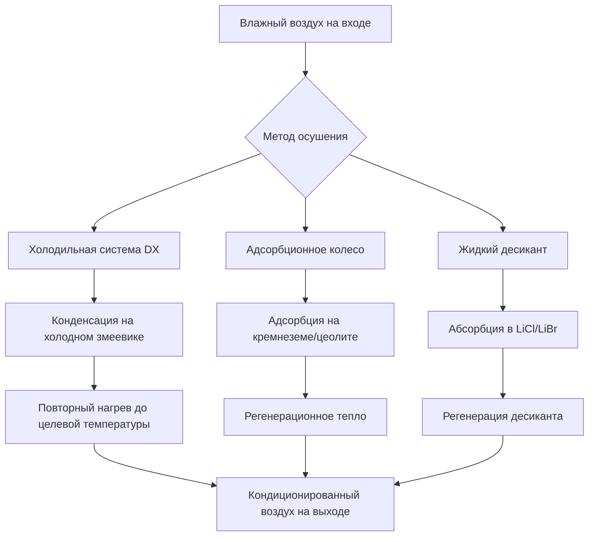
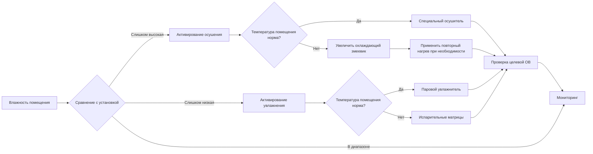

## Обзор

Контроль влажности представляет критический аспект управления качеством воздуха в помещении, который напрямую влияет на здоровье и комфорт людей, целостность строительного ограждения и сохранение материалов. Поддержание относительной влажности в приемлемых диапазонах предотвращает рост плесени, размножение пылевых клещей, раздражение дыхательных путей и деградацию конструкций. Стандарт ASHRAE 62.1 рекомендует поддерживать влажность в помещении между 30% и 60% для большинства занимаемых пространств, с более строгими требованиями для специфических приложений.

Физика управления влажностью включает понимание психрометрических соотношений, передачи скрытого тепла, скоростей образования влаги и взаимодействия между температурой и содержанием влаги в воздухе. Эффективное управление влажностью требует координации между системами отопления, охлаждения, вентиляции и специального оборудования для контроля влаги.

## Основы психрометрики

### Соотношения содержания влаги

Соотношение между температурой сухого термометра, относительной влажностью и абсолютной влажностью определяет все стратегии контроля влажности:

$$\phi = \frac{p_v}{p_{vs}} \times 100\%$$

Где:
- $\phi$ = относительная влажность (%)
- $p_v$ = парциальное давление водяного пара (Па)
- $p_{vs}$ = давление насыщенного водяного пара при температуре сухого термометра (Па)

Коэффициент влажности (абсолютная влажность) количественно определяет фактическое содержание влаги:

$$W = 0.622 \times \frac{p_v}{p_{atm} - p_v}$$

Где:
- $W$ = коэффициент влажности (кг воды/кг сухого воздуха)
- $p_{atm}$ = атмосферное давление (Па)

Температура точки росы указывает на температуру, при которой происходит конденсация при охлаждении воздуха при постоянном давлении и коэффициенте влажности. Этот параметр критически важен для предотвращения конденсации на поверхностях зданий и внутри оборудования HVAC.

## Влияние на здоровье и комфорт

### Влияние относительной влажности на качество воздуха в помещении

| Диапазон ОВ | Влияние на здоровье | Влияние на материалы | Биологический рост |
|-------------|-------------------|-------------------|-------------------|
| < 20% | Сухость слизистых оболочек, статическое электричество, раздражение глаз | Усадка древесины, растрескивание краски | Минимальная микробная активность |
| 20-30% | Снижение защиты органов дыхания, повышенная восприимчивость к инфекциям | Приемлемо для большинства материалов | Низкая популяция пылевых клещей |
| 30-50% | Оптимальная функция дыхания, снижение передачи инфекции | Стабильное изменение размеров | Минимальная плесень, низкие пылевые клещи |
| 50-60% | Приемлемый комфорт, легкое восприятие влаги | Приемлемо для кондиционируемых помещений | Умеренная активность пылевых клещей |
| 60-70% | Восприятие затхлости, снижение испарительного охлаждения | Абсорбция гигроскопичных материалов | Начало активного роста плесени |
| > 70% | Дискомфорт дыхания, размножение аллергенов | Коррозия, гниение, изменение размеров | Быстрый рост плесени и бактерий |

Стандарт ASHRAE 55 устанавливает зоны комфорта на основе пересечения температуры и влажности. При 50% ОВ диапазон комфорта составляет приблизительно 20°C до 24°C для типичной одежды и интенсивности обмена веществ.

### Выживание патогенов и влажность

Исследования демонстрируют, что относительная влажность значительно влияет на выживание переносимых по воздуху патогенов. Большинство респираторных вирусов показывают минимальные показатели выживания между 40-60% ОВ. Ниже 30% ОВ, вирусные частицы остаются в воздухе дольше и сохраняют инфекционность. Выше 60% ОВ, рост бактерий ускоряется на поверхностях и в строительных материалах.

## Источники влаги и нагрузки

### Внутреннее образование влаги

Метаболические процессы людей генерируют значительные нагрузки влаги:

$$\dot{m}_{occupant} = 0.04 \text{ до } 0.08 \text{ кг/ч на человека}$$

Конкретная скорость зависит от уровня активности, с седентарными видами деятельности в нижней части и умеренной физической работой в верхней части.

Дополнительные внутренние источники включают:
- Приготовление пищи: 1,5-3,0 кг/ч (жилые кухни)
- Принятие ванны/душ: 0,5-1,0 кг/ч
- Стирка/сушка одежды: 0,2-2,0 кг/ч
- Комнатные растения: 0,01-0,05 кг/ч на растение
- Аквариумы: 0,5-2,0 кг/день на 100 литров

### Внешняя инфильтрация влаги

Влага попадает в здания через воздухопроницаемость и диффузию пара:

$$\dot{m}_{inf} = \rho_{air} \times Q_{inf} \times (W_{out} - W_{in})$$

Где:
- $\rho_{air}$ = плотность воздуха (кг/м³)
- $Q_{inf}$ = расход инфильтрационного воздуха (м³/с)
- $W_{out}$, $W_{in}$ = коэффициенты влажности наружного и внутреннего воздуха

Диффузия пара через сборку ограждения здания способствует дополнительной передаче влаги, особенно в климатических зонах со значительным перепадом давления паров между помещением и внешней средой.

## Стратегии осушения

### Осушение на основе охлаждения

Стандартные охлаждающие змеевики удаляют влагу, когда поверхностная температура падает ниже точки росы входящего воздуха:

$$\dot{Q}_{latent} = \dot{m}_{air} \times h_{fg} \times (W_{in} - W_{out})$$

Где:
- $\dot{Q}_{latent}$ = мощность скрытого охлаждения (кВт)
- $\dot{m}_{air}$ = массовый расход воздуха (кг/с)
- $h_{fg}$ = скрытая теплота испарения (2450 кДж/кг при стандартных условиях)

Коэффициент чувствительного тепла (SHR) указывает на долю общей мощности охлаждения, посвященной снижению температуры в сравнении с удалением влаги:

$$SHR = \frac{\dot{Q}_{sensible}}{\dot{Q}_{sensible} + \dot{Q}_{latent}}$$

Стандартные холодильные змеевики работают с коэффициентами SHR 0,70-0,80. Приложения, требующие улучшенного осушения, используют змеевики с SHR от 0,50 до 0,60.

### Специальное оборудование для осушения

**Холодильные системы**: Системы подготовки наружного воздуха (DOAS) предварительно кондиционируют воздух вентиляции до определенных уровней влажности перед смешиванием с рециркулируемым воздухом. Эти системы обычно подают воздух при 7-13°C и 40-50% ОВ, требуя последующего повторного нагрева для подачи с комфортом.

**Адсорбционные осушители**: Вращающиеся адсорбционные колеса передают влагу из воздуха обработки в поток воздуха регенерации. Силикагель и молекулярное сито работают эффективно при точках росы ниже 4°C, где охлаждающие змеевики теряют эффективность. Регенерация требует тепловой энергии при 82-121°C.

**Системы жидкого десиканта**: Растворы хлорида лития или бромида лития абсорбируют влагу из воздуха через прямой контакт. Эти системы достигают более низких уровней влажности, чем методы на основе охлаждения, и облегчают восстановление тепла из процессов регенерации.

## Стратегии увлажнения

### Испарительное увлажнение

Прямое испарение вводит влагу при адиабатическом охлаждении воздуха вдоль линий постоянной энтальпии на психрометрической диаграмме. Этот процесс энергоэффективен, но снижает температуру сухого термометра:

$$\Delta T = \frac{h_{fg} \times (W_{final} - W_{initial})}{c_{p,air}}$$

Где $c_{p,air}$ = удельная теплоемкость воздуха (1.006 кДж/кг·К)

Паровое увлажнение добавляет как влагу, так и чувствительное тепло, увеличивая энтальпию:

$$\dot{Q}_{total} = \dot{m}_{steam} \times (h_{steam} - h_{water,makeup})$$

### Технологии увлажнения

| Технология | КПД | Точность управления | Риск гигиены | Применение |
|------------|---------|-------------------|--------------|-------------|
| Паровая сетка | 95-100% | Отличная (±2% ОВ) | Низкий | Больницы, музеи, лаборатории |
| Пар-в-пар | 95-100% | Отличная (±2% ОВ) | Очень низкий | Чистые комнаты, фармацевтика |
| Электродный котел | 96-99% | Отличная (±3% ОВ) | Низкий | Коммерческие здания |
| Ультразвуковой | 70-90% | Хорошая (±5% ОВ) | Умеренный | Жилые, легкие коммерческие |
| Испарительные матрицы | 80-95% | Удовлетворительная (±5-10% ОВ) | Умеренно-высокий | Промышленность, воздухообработчики |
| Распылительное сопло | 75-90% | Хорошая (±5% ОВ) | Умеренный | Технологические приложения |

Паровые системы устраняют риски биологического загрязнения, но потребляют значительную энергию. Испарительные методы предлагают более низкие операционные затраты, но требуют обработки воды и регулярного обслуживания для предотвращения микробного роста.

## Стратегии управления

### Датчики влажности и установки

Точное измерение влажности требует правильного размещения датчика вдали от прямых источников влаги и термических градиентов. Емкостные датчики обеспечивают точность ±2-3% ОВ, пригодную для большинства приложений HVAC. Гигрометры с охлажденным зеркалом достигают точности ±0.1% для критических сред.

Установки управления балансируют конкурирующие цели:

**Зимнее увлажнение**: Ограничивает влажность в помещении для предотвращения конденсации на самых холодных внутренних поверхностях. Максимальное безопасное соотношение влажности следует:

$$W_{max} = W_{sat}(T_{surface,min})$$

Для типичной конструкции с двухслойными окнами это дает максимальную ОВ 25-35% при наружных температурах ниже -7°C.

**Летнее осушение**: Поддерживает ОВ ниже 60% для предотвращения роста плесени при минимизации энергопотребления. Специальное осушение может активироваться, когда охлаждение пространства в одиночку не может достичь целевых параметров влажности.

### Интегрированное координирование систем

Современные системы автоматизации зданий модулируют несколько компонентов одновременно: температуру подаваемого воздуха, расход вентиляции, оборудование осушения и производительность увлажнения. Алгоритмы прогнозирующего управления предвосхищают изменения влажности на основе графиков занятости, прогнозов погоды и исторических закономерностей.

## Энергетические соображения

Управление влажностью значительно влияет на потребление энергии HVAC. Осушение требует энергии охлаждения плюс потенциальный повторный нагрев для поддержания комфортных температур. Увлажнение требует энергии для генерации пара или испарения воды.

Коэффициент производительности осушения посредством охлаждения и повторного нагрева:

$$COP_{dehum} = \frac{\dot{m}_{water} \times h_{fg}}{\dot{Q}_{cooling} + \dot{Q}_{reheat}}$$

Типичные значения варьируются от 1.0 до 2.5, значительно ниже, чем у чувствительного охлаждения COP 3.0-5.0. Системы рекуперации энергии захватывают отработанное тепло из осушения для повторного нагрева или предварительного нагрева наружного воздуха, улучшая общую эффективность на 20-40%.

## Стандарты и руководства

Стандарт ASHRAE 62.1 определяет скорости вентиляции, но откладывает пределы влажности на другие стандарты. Стандарт ASHRAE 55 определяет приемлемые диапазоны влажности для теплового комфорта: максимальное соотношение влажности 0.012 кг/кг и температуры точки росы не превышающие 17°C.

Специфические приложения требуют более строгого контроля:
- **Музеи/архивы**: 45-55% ОВ ±5% согласно ASHRAE Handbook - HVAC Applications
- **Больницы**: 30-60% ОВ согласно ASHRAE Standard 170
- **Центры обработки данных**: 40-60% ОВ согласно руководящим принципам ASHRAE TC 9.9
- **Фармацевтическое производство**: 35-65% ОВ согласно требованиям FDA/cGMP

Строительные нормы все чаще требуют положения контроля влажности. Международный энергокодекс (IECC) требует специальных возможностей осушения во влажных климатических зонах (климатические зоны 1A, 2A, 3A).

## Заключение

Управление влажностью служит фундаментальным параметром качества воздуха в помещении, влияющим на здоровье, комфорт и долговечность здания. Эффективная реализация требует понимания психрометрических принципов, точного расчета нагрузок, надлежащего выбора оборудования и интегрированных стратегий управления. Штраф на энергию для управления влажностью требует эффективного проектирования системы, включающего восстановление тепла и работу на основе спроса. Соответствие стандартам ASHRAE обеспечивает приемлемые внутренние среды во всех разнообразных типах зданий и климатических зонах.
