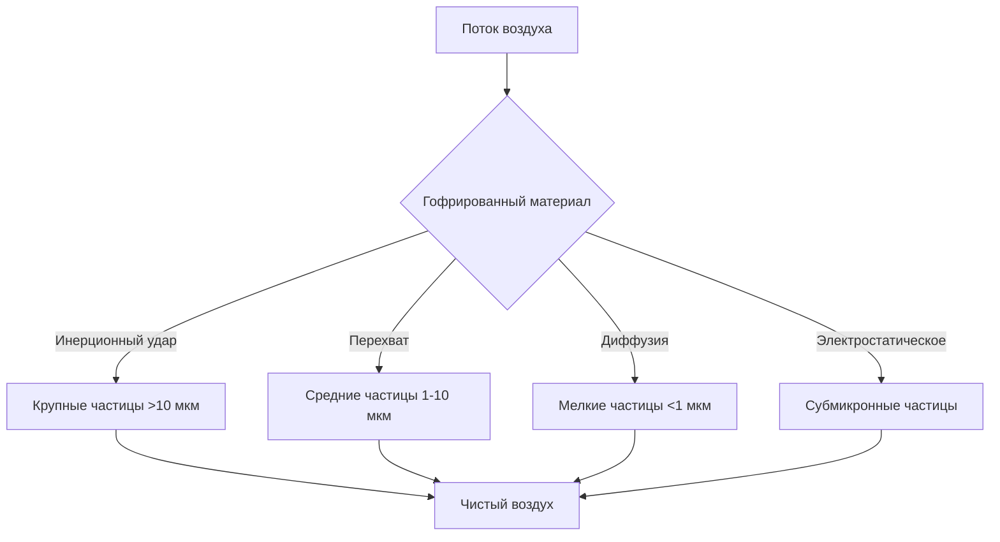
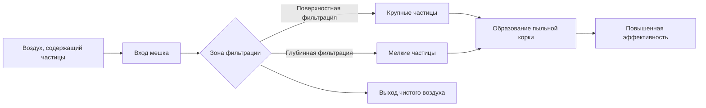
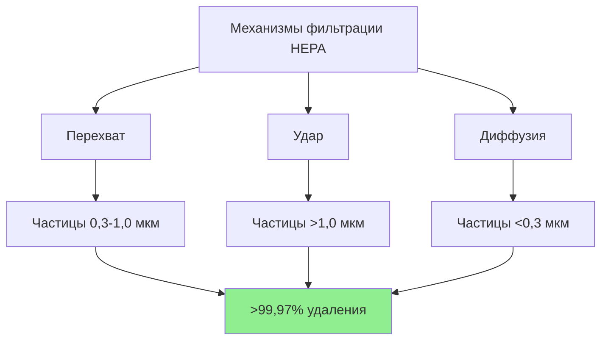

## Категории конструкции фильтров

Воздушные фильтры классифицируются по методу конструкции, что напрямую влияет на эффективность фильтрации, перепад давления, пыленосимость и срок службы. Понимание различий в конструкции позволяет правильно выбрать фильтр для конкретных применений и условий эксплуатации.

## Панельные фильтры

Панельные фильтры представляют собой самую простую конструкцию фильтра, состоящую из плоского пакета фильтрующего материала, помещенного в жесткий каркас.

### Характеристики конструкции

**Типы материалов:**
- Стекловолоконный мат (применения с низкой эффективностью)
- Синтетическое полиэфирное волокно
- Электростатически заряженный синтетический материал
- Металлическая сетка (моющиеся/многоразовые типы)

**Материалы каркаса:**
- Картон (одноразовые, MERV 1-4)
- Оцинкованная сталь (промышленные применения)
- Алюминий (коррозионная стойкость)
- Формованный пластик (влагостойкость)

**Типичные размеры:**
- Стандартные: 51 × 51 см, 51 × 64 см, 61 × 61 см
- Толщина: 2,5-5 см
- Ограниченная площадь материала равна низкой пыленосимости

### Диапазон производительности

| Параметр | Низкая эффективность | Средняя эффективность |
|-----------|----------------------|------------------------|
| Рейтинг MERV | 1-4 | 5-8 |
| Начальный Δp | 0,012-0,025 кПа | 0,037-0,074 кПа |
| Пыленосимость | 50-150 г | 150-300 г |
| Удаление частиц (0,3-1,0 мкм) | <20% | 20-35% |
| Срок службы | 1-3 месяца | 2-4 месяца |

### Применение

- Жилые системы HVAC (MERV 1-8)
- Предварительная фильтрация в многоступенчатых системах
- Легкие коммерческие применения с низкой нагрузкой частиц
- Защита оборудования (защита теплообменника)

## Гофрированные фильтры

Гофрированная конструкция увеличивает площадь материала в одинаковых фронтальных размерах путем складывания материала в гармошку. Эта конфигурация обеспечивает превосходную пыленосимость и срок службы по сравнению с панельными фильтрами.

### Особенности конструкции

**Геометрия гофров:**
- Высота гофра: 1,3-7,6 см (глубина определяет площадь материала)
- Расстояние между гофрами: 12-24 гофра на 30 см
- Поддержка материала: Металлическая проволока или пластиковая сетка предотвращают коллапс гофра

**Варианты материалов:**
- Синтетические стекловолоконные смеси (MERV 8-13)
- Электростатически заряженный материал (повышенная эффективность)
- Смеси хлопка и полиэстера (MERV 7-10)

### Характеристики производительности

**Сравнительная производительность:**

| Глубина | Соотношение площади материала | Диапазон MERV | Типичный Δp | Пыленосимость |
|---------|-------------------------------|---------------|-------------|---------------|
| 2,5 см | 3-4× панель | 7-10 | 0,049-0,086 кПа | 250-400 г |
| 5 см | 6-8× панель | 8-11 | 0,061-0,111 кПа | 400-600 г |
| 10 см | 12-16× панель | 11-14 | 0,074-0,148 кПа | 800-1200 г |

### Применение

- Коммерческие системы HVAC (стандартная эффективность)
- Жилые высокоэффективные модернизации
- Общие офисные и торговые помещения
- Некритические области здравоохранения

## Мешочные фильтры

Мешочные фильтры используют карманы материала, простирающиеся вниз от каркаса фильтра, максимизируя площадь материала и пыленосимость. Эта конструкция обеспечивает наибольшую пыленосимость среди фильтров ниже класса HEPA.

### Детали конструкции

**Конфигурация мешка:**
- Количество карманов: 3-12 на фильтр
- Глубина кармана: 30-90 см
- Крепление в коллекторе: Сварные, прошитые или ультразвуковые швы
- Поддержка: Внутренние проволочные опоры сохраняют форму мешка под потоком воздуха

**Выбор материала:**
- Синтетическое микроволокно (MERV 13-15)
- Многослойный укладистый материал
- Материал с прогрессирующей плотностью (поверхностная нагрузка к глубинной нагрузке)

### Характеристики производительности

| Карманы | Глубина | Площадь материала | MERV | Начальный Δp | Пыленосимость |
|---------|---------|-------------------|------|-------------|---------------|
| 6 | 61 см | 4,2-5,1 м² | 13-14 | 0,123-0,173 кПа | 1500-2500 г |
| 8 | 61 см | 5,6-6,5 м² | 14-15 | 0,135-0,185 кПа | 2000-3000 г |
| 6 | 91 см | 6,0-7,4 м² | 13-14 | 0,111-0,160 кПа | 2500-3500 г |

### Механизмы сбора

### Применение

- Некритические области больниц (MERV 13-14)
- Фармацевтическое производство (предварительная фильтрация)
- Предварительная фильтрация чистых помещений
- Коммерческие здания, требующие высокого качества внутреннего воздуха (IAQ)
- Центры обработки данных и производство электроники

## Картриджные фильтры

Картриджные фильтры используют цилиндрические или конические конфигурации материала, в основном применяются в промышленной системе пылеудаления и специализированных применениях HVAC.

### Вариации конструкции

**Цилиндрические картриджи:**
- Материал: Целлюлоза, полиэстер или спанбонд
- Количество гофров: 150-300 гофров
- Площадь фильтрации: 1,9-13,9 м² на картридж
- Концевые крышки: Металлические или пластиковые с уплотнением

**Картриджи панельного типа:**
- Жесткий каркас с удлиненными гофрами
- Используются в компактных фильтровальных кожухах
- Типичный диапазон MERV 11-15

### Производительность и обслуживание

**Эксплуатационные характеристики:**
- Начальный перепад давления: 0,074-0,197 кПа
- Порог замены: 0,49-0,74 кПа
- Очистка: Некоторые конструкции позволяют импульсную струйную очистку
- Срок службы: 6-24 месяца в зависимости от нагрузки

### Применение

- Промышленные системы вентиляции
- Предварительная фильтрация в системах пылеудаления
- Фильтрация технологического воздуха
- Применения с высоким объемом и низким давлением

## HEPA фильтры

Фильтры высокоэффективной очистки воздуха от частиц (HEPA) представляют самый высокий класс эффективности для механической фильтрации, удаляя ≥99,97% частиц размером 0,3 мкм (наиболее проникающий размер частиц).

### Стандарты конструкции

**Состав материала:**
- Микроволоконная стеклянная бумага
- Диаметр волокна нанометрового масштаба (0,5-2,0 мкм)
- Глубина: 0,3-0,5 мм сжатая
- Содержание связующего вещества: 5-15% для структурной целостности

**Требования к сборке:**
- Материал разделителя: Алюминиевый гофрированный, горячее склеивание
- Каркас: Прессованный картон, металл или пластик
- Уплотнение: Полиуретановое или неопреновое уплотнение
- Контроль качества: 100% фабричное тестирование согласно MIL-STD-282 или эквиваленту

### Физика фильтрации

### Характеристики производительности

| Стандарт | Эффективность при MPPS | Типичный Δp | Скорость | Применение |
|----------|------------------------|------------|----------|-----------|
| HEPA (тип A) | 99,97% @ 0,3 мкм | 0,197-0,296 кПа | 76 м/мин | Критические области здравоохранения |
| HEPA (тип B) | 99,97% @ 0,3 мкм | 0,246-0,369 кПа | 91 м/мин | Фармацевтика |
| ULPA | 99,999% @ 0,12 мкм | 0,296-0,492 кПа | 76 м/мин | Полупроводники |

### Критические применения

- Операционные в больницах и палаты изоляции
- Фармацевтические чистые комнаты (ISO класс 5-7)
- Производство полупроводников
- Биологические лаборатории (BSL-3, BSL-4)
- Ядерные объекты

## Матрица критериев выбора

| Фактор | Панель | Гофрированный | Мешочный | Картридж | HEPA |
|--------|--------|---------------|----------|----------|------|
| Начальная стоимость | $ | $$ | $$$ | $$-$$$ | $$$$ |
| Затраты на эксплуатацию | Высокие | Средние | Низкие | Средние | Высокие |
| Диапазон эффективности | MERV 1-8 | MERV 7-14 | MERV 13-15 | MERV 11-15 | MERV 17-20 |
| Пыленосимость | Очень низкая | Средняя | Очень высокая | Высокая | Низкая |
| Требуемое пространство | Минимальное | Минимальное | Среднее | Среднее | Значительное |
| Частота обслуживания | Ежемесячно | Ежеквартально | Раз в полгода | Ежеквартально | Ежегодно |
| Перепад давления | Низкий | Средний | Средний-высокий | Средний | Высокий |

## Соображения при проектировании

**Требования по потоку воздуха:**
- Ограничения фронтальной скорости предотвращают повреждение материала
- Панель/Гофрированный: максимум 91 м/мин
- Мешочный: рекомендуется 76-106 м/мин
- HEPA: стандарт 76 м/мин (критические применения)

**Корпус фильтра:**
- Размер дверцы доступа для замены фильтра
- Порты для манометра для контроля перепада давления
- Плоскостность контактной поверхности уплотнения (HEPA: ≤0,16 см)
- Предотвращение утечек (100% потока воздуха через материал)

**Интеграция в систему:**
- Предварительная фильтрация продлевает срок службы финального фильтра
- MERV 7-8 перед MERV 13-15 рекомендуется
- MERV 11-13 перед HEPA обязателен
- Контроль перепада давления для своевременной замены

## Ссылки

- ASHRAE Handbook—HVAC Systems and Equipment, Chapter 29: Air Cleaners for Particulate Contaminants
- ASHRAE Standard 52.2: Method of Testing General Ventilation Air-Cleaning Devices for Removal Efficiency by Particle Size
- ISO 16890: Air filters for general ventilation
- MIL-STD-282: Filter Units, Protective Clothing, Gas Mask Components and Related Products: Performance-Test Methods
