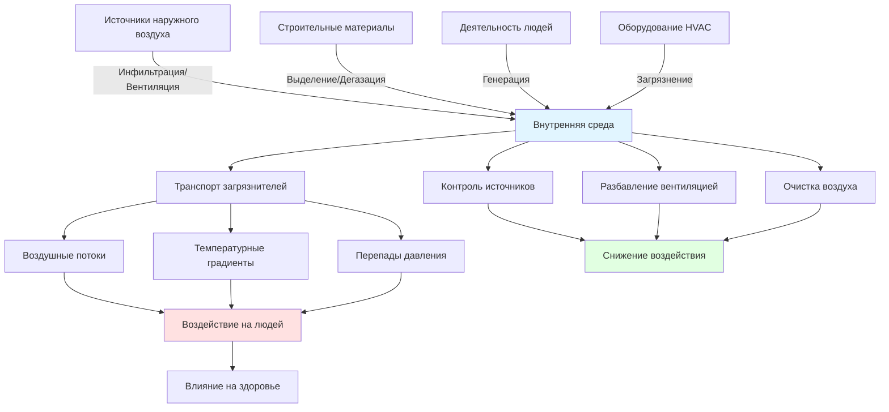
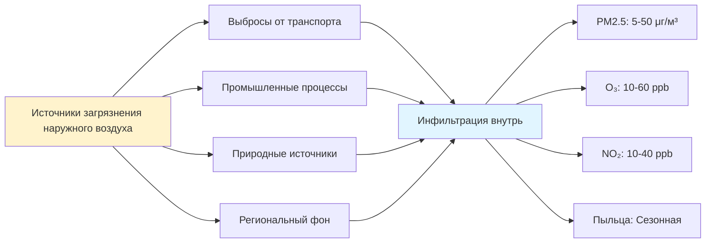
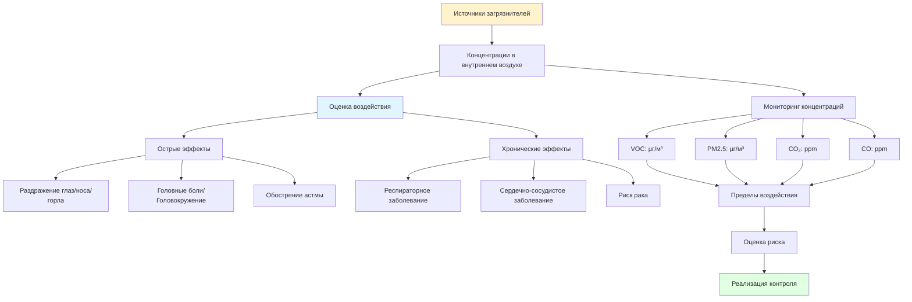

## Обзор источников загрязнения внутреннего воздуха

Качество внутреннего воздуха зависит от выявления и контроля источников загрязнения, которые постоянно вводят загрязняющие вещества в помещения зданий. ASHRAE 62.1 устанавливает, что контроль источников представляет наиболее эффективную и энергоэффективную стратегию для поддержания приемлемого качества внутреннего воздуха, приоритизируя устранение или снижение загрязнителей в их источнике до того, как станет необходимым разбавление вентиляцией.

Загрязнители внутреннего воздуха происходят из четырех основных категорий: строительные материалы и мебель, деятельность людей, механическое оборудование и системы, инфильтрация наружного воздуха. Каждая категория источников вносит отличительный профиль загрязнителей, требующий специфических подходов контроля на основе типа загрязнителя, скорости выделения и влияния на здоровье.

## Основные категории загрязнителей и источники

### Летучие органические соединения (VOC)

VOC представляют наибольшую группу загрязнителей внутреннего воздуха, включая сотни отдельных соединений со скоростью выделения от микрограммов до миллиграммов на квадратный метр в час.

**Основные источники VOC:**

| Категория источника | Конкретные источники | Типичные VOC | Длительность выделения |
|----------------|------------------|-------------|-------------------|
| Строительные материалы | Краски, клеи, герметики | Формальдегид, толуол, ксилол | Недели и месяцы |
| Напольные покрытия | Ковровое покрытие, винил, ламинат | 4-PCH, стирол, ацетальдегид | Месяцы и годы |
| Мебель | Мебель, обивка, драпировка | Формальдегид, бензол, лимонен | Месяцы и годы |
| Чистящие средства | Дезинфицирующие средства, очистители полов | Хлороформ, перхлорэтилен | Часы во время использования |
| Средства личной гигиены | Ароматизаторы, косметика | Лимонен, этанол, ацетон | Часы во время использования |
| Офисное оборудование | Принтеры, копиры | Толуол, стирол, фенол | Непрерывно во время работы |

Скорости выделения VOC следуют кривым экспоненциального затухания, при этом наибольшие концентрации происходят сразу после установки или применения, снижаясь на 50-90% в течение первого месяца для большинства материалов.

### Твердые частицы

Загрязнение твердыми частицами включает твердые и жидкие частицы размером от 0,01 до 100 микрометров в диаметре, при этом влияние на здоровье обратно пропорционально размеру частиц.

**Источники твердых частиц:**

| Размер частиц | Источники | Состав | Основная проблема здоровья |
|--------------|---------|-------------|----------------------|
| PM10 (≤10 μм) | Ресуспензия, инфильтрация наружного воздуха | Пыль, пыльца, споры плесени | Раздражение верхних дыхательных путей |
| PM2.5 (≤2,5 μм) | Сгорание, приготовление пищи, наружные источники | Сажа, органические соединения | Проникновение глубоко в легкие |
| PM1.0 (≤1,0 μм) | Сгорание, конденсация | Ультрамелкие частицы, кислоты | Циркуляция в кровеносной системе |
| PM0.1 (≤0,1 μм) | Высокотемпературные процессы | Наночастицы, металлические соединения | Клеточные и неврологические эффекты |

Концентрации внутренних частиц обычно составляют 10-50 μг/м³ для PM2.5 в жилых зданиях, при пиках, превышающих 200 μг/м³ во время приготовления пищи или уборки.

### Биоаэрозоли

Биологические загрязнители включают микроорганизмы, аллергены и органические соединения, производимые живыми организмами или процессами биологического распада.

**Типичные источники биоаэрозолей:**

- **Люди:** Бактерии, вирусы, чешуйки кожи, волосы (скорость выделения: 10⁶-10⁷ частиц на человека в час)
- **HVAC системы:** Рост бактерий на охлаждающих катушках, поддонах конденсата, увлажнителях
- **Материалы, поврежденные водой:** Споры плесени, микотоксины, бактериальные эндотоксины
- **Домашние животные:** Перхоть, белки аллергенов (основной источник Can f 1, Fel d 1 аллергенов)
- **Растения:** Пыльца, грибковые споры из почвы
- **Инфильтрация наружного воздуха:** Грибковые споры, пыльца (концентрации: 100-10 000 спор/м³)

Относительная влажность выше 60% ускоряет микробный рост на пористых материалах, при этом колонизация плесени происходит в течение 24-48 часов на влажных поверхностях.

### Продукты сгорания

Неполное сгорание генерирует оксид углерода, диоксид азота, диоксид серы и мелкие твердые частицы, содержащие полициклические ароматические углеводороды.

**Внутренние источники сгорания:**

| Источник | Основные загрязнители | Типичные концентрации | Требования к контролю |
|--------|-------------------|----------------------|---------------------|
| Газовая готовка | NO₂, CO, PM2.5 | 200-2000 μг/м³ NO₂ | Вытяжной вентилятор ≥100 CFM (169 м³/ч) |
| Камины | CO, PM2.5, PAH | 50-500 μг/м³ PM2.5 | Прямое выведение, герметичное сгорание |
| Газовые водонагреватели | CO, NO₂ | 5-35 ppm CO (при обратной тяге) | Герметичное сгорание, надлежащее вентилирование |
| Курение табака | 4000+ соединений | PM2.5: 200-1000 μг/м³ | Полный запрет или отдельная вытяжка |
| Свечи/Благовония | PM2.5, VOC, PAH | 50-300 μг/м³ PM2.5 | Вентиляция, устранение |

Концентрации оксида углерода выше 9 ppm (среднее значение за 8 часов) или 35 ppm (среднее за 1 час) превышают Национальные стандарты качества окружающего воздуха EPA.

## Пути миграции загрязнителей и взаимодействия

## Наружный воздух как источник загрязнения

Наружный воздух вводит загрязнители через механические системы вентиляции и инфильтрацию через оболочку здания, при этом концентрации варьируются в зависимости от местоположения, сезона и метеорологических условий.

**Типичные загрязнители наружного воздуха:**

Коэффициенты передачи загрязнителей из наружного воздуха внутрь варьируются в зависимости от загрязнителя: PM2.5 (0,5-0,8), озон (0,1-0,4) и NO₂ (0,4-0,8), при этом более низкие коэффициенты указывают на большее ослабление оболочкой здания и системами фильтрации.

## Строительные материалы и дегазация

Новые строительные материалы выделяют VOC путем испарения и химических реакций, при этом скорости выделения определяются составом материала, температурой, влажностью и скоростью воздуха через поверхности.

**Характеристики затухания выделения:**

Большинство строительных материалов следуют кинетике первого порядка:

**E(t) = E₀ × e^(-kt)**

Где:
- E(t) = скорость выделения в момент времени t (μг/м²/ч)
- E₀ = начальная скорость выделения (μг/м²/ч)
- k = константа затухания (ч⁻¹)
- t = время с момента установки (ч)

Периоды полураспада варьируются от 24-168 часов для водоэмульсионных красок до 1000-5000 часов для композитных материалов из древесины, содержащих смолы мочевины-формальдегида.

## Стратегии контроля источников

### Выбор материалов

**Критерии материалов с низким выделением:**

| Категория материала | Стандарт выделения | Протокол испытаний | Максимальные пределы |
|------------------|-------------------|------------------|----------------|
| Краски/Покрытия | CDPH Standard Method v1.2 | Тест в малой камере | ≤0,5 мг/м³ TVOC на 14-й день |
| Композитная древесина | CARB Phase 2 | ASTM E1333 | ≤0,05 ppm формальдегид |
| Напольные покрытия | FloorScore | CDPH v1.2 | ≤0,5 мг/м³ TVOC на 14-й день |
| Клеи/Герметики | SCAQMD Rule 1168 | EPA Method 24 | 50-250 г/л содержание VOC |

### Контроли, основанные на деятельности

**Меры контроля, специфичные для загрязнителя:**

- **Источники сгорания:** Устранить невентилируемые приборы сгорания, установить оборудование герметичного сгорания, обеспечить выделенный наружный воздух для воздуха сгорания
- **Источники влаги:** Поддерживать относительную влажность 30-50%, устранять утечки в течение 24 часов, использовать вытяжную вентиляцию в ванных комнатах и кухнях
- **Деятельность по уборке:** Использовать продукты, сертифицированные Green Seal, применять влажные методы уборки для контроля твердых частиц, планировать во время незанятых периодов
- **Офисное оборудование:** Размещать высокоэмиссионные устройства в отдельно вентилируемых помещениях, указывать оборудование с низким выделением

### Предотвращение загрязнения HVAC систем

**Критические точки контроля:**

1. **Охлаждающие катушки:** Поддерживать разность температур ≥5,6°C для предотвращения переноса влаги, наклонять поддоны конденсата ≥3,2 мм на 30 см
2. **Поддоны конденсата:** Устанавливать ультрафиолетовые лампы (минимум 5,4 Вт/м² площади поверхности катушки) или наносить противомикробные покрытия
3. **Фильтрующие материалы:** Заменять согласно графику производителя, проверять наличие протечек, поддерживать линейную скорость ≤2,5 м/с
4. **Системы увлажнения:** Использовать впрыск пара, избегать систем с увлажняемыми носителями, поддерживать обработку воды
5. **Воздуховоды:** Герметизировать согласно SMACNA Class A, устанавливать дверцы доступа каждые 6 метров для проверки

### Изоляция вентиляции

Помещения с высокой генерацией загрязнителей требуют выделенной вытяжки для предотвращения миграции загрязнителей:

**Рекомендуемые перепады давления:**

| Тип помещения | Давление относительно соседних помещений | Минимальная кратность воздухообмена | Требования к вытяжке |
|-----------|------------------------------|-------------------|---------------------|
| Туалеты | минимум -5 Па | 6-10 ACH | 100% вытяжка, без рециркуляции |
| Помещения копирования/печати | минимум -2,5 Па | 10-15 ACH | Выделенная вытяжка |
| Лаборатории | -2,5 до -10 Па | 6-12 ACH | 100% вытяжка |
| Кухни | минимум -5 Па | 15-20 ACH | Скорость захвата вытяжки ≥0,5 м/с |

## Влияние на здоровье и оценка воздействия

**Руководства EPA по качеству внутреннего воздуха:**

- **Формальдегид:** ≤0,1 ppm (предел воздействия NIOSH)
- **PM2.5:** ≤35 μг/м³ (среднее значение за 24 часа)
- **CO:** ≤9 ppm (среднее значение за 8 часов)
- **NO₂:** ≤0,05 ppm (годовое среднее)
- **Радон:** ≤1,5 Бк/л (уровень действия EPA)

## Иерархия реализации

Эффективность контроля источников следует иерархическому подходу, согласованному с принципами промышленной гигиены:

1. **Устранение:** Удалить или запретить источники загрязнителей (наиболее эффективно)
2. **Замена:** Заменить материалы с высоким выделением на альтернативы с низким выделением
3. **Технические средства:** Установить локальную вытяжную вентиляцию, герметизировать поверхности выделения
4. **Административные средства:** Планировать высокоэмиссионную деятельность во время незанятых периодов
5. **Разбавление вентиляцией:** Увеличить скорости подачи наружного воздуха (наименее эффективно, наибольшие энергетические затраты)

Реализация контроля источников в верхней части этой иерархии достигает 80-95% снижения загрязнителей в сравнении с 30-70% снижением только от разбавления вентиляцией, при этом снижая энергопотребление HVAC на 20-40% благодаря более низким требованиям к вентиляции.

## Ссылки

- ASHRAE Standard 62.1-2022: Вентиляция для приемлемого качества внутреннего воздуха
- Руководства и стандарты EPA по качеству внутреннего воздуха
- California Department of Public Health Standard Method v1.2
- CARB Regulation for Composite Wood Products
- ASHRAE Fundamentals Handbook, Chapter 11: Загрязнители воздуха
