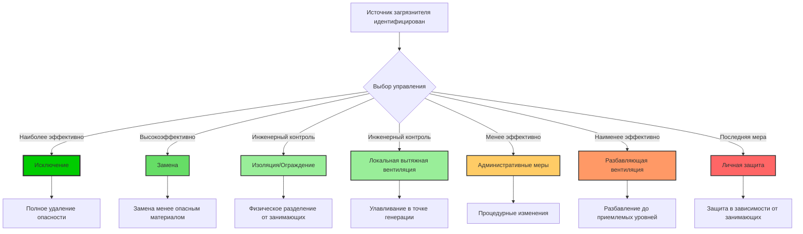
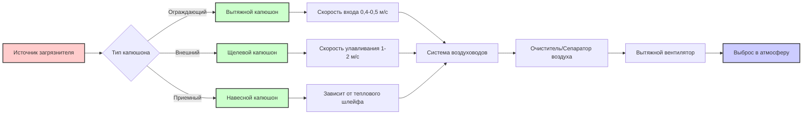

# Стратегии контроля источников загрязнения для качества воздуха в помещении

Контроль источников представляет наиболее эффективный и экономичный подход к управлению качеством воздуха в помещении путем предотвращения попадания загрязнителей в занятые помещения вместо попытки удаления после выброса. Иерархия контроля промышленной гигиены предоставляет основу для систематического управления загрязнителями через исключение, замену, инженерные меры, административные меры и средства индивидуальной защиты.

## Иерархия эффективности управления

Иерархия управления расставляет приоритеты стратегий вмешательства на основе эффективности и надежности. Меры контроля верхнего уровня обеспечивают по своей сути более надежную защиту, чем нижележащие вмешательства.

## Анализ эффективности и стоимости методов управления

Различные стратегии контроля источников обеспечивают различные уровни защиты, капитальных вложений и операционных затрат. Выбор требует балансирования эффективности с экономическими и практическими ограничениями.

| Метод управления | Эффективность | Капитальные затраты | Операционные затраты | Надежность | Сложность внедрения |
|----------------|---------------|--------------|----------------|-------------|--------------------------|
| **Исключение** | 100% | Низкие-Средние | Нет | Наивысшая | Низкая-Средняя |
| **Замена** | 80-100% | Низкие-Высокие | Подобны базовому | Высокая | Средняя |
| **Изоляция/Ограждение** | 90-99% | Средние-Высокие | Низкие | Высокая | Средняя-Высокая |
| **Локальная вытяжка** | 70-95% | Средние-Высокие | Средние-Высокие | Средняя-Высокая | Средняя-Высокая |
| **Административные** | 40-70% | Низкие | Средние | Низкая-Средняя | Низкая-Средняя |
| **Разбавляющая вентиляция** | 30-60% | Средние | Высокие | Средняя | Средняя |
| **Личная защита** | 50-90% | Низкие | Средние | Низкая | Низкая |

## Стратегия исключения

Исключение полностью удаляет источник загрязнителя, обеспечивая абсолютный контроль без постоянных операционных затрат. Этот подход требует анализа требований процесса для выявления ненужных источников выбросов.

### Методы внедрения

**Переработка процесса**: Изменение операций для исключения опасных этапов. Пример: замена очистки на основе растворителей на ультразвуковую водную очистку исключает выбросы ЛОС при одновременном улучшении эффективности очистки.

**Поэтапный вывод материалов**: Удаление высокоэмиссионных материалов из инвентаря здания. Пример: исключение люминесцентных ламп, содержащих ртуть, в пользу светодиодного освещения исключает опасность паров ртути.

**Переноса деятельности**: Перемещение деятельности, генерирующей выбросы, в открытые помещения или неоккупированные пространства. Пример: перенос испытаний дизельного генератора в открытое помещение исключает воздействие внутри помещения твердых частиц и NOx.

Экономическая выгода от исключения:

$$NPV_{elim} = \sum_{t=1}^{n} \frac{C_{vent,t} + C_{health,t} + C_{liability,t}}{(1+r)^t} - C_{redesign}$$

Где:
- $NPV_{elim}$ = чистая текущая стоимость исключения (денежная единица)
- $C_{vent,t}$ = избегаемые затраты на вентиляцию в году $t$
- $C_{health,t}$ = избегаемые затраты, связанные со здоровьем
- $C_{liability,t}$ = избегаемые затраты на ответственность/соответствие
- $C_{redesign}$ = единовременные затраты на переработку процесса
- $r$ = ставка дисконта
- $n$ = период анализа (годы)

## Стратегия замены

Замена заменяет опасные материалы менее опасными альтернативами, выполняющими эквивалентные функции. ASHRAE 62.1 IAQ Procedure явно учитывает замену источников при расчете требуемых наружных воздушных потоков.

### Критерии выбора материалов

**Материалы с низким содержанием летучих органических соединений**: Выбор продуктов, соответствующих калифорнийскому разделу 01350 или стандартному методу CDPH v1.2 пределам выбросов. Эти стандарты устанавливают протоколы испытаний в камере, ограничивающие выбросы до:

| Категория материала | Формальдегид (мкг/м²·ч) | Всего ЛОС (мкг/м²·ч) | Длительность испытания |
|-------------------|------------------------|---------------------|---------------|
| Напольные покрытия | 16,5 | 500 | 14 дней |
| Потолочные/настенные панели | 16,5 | 500 | 14 дней |
| Теплоизоляция | 16,5 | 500 | 14 дней |
| Мебель/сиденья | 11,0 | 330 | 14 дней |
| Клеи/герметики | 50 | 1500 | 14 дней |

**Сертификация GreenGuard**: Третьим лицом проверенные продукты с низкими выбросами, соответствующие пределам выбросов химических веществ и формальдегида летучих органических соединений. Сертификация Gold требует более строгих пределов, подходящих для школ и здравоохранения.

**Выбор хладагента**: Замена хладагентов с высоким ПГП на альтернативы с более низким ПГП, соответствующие требованиям безопасности и производительности в соответствии со стандартом ASHRAE 34. Переход от R-410A (ПГП 2088) к R-32 (ПГП 675) или R-454B (ПГП 466) снижает влияние на климат при одновременном исключении будущих проблем соответствия нормативным требованиям.

Снижение выбросов при замене:

$$\Delta E = (E_{baseline} - E_{substitute}) \cdot A \cdot t$$

Где:
- $\Delta E$ = общее снижение выбросов (мг)
- $E_{baseline}$ = коэффициент выбросов базового материала (мг/м²·ч)
- $E_{substitute}$ = коэффициент выбросов заменяющего материала (мг/м²·ч)
- $A$ = площадь поверхности материала (м²)
- $t$ = период воздействия (ч)

## Изоляция и ограждение

Изоляция физически разделяет источники загрязнителей от занятых помещений через барьеры, контейнирование или выделенные ограждения. Эта стратегия особенно эффективна для неизбежных источников выбросов.

### Методы изоляции

**Pressуризация помещения**: Поддержание разностей давлений для предотвращения миграции загрязнителей. Загрязненные помещения работают при отрицательном давлении по отношению к прилегающим чистым помещениям:

$$\Delta P = 1.29 \times 10^{-3} \cdot \frac{Q^2}{A_{leak}^2}$$

Где:
- $\Delta P$ = разность давлений (Па)
- $Q$ = поток подмеса утечки (л/с)
- $A_{leak}$ = эффективная площадь утечки (м²)

Целевые разности давлений: 2,5-5 Па для общей изоляции, 5-12,5 Па для критического контейнирования.

**Физические ограждения**: Изоляция оборудования или процессов в герметичных ограждениях с вытяжкой наружу. Эффективность ограждения зависит от эффективности улавливания и скорости потока на входе:

$$\eta_{capture} = 1 - e^{-V_f \cdot t / L}$$

Где:
- $\eta_{capture}$ = эффективность улавливания загрязнителя (доля)
- $V_f$ = скорость потока на входе ограждения (м/с)
- $t$ = время пребывания загрязнителя (с)
- $L$ = характеристическое измерение ограждения (м)

**Вестибюли и шлюзы**: Создание буферных зон давления между загрязненными и чистыми областями с последовательной работой двери, предотвращающей одновременное открытие.

## Локальная вытяжная вентиляция

Локальная вытяжная вентиляция (LEV) улавливает загрязнители в точке генерации до их смешивания с воздухом помещения. Правильно спроектированные системы LEV достигают эффективности улавливания 70-95% при вытяжке только 5-20% объемного потока, необходимого для эквивалентной разбавляющей вентиляции.

### Основные принципы проектирования LEV

**Скорость улавливания**: Минимальная скорость воздуха у источника загрязнителя, необходимая для преодоления противоположных воздушных токов и втягивания загрязнителей в вытяжной колпак. Требуемая скорость улавливания зависит от характеристик генерации загрязнителя:

| Условие выброса | Скорость улавливания (м/с) | Пример применения |
|-------------------|------------------------|---------------------|
| Выброс без скорости в спокойный воздух | 0,25-0,50 | Испарение из открытых контейнеров |
| Выброс при низкой скорости в умеренно неподвижный воздух | 0,50-1,00 | Заполнение контейнера, низкоскоростная передача |
| Активная генерация в зону быстрого движения воздуха | 1,00-2,50 | Распыление краски, шлифование, абразивная обработка |
| Выброс при высокой начальной скорости в зону очень быстрого движения воздуха | 2,50-10,0 | Шлифование больших поверхностей, заполнение бочек |

**Потери на входе капюшона**: Потеря давления на входе вытяжного капюшона зависит от геометрии и характеристик потока:

$$\Delta P_e = \frac{\rho V^2}{2} \cdot C_e$$

Где:
- $\Delta P_e$ = потеря на входе (Па)
- $\rho$ = плотность воздуха (кг/м³)
- $V$ = скорость в воздуховоде (м/с)
- $C_e$ = коэффициент потери на входе (0,25 для конического входа, 0,49 для простого отверстия, 0,93 для острого края)

**Требуемый воздушный поток**: Расчет воздушного потока вытяжного капюшона на основе скорости улавливания и геометрии капюшона:

$$Q = V_c \cdot A_c \cdot (1 + \frac{X}{D})^2$$

Для круглых капюшонов на расстоянии $X$ от источника, где:
- $Q$ = требуемый объемный поток (м³/с)
- $V_c$ = требуемая скорость улавливания (м/с)
- $A_c$ = площадь входа капюшона (м²)
- $X$ = расстояние от капюшона до источника (м)
- $D$ = диаметр капюшона (м)

### Типы систем LEV

**Ограждающие капюшоны**: Частичное или полное ограждение источника загрязнителя. Наиболее эффективная конфигурация LEV, требующая минимального объема вытяжки. Вытяжные капюшоны лабораторий представляют архетип, поддерживая скорость входа 0,4-0,5 м/с для защиты занимающих.

**Внешние капюшоны**: Расположены рядом с источником загрязнителя без ограждения. Требуют больших объемов вытяжки из-за отсутствия физического контейнирования. Щелевые капюшоны вдоль краев бака или капюшоны шлифовального круга являются примерами этой конфигурации.

**Приемные капюшоны**: Улавливают загрязнители с естественной восходящей траекторией, такие как навесные капюшоны над нагретыми процессами. Эффективны только при наличии теплового шлейфа, обеспечивающего восходящий транспорт загрязнителя.

## Процедуры промывки

Промывка перед занятием снижает повышенные концентрации загрязнителей из новых материалов до занятия здания. LEED v4 указывает два пути промывки:

**Путь 1**: Подавать 4267 м³ наружного воздуха на м² площади пола после завершения строительства со всеми установленными внутренними отделками. Поддерживать минимальную температуру 15°C и максимальную влажность 60% на протяжении всей промывки.

**Путь 2**: Если занятие требуется до завершения полной промывки, подавать 1067 м³/м² перед занятием, затем продолжать до достижения всего 4267 м³/м² при оккупированном помещении.

Снижение концентрации во время промывки следует экспоненциальному затуханию:

$$C(t) = C_0 \cdot e^{-\lambda t} + \frac{G}{\lambda V}(1 - e^{-\lambda t})$$

Где:
- $C(t)$ = концентрация в момент времени $t$ (мкг/м³)
- $C_0$ = начальная концентрация (мкг/м³)
- $\lambda$ = коэффициент смены воздуха (ч⁻¹)
- $G$ = коэффициент генерации загрязнителя (мкг/ч)
- $V$ = объем помещения (м³)

## Структура анализа стоимости и выгод

Решения об инвестировании в контроль источников требуют количественного сравнения затрат на управление с выгодами от снижения энергии вентиляции, повышенной производительности занимающих и избегаемых затрат на здоровье.

### Общая стоимость владения

$$TCO_{control} = C_{capital} + \sum_{t=1}^{n} \frac{C_{operating,t} + C_{maintenance,t}}{(1+r)^t}$$

$$TCO_{baseline} = C_{ventilation} + C_{energy} + C_{health} + C_{productivity}$$

$$Savings = TCO_{baseline} - TCO_{control}$$

Где экономия представляет экономическую ценность внедрения контроля источников по сравнению с полаганием только на разбавляющую вентиляцию.

### Расчет экономии энергии

Снижение требований к наружному воздуху из-за контроля источников напрямую снижает нагрузки на отопление и охлаждение:

$$\Delta E_{annual} = Q_{reduced} \cdot \rho \cdot c_p \cdot (T_{indoor} - T_{outdoor,avg}) \cdot H$$

Где:
- $\Delta E_{annual}$ = годовая экономия энергии отопления (кВт·ч)
- $Q_{reduced}$ = снижение наружного воздуха (м³/с)
- $\rho$ = плотность воздуха (1,2 кг/м³)
- $c_p$ = удельная теплоемкость (1,006 кДж/кг·K)
- $H$ = годовые часы отопления

Расчет экономии охлаждения должен учитывать как явные, так и скрытые нагрузки.

## Интеграция с процедурой ASHRAE 62.1 IAQ

Процедура ASHRAE 62.1 IAQ явно допускает сниженный наружный воздушный поток при условии, что контроль источников поддерживает концентрации загрязнителей ниже допустимых пределов. Процедура требует:

1. **Идентификация загрязнителей**: Выявить все релевантные загрязнители и их источники
2. **Пределы концентрации**: Установить максимально допустимые концентрации для каждого загрязнителя
3. **Количественная оценка источников**: Измерить или оценить коэффициенты генерации для всех источников
4. **Документирование управления**: Документировать меры контроля источников и эффективность
5. **Проверка производительности**: Измерить фактические концентрации для проверки соответствия

Требуемый наружный воздух с учетом контроля источников:

$$Q_{oa} = \max\left[\frac{S_i - \eta_{control,i} \cdot S_i}{C_{max,i} - C_{oa,i}}\right]$$

Где $\eta_{control,i}$ представляет эффективность контроля источников для загрязнителя $i$. Высокая эффективность контроля источников напрямую снижает требуемый наружный воздух.

## Лучшие практики внедрения

Успешное внедрение контроля источников требует систематического подхода:

1. **Проведите оценку источников**: Выявить все источники загрязнителей и количественно оценить коэффициенты выбросов посредством измерения или баз данных коэффициентов выбросов
2. **Расставить приоритеты по опасности**: Ранжировать источники по токсичности, потенциалу воздействия и величине выбросов
3. **Оценить варианты управления**: Оценить осуществимость, стоимость и эффективность исключения, замены и инженерных мер
4. **Внедрить управление наивысшего уровня**: Применить наиболее эффективные экономически целесообразные меры в соответствии с иерархией
5. **Проверить производительность**: Измерить концентрации после внедрения для подтверждения эффективности
6. **Документировать и обслуживать**: Записать спецификации управления и установить процедуры обслуживания

Контроль источников обеспечивает превосходные результаты качества воздуха в помещении по сравнению с подходами, основанными только на вентиляции, при одновременном снижении потребления энергии, капитальных затрат на системы HVAC с избыточной мощностью и операционной сложности. Иерархия промышленной гигиены предоставляет проверенную основу для систематического управления загрязнителями, применимую во всех типах и категориях зданий.
