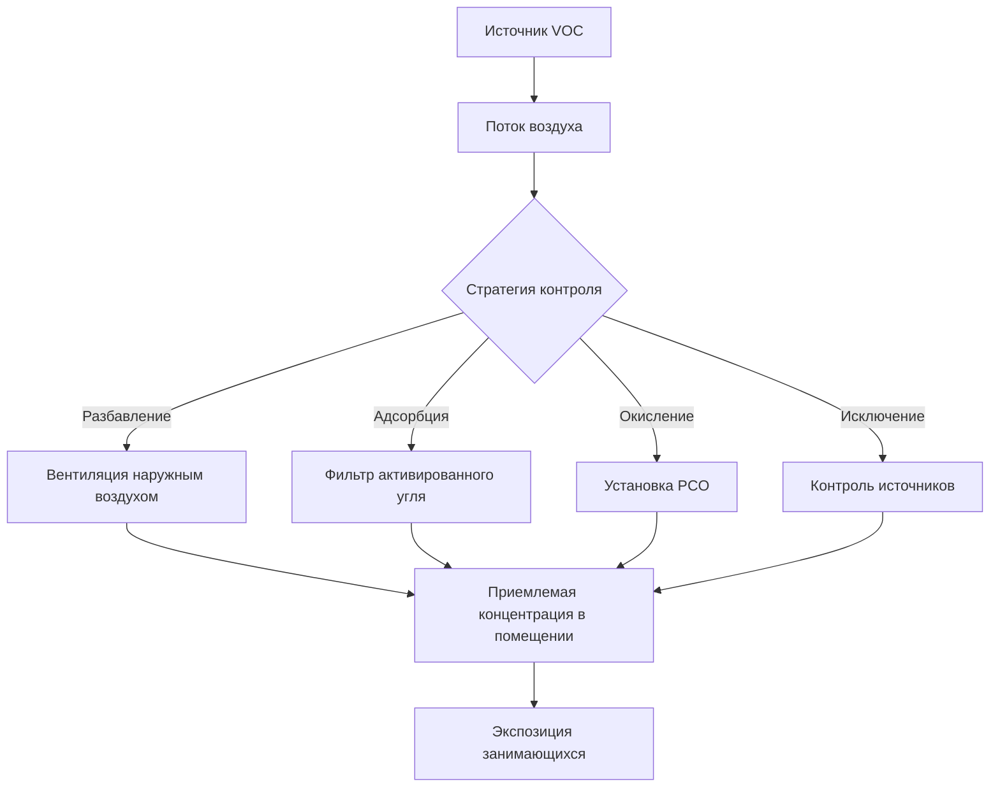

# Контроль содержания летучих органических соединений в системах HVAC

Летучие органические соединения (VOC) представляют собой разнообразный класс содержащих углерод химических веществ, которые испаряются при комнатной температуре и создают серьезные проблемы качества воздуха в помещении. Эффективный контроль VOC требует понимания физических механизмов генерации, транспорта и удаления в условиях здания.

## Источники VOC и скорости выделения

Выбросы VOC поступают из строительных материалов, мебели, чистящих средств, деятельности занимающихся и инфильтрации наружного воздуха. Скорости выделения подчиняются кинетике первого порядка для источников, контролируемых диффузией:

$$E(t) = E_0 \cdot e^{-kt}$$

Где:
- $E(t)$ = скорость выделения в момент времени $t$ (мг/ч)
- $E_0$ = начальная скорость выделения (мг/ч)
- $k$ = константа распада (ч⁻¹)
- $t$ = время с момента установки (ч)

Специфичные для материала константы распада находятся в диапазоне от 0,001 до 0,1 ч⁻¹, где более высокие значения указывают на более быстрое снижение выделения. Влажные материалы, такие как краски и клеи, демонстрируют более высокие начальные выбросы с быстрым распадом, в то время как сухие материалы показывают более низкие, но более стойкие выбросы.

## Основы разбавляющей вентиляции

Разбавляющая вентиляция удаляет VOC путем непрерывной замены загрязненного воздуха в помещении более чистым наружным воздухом. Установившаяся концентрация в помещении следует принципам массового баланса:

$$C_{ss} = \frac{G}{Q \cdot \eta} + C_o$$

Где:
- $C_{ss}$ = установившаяся концентрация в помещении (мкг/м³)
- $G$ = общая скорость выделения VOC (мкг/ч)
- $Q$ = скорость подачи наружного воздуха (м³/ч)
- $\eta$ = эффективность вентиляции (безразмерная, 0,5-1,2)
- $C_o$ = концентрация VOC на улице (мкг/м³)

ASHRAE Standard 62.1 устанавливает минимальные скорости вентиляции, но не рассматривает явно требования вентиляции, специфичные для VOC. Для помещений с повышенными источниками VOC скорости вентиляции должны быть рассчитаны на основе целевых уровней концентрации и известных скоростей выделения.

## Адсорбция активированным углем

Активированный уголь удаляет VOC путем физической адсорбции на высокопористый углеродный материал. Емкость адсорбции следует изотерме Фройндлиха:

$$q_e = K_f \cdot C_e^{1/n}$$

Где:
- $q_e$ = емкость адсорбции в равновесии (мг VOC/г углерода)
- $K_f$ = константа Фройндлиха (единицы варьируют)
- $C_e$ = концентрация в газовой фазе в равновесии (мг/м³)
- $n$ = интенсивность адсорбции (безразмерная, обычно 1-10)

| Тип углерода | Площадь поверхности (м²/г) | Типовое применение | Периодичность замены |
|-------------|---------------------|----------------------|----------------------|
| Гранулированный активированный уголь (GAC) | 500-1500 | Газовые фильтры, крупные системы | 6-24 месяца |
| Пропитанный уголь | 800-1200 | Кислые газы, формальдегид | 12-18 месяцев |
| Углеродная ткань | 1000-2000 | Компактные фильтры, специальные применения | 3-12 месяцев |
| Гранулированный уголь | 900-1400 | Глубокие слои фильтров, высокие расходы | 12-36 месяцев |

Время пробоя определяет срок службы фильтра:

$$t_b = \frac{\rho_b \cdot V \cdot q_e}{Q \cdot C_0}$$

Где:
- $t_b$ = время пробоя (ч)
- $\rho_b$ = объемная плотность углеродного слоя (г/л)
- $V$ = объем углеродного слоя (л)
- $q_e$ = емкость адсорбции (мг/г)
- $Q$ = расход воздуха (л/ч)
- $C_0$ = концентрация VOC на входе (мг/л)

## Фотокаталитическое окисление

Системы фотокаталитического окисления (PCO) используют ультрафиолетовый свет для активации катализаторов диоксида титана, генерирующих гидроксильные радикалы, которые окисляют VOC до диоксида углерода и воды. Скорость окисления следует кинетике Ленгмюра-Хиншельвуда:

$$r = \frac{k \cdot K \cdot C}{1 + K \cdot C}$$

Где:
- $r$ = скорость реакции (мг/м²·с)
- $k$ = константа скорости реакции (мг/м²·с)
- $K$ = константа равновесия адсорбции (м³/мг)
- $C$ = концентрация VOC (мг/м³)

Эффективность PCO зависит от интенсивности УФ излучения, времени пребывания, влажности и площади поверхности катализатора. Системы достигают эффективности удаления при однократном проходе 40-90% для распространенных VOC при скоростях на фронте ниже 2,5 м/с.

## Стратегии контроля источников

Контроль источников исключает или снижает выбросы VOC в месте генерации, обеспечивая наиболее экономически эффективное долгосрочное решение:

1. **Выбор материалов**: Укажите материалы с низким выделением, соответствующие требованиям California Section 01350 или CDPH Standard Method v1.2
2. **Промывка перед вводом в эксплуатацию**: Реализуйте минимум 72-часовую промывку при 0,15 м³/с на м² площади пола перед введением в эксплуатацию
3. **Планирование**: Проводите виды деятельности с высокими выбросами в периоды неиспользования помещений с повышенной вентиляцией
4. **Изоляция**: Отделите источники выбросов в выделенных помещениях с отрицательным давлением и выделенным выхлопом

## Влияние влажности на контроль VOC

Относительная влажность существенно влияет как на выбросы VOC, так и на эффективность удаления. Водяной пар конкурирует за сайты адсорбции на активированном угле, снижая емкость для неполярных VOC на 10-50% при уровнях влажности выше 50% ОВ. Напротив, системы PCO требуют 30-60% ОВ для оптимальной генерации гидроксильных радикалов.

Скорректированная по влажности емкость углерода следует:

$$q_{e,humid} = q_{e,dry} \cdot (1 - \alpha \cdot RH)$$

Где $\alpha$ — коэффициент чувствительности к влажности (0,002-0,01 на %ОВ) в зависимости от типа углерода и полярности VOC.

## Интеграция системы управления

Эффективный контроль VOC интегрирует несколько стратегий на основе характеристик выделения, режимов использования и экономических ограничений. Управляемая спросом вентиляция с использованием датчиков VOC обеспечивает динамическую реакцию на переменные скорости выделения при минимизации энергопотребления. ASHRAE Guideline 36 предоставляет последовательности операций для интегрированного контроля VOC в автоматизированных системах зданий.

Размещение датчиков должно учитывать местоположение источников выделения, картину потока воздуха и эффективность перемешивания для обеспечения репрезентативных измерений для алгоритмов управления. Многоточечное усреднение улучшает стабильность управления по сравнению с однточечным датчиком в больших помещениях.

## Проверка производительности

Проверка производительности системы контроля VOC требует периодического прямого отбора проб воздуха и анализа. ASTM D5197 устанавливает протоколы определения формальдегида во внутреннем воздухе, в то время как EPA Method TO-15 рассматривает измерение летучих органических соединений в воздухе с использованием канистр и газовой хроматографии-масс-спектрометрии.

Целевые уровни VOC в помещении зависят от типа использования помещения и нормативных требований, с типовыми пределами в диапазоне от 50 мкг/м³ для общего VOC в чувствительных средах до 500 мкг/м³ в промышленных условиях.
