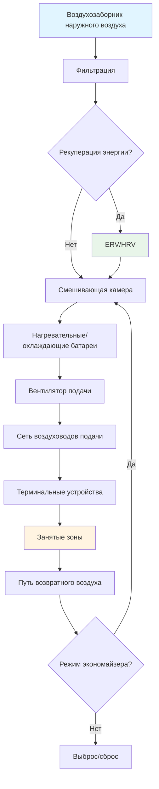

## Фундаментальные принципы

Системы вентиляции подают наружный воздух в помещения для разбавления и удаления загрязнений при сохранении приемлемого качества воздуха в помещении. Основные функции включают:

- **Разбавление загрязнителей**: снижение концентрации загрязняющих веществ, генерируемых людьми (CO₂, биоэффлюенты, ЛОС)
- **Контроль влажности**: управление скрытыми нагрузками от людей и технологических процессов
- **Управление запахами**: поддержание приемлемых сенсорных условий
- **Управление давлением**: предотвращение инфильтрации и управление схемами потоков воздуха между зонами

Принцип разбавления следует балансу масс:

$$C = \frac{G}{Q} + C_o \left(1 - e^{-Qt/V}\right)$$

Где:
- $C$ = концентрация загрязнителя в помещении (ppm или мг/м³)
- $G$ = скорость генерации загрязнителя (масса/время)
- $Q$ = расход наружного воздуха (объём/время)
- $C_o$ = концентрация загрязнителя на улице
- $V$ = объём помещения
- $t$ = время

При установившемся равновесии:

$$C_{ss} = \frac{G}{Q} + C_o$$

Это соотношение показывает, что удвоение расхода наружного воздуха уменьшает установившуюся концентрацию вдвое.

## Определение требуемых расходов вентиляции

Стандарт ASHRAE 62.1 устанавливает минимальные расходы вентиляции, используя Процедуру определения расхода вентиляции (VRP):

$$V_{oz} = R_p \times P_z + R_a \times A_z$$

Где:
- $V_{oz}$ = требуемый расход наружного воздуха для зоны (CFM)
- $R_p$ = удельный расход наружного воздуха на человека (CFM/чел)
- $P_z$ = численность зоны
- $R_a$ = удельный расход наружного воздуха на площадь (CFM/м²)
- $A_z$ = площадь пола зоны (м²)

Для многозонных систем расход наружного воздуха системы должен учитывать долю наружного воздуха в подаче:

$$V_{ot} = \frac{\sum_{все\ зоны} V_{oz}}{E_v}$$

Где $E_v$ — эффективность вентиляции системы, варьируется от 0,6 до 1,0 в зависимости от конфигурации системы.

## Категории систем вентиляции

### Системы механической вентиляции

**Системы постоянного объёма**
Подают фиксированный расход воздуха независимо от изменений нагрузки. Наружный воздух обычно управляется заслонками, находящимися в минимальном положении или поддерживающими концентрацию CO₂.

**Системы переменного объёма воздуха (VAV)**
Модулируют расход подачи воздуха в зависимости от тепловой нагрузки. Управление наружным воздухом должно компенсировать переменные расходы подачи:

$$\%OA_{min} = \frac{V_{ot}}{V_{supply}}$$

При уменьшении расхода подачи воздуха при неполной нагрузке заслонка наружного воздуха открывается для поддержания требуемого расхода вентиляции.

**Системы подачи выделенного наружного воздуха (DOAS)**
Разделяют вентиляцию и кондиционирование. DOAS обрабатывает 100 % наружного воздуха, предварительно кондиционируя его перед подачей. Параллельные терминальные устройства независимо управляют чувствительными нагрузками.

### Естественная вентиляция

Использует движущие силы ветра и разницы температур (эффект дымовой трубы). Требуемая эффективная площадь открытия:

$$A_{eff} = \frac{Q}{\sqrt{2 \times \frac{\Delta P}{\rho}}}$$

Где $\Delta P$ представляет разницу давления, вызванную ветром или естественной тягой.

## Сравнение систем вентиляции

| Тип системы | Управление наружным воздухом | Потенциал рекуперации энергии | Применение |
|-------------|-------------------|------------------------|-------------|
| Однозонная CAV | Фиксированное положение заслонки | Ограниченный | Небольшие здания, постоянная загрузка |
| VAV с переналадкой | Слежение за расходом или CO₂ | Умеренный через экономайзер | Офисные здания, переменные нагрузки |
| DOAS + параллельные | 100 % выделенного | Высокий через ERV/HRV | Все климаты, высокие требования вентиляции |
| Естественная вентиляция | Модуляция открытия | Отсутствует (свободное охлаждение) | Мягкие климаты, низкие чувствительные нагрузки |
| Управление спросом | Датчики CO₂ или занятости | Переменный | Общественные помещения, переменная плотность |

## Метод воздухообмена в час

Альтернативный подход выражает вентиляцию как количество воздухообменов в час (ACH):

$$ACH = \frac{Q \times 60}{V}$$

Преобразование в расход наружного воздуха:

$$Q = \frac{ACH \times V}{60}$$

Типовые требования:
- **Жилые**: минимум 0,35 ACH (ASHRAE 62.2)
- **Офисы**: 4–6 ACH общий, 15–20 % наружный воздух
- **Лаборатории**: минимум 6–12 ACH, часто 100 % наружный воздух
- **Помещения изоляции в учреждениях здравоохранения**: 12 ACH при отрицательном давлении

## Эффективность вентиляции

Не весь вентиляционный воздух поровну достигает зоны дыхания. Эффективность вентиляции ($E_v$) учитывает короткое замыкание и стратификацию:

$$E_v = \frac{C_e - C_s}{C_r - C_s}$$

Где:
- $C_e$ = концентрация загрязнителя на выходе
- $C_r$ = концентрация в зоне дыхания
- $C_s$ = концентрация подаваемого воздуха

Идеальное перемешивание даёт $E_v$ = 1,0. Вентиляция смещением может достичь $E_v$ > 1,0, в то время как плохое распределение приводит к $E_v$ < 1,0.

## Энергетические аспекты

Вентиляция представляет значительную энергетическую нагрузку:

$$Q_{sensible} = 1,08 \times Q \times (T_o - T_s)$$

$$Q_{latent} = 4840 \times Q \times (W_o - W_s)$$

Где $Q$ в CFM (м³/ч), температуры в °C, отношения влажности в кг_в/кг_сух_в.

Годовая энергия вентиляции в климатах с сезонами отопления и охлаждения часто превышает 30 % всей потребляемой энергии HVAC. Системы рекуперации энергии могут снизить это на 50–80 % в зависимости от климата.

## Стратегия создания давления

Перепады давления в здании управляют миграцией загрязнений:

- **Положительное давление**: подача > выброс, предотвращает инфильтрацию
- **Отрицательное давление**: выброс > подача, удерживает загрязнения
- **Нейтральное давление**: уравновешенные потоки, минимальная движущая сила

Перепад давления между зонами, требующими разделения, обычно составляет от 2,5 до 6,2 Па.

## Интеграция системы

Современные системы вентиляции интегрируются с:

- **Автоматизация зданий**: планирование, стратегии переналадки, управление спросом
- **Управление энергией**: циклы экономайзера, оптимизация рекуперации тепла
- **Мониторинг качества воздуха в помещении**: датчики CO₂, ЛОС, взвешенных частиц
- **Безопасность и жизнедеятельность**: контроль дыма, режимы аварийной вентиляции

## Лучшие практики проектирования

1. **Размер воздухозаборников наружного воздуха** для пиковых требований вентиляции с адекватной свободной площадью (скорость на входе < 2,54 м/с)
2. **Расположение воздухозаборников** на минимальном расстоянии 7,6 м от выпускных отверстий, погрузочных площадок и других источников загрязнения
3. **Обеспечение достаточного перемешивания** между наружным и возвратным воздухом (минимум 1,5 м секция смешивания)
4. **Установка измерения расхода воздуха** на воздухозаборниках наружного воздуха для пусконаладки и проверки
5. **Проектирование для модуляции** в системах VAV с поддержкой минимальной вентиляции при всех расходах подачи
6. **Рассмотрение байпаса** для рекуперации энергии при мягких условиях, когда наружный воздух подходит для свободного охлаждения
7. **Реализация управления спросом** только там, где загрузка различается значительно и непредсказуемо

Эти принципы создают основу для эффективного проектирования систем вентиляции, которые балансируют требования качества воздуха в помещении с энергоэффективностью при всех условиях эксплуатации.
