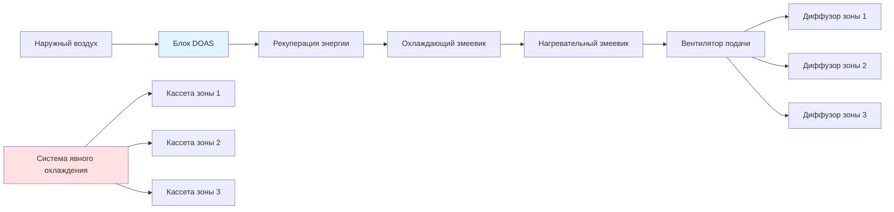
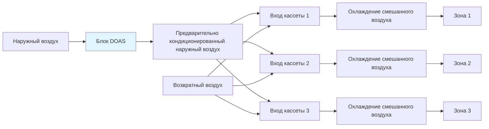
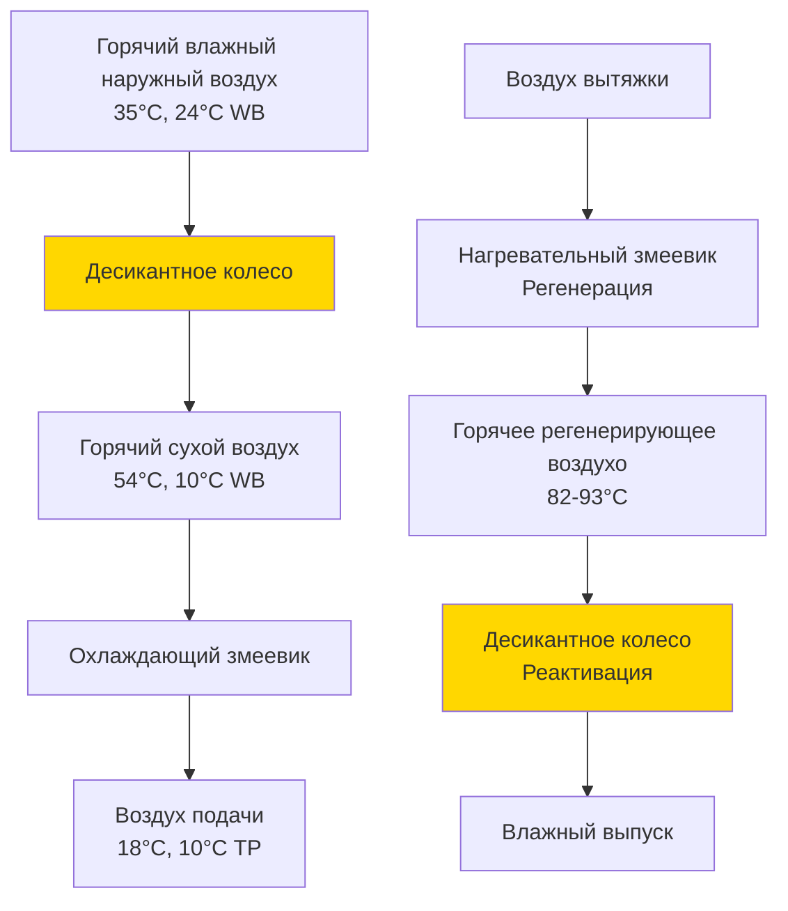

## Фундаментальная концепция

Системы с выделенным наружным воздухом (DOAS) представляют смену парадигмы в проектировании HVAC благодаря **разделению обработки вентиляционного воздуха от явного охлаждения помещения**. В отличие от обычных систем, где наружный воздух смешивается с возвратным воздухом перед кондиционированием, DOAS обрабатывает 100% наружного воздуха в отдельном выделенном блоке, подавая предварительно обработанный вентиляционный воздух непосредственно в помещения или в концевые устройства.

Основной принцип: **одна система обрабатывает скрытые нагрузки и вентиляцию (DOAS), в то время как отдельные системы справляются с явными нагрузками охлаждения** (радиационные панели, охлаждаемые потолки, кассеты вентиляторов или системы переменного хладагента).

## Соответствие ASHRAE 62.1

Стандарт ASHRAE 62.1 требует минимальные скорости вентиляции на основе занятости и площади пола. DOAS упрощает соответствие благодаря:

- Обеспечению постоянного расхода вентиляционного воздуха независимо от условий нагрузки помещения
- Исключению проблем с переменной долей наружного воздуха, присущих системам VAV
- Возможности прямого измерения и проверки подачи наружного воздуха
- Более надежному поддержанию эффективности вентиляции (Ez)

**Расчет требования вентиляции согласно ASHRAE 62.1:**

```
Vbz = RpPz + RaAz
```

Где:
- Vbz = расход наружного воздуха в дыхательной зоне (CFM)
- Rp = норма наружного воздуха на человека (CFM/человек)
- Ra = норма наружного воздуха на площадь (CFM/м²)
- Pz = численность зоны
- Az = площадь пола зоны (м²)

Для типичного офисного помещения (Rp = 2,4 CFM/человек, Ra = 0,65 CFM/м²):
- помещение площадью 280 м² с 15 человеками
- Vbz = (2,4 × 15) + (0,65 × 280) = 36 + 182 = **218 CFM (369 м³/ч)**

## Конфигурации систем

### Параллельная конфигурация

В параллельной DOAS вентиляционный воздух подается **непосредственно в помещения**, независимо от концевых устройств.



**Преимущества:**
- Истинное разделение вентиляции и явных нагрузок
- Концевые устройства работают только с явными нагрузками (более компактное оборудование)
- Упрощенное управление концевыми устройствами
- Улучшенный контроль влажности на уровне блока DOAS

**Недостатки:**
- Требует отдельной системы воздуховодов для DOAS
- Более высокие первоначальные затраты на установку
- Больше требований к пространству потолка для двойной системы распределения

### Последовательная конфигурация

В последовательной DOAS вентиляционный воздух подается **на входы концевых устройств**, смешиваясь с рециркулируемым воздухом.



**Преимущества:**
- Единственная система распределения воздуховодов
- Более низкие затраты на установку
- Меньше требований к пространству потолка
- Упрощенная архитектура

**Недостатки:**
- Концевые устройства должны справляться с комбинированными вентиляционными и явными нагрузками (более крупное оборудование)
- Менее точный контроль влажности на уровне зоны
- Потенциальные потери при смешивании

## Стратегии осушения

### Подход с обычным охлаждающим змеевиком

Охлаждающие змеевики DOAS работают при **более низких температурах точки росы аппарата (ADP)**, чем обычные системы, для достижения более глубокого осушения.

**Емкость скрытого охлаждения:**

```
QL = 2,053 × CFM × Δω
```

Где:
- QL = емкость скрытого охлаждения (кДж/ч)
- CFM = расход воздуха в CFM (м³/ч)
- Δω = разница отношения влажности (г/кг сухого воздуха)
- 2,053 = коэффициент преобразования

**Пример расчета:**
- Наружный воздух: 35°C, 24°C WB (ω = 20,8 г/кг)
- Целевой воздух подачи: 13°C, 95% ОВ (ω = 9,4 г/кг)
- Расход воздуха: 944 CFM (1 603 м³/ч)

```
QL = 2,053 × 944 × (20,8 - 9,4)
QL = 2,053 × 944 × 11,4
QL = 22,117 кДж/ч (6,1 кВт скрытого охлаждения)
```

**Емкость явного охлаждения:**

```
QS = 0,018 × CFM × ΔT
QS = 0,018 × 944 × (35 - 13)
QS = 37,370 кДж/ч (10,4 кВт явного охлаждения)
```

**Общее охлаждение: 59,487 кДж/ч (16,5 кВт)**

**Коэффициент явного тепла (SHR):**

```
SHR = QS / (QS + QL) = 37,370 / 59,487 = 0,63
```

Этот низкий SHR (типично 0,55-0,70 для DOAS) контрастирует с обычными системами (SHR 0,75-0,85), демонстрируя направленность DOAS на удаление скрытого тепла.

### Десикантное осушение

Для экстремальных условий влажности или когда требуются очень низкие точки росы, **десикантные колеса** обеспечивают химическое осушение без чрезмерного охлаждения.



**Производительность десикантного колеса:**
- Удаление влаги: 5,7-8,5 г/кг (г влаги на килограмм сухого воздуха)
- Температура регенерации: 82-104°C
- Потенциал рекуперации энергии: 50-70% эффективность явного тепла
- Перепад давления: 0,01-0,02 кПа

## Интеграция рекуперации энергии

Рекуперация энергии драматически снижает эксплуатационные затраты DOAS путем предварительной обработки наружного воздуха энергией воздуха вытяжки.

**Общая эффективность:**

```
ηt = (h1 - h2) / (h1 - h4)
```

Где:
- h1 = энтальпия входящего наружного воздуха
- h2 = энтальпия выходящего наружного воздуха (после рекуперации)
- h4 = энтальпия входящего воздуха вытяжки

**Пример с энтальпийным колесом (75% общая эффективность):**

Летнее условие:
- Наружный воздух: 35°C, 24°C WB (h = 50,4 кДж/кг)
- Воздух вытяжки: 24°C, 50% ОВ (h = 37,0 кДж/кг)
- После рекуперации: h2 = 50,4 - 0,75(50,4 - 37,0) = **40,4 кДж/кг**

Это представляет **предварительное охлаждение с 35°C до приблизительно 26°C** перед механическим охлаждением.

**Годовая экономия энергии:**

```
Экономия = 0,018 × CFM × Δh × часы
```

Для 944 CFM (1 603 м³/ч), снижение энтальпии 10,1 кДж/кг, 2 688 часов охлаждения:
```
Экономия = 0,018 × 944 × 10,1 × 2,688 = 41,094 МДж/год
```

При стоимости 0,12 USD/кВч (COP 0,8): **3 200 USD годовой экономии**

## Нейтральный и холодный воздух подачи

### Стратегия нейтрального воздуха подачи (13-18°C)

Подает воздух близкий к температуре помещения для **минимизации влияния явного охлаждения** на зоны:

- Снижает требования к переподогреву концевых устройств
- Позволяет использовать более компактные концевые устройства (только явное охлаждение)
- Оптимально для систем радиационного охлаждения
- Типичная подача: 15-18°C в режиме охлаждения

### Стратегия холодного воздуха подачи (9-13°C)

Подает холодный воздух для **обеспечения как скрытого, так и частичного явного охлаждения**:

- Снижает требования по охлаждающей емкости концевых устройств
- Может исключить некоторые концевые устройства в помещениях с низкой нагрузкой
- Требует переподогрева для помещений с преобладанием вентиляции
- Типичная подача: 10-13°C

**Анализ компромиссов:** Нейтральный воздух подачи максимизирует преимущества разделения, но требует полнопроизводительных систем явного охлаждения. Холодный воздух подачи обеспечивает помощь явного охлаждения, но увеличивает штрафы на переподогрев и нивелирует преимущества чистого разделения.

## Методология расчета нагрузок

### Компоненты выбора размера DOAS

**1. Расход вентиляционного воздуха (ASHRAE 62.1):**
- Расчет для каждого типа помещения и занятости
- Суммирование всех зон, обслуживаемых блоком DOAS
- Добавление потерь распределения при необходимости

**2. Скрытая нагрузка:**
```
QL = 2,053 × CFM × (ωНА - ωподачи)
```

**3. Явная нагрузка:**
```
QS = 0,018 × CFM × (TНА - Tподачи)
```

**4. Проверка емкости осушения:**

Проверка точки росы ADP змеевика и коэффициента контакта для достижения целевой влажности:
```
Tподачи = TADP,змеевика + CF × (Tсмешанное - TADP,змеевика)
```

Где CF = коэффициент контакта змеевика (типично 0,85-0,95)

### Пример расчета дня проектирования

**Проект:** офисное здание площадью 1 858 м², 100 человек
**Местоположение:** Атланта, штат Джорджия (летний расчет: 34°C DB, 23°C WB)

**Шаг 1: Требование вентиляции**
```
V = (2,4 CFM/человек × 100) + (0,65 CFM/м² × 1,858)
V = 240 + 1,208 = 1,448 CFM (2 460 м³/ч)
```

**Шаг 2: Целевые условия подачи**
- Подача: 13°C, 90% ОВ (ω = 9,4 г/кг)
- Наружный воздух: 34°C, 23°C WB (ω = 20,5 г/кг)

**Шаг 3: Охлаждающие нагрузки**

Скрытая:
```
QL = 2,053 × 1,448 × (20,5 - 9,4) = 33,213 кДж/ч
```

Явная:
```
QS = 0,018 × 1,448 × (34 - 13) = 54,809 кДж/ч
```

**Итого: 88,022 кДж/ч (24,5 кВт)**

С 70% эффективной рекуперацией энергии:
```
Чистое охлаждение = 88,022 × (1 - 0,70) = 26,407 кДж/ч (7,3 кВт)
```

**Выбор оборудования DOAS: 7,3 кВт блок DX с энтальпийным колесом**

## Стратегии управления

**Сброс температуры воздуха подачи:**
- Мониторинг уровней влажности в зонах
- Сброс температуры подачи между 10-18°C на основе требования осушения
- Предотвращение чрезмерного охлаждения при низких скрытых нагрузках

**Вентиляция по требованию:**
- Модуляция наружного воздуха на основе датчиков CO₂ (если занятость варьируется)
- Поддержание минимальной обязательной вентиляции
- Снижение энергии в периоды не занятости или низкой занятости

**Управление обходом:**
- При мягких условиях обход охлаждающего змеевика
- Использование только рекуперации энергии для предварительной обработки
- Работа экономайзера при благоприятных наружных условиях

## Сводка преимуществ

| Категория преимущества | Количественное воздействие |
|------------------------|---------------------------|
| Постоянство КВП | Подача 100% наружного воздуха, без проблем снижения VAV |
| Контроль влажности | ОВ в помещении поддерживается 40-60% против 35-70% обычной |
| Экономия энергии | Снижение на 20-40% энергии HVAC против постоянного объема |
| Уменьшение оборудования | Концевые устройства на 30-50% меньше (только явное охлаждение) |
| Обслуживание | Централизованная обработка наружного воздуха, упрощенное зональное оборудование |
| Комфорт | Исключение холодных сквозняков, улучшенное распределение |

Архитектура DOAS обеспечивает превосходную эффективность вентиляции, точный контроль влажности и значительную экономию энергии благодаря интеллектуальному разделению вентиляции от явных охлаждающих нагрузок. Надлежащее проектирование требует тщательного анализа климатических условий, профилей нагрузок и интеграции с системами явного охлаждения для максимизации преимуществ.

---

**Файл:** /Users/evgenygantman/Documents/github/gantmane/hvac/content/ventilation-indoor-air-quality/ventilation-systems/dedicated-outdoor-air-systems/_index.md
