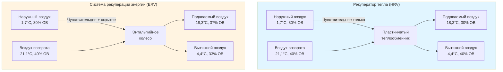
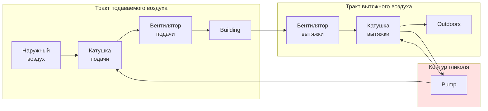

Системы рекуперации энергии вентиляции (ERV) восстанавливают тепловую энергию из потоков вытяжного воздуха для предварительной обработки поступающего наружного воздуха, значительно снижая энергопотребление HVAC. Понимание физики передачи тепла и влаги через различные типы теплообменников позволяет оптимально выбирать систему для конкретных климатических условий.

## Чувствительная и полная рекуперация энергии

**Рекуператоры тепла (HRV)** передают только чувствительное тепло между потоками воздуха через проводящий барьер. Происходят изменения температуры, но влажность остаётся неизменной. Чувствительная эффективность (εs) количественно характеризует производительность:

$$\varepsilon_s = \frac{T_{supply} - T_{outdoor}}{T_{exhaust} - T_{outdoor}}$$

Где:
- Tsupply = температура подаваемого воздуха на выходе теплообменника (°C)
- Texhaust = температура вытяжного воздуха здания (°C)
- Toutdoor = температура наружного воздуха на входе теплообменника (°C)

**Системы рекуперации энергии (ERV)** передают как чувствительное, так и скрытое тепло (влагу). Полная эффективность (εt) учитывает передачу энтальпии:

$$\varepsilon_t = \frac{h_{supply} - h_{outdoor}}{h_{exhaust} - h_{outdoor}}$$

Где h представляет удельную энтальпию (кДж/кг сухого воздуха).

Скрытая эффективность (εl) изолирует производительность передачи влаги:

$$\varepsilon_l = \frac{W_{supply} - W_{outdoor}}{W_{exhaust} - W_{outdoor}}$$

Где W — коэффициент влажности (кг влаги/кг сухого воздуха).

## Эффективность и метод NTU

Число единиц переноса (NTU) обеспечивает безразмерный анализ теплообменника. Для противоточных конфигураций с уравновешенными потоками воздуха:

$$NTU = \frac{UA}{\dot{m}_{min} c_p}$$

Где:
- U = общий коэффициент теплопередачи (кВт/м²·K)
- A = площадь поверхности теплопередачи (м²)
- ṁmin = минимальный массовый расход между потоками (кг/ч)
- cp = удельная теплоёмкость воздуха (1,005 кДж/кг·K)

Для противоточных теплообменников с уравновешенными потоками (C* = 1):

$$\varepsilon_s = \frac{NTU}{1 + NTU}$$

Для перекрёстных конфигураций эффективность зависит от расположения потока. Перекрёстный поток без смешивания:

$$\varepsilon_s = 1 - \exp\left[\frac{NTU^{0.22}}{C^*}\left(\exp(-C^* \cdot NTU^{0.78}) - 1\right)\right]$$

Где C* = отношение минимальной теплоёмкости к максимальной (безразмерное).

## Технологии рекуперации энергии

### Пластинчатые теплообменники

Алюминиевые или полимерные пластины разделяют потоки воздуха в противоточной или перекрёстной конфигурации. Чувствительная эффективность составляет 50–85% в зависимости от конфигурации.

**Преимущества:**
- Отсутствие движущихся частей, минимальное техническое обслуживание
- Полное отсутствие перекрёстного загрязнения между потоками
- Компактное исполнение
- Низкое сопротивление (75–200 Па)

**Ограничения:**
- Только чувствительная рекуперация (без передачи влаги)
- Фиксированная геометрия ограничивает способность к перестройке
- Образование льда в холодном климате требует стратегий разморозки

### Энтальпийные колёса (роторные теплообменники)

Вращающееся колесо с десиккантным покрытием передаёт тепло и влагу между потоками воздуха. Типичная эффективность: 70–85% чувствительная, 60–75% скрытая.

**Преимущества:**
- Одновременная чувствительная и скрытая рекуперация
- Высокая эффективность во всём диапазоне работы
- Самоочищающееся действие снижает загрязнение

**Ограничения:**
- Движущиеся части требуют техническое обслуживание (подшипники, ремни, двигатель)
- Возможное перекрёстное загрязнение (1–3% уноса)
- Более высокое сопротивление (125–300 Па)
- Требует секцию продувки для минимизации утечек

### Циркуляционные системы с теплоносителем

Раствор гликоля циркулирует между катушками вытяжного и подаваемого воздуха, передавая чувствительное тепло. Эффективность обычно 45–65%.

**Преимущества:**
- Вытяжные и подающие воздуховоды не должны быть рядом
- Отсутствие перекрёстного загрязнения
- Минимальный риск замерзания с раствором гликоля
- Возможность замены отдельных катушек

**Ограничения:**
- Наименьшая эффективность среди распространённых технологий
- Только чувствительная рекуперация
- Потребление энергии насосом
- Утечка гликоля требует мониторинга

## Требования ASHRAE 90.1

ASHRAE 90.1 Раздел 6.5.6.1 требует рекуперацию энергии для систем, соответствующих конкретным критериям:

| Климатическая зона | Порог расхода подаваемого воздуха | % наружного воздуха |
|---|---|---|
| 3B, 3C, 4B, 4C, 5B, 5C | ≥ 8,500 м³/ч | ≥ 70% |
| 1B, 2B, 3A, 4A, 5A, 6A | ≥ 8,500 м³/ч | ≥ 70% |
| 6B, 7, 8 | ≥ 8,500 м³/ч | ≥ 50% |

Минимальный коэффициент рекуперации энергии: 50% (коэффициент восстановления энтальпии согласно AHRI 1060).

Исключения включают:
- Системы вентиляции лабораторных вытяжных шкафов
- Системы, обслуживающие помещения с опасной вытяжкой
- Вытяжка коммерческой кухни
- Приложения осушения во влажном климате

## Выбор в зависимости от климата

### Холодные климаты (зоны 5–8)

**Рекомендация:** пластинчатый HRV или энтальпийное колесо с управлением разморозкой.

Холодный наружный воздух создаёт риск образования льда, когда влага вытяжного воздуха конденсируется и замерзает на поверхностях теплообменника. Стратегии разморозки включают:
- Разморозку рециркуляцией (временный байпас наружного воздуха)
- Предварительный нагрев (повышение температуры входящего воздуха выше −6,7°C)
- Модуляция скорости колеса (снижение времени воздействия)

Приоритет чувствительной рекуперации превышает скрытую рекуперацию в климатах с преобладанием отопления. Зимняя инфильтрация вводит сухой наружный воздух, что снижает ценность рекуперации влаги.

### Жаркие влажные климаты (зоны 1–2)

**Рекомендация:** энтальпийное колесо ERV с высокой скрытой эффективностью.

Летний наружный воздух несёт существенную нагрузку влаги. Скрытое охлаждение составляет 30–50% от общей холодильной нагрузки. Рекуперация влаги из вытяжного воздуха сокращает время работы компрессора и улучшает осушение.

Целевые характеристики:
- Скрытая эффективность ≥ 60%
- Полная эффективность ≥ 70%
- Десиккантное покрытие для адсорбции влаги

### Смешанные климаты (зоны 3–4)

**Рекомендация:** энтальпийное колесо ERV для круглогодичных преимуществ.

Сезоны отопления и охлаждения представляют значительные нагрузки. Полная рекуперация энергии захватывает ценность во всех режимах работы:
- Зима: рекуперация чувствительного тепла и энергии увлажнения
- Лето: рекуперация чувствительного охлаждения и энергии осушения
- Переходные сезоны: свободное охлаждение через интеграцию с экономайзером

## Расчёты производительности

**Пример:** Расчёт экономии энергии для ERV 8,500 м³/ч в смешанном климате.

Заданные условия:
- Наружный воздух: 35°C по сухому термометру, 23,9°C по влажному термометру (h = 75,8 кДж/кг)
- Вытяжной воздух: 23,9°C по сухому термометру, 50% ОВ (h = 49,8 кДж/кг)
- Полная эффективность: 75%

Энтальпия подаваемого воздуха после ERV:

$$h_{supply} = h_{outdoor} - \varepsilon_t(h_{outdoor} - h_{exhaust})$$

$$h_{supply} = 75,8 - 0,75(75,8 - 49,8) = 56,3 \text{ кДж/кг}$$

Массовый расход (ρ = 1,20 кг/м³):

$$\dot{m} = 8500 \times 1,20 = 10,200 \text{ кг/ч}$$

Скорость рекуперации энергии:

$$\dot{Q}_{recovered} = \dot{m}(h_{outdoor} - h_{supply}) = 10,200(75,8 - 56,3) = 198,6 \text{ кДж/с} = 198,6 \text{ кВт}$$

Годовая экономия холодильной энергии зависит от часов работы и тарифов на коммунальные услуги, но это снижение холодильной нагрузки на 198,6 кВт демонстрирует существенный потенциал снижения размера механической системы.

## Рассмотрение интеграции системы

Системы рекуперации энергии взаимодействуют с управлением экономайзером согласно ASHRAE 90.1 Раздел 6.5.1. Когда условия наружного воздуха благоприятствуют свободному охлаждению (режим экономайзера по энтальпии или по сухому термометру), ERV должен:

1. **Режим байпаса:** заслонки перенаправляют потоки воздуха вокруг теплообменника
2. **Остановка колеса:** энтальпийные колёса прекращают вращение, чтобы предотвратить добавление тепла
3. **Отключение циркуляционного насоса:** отключить циркуляцию гликоля

Надлежащая последовательность управления предотвращает противодействие рекуперации энергии работе экономайзера. Интегрированное управление экономайзером-ERV максимизирует годовую экономию энергии, выбирая оптимальный режим работы для текущих условий.

## Заключение

Рекуперация энергии вентиляции снижает нагрузки на кондиционирование наружного воздуха на 50–85% в зависимости от выбора технологии и климата. Пластинчатые HRV обеспечивают только чувствительную рекуперацию с минимальным обслуживанием, энтальпийные колёса ERV обеспечивают полную рекуперацию энергии для комплексной экономии, а циркуляционные системы с теплоносителем позволяют осуществлять рекуперацию там, где ограничения в расположении воздуховодов существуют. Соответствуйте технологию характеристикам климата и следуйте требованиям ASHRAE 90.1 для достижения соответствия нормам и оптимальной энергетической производительности.
