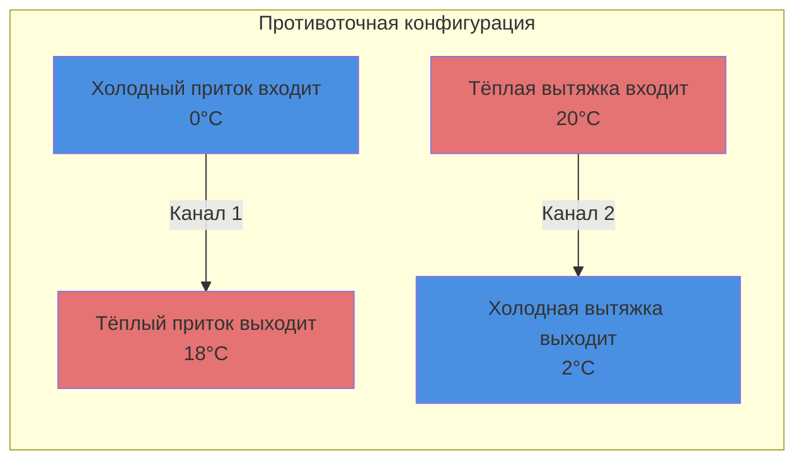
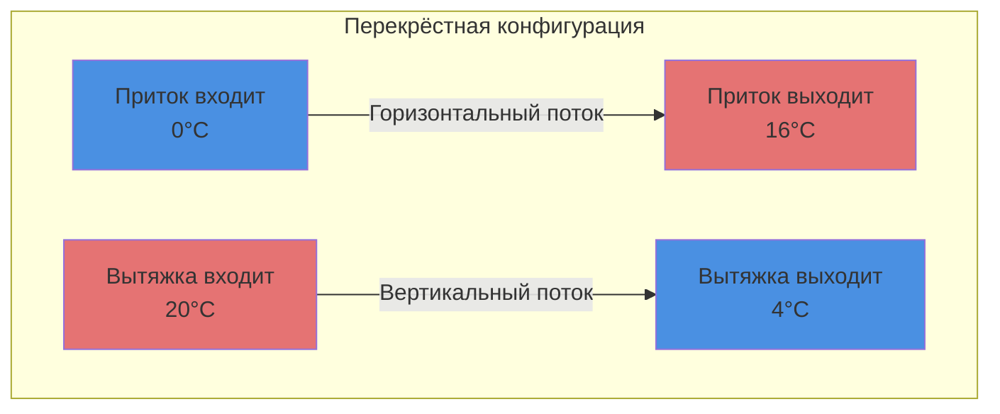
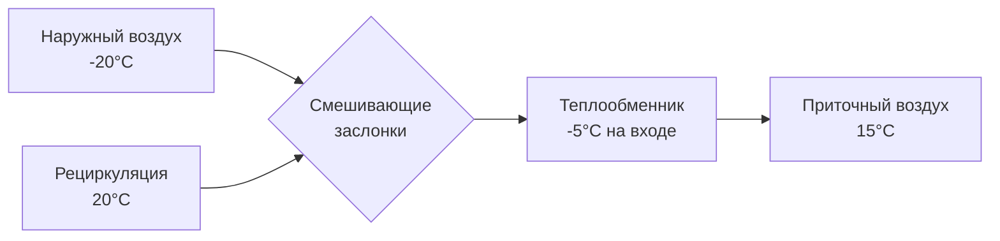

## Обзор

Пластинчатые теплообменники представляют наиболее распространённую технологию рекуперации явного тепла в коммерческих системах HVAC. Эти устройства передают тепловую энергию между потоками приточного и вытяжного воздуха через тонкие металлические или полимерные пластины, расположенные в чередующихся каналах потока, достигая эффективности 50-85% в зависимости от конфигурации и условий эксплуатации.

## Конфигурации теплопередачи

### Противоточная конструкция

Противоточные конфигурации обеспечивают максимальную эффективность теплопередачи, поддерживая оптимальные перепады температуры по всей поверхности теплообмена. Входящий воздух поступает с противоположных концов теплообменника, создавая наивысшую теоретическую эффективность.

**Эффективность:** 70-85% при стандартных условиях

### Перекрёстная конструкция

Перекрёстные теплообменники ориентируют потоки приточного и вытяжного воздуха перпендикулярно друг другу, упрощая монтаж и снижая гидравлическое сопротивление. Эта конфигурация доминирует в жилищных и лёгких коммерческих приложениях благодаря преимуществам в стоимости производства.

**Эффективность:** 50-70% при стандартных условиях

### Параллельная конструкция

Параллельные конфигурации направляют оба потока воздуха в одном направлении. Хотя встречаются реже из-за более низкой эффективности, эта конфигурация минимизирует риск перекрёстного загрязнения в критичных приложениях.

**Эффективность:** 40-60% при стандартных условиях

## Метод NTU-эффективности

Метод числа единиц переноса (NTU) обеспечивает точное прогнозирование производительности для всех конфигураций пластинчатых теплообменников:

$$\varepsilon = f(NTU, C_r, \text{конфигурация потока})$$

Где:
- $\varepsilon$ = эффективность теплообменника (безразмерная)
- $NTU$ = число единиц переноса (безразмерная)
- $C_r$ = коэффициент тепловой ёмкости $= C_{min}/C_{max}$

**Число единиц переноса:**

$$NTU = \frac{UA}{C_{min}}$$

Где:
- $U$ = общий коэффициент теплопередачи (Вт/м²·K)
- $A$ = площадь поверхности теплообмена (м²)
- $C_{min}$ = минимальный тепловой поток (Вт/K)

**Эффективность противоточного течения:**

$$\varepsilon_{counter} = \frac{1 - e^{-NTU(1-C_r)}}{1 - C_r \cdot e^{-NTU(1-C_r)}}$$

Для сбалансированного потока ($C_r = 1$):

$$\varepsilon_{counter} = \frac{NTU}{1 + NTU}$$

**Эффективность перекрёстного течения (оба потока неперемешиваны):**

$$\varepsilon_{cross} = 1 - \exp\left[\frac{NTU^{0.22}}{C_r}(\exp(-C_r \cdot NTU^{0.78}) - 1)\right]$$

## Анализ гидравлического сопротивления

Гидравлическое сопротивление через пластинчатые теплообменники напрямую влияет на энергопотребление вентиляторов и экономику системы. Точный расчёт требует учёта потерь на трение и ускорения потока:

$$\Delta P = f \cdot \frac{L}{D_h} \cdot \frac{\rho v^2}{2} + K \cdot \frac{\rho v^2}{2}$$

Где:
- $f$ = коэффициент трения Дарси (безразмерный)
- $L$ = длина пути потока (м)
- $D_h$ = гидравлический диаметр (м)
- $\rho$ = плотность воздуха (кг/м³)
- $v$ = средняя скорость (м/с)
- $K$ = коэффициент местного сопротивления для эффектов входа/выхода

**Гидравлический диаметр:**

$$D_h = \frac{4A_c}{P_w}$$

Где:
- $A_c$ = площадь поперечного сечения канала (м²)
- $P_w$ = смоченный периметр (м)

Типичное гидравлическое сопротивление находится в диапазоне 75-250 Па при расчётных расходах воздуха.

## Стратегии контроля обледенения

Образование льда происходит, когда потоки вытяжного воздуха охлаждают приточный воздух ниже 0°C, вызывая замерзание влаги на поверхностях теплообмена. Это явление снижает эффективность и увеличивает гидравлическое сопротивление, потенциально полностью перекрывая поток воздуха.

### Критический порог обледенения

Риск обледенения значительно возрастает при:

$$T_{приток,выход} < 0°C \quad \text{и} \quad \omega_{вытяжка} > 0.003 \, \text{кг}_в/\text{кг}_{св}$$

Где $\omega$ обозначает коэффициент влажности.

### Методы разморозки

**1. Управление перепускным клапаном**

Направить часть тёплого воздуха здания мимо теплообменника во время низких наружных температур:

**2. Предварительный нагревающий калорифер**

Установить нагревающий калорифер до теплообменника для поддержания температуры входящего воздуха выше -10°C.

**3. Прерывистая работа**

Периодически отключать поток вытяжного воздуха, позволяя тёплому приточному воздуху разморозить поверхности (циклы 5-15 минут).

**4. Разворот потока**

Некоторые конструкции поддерживают разворот потока воздуха, используя тепло вытяжного воздуха здания для разморозки приточной части.

## Стандарт ASHRAE 84

ASHRAE Standard 84-2020 устанавливает стандартизированные процедуры испытаний для воздухо-воздушных теплообменников, обеспечивая согласованные рейтинги производительности между производителями.

**Ключевые условия испытаний:**

| Параметр | Зимнее испытание | Летнее испытание |
|-----------|-------------|-------------|
| Температура наружного воздуха | -18°C | 35°C |
| Температура внутреннего воздуха | 21°C | 24°C |
| Баланс расходов | 1:1 | 1:1 |
| Скорость на входе | 1.5-2.5 м/с | 1.5-2.5 м/с |

**Отчитываемые показатели:**

- Эффективность явного тепла при различных температурных условиях
- Характеристики гидравлического сопротивления в зависимости от расхода
- Пороги образования льда
- Коэффициенты перекрёстного утечки (целевое значение: <5%)
- Деградация коэффициента теплопередачи во времени

## Материальные решения

**Алюминий:** Высокая теплопроводность (205 Вт/м·K), лёгкий, экономичный. Подвержен коррозии в прибрежных средах.

**Полимерные плёнки:** Стойкие к коррозии, более низкая теплопроводность (0.2-0.5 Вт/м·K), требуют большей площади поверхности. Отличный выбор для приложений с высокой влажностью.

**Покрытая сталь:** Эпоксидные или полимерные покрытия защищают сердечник из углеродистой стали, сочетая тепловую производительность с коррозионной стойкостью.

## Оптимизация производительности

**Увеличение эффективности:**
- Максимизировать площадь поверхности теплообмена
- Снизить расстояние между пластинами (оптимальное 1.5-3 мм)
- Выбрать противоточную конфигурацию
- Сбалансировать расходы приточного и вытяжного воздуха

**Снижение гидравлического сопротивления:**
- Увеличить высоту канала
- Минимизировать длину пути потока
- Использовать обтекаемую геометрию входов/выходов
- Поддерживать чистоту поверхностей (фильтрация перед теплообменником)

## Требования к техническому обслуживанию

Пластинчатые теплообменники требуют минимального обслуживания по сравнению с ротационными колёсами рекуперации энергии:

- **Ежеквартально:** Визуальный осмотр на повреждения от обледенения, проверка контролей разморозки
- **Два раза в год:** Измерение гидравлического сопротивления, очистка доступных поверхностей
- **Ежегодно:** Проверка эффективности по ASHRAE 84
- **Каждые 3-5 лет:** Разборка и глубокая очистка внутренних поверхностей

Должным образом обслуживаемые пластинчатые теплообменники обеспечивают 15-25 лет надёжной работы в коммерческих системах HVAC.

---

**Связанные темы:** [Рекуперация энергии вентиляции](../../../../ventilation-indoor-air-quality/ventilation-systems/energy-recovery-ventilation/_index.md), [Моделирование теплопередачи](../../../../sustainability-emerging-tech-economics/computational-methods-research/heat-transfer-modeling/_index.md)
