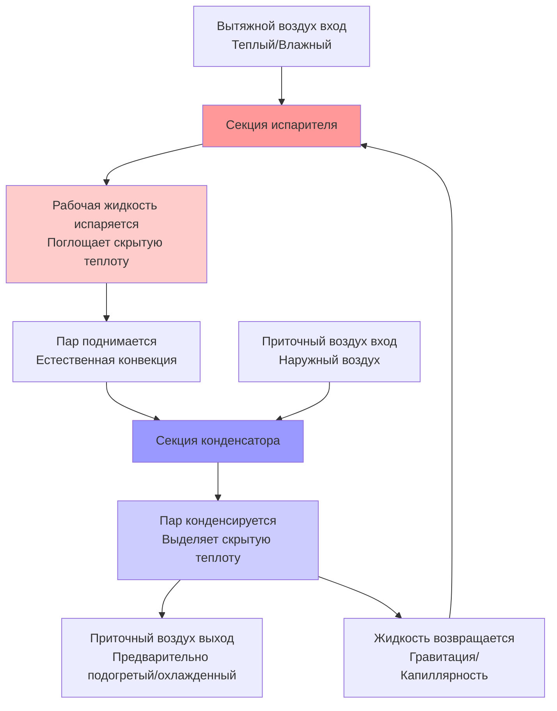
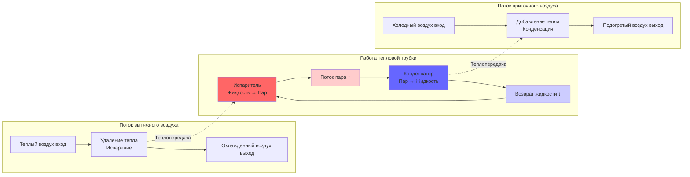

Тепловые трубки представляют пассивную технологию рекуперации энергии, которая передает тепло между потоками приточного и вытяжного воздуха без движущихся частей, электроснабжения или перекрестного загрязнения. Эти устройства используют теплопередачу при изменении фазы для достижения высоких коэффициентов теплопроводности, превышающих показатели обычных металлических проводников на несколько порядков.

## Принципы двухфазной теплопередачи

Тепловые трубки работают по замкнутому циклу испарения-конденсации внутри герметичных трубок, содержащих рабочую жидкость. Фундаментальная последовательность работы включает испарение на горячем конце (сторона вытяжного воздуха), миграцию пара на холодный конец (сторона приточного воздуха), конденсацию с выделением скрытой теплоты и капиллярный возврат жидкого конденсата в секцию испарителя.

Выбор рабочей жидкости зависит от диапазона рабочих температур. Обычные хладагенты включают R-134a для стандартных HVAC-приложений (-26°C до 93°C), воду для повышенных температур (30°C до 200°C) и аммиак для низкотемпературных приложений (-60°C до 100°C). Жидкость должна иметь надлежащие характеристики давления насыщенного пара при расчетных условиях для поддержания циркуляции без требования внешнего насоса.

### Модель теплового сопротивления

Тепловые характеристики тепловой трубки описываются последовательными тепловыми сопротивлениями от источника к поглотителю:

$$R_{total} = R_{evap} + R_{vapor} + R_{cond} + R_{wall}$$

Где:
- $R_{evap}$ = тепловое сопротивление испарителя (К/Вт)
- $R_{vapor}$ = тепловое сопротивление потока пара (К/Вт)
- $R_{cond}$ = тепловое сопротивление конденсатора (К/Вт)
- $R_{wall}$ = тепловое сопротивление проводимости стенки трубки (К/Вт)

Скорость теплопередачи определяется по формуле:

$$Q = \frac{T_{exhaust} - T_{supply}}{R_{total}}$$

Для практических HVAC-тепловых трубок сопротивление потока пара преобладает при низких тепловых нагрузках, в то время как пленочные сопротивления испарителя и конденсатора управляют процессом при высокой загрузке.

## Эффективность тепловой трубки

Тепловая эффективность определяет долю максимально возможной теплопередачи, достигаемой массивом тепловых трубок:

$$\varepsilon = \frac{T_{supply,out} - T_{supply,in}}{T_{exhaust,in} - T_{supply,in}}$$

При сбалансированных расходах воздуха (равные массовые расходы с обеих сторон) эффективность обычно составляет от 45% до 65% в зависимости от конфигурации. Метод Числа Единиц Передачи (NTU) связывает эффективность с размером теплообменника:

$$\varepsilon = \frac{1 - e^{-NTU(1-C)}}{1 - C \cdot e^{-NTU(1-C)}}$$

Где:
- $NTU = \frac{UA}{\dot{m}_{min} c_p}$
- $C = \frac{\dot{m}_{min} c_p}{\dot{m}_{max} c_p}$ (отношение емкостей)
- $U$ = общий коэффициент теплопередачи (Вт/м²·К)
- $A$ = общая площадь теплопередачи (м²)

Для сбалансированных потоков, где $C = 1$:

$$\varepsilon = \frac{NTU}{1 + NTU}$$

## Конфигурация и параметры проектирования

Системы рекуперации энергии с тепловыми трубками используют несколько параллельных трубок, расположенных перпендикулярно потоку воздуха, создавая пучки труб, подобные обычной геометрии катушки. Ключевые параметры проектирования включают:

**Геометрия трубки:**
- Диаметр: 12-25 мм типично
- Длина: 0,6-2,4 м в зависимости от размеров воздуховода
- Глубина рядов: 4-12 рядов для надлежащего NTU
- Расстояние оребрения: 8-12 ребер на дюйм для улучшения теплопередачи с воздухом

**Угол наклона:**
Тепловые трубки требуют минимального уклона для гравитационного возврата конденсата в бесфитильных конструкциях. ASHRAE Fundamentals рекомендует минимальный уклон 5-10 градусов от горизонтали, при этом испаритель расположен ниже конденсатора. Фитильные тепловые трубки могут работать в любой ориентации, но это увеличивает стоимость и сложность.

**Коэффициент теплопередачи:**
Общая проводимость учитывает как сопротивления со стороны воздуха, так и со стороны хладагента:

$$\frac{1}{U} = \frac{1}{h_{air,supply}} + \frac{1}{h_{air,exhaust}} + \frac{1}{h_{refrigerant}} + \frac{t_{wall}}{k_{wall}}$$

Типичные значения U составляют 40-80 Вт/м²·К для оребренных трубчатых массивов тепловых трубок со скоростями воздуха 2-4 м/с.

## Приложения и производительность

Вентиляторы рекуперации энергии с тепловыми трубками находят оптимальное применение в системах, требующих:

1. **Полное разделение воздуха:** Нулевое перекрестное загрязнение между потоками вытяжки и приток подходит для здравоохранения, лабораторий и промышленной вытяжки, где передача влаги или загрязнений запрещена.

2. **Пассивная работа:** Отсутствие электроэнергии для механизма теплопередачи снижает паразитное энергопотребление и требования к обслуживанию.

3. **Рекуперация только явного тепла:** Тепловые трубки передают только явное тепло (температура) без влагообмена, полезно во влажном климате, где рекуперация скрытой теплоты вызывает проблемы обледенения.

**Соответствие ASHRAE 90.1:**
Энергетический стандарт 90.1 Раздел 6.5.6.1 требует рекуперации энергии для систем, превышающих определенные количества наружного воздуха. Системы с тепловыми трубками обычно достигают 50-60% явной эффективности, соответствуя предписывающим требованиям для климатических зон, требующих вентиляции с рекуперацией энергии.

**Мощность и подбор:**
Мощность рекуперации тепловой трубкой масштабируется с количеством трубок и расходом воздуха:

$$Q_{recovered} = \varepsilon \cdot \dot{m}_{air} \cdot c_p \cdot (T_{exhaust} - T_{supply})$$

Для системы 2000 CFM (944 м³/ч) с эффективностью 60% и температурным перепадом 30°C:
$$Q = 0,60 \times 944 \times 10^{-3} \times 1006 \times 30 = 17,1 \text{ кВ}$$

## Ограничения и соображения

**Баланс расходов воздуха:**
Эффективность значительно деградирует при дисбалансе расходов воздуха. Отношение емкостей $C$ ниже 0,75 снижает тепловые характеристики на 15-25% по сравнению со сбалансированной работой.

**Потеря давления:**
Несколько рядов трубок создают статические потери давления 75-200 Па (0,3-0,8 дюйма вод. ст.), требующие учета энергии вентилятора в анализе общей рекуперации энергии.

**Обледенение:**
Ниже примерно 0°C температуры вытяжного воздуха замерзание конденсата может заблокировать поток воздуха. Обводные заслонки, катушки предварительного подогрева или механизмы отклонения предотвращают накопление инея в экстремальных условиях.

**Зависимость ориентации:**
Тепловые трубки с гравитационным возвратом требуют определенных углов установки, ограничивая применение при модернизации в механических помещениях с ограниченным пространством.

Технология тепловых трубок обеспечивает надежную, не требующую обслуживания рекуперацию энергии с исключительной надежностью для приложений, приоритизирующих разделение воздуха и пассивную работу над максимальной эффективностью.
