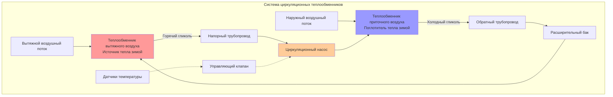

## Обзор

Системы циркуляционных теплообменников обеспечивают утилизацию явного тепла между пространственно разделёнными потоками вытяжного и приточного воздуха. Прокачиваемый раствор гликоля циркулирует между теплообменниками в вытяжном и приточном воздуховодах, передавая энергию без прямого контакта между потоками воздуха. Данная конфигурация обеспечивает гибкость монтажа в случаях, когда прямые устройства рекуперации тепла невозможно использовать из-за расстояния между потоками, загрязнения или ограничений архитектурной планировки.

## Конфигурация системы

Циркуляционные контуры состоят из оребрённо-трубчатых теплообменников, установленных в обоих воздушных потоках, соединительного трубопровода, циркуляционного насоса, расширительного бака и раствора гликоля. Теплообменник вытяжного воздуха действует как источник тепла (в зимнем режиме) или поглотитель тепла (в летнем режиме), в то время как теплообменник приточного воздуха выполняет противоположную функцию.

### Физическое расположение

Теплообменники расположены перпендикулярно потоку воздуха в воздуховодах вытяжного и наружного воздуха. Типичные расстояния между теплообменниками варьируются от 3 м до более 100 м, ограничиваясь в основном энергетическими затратами на прокачку. Скорость потока воздуха через поперечное сечение теплообменника должна поддерживаться в диапазоне 2,0–3,5 м/с для оптимальной теплопередачи и приемлемого перепада давления.

## Эффективность теплопередачи

Эффективность системы циркуляционных теплообменников количественно определяет отношение реальной передачи энергии к теоретическому максимуму. В соответствии со стандартом ASHRAE Standard 84 эффективность передачи явного тепла определяется следующим образом:

$$\varepsilon_s = \frac{Q_{actual}}{Q_{max}} = \frac{\dot{m}_{sa} c_p (T_{sa,out} - T_{sa,in})}{\dot{m}_{min} c_p (T_{ea,in} - T_{sa,in})}$$

Где:
- $\varepsilon_s$ = эффективность передачи явного тепла (безразмерная величина)
- $Q_{actual}$ = реальная мощность теплопередачи (Вт)
- $Q_{max}$ = максимальная возможная мощность теплопередачи (Вт)
- $\dot{m}_{sa}$ = массовый расход приточного воздуха (кг/с)
- $\dot{m}_{min}$ = минимальное значение из расходов приточного или вытяжного воздуха (кг/с)
- $c_p$ = удельная теплоёмкость воздуха (Дж/кг·К)
- $T_{ea,in}$ = температура входящего вытяжного воздуха (°C)
- $T_{sa,in}$ = температура входящего приточного воздуха (°C)
- $T_{sa,out}$ = температура выходящего приточного воздуха (°C)

Типичная эффективность циркуляционных теплообменников составляет 45–65%, что ниже, чем у роторных теплообменников (70–85%) или пластинчатых теплообменников (50–75%), но приемлемо с учётом преимущества гибкости конструкции.

### Зависимость эффективности теплообменника

Эффективность отдельного теплообменника следует методу NTU (число единиц передачи):

$$\varepsilon_{coil} = 1 - e^{-NTU}$$

Для перекрёстного потока с обоими немешаными потоками:

$$NTU = \frac{UA}{\dot{m}_{min} c_p}$$

Где:
- $U$ = общий коэффициент теплопередачи (Вт/м²·К)
- $A$ = поперечная площадь теплообменника (м²)

Общая эффективность системы зависит от значений эффективности обоих теплообменников и соотношения тепловых мощностей.

## Свойства гликолевого раствора

Растворы этиленгликоля или пропиленгликоля предотвращают замерзание при зимней работе. Требуемая концентрация зависит от минимальной ожидаемой температуры жидкости, которая возникает при приближении температуры вытяжного воздуха к расчётной температуре наружного воздуха.

### Концентрация антифриза

Требуемая концентрация гликоля по объёму для защиты от замерзания:

$$C_{glycol} = \frac{T_{freeze} - T_{min,fluid}}{T_{freeze} - T_{pure,glycol}} \times 100\%$$

Для пропиленгликоля с типичной защитой до −20°C:

$$C_{glycol} = \frac{0 - (-20)}{0 - (-59)} \times 100\% = 33,9\%$$

Стандартная практика предусматривает применение 40–50% пропиленгликоля для защиты от −18°C до −29°C, обеспечивая запас прочности сверх расчётных требований.

### Влияние свойств раствора

Концентрация гликоля влияет на тепловые характеристики:

| Содержание гликоля, % | Удельная теплоёмкость (кДж/кг·К) | Плотность (кг/м³) | Вязкость (сП при 20°C) |
|------------------------|----------------------------------|-------------------|----------------------|
| 0% (вода) | 4,18 | 998 | 1,0 |
| 30% | 3,91 | 1027 | 2,5 |
| 50% | 3,58 | 1041 | 5,0 |

Более высокие концентрации гликоля снижают удельную теплоёмкость и увеличивают вязкость, требуя более мощные насосы и снижая коэффициенты теплопередачи на стороне воздуха на 10–20%.

## Методология расчёта теплообменников

Выбор теплообменника сбалансирован между эффективностью теплопередачи и перепадом давления на стороне воздуха и стоимостью.

### Требуемая поперечная площадь

$$A_{face} = \frac{\dot{V}}{v_{face}}$$

Где:
- $A_{face}$ = поперечная площадь теплообменника (м²)
- $\dot{V}$ = объёмный расход воздуха (м³/с)
- $v_{face}$ = скорость потока через поперечное сечение, обычно 2,5 м/с (м/с)

### Количество рядов

Требуемое количество рядов зависит от целевой эффективности:

$$N_{rows} = \frac{-\ln(1 - \varepsilon_{coil})}{k}$$

Где $k$ = коэффициент эффективности на ряд (обычно 0,20–0,25 для стандартных теплообменников).

Для эффективности теплообменника 55%: $N_{rows} = \frac{-\ln(0,45)}{0,22} = 3,6$ → используем 4 ряда.

Типичные конфигурации используют 4–8 рядов для теплообменников вытяжного воздуха и 4–6 рядов для теплообменников приточного воздуха.

## Подбор насоса

Подбор циркуляционного насоса требует расчёта потерь напора в системе и требуемого расхода.

### Расход гликоля

$$\dot{m}_{glycol} = \frac{Q}{c_{p,glycol} \Delta T_{glycol}}$$

Типичный перепад температуры через теплообменники: 5–10°C.

Для передачи 10 кВт тепла с перепадом 8°C и 40% пропиленгликоля:

$$\dot{m}_{glycol} = \frac{10000}{3750 \times 8} = 0,333 \text{ кг/с} = 1200 \text{ кг/ч}$$

### Перепад давления в системе

Общая потеря напора включает перепад в теплообменниках, трение в трубопроводах и сопротивление фитингов:

$$\Delta P_{total} = \Delta P_{coils} + \Delta P_{pipe} + \Delta P_{fittings}$$

Перепад давления в теплообменниках обычно составляет 20–40 кПа на один теплообменник. Потери в трубопроводах рассчитываются по уравнению Дарси–Вейсбаха с поправкой на вязкость гликоля.

Потребляемая мощность насоса:

$$P_{pump} = \frac{\dot{V}_{glycol} \Delta P_{total}}{\eta_{pump}}$$

Где $\eta_{pump}$ = КПД насоса (обычно 0,50–0,70 для небольших циркуляционных насосов).

## Система управления и регулирование

Заслонки подмешивания обхода или трёхходовые управляющие клапаны регулируют теплоутилизацию во избежание переохлаждения или перегрева приточного воздуха. Управляющий клапан дросселирует поток гликоля на основе температуры выходящего приточного воздуха.

Защита от замерзания требует:
- Датчик минимальной температуры на выходе теплообменника приточного воздуха
- Мониторинг температуры гликоля
- Проверка расхода в насосе
- Аварийное отключение при температуре приточного воздуха −2°C

## Требования нормативных документов

Стандарт ASHRAE Standard 90.1 требует теплоутилизации для систем, превышающих установленные пороги расходов воздуха и часов работы. Циркуляционные теплообменники соответствуют требованиям в следующих случаях:

- Расчётная эффективность ≥ 50% (Standard 90.1-2019, раздел 6.5.6.1)
- Испытание по методике ASHRAE Standard 84
- Предусмотрена возможность обхода для работы с экономайзером

## Рекомендации по применению

**Преимущества:**
- Разделение загрязнённого вытяжного воздуха от приточного воздуха
- Гибкий монтаж с большими расстояниями между теплообменниками
- Отсутствие перетечек между воздушными потоками
- Удобство при модернизации существующих систем

**Ограничения:**
- Более низкая эффективность по сравнению с системами прямой рекуперации
- Паразитные энергозатраты насоса (обычно 50–150 Вт)
- Требования к обслуживанию гликоля
- Более высокая начальная стоимость по сравнению с пластинчатыми теплообменниками для применений с близким расположением теплообменников

## Требования к техническому обслуживанию

Ежегодное техническое обслуживание включает:
- Тестирование концентрации гликоля (рефрактометр или ареометр)
- Тестирование pH (поддерживать 8,5–10,5)
- Визуальный осмотр на утечки
- Проверка производительности насоса
- Очистка теплообменника при наличии загрязнений на стороне воздуха

Деградация гликоля происходит в течение 3–5 лет, требуя частичной или полной замены при снижении pH ниже 7,5 или истощении концентрации ингибиторов.

## Мониторинг производительности

Основные показатели производительности:
- Входящие и выходящие температуры воздуха (четыре точки измерения)
- Температуры подачи и возврата гликоля
- Расход гликоля
- Перепад давления на стороне воздуха через теплообменники
- Электропотребление насоса

Снижение эффективности более чем на 10% от расчётного значения указывает на загрязнение теплообменника, снижение расхода гликоля или утечки воздуха в системе, требующие исследования.

## Заключение

Системы циркуляционных теплообменников обеспечивают практичную теплоутилизацию в случаях, когда физическое разделение, опасения загрязнения или ограничения при монтаже исключают использование устройств прямого теплообмена. Надлежащий расчёт теплообменников, насосов и концентрации гликоля обеспечивает надёжную работу и эффективность 50–65%. Несмотря на то, что паразитные энергозатраты и более низкая эффективность по сравнению с роторными или пластинчатыми теплообменниками представляют компромиссы, гибкость конструкции и предотвращение загрязнения оправдывают применение циркуляционных теплообменников во многих коммерческих и учреждениях.
