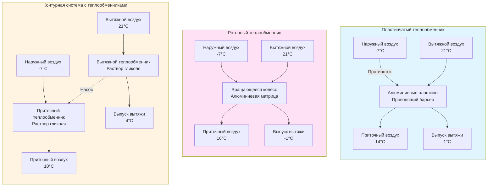

Системы рекуперации чувствительного тепла передают тепловую энергию между потоками вытяжного и приточного воздуха без обмена влагой. Эти устройства восстанавливают энергию отопления и охлаждения из вытяжного воздуха здания для предварительного кондиционирования входящего наружного вентиляционного воздуха, сокращая потребление энергии HVAC на 45-85% в зависимости от типа теплообменника и условий работы.

## Эффективность рекуперации чувствительного тепла

Эффективность рекуперации чувствительного тепла (εs) определяет долю доступной разности температур, восстанавливаемую теплообменником. Этот безразмерный параметр варьируется от 0 (отсутствие рекуперации) до 1,0 (полная рекуперация).

$$\varepsilon_s = \frac{T_{sa,leaving} - T_{oa,entering}}{T_{ea,entering} - T_{oa,entering}}$$

Где:
- Tsa,leaving = температура приточного воздуха на выходе теплообменника (°C)
- Toa,entering = температура наружного воздуха на входе теплообменника (°C)
- Tea,entering = температура вытяжного воздуха на входе теплообменника (°C)

В режиме отопления (зимняя эксплуатация) теплообменник с 75% эффективностью рекуперации, восстанавливающий тепло из вытяжного воздуха 21°C для предварительного кондиционирования наружного воздуха -7°C, обеспечивает:

$$T_{sa,leaving} = T_{oa,entering} + \varepsilon_s(T_{ea,entering} - T_{oa,entering})$$

$$T_{sa,leaving} = -7 + 0.75(21 - (-7)) = 14°C$$

Это повышение температуры на 21°C существенно снижает тепловую нагрузку отопления по сравнению с кондиционированием наружного воздуха с -7°C до температуры приточного воздуха.

## Основы теплопередачи

Скорость передачи чувствительного тепла через теплообменник подчиняется:

$$\dot{Q}_s = \dot{m} c_p \Delta T = \dot{m} c_p \varepsilon_s (T_{ea,entering} - T_{oa,entering})$$

Где:
- Q̇s = скорость передачи чувствительного тепла (кДж/ч)
- ṁ = массовый расход воздуха (кг/ч)
- cp = удельная теплоёмкость воздуха = 1.005 кДж/(кг·К)
- ΔT = изменение температуры наружного воздуха (°C)

При расходе воздуха 2360 CFM (4000 м³/ч) в стандартных условиях (ρ = 1.2 кг/м³):

$$\dot{m} = 4000 \times 1.2 = 4800 \text{ кг/ч}$$

При εs = 0,75 и разности температур 28°C:

$$\dot{Q}_s = 4800 \times 1.005 \times 0.75 \times 28 = 101,340 \text{ кДж/ч (28.1 кВт)}$$

Произведение UA (коэффициент теплопередачи умножить на площадь) определяет тепловые характеристики теплообменника:

$$UA = \frac{\dot{Q}_s}{LMTD}$$

Где LMTD — логарифмическая средняя разность температур между воздушными потоками.

## Технологии теплообменников чувствительного тепла

Три основных технологии доминируют в приложениях рекуперации чувствительного тепла, каждая с отличительными характеристиками работы и критериями выбора.

### Пластинчатые теплообменники

Алюминиевые или полимерные пластины образуют чередующиеся проходы для приточного и вытяжного воздушных потоков в противотоке или кроссток конфигурациях. Теплопередача через стенки пластин посредством проводимости осуществляет обмен чувствительной энергией между воздушными потоками без смешивания воздуха.

**Характеристики производительности:**
- Эффективность рекуперации: 50-85% (противоток превосходит кросток)
- Перепад давления: 25-67 Па
- Нулевое перекрёстное загрязнение между воздушными потоками
- Отсутствие движущихся частей, требующих обслуживания

**Конфигурации противотока и крос­тока:**

Противоточные схемы достигают более высокой эффективности, поскольку воздушные потоки текут в противоположных направлениях, поддерживая максимальную разность температур по всей длине теплообменника. Для сбалансированных потоков (равные расходы приточного и вытяжного воздуха):

$$\varepsilon_{s,counterflow} = \frac{1 - \exp[-NTU(1-C^*)]}{1 - C^* \exp[-NTU(1-C^*)]}$$

Для сбалансированных потоков, где C* = 1:

$$\varepsilon_{s,counterflow} = \frac{NTU}{1 + NTU}$$

Кросток конфигурации показывают более низкую эффективность из-за неоптимальных профилей температур:

$$\varepsilon_{s,crossflow} = 1 - \exp\left[\frac{NTU^{0.22}}{C^*}\left(\exp(-C^* \cdot NTU^{0.78}) - 1\right)\right]$$

Где NTU (Число единиц передачи) представляет параметр теплового размера теплообменника.

**Соображения по образованию иния:**

Когда влага вытяжного воздуха конденсируется и замерзает на холодных поверхностях наружного воздуха (наружный воздух ниже 0°C), накопление инея блокирует воздушный поток и снижает производительность. Стратегии оттаивания включают:
- Предварительный нагревательный регистр перед теплообменником
- Байпасные заслонки для временной остановки рекуперации тепла
- Рециркуляция вытяжного воздуха для нагрева потока наружного воздуха

### Роторные теплообменники

Вращающееся колесо с алюминиевой матрицей передаёт тепло по мере чередования между вытяжным и приточным воздушными потоками. Скорость вращения колеса обычно варьируется от 10-20 об/мин.

**Характеристики производительности:**
- Эффективность рекуперации: 65-85%
- Перепад давления: 42-84 Па
- Требует обслуживания двигателя, подшипников, приводной системы
- 1-3% перекрёстного загрязнения от переносимого воздуха в матрице колеса

Теплопередача осуществляется путём периодического нагревания и охлаждения материала вращающегося колеса. Колесо поглощает тепло из более теплого воздушного потока и отдаёт его в более холодный воздушный поток во время каждого оборота.

**Преимущества:**
- Высокая эффективность в широком диапазоне работы
- Компактные размеры относительно производительности
- Самоочищающееся действие снижает загрязнение
- Минимальное образование инея (непрерывное вращение предотвращает накопление льда)

**Ограничения:**
- Движущиеся части требуют регулярного обслуживания
- Перекрёстное загрязнение запрещает использование с опасной вытяжкой
- Более высокий перепад давления, чем у пластинчатого типа
- Необходима секция очистки для минимизации переноса

### Контурные системы с теплообменниками

Раствор гликоля циркулирует между оребрённо-трубчатыми теплообменниками в вытяжном и приточном воздушных потоках, передавая чувствительное тепло через циркуляционный контур жидкости. Типовая концентрация гликоля: 25-40% для защиты от замерзания.

**Характеристики производительности:**
- Эффективность рекуперации: 45-65%
- Перепад давления: 34-76 Па на теплообменнике
- Энергетический расход насоса: 0.5-2.0 кВт в зависимости от размера системы
- Нулевое перекрёстное загрязнение

Эффективность теплопередачи зависит от площади поверхности теплообменника, расхода гликоля и подхода температур:

$$\varepsilon_s = \frac{1}{\frac{1}{\varepsilon_{coil,supply}} + \frac{1}{\varepsilon_{coil,exhaust}} - 1}$$

**Критическое преимущество:**

Контурные теплообменники обеспечивают рекуперацию энергии, когда вытяжные и приточные воздуховоды не могут быть расположены смежно. Трубопроводы гликоля могут простираться на сотни метров между теплообменниками, обеспечивая гибкость, невозможную с пластинчатыми или роторными теплообменниками.

**Критерии выбора:**
- Вытяжные и приточные воздуховоды разделены расстоянием или барьерами
- Перекрёстное загрязнение абсолютно запрещено (здравоохранение, лаборатории)
- Существующие здания, где добавление протоковых теплообменников непрактично

## Методы тестирования ASHRAE Standard 84

ASHRAE Standard 84 "Метод тестирования воздухо-воздушных теплообменников" устанавливает стандартизированные процедуры тестирования производительности для всех устройств рекуперации тепла.

**Условия испытания:**

Условия стандартного рейтинга проверяют производительность при:
- Зима: -18°C наружный воздух, 21°C вытяжной воздух
- Лето: 35°C наружный воздух, 24°C вытяжной воздух
- Сбалансированные расходы воздуха (равные CFM приточного и вытяжного)

**Измеряемые параметры:**
1. Расходы воздуха (стороны приточного и вытяжного воздуха)
2. Температуры сухого термометра входа и выхода (четыре измерения)
3. Температуры влажного термометра входа и выхода (четыре измерения)
4. Статический перепад давления через каждую сторону
5. Энергопотребление вспомогательного оборудования (вентиляторы, насосы, двигатели)

**Расчёт эффективности согласно Standard 84:**

Эффективность рекуперации использует только сухие температуры:

$$\varepsilon_s = \frac{T_{1,out} - T_{1,in}}{T_{2,in} - T_{1,in}}$$

Где индекс 1 обозначает воздушный поток с минимальной теплоёмкостью (ṁcp)min.

**Тестирование накопления инея:**

Standard 84 включает протоколы тестирования инея для приложений холодного климата:
- Непрерывная работа при -10°C наружном воздухе, 21°C, 50% относительной влажности вытяжного воздуха
- Мониторинг увеличения перепада давления, указывающего на накопление инея
- Проверка работы управления оттаиванием и времени восстановления

## Расчёты экономии энергии

**Пример приложения:** офисное здание в климатической зоне 5A, требующее 8000 CFM (13600 м³/ч) наружного воздуха.

**Анализ сезона зимнего отопления:**

Расчётные условия:
- Наружный воздух: -18°C
- Вытяжной воздух: 21°C
- Пластинчатый HRV: εs = 0,75
- Часы работы: 2500 часов/год сезон отопления

Повышение температуры через HRV:

$$\Delta T = 0.75 \times (21 - (-18)) = 29.3°C$$

Скорость восстановления энергии отопления:

$$\dot{Q}_{recovered} = 0.34 \times CFM \times \Delta T = 0.34 \times 8000 \times 29.3 = 79,672 \text{ кДж/ч}$$

Годовая экономия энергии отопления (при условии эффективности котла 80%):

$$E_{saved} = \frac{79,672 \times 2500}{0.80} = 248,975 \text{ МДж/год} = 69 \text{ ГДж/год}$$

При цене 8 руб/МДж: **Годовая экономия = 1,992,000 руб.**

**Анализ сезона летнего охлаждения:**

Расчётные условия:
- Наружный воздух: 35°C
- Вытяжной воздух: 24°C
- Часы работы: 1500 часов/год сезон охлаждения

Снижение температуры через HRV:

$$\Delta T = 0.75 \times (35 - 24) = 8.3°C$$

Скорость восстановления энергии охлаждения:

$$\dot{Q}_{recovered} = 0.34 \times 8000 \times 8.3 = 22,544 \text{ кДж/ч (6.3 кВт)}$$

Годовая экономия энергии охлаждения (при условии EER = 10):

$$E_{saved} = \frac{22,544 \times 1500}{10} = 3,381,600 \text{ кДж/год} = 0.94 \text{ МВт·ч/год}$$

При цене 8 руб/кВт·ч: **Годовая экономия = 75,200 руб.**

**Общая годовая экономия затрат на энергию: 2,067,200 руб.**

При типовой стоимости установки 2,400,000-3,600,000 руб. для этого размера системы, простой период окупаемости составляет 1.2-1.7 года, демонстрируя сильную экономическую целесообразность.

## Заключение

Системы рекуперации чувствительного тепла обеспечивают существенную экономию энергии для приложений с интенсивной вентиляцией. Пластинчатые теплообменники обеспечивают эксплуатацию без обслуживания с нулевым перекрёстным загрязнением, роторные колёса достигают наивысшей эффективности в компактных конфигурациях, а контурные теплообменники обеспечивают рекуперацию там, где близость воздуховодов препятствует использованию других технологий. Тестирование ASHRAE Standard 84 обеспечивает проверку производительности, а расчёты экономии энергии демонстрируют быструю окупаемость в большинстве коммерческих приложений. Выбирайте технологию на основе допустимости перекрёстного загрязнения, возможностей обслуживания, пространственных ограничений и условий работы, специфичных для климата.
