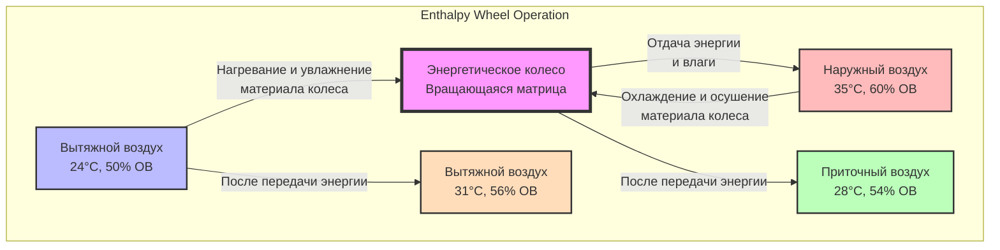
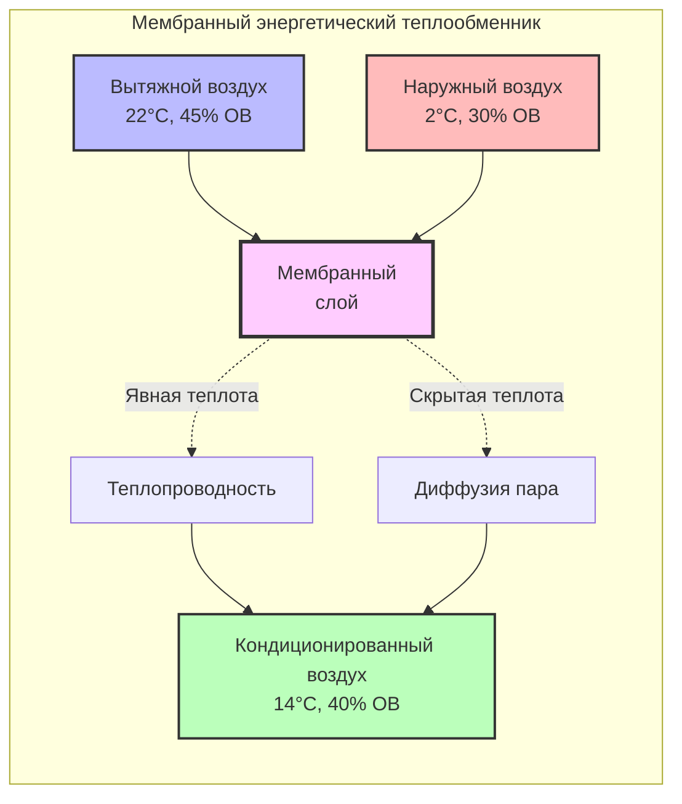

# Полная рекуперация энергии: передача явной и скрытой теплоты

Системы полной рекуперации энергии (ПРЭ) восстанавливают как явную теплоту, так и скрытую теплоту (влагу) из потоков вытяжного воздуха, максимизируя энергоэффективность вентиляционных приложений. В отличие от рекуперации только явной теплоты, системы ПРЭ передают энтальпию, снижая как нагрузки на отопление/охлаждение, так и требования к увлажнению/осушению.

## Фундаментальные принципы

### Механизм передачи энтальпии

Полная рекуперация энергии работает на основе одновременной передачи теплоты и влаги. Когда два потока воздуха с различными температурами и влагосодержанием проходят через устройство ПРЭ, передача энергии происходит в двух формах:

**Передача явной теплоты** следует разности температур:
$$Q_s = \dot{m} \cdot c_p \cdot (T_1 - T_2)$$

**Передача скрытой теплоты** следует разности содержания влаги:
$$Q_l = \dot{m} \cdot h_{fg} \cdot (W_1 - W_2)$$

где $\dot{m}$ — массовый расход воздуха, $c_p$ — удельная теплоёмкость воздуха, $h_{fg}$ — скрытая теплота испарения (приблизительно 2465 кДж/кг), и $W$ — влагосодержание.

**Передача полной энтальпии** объединяет оба компонента:
$$Q_t = \dot{m} \cdot (h_1 - h_2)$$

где $h$ представляет удельную энтальпию потока влажного воздуха.

### Полная эффективность

Согласно ASHRAE Standard 84-2020, полная эффективность определяет способность устройства передавать энтальпию между потоками воздуха:

$$\varepsilon_t = \frac{h_{supply,out} - h_{outdoor}}{h_{exhaust,in} - h_{outdoor}}$$

Это можно разложить на компоненты явной и скрытой теплоты:

$$\varepsilon_t = \frac{\varepsilon_s \cdot c_p \cdot (T_{exh} - T_{oa}) + \varepsilon_l \cdot h_{fg} \cdot (W_{exh} - W_{oa})}{h_{exh} - h_{oa}}$$

Типичные значения полной эффективности находятся в диапазоне от 60% до 85% для коммерчески доступных систем.

## Технологии полной рекуперации энергии

### Энергетические колеса (энтальпийные колеса)

Энергетические колеса состоят из вращающихся матриц гигроскопических материалов, которые поглощают и отдают как теплоту, так и влагу.

**Характеристики конструкции:**
- Десикантное покрытие из алюминия или синтетического материала
- Скорость вращения: 10-20 об/мин типично
- Глубина матрицы: 200-500 мм
- Диаметр колеса: 0,6-4,0 м

**Параметры производительности:**
- Полная эффективность: 70-85%
- Эффективность явной теплоты: 75-90%
- Эффективность скрытой теплоты: 50-75%
- Перепад давления: 100-300 Па

**Контроль перекрестного загрязнения:**
Энергетические колеса естественным образом позволяют минимальную передачу воздуха между потоками (обычно 1-5%). Секции очистки могут снизить утечку менее чем до 1%.

### Мембранные энергетические теплообменники

Секционные или противоточные мембранные теплообменники используют полупроницаемые материалы, которые позволяют передачу водяного пара при предотвращении смешивания воздуха.

**Типы мембран:**

1. **Полимерные мембраны** — полиэтилен, полипропилен с молекулярными сетами
2. **Обработанная бумага** — целлюлозные гигроскопические материалы
3. **Синтетические композиты** — многослойные инженерные материалы

**Принципы работы:**

**Характеристики производительности:**
- Полная эффективность: 60-75%
- Нулевое перекрестное загрязнение (полное разделение)
- Отсутствие движущихся частей (высокая надёжность)
- Перепад давления: 75-200 Па
- Требует периодической очистки

### Системы с повышенной содикацией

Передовые системы включают жидкие или твёрдые десиканты для повышения пропускной способности влаги, особенно ценны в климатических условиях с высокой влажностью.

**Типы конфигурации:**

1. **Вращающиеся десикантные колеса** с улучшенными гигроскопическими покрытиями (силикагель, молекулярные сита, хлорид лития)
2. **Жидкостные десикантные контуры** с использованием растворов хлорида лития или хлорида кальция
3. **Гибридные мембранно-десикантные** системы, объединяющие технологии

**Повышенное удаление влаги:**
Десикантные системы достигают эффективности скрытой теплоты, превышающей 80%, по сравнению с 50-70% для стандартных энергетических колёс.

## Производительность в зависимости от климата

### Климаты с преобладанием охлаждения

В жарко-влажных условиях (Майами, Хьюстон) полная рекуперация энергии значительно снижает нагрузки на осушение:

$$Q_{total,saved} = \dot{V} \cdot \rho \cdot (h_{oa} - h_{supply}) \cdot \varepsilon_t$$

Пример летних расчётных условий (1000 CFM (1699 м³/ч)):
- Наружный воздух: 35°C, 70% ОВ (h = 108 кДж/кг)
- Вытяжной воздух: 24°C, 50% ОВ (h = 66 кДж/кг)
- При 75% полной эффективности: приточный воздух при 27°C, 58% ОВ (h = 76 кДж/кг)
- Восстановленная энергия: 30 кВт

### Климаты с преобладанием отопления

В холодных-сухих условиях (Миннеаполис, Калгари) ПРЭ предотвращает чрезмерную потерю влаги в помещении:

Пример зимних расчётных условий (1000 CFM (1699 м³/ч)):
- Наружный воздух: -18°C, 60% ОВ (h = 2,1 кДж/кг)
- Вытяжной воздух: 21°C, 30% ОВ (h = 45,8 кДж/кг)
- При 75% полной эффективности: приточный воздух при 13°C, 32% ОВ (h = 36,2 кДж/кг)
- Восстановленная энергия: 32 кВт

### Смешанные климаты

Круглогодичная работа в умеренных климатических условиях (Сан-Франциско, Сиэтл) требует обводных заслонок или модулирующих элементов управления для предотвращения чрезмерного восстановления во время мягких условий.

## Стандарты ASHRAE и требования кодекса

### ASHRAE Standard 84-2020

Устанавливает процедуры испытания и рейтинга для воздухо-воздушных теплообменников:

**Условия испытания:**
- Сбалансированный расход (приточный CFM = вытяжной CFM)
- Стандартные расходы воздуха: 500, 1000, 2000 CFM на испытание
- Несколько комбинаций температуры/влажности
- Испытание на накопление инея для полной рекуперации энергии

**Сообщаемые данные о производительности:**
- Эффективность явной теплоты ($\varepsilon_s$)
- Эффективность скрытой теплоты ($\varepsilon_l$)
- Полная эффективность ($\varepsilon_t$)
- Перепад давления для приточных и вытяжных потоков
- Процент перекрестного загрязнения

### Требования ASHRAE Standard 90.1-2022

**Раздел 6.5.6.1** требует рекуперации энергии для систем, соответствующих определённым критериям:

| Климатическая зона | Проектное поступление наружного воздуха | Часы работы системы |
|-----|--------|------|
| 1-2 (Жаркий) | ≥ 5000 CFM | ≥ 8000 ч/год |
| 3-4 (Умеренный) | ≥ 5000 CFM | ≥ 8000 ч/год |
| 5-8 (Холодный) | ≥ 3000 CFM | ≥ 8000 ч/год |

**Требования минимальной эффективности:**
- Полная эффективность ≥ 50% во всех климатических зонах
- Повышенные требования для более крупных систем (60% для систем ≥ 20000 CFM)

**Исключения:**
- Лабораторные вытяжные шкафы с опасными выбросами
- Системы, обслуживающие помещения с высокими уровнями твёрдых частиц
- Приложения, где доля наружного воздуха превышает 70%

## Рассмотрения при выборе системы

### Факторы, зависящие от приложения

**Энергетические колеса предпочтительны для:**
- Высоких требований к эффективности (75-85%)
- Сбалансированных нагрузок явной/скрытой теплоты
- Коммерческих офисных зданий, школ

**Мембранные теплообменники предпочтительны для:**
- Чувствительных приложений, требующих нулевого перекрестного загрязнения
- Больниц, лабораторий, предприятий пищевой промышленности
- Потоков вытяжного воздуха с коррозивными свойствами

**Десикантные системы предпочтительны для:**
- Влажных климатов (прибрежные, тропические)
- Приложений, требующих глубокого осушения
- Крытых бассейнов, спа-салонов, музеев

### Экономический анализ

Период окупаемости зависит от:
- Часов работы в год
- Доли наружного воздуха
- Местных тарифов на электроэнергию
- Суровости климата

$$\text{Простой период окупаемости (лет)} = \frac{\text{Стоимость установки}}{\text{Годовая экономия энергии} - \text{Годовое обслуживание}}$$

Типичные установленные затраты варьируются от 1,50 до 3,50 USD за CFM для коммерческих приложений.

## Обслуживание и долговечность

### Обслуживание энергетического колеса

- **Проверка механизма вращения:** Ежеквартально
- **Очистка матрицы колеса:** Ежегодно или раз в два года
- **Проверка натяжения ремня и двигателя привода:** Ежеквартально
- **Замена десикантного покрытия:** Типичный срок службы 10-15 лет

### Обслуживание мембранного теплообменника

- **Проверка на засорение:** Ежеквартально
- **Очистка мембранных поверхностей:** Ежегодно (промывка под давлением или химическая очистка)
- **Проверка прокладок и уплотнений:** Ежегодно
- **Замена мембранных сердечников:** Типичный срок службы 15-20 лет

Надлежащее обслуживание обеспечивает поддержание эффективности на протяжении всего жизненного цикла оборудования, максимизируя возврат инвестиций для систем полной рекуперации энергии.
