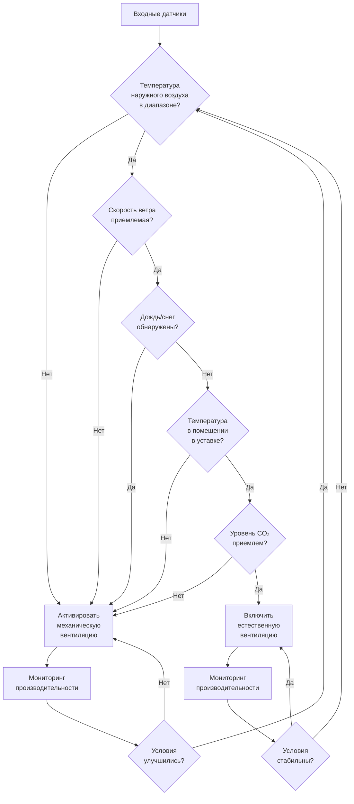

## Обзор

Гибридные или смешанные системы вентиляции объединяют стратегии естественной и механической вентиляции для оптимизации энергоэффективности при сохранении качества воздуха в помещении и теплового комфорта. Эти системы используют естественные движущие силы — ветровое давление и плавучесть — когда условия позволяют, и активируют механические системы, когда естественная вентиляция оказывается недостаточной.

Стандарт ASHRAE 62.1 признает гибридную вентиляцию жизнеспособной стратегией для обеспечения требуемых расходов наружного воздуха при условии надлежащего управления, обеспечивающего адекватные расходы вентиляции при всех режимах работы.

## Основные режимы работы

Гибридная вентиляция работает в трех отдельных конфигурациях:

### Режим переключения

Система переключается между полностью естественной и полностью механической вентиляцией в зависимости от условий наружного воздуха. В любой момент времени функционирует только один режим во всем здании.

**Логика принятия решения управления:**

$$
\text{Режим} =
\begin{cases}
\text{Естественная} & \text{если } T_{\text{нар}} \in [T_{\text{мин}}, T_{\text{макс}}] \land W < W_{\text{макс}} \land \text{Дождь} = \text{нет} \\
\text{Механическая} & \text{в противном случае}
\end{cases}
$$

где $T_{\text{нар}}$ — температура наружного воздуха, $W$ — скорость ветра, а диапазон температур $[T_{\text{мин}}, T_{\text{макс}}]$ определяет зону комфорта естественной вентиляции.

### Параллельный режим

Естественная и механическая вентиляция работают одновременно. Механические системы обеспечивают базовую вентиляцию, а открываемые окна или воздушные проемы дополняют поток воздуха и обеспечивают контроль для пользователей.

Общий расход вентиляции:

$$
\dot{V}_{\text{итого}} = \dot{V}_{\text{мех}} + \dot{V}_{\text{нат}}
$$

где $\dot{V}_{\text{мех}}$ — механический расход воздуха, а $\dot{V}_{\text{нат}}$ — вклад естественной вентиляции.

### Зональный режим

Различные зоны здания используют различные стратегии вентиляции в зависимости от локальных условий, занятости или тепловых нагрузок. Внутренние зоны обычно используют механическую вентиляцию, а периметральные зоны используют естественную вентиляцию при благоприятных условиях.

## Движущие силы естественной вентиляции

Эффективность гибридных систем зависит от понимания физики естественной вентиляции.

### Тепловой подпор

Конвективный поток, обусловленный различиями температур:

$$
\Delta P_{\text{подпор}} = \rho_{\text{нар}} g h \left( 1 - \frac{T_{\text{нар}}}{T_{\text{внут}}} \right)
$$

где:
- $\rho_{\text{нар}}$ = плотность наружного воздуха (кг/м³)
- $g$ = ускорение свободного падения (9,81 м/с²)
- $h$ = разность высот между проемами (м)
- $T_{\text{нар}}$, $T_{\text{внут}}$ = абсолютные температуры (К)

### Ветровое давление

Коэффициенты давления на поверхности определяют разность давления, вызванную ветром:

$$
\Delta P_{\text{ветер}} = C_p \cdot \frac{1}{2} \rho v_{\text{отн}}^2
$$

где $C_p$ — коэффициент давления (безразмерный), $\rho$ — плотность воздуха, $v_{\text{отн}}$ — расчетная скорость ветра на высоте здания.

Комбинированные движущие силы дают общую разность давления:

$$
\Delta P_{\text{итого}} = \Delta P_{\text{подпор}} + \Delta P_{\text{ветер}}
$$

## Стратегии управления

### Критерии переключения

Эффективное управление требует нескольких входных сигналов датчиков:

| Параметр | Диапазон естественного режима | Триггер механического режима |
|----------|------------------------------|------------------------------|
| Температура наружного воздуха | 15–25°C | За пределами диапазона |
| Скорость ветра | < 6 м/с | Избыточный ветер |
| Осадки | Сухие условия | Дождь/снег обнаружены |
| CO₂ в помещении | < 1000 ppm | Повышенные уровни |
| Температура в помещении | В пределах ±1°C уставки | Отклонение > 1°C |
| Качество наружного воздуха | AQI < 100 | Низкое качество воздуха |

### Управление мертвой зоной

Предотвращение частого переключения режимов с помощью температурных мертвых зон:

$$
\text{Переключиться на механический режим при: } T_{\text{внут}} > T_{\text{уст}} + \Delta T_{\text{мз}}
$$

$$
\text{Переключиться на естественный режим при: } T_{\text{внут}} < T_{\text{уст}} - \Delta T_{\text{мз}}
$$

Типичная мертвая зона $\Delta T_{\text{мз}} = 1,0–2,0°C$ предотвращает колебания между режимами.

## Рассмотрения при проектировании

### Расчет размеров проемов

Проемы естественной вентиляции должны обеспечивать адекватную эффективную площадь:

$$
A_{\text{эфф}} = \frac{\dot{V}_{\text{треб}}}{C_d \sqrt{2 \Delta P / \rho}}
$$

где:
- $A_{\text{эфф}}$ = эффективная площадь проема (м²)
- $\dot{V}_{\text{треб}}$ = требуемый расход вентиляции (м³/с)
- $C_d$ = коэффициент расхода (0,60–0,65 типично)
- $\Delta P$ = разность давления на проеме (Па)

### Интеграция тепловой массы

Высокая тепловая масса замедляет реакцию температуры в помещении, продлевая часы естественной вентиляции. Ночное охлаждение с использованием естественной вентиляции заряжает тепловую массу для дневного охлаждения:

$$
Q_{\text{накопл}} = \rho c_p V (T_{\text{день}} - T_{\text{ночь}})
$$

где $V$ — эффективный объем тепловой массы.

## Сравнение производительности

| Аспект | Чисто механическая | Гибридная система | Чисто естественная |
|--------|-------------------|-------------------|-------------------|
| Использование энергии | Максимальное | Снижение на 30–60% | Минимальное |
| Точность управления | Отличная | Хорошая | Ограниченная |
| Взаимодействие с пользователем | Отсутствует | Умеренное | Высокое |
| Начальная стоимость | Средняя | Максимальная | Минимальная |
| Согласованность комфорта | Отличная | Хорошая | Переменная |
| Применимые климаты | Все | Умеренные | Ограниченные |

## Пригодность применения

Гибридная вентиляция работает оптимально в:

- **Климатических зонах** с существенными переходными сезонами (климатические зоны ASHRAE 3–5)
- **Типах зданий** с переменной занятостью (офисы, школы, лаборатории)
- **Периметральных зонах** с доступом к фасадам и открываемым элементам
- **Низкоэтажных конструкциях**, где тепловой подпор может быть эффективно использован
- **Объектах** с благоприятными ветровыми условиями и минимальным шумом/загрязнением

## Соответствие нормативно-правовым документам

ASHRAE 62.1 требует, чтобы когда естественная вентиляция обеспечивает требуемый наружный воздух:

- Площадь проемов ≥ 4% площади чистого занимаемого этажа
- Проемы не менее чем на двух стенах или с разностью высот
- Непрерывный мониторинг или управление демонстрирует соответствие
- Процедуры документируют фактические расходы вентиляции в проектных условиях

Для гибридных систем механическое резервирование должно активироваться, когда естественная вентиляция не может обеспечить минимальные требования:

$$
\dot{V}_{\text{мех}} \geq \dot{V}_{\text{мин,ASHRAE}} - \dot{V}_{\text{нат,проверен}}
$$

## Потенциал экономии энергии

Правильно спроектированные гибридные системы достигают значительных сокращений энергии:

$$
\text{Экономия энергии} = \frac{E_{\text{мех}} - E_{\text{гибрид}}}{E_{\text{мех}}} \times 100\%
$$

Полевые исследования демонстрируют экономию энергии вентилятора на 30–60% в умеренных климатах, с общим сокращением энергии HVAC на 15–40% в зависимости от климата и типа здания.

## Требования к комиссионированию

Проверочные испытания должны подтвердить:

- Расходы воздуха естественной вентиляции при репрезентативных условиях
- Правильное выполнение последовательностей управления при переходах режимов
- Блокировки предотвращают одновременное отопление/охлаждение при естественной вентиляции
- Калибровка датчиков и точность размещения
- Функциональность пользовательского интерфейса и возможности переопределения
- Интеграция метеостанции и надежность данных

Функциональное испытание производительности согласно ASHRAE Guideline 0 подтверждает, что система работает как спроектировано во всех прогнозируемых сценариях эксплуатации.

---

**Ссылки:**
- ASHRAE Standard 62.1: Вентиляция для приемлемого качества воздуха в помещении
- ASHRAE Guideline 0: Процесс комиссионирования
- CIBSE AM13: Смешанная вентиляция
- ASHRAE Fundamentals Handbook, Глава 16: Вентиляция и инфильтрация
