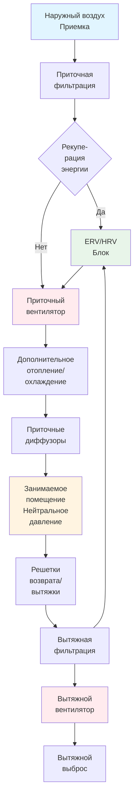

## Основы механической вентиляции

Механическая вентиляция использует вентиляторы для принудительного движения воздуха через здания, обеспечивая контролируемую подачу наружного воздуха независимо от погодных условий и характеристик ограждающей конструкции здания. Эти системы обеспечивают надежное качество воздуха в помещении, позволяя осуществлять точное управление давлением и интеграцию с оборудованием отопления и охлаждения.

Три основные стратегии механической вентиляции различаются по направлению воздушного потока и управлению давлением:

- **Системы только приточные**: Нагнетают наружный воздух в помещения, создавая положительное давление
- **Системы только вытяжные**: Удаляют воздух из помещений, создавая отрицательное давление и инфильтрацию
- **Сбалансированные системы**: Одновременно подают и удаляют равные объемы воздуха, поддерживая нейтральное давление

## Требования стандарта ASHRAE 62.1 к вентиляции

ASHRAE 62.1 устанавливает минимальные скорости вентиляции через Процедуру вентиляции (VRP). Требование к наружному воздуху зоны объединяет компоненты, основанные на количестве людей и площади помещения:

$$V_{oz} = R_p \cdot P_z + R_a \cdot A_z$$

**Параметры:**
- $V_{oz}$ = требуемый расход наружного воздуха для зоны (м³/ч)
- $R_p$ = скорость подачи наружного воздуха на человека (м³/(ч·чел)), типично 8,5-17 м³/(ч·чел)
- $P_z$ = численность населения зоны (проектная или стандартная плотность людей)
- $R_a$ = скорость подачи наружного воздуха на единицу площади (м³/(ч·м²)), типично 0,65-1,3 м³/(ч·м²)
- $A_z$ = площадь пола зоны (м²)

Для многозональных систем общее поступление наружного воздуха должно учитывать эффективность вентиляции:

$$V_{ot} = \frac{\sum_{all\ zones} V_{oz} / E_z}{E_v}$$

Где:
- $E_z$ = эффективность распределения воздуха в зоне (0,8 для потолочной подачи, 1,2 для вытеснения)
- $E_v$ = эффективность вентиляции системы (0,6-1,0 в зависимости от типа системы и разнообразия зон)

## Расчеты кратности воздухообмена

Кратность воздухообмена выражает вентиляцию как количество обменов объема пространства в час:

$$ACH = \frac{Q \cdot 60}{V}$$

**Где:**
- $ACH$ = кратность воздухообмена (ч⁻¹)
- $Q$ = объемный расход (м³/ч)
- $V$ = объем помещения (м³)

Преобразование требуемой кратности воздухообмена в расход:

$$Q = \frac{ACH \cdot V}{60}$$

Для жилых применений согласно ASHRAE 62.2 минимальный постоянный расход вентилятора:

$$Q_{fan} = 0,032 \cdot A_{floor} + 0,008 \cdot (N_{br} + 1) \cdot A_{floor}$$

Где $A_{floor}$ — кондиционируемая площадь пола (м²) и $N_{br}$ — количество спален.

## Системы приточной вентиляции

Приточная механическая вентиляция вводит наружный воздух через вентиляторы, создавая положительное давление в здании, которое снижает инфильтрацию. Наружный воздух проходит через фильтрацию и дополнительную обработку перед распределением.

**Ключевые аспекты проектирования:**

1. **Место приемки**: Минимум 7,6 м от источников загрязнения, 3 м выше уровня земли
2. **Фильтрация**: Минимум MERV 8, MERV 13+ для улучшенного контроля частиц
3. **Распределение**: Высокие боковые или потолочные диффузоры для эффективного перемешивания
4. **Путь сброса**: Достаточная свободная площадь для выхода воздуха без чрезмерного повышения давления

**Преимущества:**
- Предотвращает инфильтрацию некондиционированного воздуха
- Централизует фильтрацию в одной точке приемки
- Позволяет предварительную обработку наружного воздуха
- Подходит для герметичных ограждающих конструкций зданий

**Ограничения:**
- Потенциальное накопление влаги в полостях ограждающей конструкции в период охлаждения
- Более высокое энергопотребление, если наружный воздух требует полной обработки
- Сложность поддержания равномерного давления в больших или разделенных зданиях

## Системы вытяжной вентиляции

Системы только вытяжные механически удаляют внутренний воздух, создавая отрицательное давление, которое вытягивает наружный воздух через отверстия в ограждающей конструкции и намеренные пассивные приемки.

**Применение:**
- Жилая вентиляция ванных комнат и кухни
- Объекты, требующие локализации загрязнения (туалеты, лаборатории)
- Промышленные помещения с генерацией тепла или загрязняющих веществ
- Автостоянки с управлением CO

**Требования проектирования:**

Скорость вытяжки для общего разбавления:

$$Q_{exhaust} = \frac{G \cdot 10^6}{C_{max} - C_{ambient}}$$

Где:
- $G$ = скорость генерации загрязняющего вещества (кг/с или кг/ч)
- $C_{max}$ = максимально допустимая концентрация (ppm)
- $C_{ambient}$ = наружная концентрация (ppm)

**Преимущества:**
- Предотвращает миграцию загрязняющих веществ в соседние помещения
- Простая установка с минимальными воздуховодами
- Нет риска летней конденсации в полостях ограждающей конструкции
- Более низкая первоначальная стоимость, чем приточные или сбалансированные системы

**Ограничения:**
- Нет контроля качества наружного воздуха (поступает без фильтрации)
- Невозможность предварительной обработки наружного воздуха
- Увеличенные нагрузки инфильтрации в зимний период
- Потенциальный обратный поток из устройств сгорания

## Системы сбалансированной вентиляции

Сбалансированные системы обеспечивают равные расходы приточного и вытяжного воздуха, поддерживая нейтральное давление в здании, позволяя полностью контролировать как поступающий, так и выходящий воздушные потоки.

**Конфигурации системы:**

| Конфигурация | Приточный вентилятор | Вытяжной вентилятор | Рекупе­рация энергии | Применение |
|--------------|------------|-------------|-----------------|-------------|
| Простая сбалансированная | Да | Да | Нет | Мягкий климат, низкие энергозатраты |
| Система HRV | Да | Да | Только явная | Холодный климат, низкие скрытые нагрузки |
| Система ERV | Да | Да | Явная + скрытая | Жаркий-влажный и холодный климаты |
| DOAS | Да | Да | Обычно включена | Все климаты, высокая производительность |

**Точность управления давлением:**

Разность давления между приточной и вытяжной:

$$\Delta P = P_{static,supply} - P_{static,exhaust}$$

Цель: $|\Delta P| < 5,0$ Па для нейтрального давления

**Преимущества:**
- Полный контроль качества наружного воздуха (фильтрация, обработка)
- Нет влияния на давление в ограждающей конструкции здания
- Наивысший потенциал рекупе­рации энергии (50-80% эффективность)
- Независимое управление местами подачи и вытяжки
- Подходит для всех климатов и типов зданий

**Ограничения:**
- Наивысшая стоимость и сложность установки
- Требует балансировки расходов приточного и вытяжного воздуха
- Два вентиляторных агрегата повышают требования к обслуживанию
- Рекупе­рация энергии добавляет потери давления и требования к обслуживанию теплообменника

## Мощность вентилятора и расчеты энергии

Мощность вентилятора механической вентиляции зависит от расхода и полного напора:

$$P_{fan} = \frac{Q \cdot \Delta P_{total}}{1000 \cdot \eta_{fan} \cdot \eta_{motor}}$$

**Где:**
- $P_{fan}$ = мощность на валу (кВт)
- $Q$ = расход воздуха (м³/ч)
- $\Delta P_{total}$ = полное повышение давления (Па)
- $\eta_{fan}$ = полная эффективность вентилятора (0,50-0,80)
- $\eta_{motor}$ = эффективность двигателя (0,85-0,95)

Полное повышение давления включает все сопротивления системы:

$$\Delta P_{total} = \Delta P_{filters} + \Delta P_{coils} + \Delta P_{ERV} + \Delta P_{ductwork}$$

**Типичные потери давления:**
- Фильтры: 25-125 Па (чистые к загрязненным)
- Нагревательные/охлаждающие коили: 50-125 Па
- Блок ERV/HRV: 75-200 Па
- Воздуховоды: 0,8-1,5 Па на метр эквивалентной длины

Годовое энергопотребление вентилятора:

$$E_{annual} = P_{fan} \cdot t_{operating} \cdot k$$

Где:
- $E_{annual}$ = годовая энергия (кВч)
- $t_{operating}$ = годовые часы работы
- $k$ = коэффициент частичной нагрузки (0,7-0,9 для постоянной работы)

## Сравнение типов систем

| Параметр | Только приточная | Только вытяжная | Сбалансированная | Сбалансиров. + ERV |
|-----------|-------------|--------------|----------|----------------|
| Первоначальная стоимость | $ | $ | $$ | $$$ |
| Эксплуатационная стоимость | Средняя | Низко-средняя | Средне-высокая | Низко-средняя |
| Управление фильтрацией | Отличное | Отсутствует | Отличное | Отличное |
| Управление давлением | Положительное | Отрицательное | Нейтральное | Нейтральное |
| Рекупе­рация энергии | Отсутствует | Отсутствует | Дополнительно | Интегрирована |
| Управление влажностью | Ограниченное | Отсутствует | Хорошее | Отличное |
| Подходимость климату | Холодный/Сухой | Жаркий/Влажный | Все | Все |
| Сложность установки | Средняя | Низкая | Высокая | Высокая |

## Соображения энергоэффективности

Потребление энергии вентиляцией состоит из мощности вентилятора и нагрузок обработки:

**Явная нагрузка нагревания/охлаждения:**

$$Q_{sensible} = 0,34 \cdot Q \cdot \Delta T$$

Где:
- $Q$ = расход воздуха (м³/ч)
- $\Delta T$ = разность температур между наружным и подаваемым воздухом (°C)

**Скрытая нагрузка охлаждения:**

$$Q_{latent} = 0,83 \cdot Q \cdot \Delta W$$

Где $\Delta W$ = разность влагосодержания (кг/кг)

**Эффективность рекупе­рации энергии:**

Явная эффективность:

$$\varepsilon_{sensible} = \frac{T_{supply} - T_{outdoor}}{T_{exhaust} - T_{outdoor}}$$

Полная эффективность (включая скрытую):

$$\varepsilon_{total} = \frac{h_{supply} - h_{outdoor}}{h_{exhaust} - h_{outdoor}}$$

Где $h$ представляет энтальпию (кДж/кг).

**Стратегии оптимизации:**

1. **Управление переменной скоростью**: Снижение скорости вентилятора в условиях частичной нагрузки ($P_{fan} \propto Q^3$)
2. **Вентиляция по требованию**: Модуляция наружного воздуха на основе занятости или уровней CO₂
3. **Рекупе­рация энергии**: Установка ERV/HRV в климатах с >1000 градусо-дней отопления или >800 градусо-дней охлаждения
4. **Интеграция с фреон-системой**: Обход рекупе­рации энергии при условиях наружного воздуха, благоприятствующих бесплатному охлаждению
5. **Высокоэффективные компоненты**: Выбор вентиляторов с полной эффективностью >65%, двигателей с классом эффективности Premium
6. **Снижение потерь давления**: Минимизация сопротивления системы через надлежащую калибровку (скорость воздуха в основных каналах <6 м/с)

## Лучшие практики проектирования

1. **Выбор системы**: Выбирать сбалансированные системы с рекупе­рацией энергии для зданий, требующих >476 м³/ч наружного воздуха в суровых климатах

2. **Калибровка вентилятора**: Включить 10-15% запас выше рассчитанной потери давления для фильтрации нагрузки и системных эффектов

3. **Измерение расхода воздуха**: Установить станции измерения расхода воздуха на приемках наружного воздуха (матрицы усреднения скорости или сетки потока)

4. **Интеграция управления**: Программировать BAS для поддержания минимальной вентиляции при всех условиях работы, включая разогрев и отвод

5. **Наладка**: Проверить расходы наружного воздуха при проектных и частичных нагрузках, измерить отношения давления между зонами

6. **Доступ для обслуживания**: Обеспечить достаточный зазор для замены фильтра (минимум 0,6 м) и проверки коилей

7. **Защита приемки**: Установить погодные жалюзи с скоростью свободной площади 1,5-2,5 м/с, сетки защиты от птиц и дренажные поддоны

8. **Выброс вытяжки**: Расположить выбросы минимум 3 м над смежными поверхностями крыши, направить в стороне от приемок и границ участков

Эти принципы механической вентиляции позволяют проектировать системы, которые надежно доставляют требуемый наружный воздух, минимизируя энергопотребление и поддерживая надлежащие отношения давления по всему зданию.
