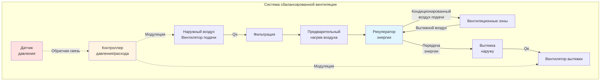

# Системы сбалансированной механической вентиляции

Системы сбалансированной механической вентиляции поддерживают нейтральное или контролируемое давление в здании путем обеспечения равного или пропорционального расхода воздуха подачи и вытяжки. Такой подход обеспечивает точное управление давлением в здании, контролем загрязнений и возможностями рекуперации энергии, обеспечивая надлежащую подачу наружного воздуха в соответствии со стандартом ASHRAE 62.1.

## Фундаментальные принципы

Система сбалансированной вентиляции работает на основе принципа, согласно которому **чистый расход воздуха равен нулю** (или контролируемому смещению) для поддержания желаемого соотношения давлений в здании. Система одновременно вводит наружный воздух через вентиляторы подачи и удаляет внутренний воздух через вентиляторы вытяжки.

### Уравнение баланса давлений

Дифференциальное давление в здании относительно наружной среды определяется выражением:

$$\Delta P_b = \frac{\rho}{2} \left[ \left(\frac{Q_s - Q_e}{A_L C_d}\right)^2 \right]$$

Где:
- $\Delta P_b$ = дифференциальное давление в здании (Па)
- $\rho$ = плотность воздуха (кг/м³)
- $Q_s$ = расход воздуха подачи (м³/с)
- $Q_e$ = расход воздуха вытяжки (м³/с)
- $A_L$ = эффективная площадь утечки (м²)
- $C_d$ = коэффициент расхода (обычно 0,6-0,65)

Для **нейтрального давления** ($\Delta P_b = 0$):

$$Q_s = Q_e$$

### Допуск по сбалансированности воздухозабора

ASHRAE 62.1 требует соответствия расходов наружного воздуха требованиям вентиляции зон. Практические системы с балансом поддерживают:

$$0,95 \leq \frac{Q_s}{Q_e} \leq 1,05$$

Этот допуск ±5% компенсирует неопределенность измерения и ограничения управления, предотвращая значительные дисбалансы давления.

## Конфигурация системы

## Управление давлением в здании

### Намеренное смещение давления

Некоторые приложения требуют контролируемого положительного или отрицательного давления:

**Положительное давление** (чистые комнаты, больницы, изоляционные помещения):

$$Q_s = Q_e + Q_{offset}$$

Где $Q_{offset}$ создает желаемый дифференциал положительного давления (обычно 2,5-15 Па).

**Отрицательное давление** (лаборатории, промышленные объекты, зоны изоляции):

$$Q_e = Q_s + Q_{offset}$$

Смещенный расход воздуха фильтруется или проникает через оболочку здания.

### Стратегии управления давлением

**Прямое управление давлением**: Модулирует вентиляторы подачи и/или вытяжки на основе обратной связи от датчика давления в здании, используя ПИД-управление:

$$Q_{s,adj} = Q_{s,sp} + K_p e(t) + K_i \int e(t) dt + K_d \frac{de(t)}{dt}$$

Где $e(t) = P_{sp} - P_{measured}$ — это ошибка давления.

**Управление отслеживанием расхода**: Поддерживает постоянное смещение между измеренными расходами подачи и вытяжки:

$$Q_s - Q_e = \text{const}$$

Этот метод обеспечивает стабильное управление без необходимости в высокоточных датчиках давления.

## Интеграция системы подпитки воздухом

Системы с вытяжкой только (кухонные вытяжки, лабораторные вытяжные шкафы, промышленная вытяжка) требуют подпитки воздухом для предотвращения чрезмерного отрицательного давления в здании. Системы с балансом включают **специализированные устройства подпитки воздуха**, рассчитанные на соответствие нагрузкам вытяжки:

$$Q_{MA} = \sum Q_{exhaust} - Q_{HVAC,outdoor}$$

Где:
- $Q_{MA}$ = требуемый расход подпитки (м³/с)
- $\sum Q_{exhaust}$ = общий расход вытяжного воздуха (м³/с)
- $Q_{HVAC,outdoor}$ = наружный воздух, подаваемый системами HVAC (м³/с)

### Конструкция устройства подпитки воздухом

Устройства подпитки воздухом обычно включают:

- **Высокоэффективную фильтрацию** (MERV 13-16 по ASHRAE 62.1)
- **Мощность нагрева** для кондиционирования наружного воздуха (предотвращение холодных сквозняков)
- **Опциональное охлаждение** в жарком климате
- **Модулирующие заслонки** для управления расходом
- **Прямое газовое отопление** для экономичной работы в промышленных приложениях

## Вентиляция с рекуперацией энергии

Системы с балансом обеспечивают идеальные условия для рекуперации энергии, передавая чувствительную и/или скрытую энергию между потоками вытяжки и подачи.

### Эффективность рекуперации энергии

**Эффективность по чувствительной теплоте**:

$$\epsilon_s = \frac{T_{supply} - T_{outdoor}}{T_{exhaust} - T_{outdoor}}$$

**Общая эффективность** (энтальпия):

$$\epsilon_t = \frac{h_{supply} - h_{outdoor}}{h_{exhaust} - h_{outdoor}}$$

Высокоэффективные рекуператоры энергии достигают эффективности 70-85%, значительно снижая нагрузки на отопление и охлаждение.

### Потенциал энергосбережения

Годовая рекуперированная энергия:

$$E_{recovered} = \rho \cdot c_p \cdot Q_s \cdot \epsilon_s \cdot \sum (T_{exhaust} - T_{outdoor}) \cdot \Delta t$$

Где:
- $c_p$ = удельная теплоемкость воздуха (1,006 кДж/кг·К)
- $\Delta t$ = часы работы

Это может снизить энергию на вентиляционное отопление/охлаждение на 50-70% по сравнению с системами без рекуперации.

## Соображения при проектировании

### Распределение воздуховодов

Системы с балансом требуют двойных сетей воздуховодов:
- **Воздуховоды подачи**: Распределяют наружный воздух по зонам
- **Воздуховоды вытяжки**: Собирают внутренний воздух из зон

Правильная калибровка воздуховодов обеспечивает расходы по проекту при приемлемых статических давлениях (обычно 250-750 Па в целом).

### Выбор вентилятора и управление

Вентиляторы подачи и вытяжки должны работать в диапазоне условий:
- **Приводы с переменной скоростью** позволяют модулировать расход
- **Резервные вентиляторы** (конфигурация N+1) для критических приложений
- **Массивы вентиляторов** распределяют нагрузку и повышают надежность

### Требования к фильтрации

ASHRAE 62.1-2022 определяет минимальную **фильтрацию MERV 13** для наружного воздуха. Более высокая эффективность (MERV 14-16 или HEPA) может быть требуется для:
- Медицинских учреждений
- Чистых комнат
- Высокозагрязненных сред
- Улучшенных целей по качеству внутреннего воздуха

### Интеграция управления

Современные системы с балансом интегрируются с системами автоматизации зданий (BAS) для:
- **Управления по требованию вентиляции** (на основе CO₂ или занятости)
- **Координации экономайзера** (свободное охлаждение при наличии выгоды)
- **Последовательности операций**, координирующей оборудование HVAC
- **Сигнализации и диагностики** для оптимизации обслуживания

## Приложения

Сбалансированная вентиляция превосходно работает в:

- **Коммерческих офисных зданиях**: Нейтральное давление с рекуперацией энергии
- **Школах и университетах**: Непрерывная подача наружного воздуха по ASHRAE 62.1
- **Медицинских учреждениях**: Точное управление давлением для профилактики инфекций
- **Лабораториях**: Отрицательная изоляция с подпиткой воздухом
- **Чистом производстве**: Положительное давление с высокоэффективной фильтрацией
- **Жилых высокопроизводительных зданиях**: Непрерывная вентиляция с рекуперацией тепла

## Требования к обслуживанию

Регулярное обслуживание обеспечивает устойчивую производительность:

- **Замена фильтра**: По расписанию производителя (обычно ежеквартально)
- **Проверка расхода**: Ежегодное тестирование и балансировка
- **Очистка рекуператора энергии**: Сезонная очистка сердечников теплообменника
- **Калибровка управления**: Ежегодная проверка датчиков и исполнительных механизмов
- **Осмотр вентилятора**: Смазка подшипников, натяжение ремня, анализ вибрации

Надлежащее обслуживание систем с балансом обеспечивает десятилетия надежной, энергоэффективной вентиляции, одновременно поддерживая отличное качество воздуха в помещении и точное управление давлением в здании.
