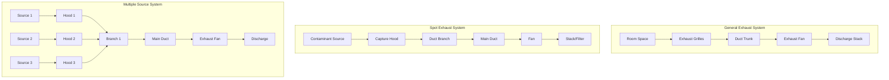
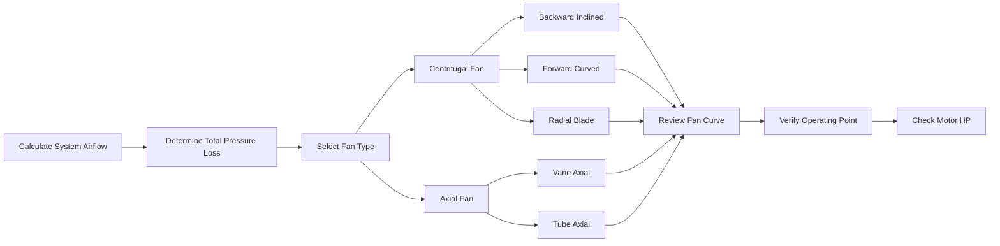

# Проектирование и реализация систем вытяжки

Системы вытяжки удаляют загрязненный воздух, тепло, влагу и запахи из помещений, поддерживая приемлемое качество воздуха в помещении и комфорт для находящихся там людей. Правильное проектирование требует понимания физики воздушного потока, характеристик загрязняющих веществ и параметров производительности системы.

## Типы систем вытяжки

### Общая вытяжная вентиляция

Системы общей вытяжки разбавляют и удаляют загрязняющие вещества в воздухе, равномерно распределенные по всему помещению. Эти системы полагаются на смешивание воздуха в помещении для транспортировки загрязняющих веществ к точкам вытяжки.

**Области применения:**
- Офисные здания и коммерческие помещения
- Санузлы и раздевалки
- Кладовые и механические помещения
- Легкие производственные объекты

Требования к воздушному потоку при общей вытяжке соответствуют минимальным расходам наружного воздуха ASHRAE 62.1, основанным на занятости и площади пола:

$$V_{\text{exhaust}} = R_p \times P + R_a \times A$$

Где:
- $V_{\text{exhaust}}$ = требуемый расход воздуха вытяжки (м³/ч)
- $R_p$ = норма наружного воздуха на человека (м³/ч на человека)
- $P$ = расчетная плотность людей (чел.)
- $R_a$ = норма наружного воздуха на площадь (м³/(ч·м²))
- $A$ = площадь пола (м²)

### Системы локальной вытяжки

Локальная вытяжка улавливает загрязняющие вещества на источнике или вблизи него до их распространения в общее пространство. Этот подход обеспечивает более высокую эффективность, чем общая вытяжка для локализованных источников.

**Типичные области применения:**
- Вытяжные зонты над кухонными плитами
- Вытяжные шкафы лабораторий
- Сварочные посты
- Полиграфические операции
- Паяльные станции

Скорость улавливания определяет требуемый расход воздуха вытяжки в зависимости от конфигурации зонта и характеристик загрязняющего вещества:

$$Q = V_c \times A_{\text{face}}$$

Где:
- $Q$ = расход воздуха вытяжки (м³/ч)
- $V_c$ = скорость улавливания (м/с)
- $A_{\text{face}}$ = площадь входного отверстия зонта (м²)

Типичные скорости улавливания варьируются от 0,25–1,0 м/с для панельных зонтов до 0,5–2,5 м/с для боковых вытяжных зонтов в зависимости от тепловых характеристик загрязняющего вещества и интенсивности образования.

### Системы производственной вытяжки

Системы производственной вытяжки обрабатывают промышленные загрязняющие вещества, опасные материалы или высокотемпературные отходящие потоки. Эти системы требуют специального проектирования для работы с едкими газами, взрывчатыми пылями или ядовитыми веществами.

**Соображения при проектировании:**
- Совместимость материалов с загрязняющими веществами
- Взрывозащищенная конструкция при необходимости
- Минимальные скорости транспортировки для твердых частиц
- Конструкция, устойчивая к искрам, для легко воспламеняющихся пылей
- Коррозионностойкие материалы для химических процессов

## Конфигурация системы вытяжки

## Определение размеров воздуховодов и потери давления

Определение размеров воздуховодов вытяжки уравновешивает первоначальные затраты против эффективности при эксплуатации. Недостаточно большие воздуховоды увеличивают потери давления и энергопотребление; слишком большие воздуховоды тратят материал и пространство.

### Выбор скорости

Рекомендуемые скорости в воздуховодах зависят от типа системы и транспортируемых материалов:

| Область применения | Диапазон скорости (м/с) |
|-------------|---------------------|
| Общая вытяжка | 6–9 |
| Воздух, содержащий кухонный жир | 8–10 |
| Легкая пыль | 13–15 |
| Тяжелая пыль | 18–23 |
| Абразивные материалы | 23–28 |

### Расчет потерь давления

Общие потери давления в системе включают потери трения в прямых участках воздуховода, потери в фасонных частях и потери на выходе:

$$\Delta P_{\text{total}} = \Delta P_{\text{friction}} + \Delta P_{\text{fittings}} + \Delta P_{\text{exit}}$$

Потери трения в прямом воздуховоде:

$$\Delta P_{\text{friction}} = f \times \frac{L}{D} \times \frac{\rho V^2}{2}$$

Где:
- $f$ = коэффициент трения (безразмерный)
- $L$ = длина воздуховода (м)
- $D$ = диаметр воздуховода (м)
- $\rho$ = плотность воздуха (кг/м³)
- $V$ = скорость воздуха (м/с)

Потери в фасонных частях используют коэффициенты потерь:

$$\Delta P_{\text{fitting}} = C \times \frac{\rho V^2}{2}$$

Где $C$ – коэффициент потерь фасонной части из справочника ASHRAE Fundamentals.

## Выбор вентилятора

### Статическое давление вентилятора

Вентилятор должен преодолевать общее давление системы при расчетном расходе:

$$SP_{\text{fan}} = \Delta P_{\text{total}} + VP_{\text{discharge}}$$

Где:
- $SP_{\text{fan}}$ = статическое давление вентилятора (Па)
- $VP_{\text{discharge}}$ = скоростное давление на выходе (Па)

### Требуемая мощность вентилятора

Эффективная мощность определяет выбор двигателя:

$$\text{BHP} = \frac{Q \times SP_{\text{fan}}}{3600 \times \eta_{\text{fan}}}$$

Где:
- $\text{BHP}$ = эффективная мощность (кВт)
- $Q$ = расход воздуха (м³/ч)
- $SP_{\text{fan}}$ = статическое давление вентилятора (Па)
- $\eta_{\text{fan}}$ = полный коэффициент полезного действия вентилятора (доля)

Выбирайте мощность двигателя на 10–15% выше расчетной эффективной мощности, чтобы учесть вариации системы и потери при передаче.

## Балансировка системы

Системы вытяжки требуют балансировки для достижения расходов по проекту в каждой точке вытяжки:

1. **Измерьте фактические расходы** в каждом терминале с помощью измерителя потока или поперечного зондирования питито
2. **Рассчитайте регулировку** на основе соотношения поток-давление: $Q_2/Q_1 = \sqrt{P_2/P_1}$
3. **Отрегулируйте заслонки** в ветвях для перераспределения воздушного потока
4. **Проверьте производительность вентилятора** по кривым производителя
5. **Задокументируйте финальные настройки** и расходы для справки при техническом обслуживании

## Стандарты и руководства по проектированию

- **ASHRAE 62.1**: Вентиляция для приемлемого качества воздуха в помещении
- **Руководство ACGIH по промышленной вентиляции**: Проектирование зонтов и скорости улавливания
- **NFPA 91**: Системы вытяжки для воздушной транспортировки паров, газов, туманов и твердых частиц
- **IMC Глава 5**: Системы вытяжки

## Критические параметры проектирования

**Выбор материалов:**
- Оцинкованная сталь для общей вытяжки
- Нержавеющая сталь для коррозионных сред
- ПВХ или FRP для химической вытяжки
- Алюминий для абразивных материалов (невоспламеняющийся)

**Место выпуска:**
- Минимум 3 м выше уровня кровли
- 3 м от воздухозаборников
- Учитывайте преобладающие ветры и эффект обтекания здания
- Зонты от дождя для наружных выпусков

**Управление:**
- Регулируемые по скорости приводы для оптимизации энергопотребления
- Блокировка с системами подачи воздуха
- Мониторинг давления для проверки системы
- Сигнализация при недостаточном расходе вытяжки

Правильное проектирование системы вытяжки интегрирует расчеты воздушного потока, выбор материалов, производительность вентилятора и стратегии управления для поддержания безопасной и комфортной внутренней среды при минимизации энергопотребления.
