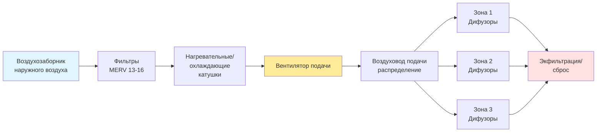
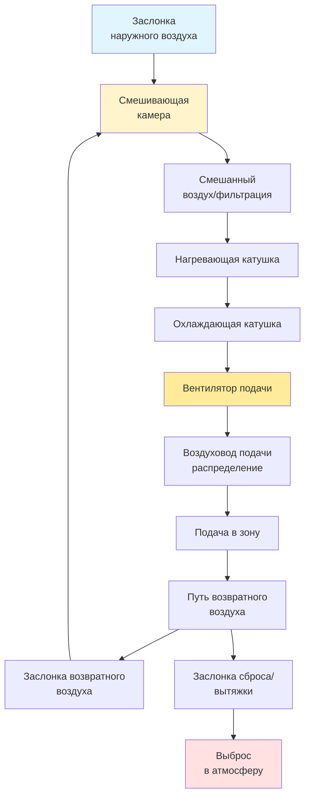
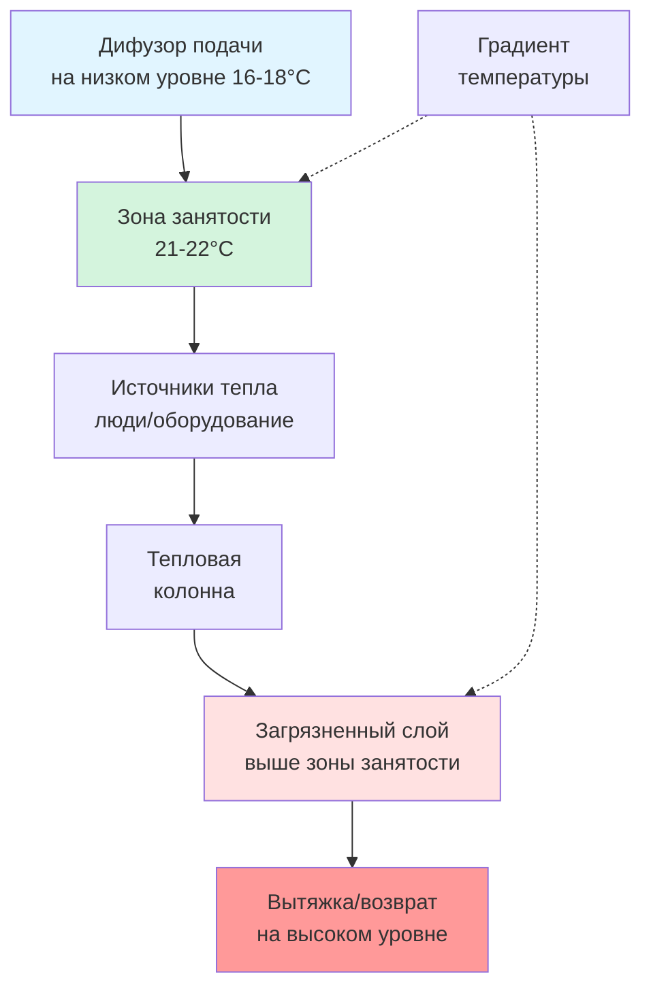

## Фундаментальный принцип работы

Системы вентиляции подачи создают **положительное давление** в кондиционируемом помещении путем механического введения воздуха с расходом, превышающим естественную инфильтрацию и экфильтрацию. Такое повышение давления направляет воздух наружу через отверстия ограждающей конструкции здания, предотвращая неконтролируемую инфильтрацию некондиционированного наружного воздуха, влаги и загрязнений.

Фундаментальный баланс массового расхода для системы вентиляции только подачи:

$$\dot{m}_{\text{подача}} = \dot{m}_{\text{вытяжка}} + \dot{m}_{\text{экфильтрация}}$$

Все массовые расходы в кг/с. Перепад давления, создаваемый обычно находится в диапазоне **5 до 12 Па** относительно наружной среды, достаточно для контроля инфильтрации без чрезмерного повышения давления в здании.

## Конфигурации систем

### Системы со 100% наружным воздухом

Эти системы подают исключительно наружный воздух без рециркуляции, обеспечивая максимальную эффективность вентиляции и производительность качества воздуха в помещении.

**Применения:**
- Медицинские учреждения (операционные, изоляционные помещения)
- Лабораторная среда с вытяжкой фумариума
- Промышленные объекты с высоким образованием загрязнений
- Плавательные бассейны, требующие контроля влажности
- Помещения, где перекрестное загрязнение недопустимо

**Энергетические последствия:**

Общая энергия кондиционирования для системы со 100% наружным воздухом:

$$Q_{\text{итого}} = 1.21 \times \text{м³/ч} \times \Delta h$$

Где:
- $Q_{\text{итого}}$ = общая нагрузка охлаждения/нагрева (кДж/ч)
- м³/ч = расход подачи наружного воздуха
- $\Delta h$ = разность энтальпии наружного и подаваемого воздуха (кДж/кг)
- 1.21 = константа (в единицах СИ с плотностью воздуха 1.2 кг/м³)

**Пример расчета:**
- Расход подаваемого воздуха: 16 970 м³/ч (10 000 CFM)
- Летние условия наружу: 35°C, 24°C влажного термометра (h = 89.3 кДж/кг)
- Условия подачи: 13°C, 90% ОВ (h = 52.5 кДж/кг)

$$Q_{\text{итого}} = 1.21 \times 16 970 \times (89.3 - 52.5) = 750 600 \text{ кДж/ч (208 кВт)}$$

Такая высокая энергетическая потребность требует рекуперации энергии в большинстве климатических условий, что обеспечивает снижение нагрузки кондиционирования на 60-80%.

### Системы смешанного воздуха

Системы смешанного воздуха объединяют наружный воздух с рециркулируемым возвратным воздухом, снижая энергопотребление при сохранении требуемых расходов вентиляции.

**Расчет процента наружного воздуха:**

Доля наружного воздуха в потоке подаваемого воздуха:

$$\%ОВ = \frac{V_{оа}}{V_{са}} \times 100$$

Где:
- $\%ОВ$ = процент наружного воздуха
- $V_{оа}$ = расход приема наружного воздуха (м³/ч)
- $V_{са}$ = общий расход подаваемого воздуха (м³/ч)

**Альтернативный расчет с использованием измерения температуры или CO₂:**

$$\%ОВ = \frac{T_{см} - T_{возв}}{T_{оа} - T_{возв}} \times 100$$

Где:
- $T_{см}$ = температура смешанного воздуха (°C)
- $T_{возв}$ = температура возвратного воздуха (°C)
- $T_{оа}$ = температура наружного воздуха (°C)

**Пример:**
- Возвратный воздух: 24°C
- Наружный воздух: 35°C
- Смешанный воздух: 26°C

$$\%ОВ = \frac{26 - 24}{35 - 24} \times 100 = \frac{2}{11} \times 100 = 18.2\%$$

При расходе подаваемого воздуха 33 940 м³/ч (20 000 CFM), расход приема наружного воздуха составляет 6 178 м³/ч (3 640 CFM).

## Процедура определения вентиляции ASHRAE 62.1

Стандарт ASHRAE 62.1 определяет минимальные требования к наружному воздуху для приемлемого качества воздуха в помещении на основе занятости и функции помещения.

**Требование наружного воздуха зоны:**

$$V_{оз} = R_p P_з + R_a A_з$$

Где:
- $V_{оз}$ = требование наружного воздуха для зоны (м³/ч)
- $R_p$ = расход наружного воздуха на человека (м³/(ч·чел))
- $P_з$ = население зоны (расчетная занятость)
- $R_a$ = расход наружного воздуха на единицу площади (м³/(ч·м²))
- $A_з$ = площадь пола зоны (м²)

**Прием наружного воздуха на уровне системы:**

Для многозонных систем учитывайте эффективность вентиляции и эффективность распределения:

$$V_{от} = \frac{\sum_{все\,зоны} V_{оз}/E_з}{1 - \frac{\sum_{все\,зоны} V_{оз}/E_з}{V_{пс}}}$$

Где:
- $V_{от}$ = прием наружного воздуха на уровне системы (м³/ч)
- $E_з$ = эффективность распределения воздуха зоны (обычно 0.8-1.2)
- $V_{пс}$ = основной расход воздуха системы (м³/ч)

**Практический пример:**

Офисное здание с тремя зонами:

| Зона | Площадь (м²) | Люди | $R_p$ (м³/(ч·чел)) | $R_a$ (м³/(ч·м²)) | $V_{оз}$ (м³/ч) |
|------|-----------|---------|----------------------|----------------------|---------------|
| Зона 1 | 186 | 10 | 7.5 | 0.65 | 288 |
| Зона 2 | 279 | 15 | 7.5 | 0.65 | 433 |
| Зона 3 | 139 | 8 | 7.5 | 0.65 | 220 |
| **Итого** | **604** | **33** | - | - | **941 м³/ч** |

Предполагая $E_з = 1.0$ (потолочная подача, напольный возврат) и общий расход подаваемого воздуха 10 195 м³/ч (6 000 CFM):

$$V_{от} = \frac{941}{1 - \frac{941}{10 195}} = \frac{941}{0.908} = 1 037 \text{ м³/ч}$$

Доля наружного воздуха системы: $1 037/10 195 = 10.2\%$

## Стратегии распределения воздуха

### Вентиляция с перемешиванием

Обычная потолочная подача создает **полностью перемешанные условия** в зоне занятости через высокоскоростные воздушные струи, которые вовлекают воздух помещения.

**Параметры проектирования:**
- Температура подаваемого воздуха: 13-18°C (охлаждение), 29-40°C (нагрев)
- Скорость подачи на дифузоре: 2.0-4.0 м/с
- Конечная скорость в зоне занятости: <0.25 м/с
- Воздухообмены в час: 4-12 ACH (варьируется по применениям)

**Расчет дальности распространения:**

Дальность распространения до заданной конечной скорости:

$$T = \frac{V_о}{V_т} \times d_о \times K$$

Где:
- $T$ = дальность распространения (м)
- $V_о$ = скорость на выходе (м/с)
- $V_т$ = конечная скорость (м/с, обычно 0.25 м/с)
- $d_о$ = диаметр или эффективный размер выходного отверстия (м)
- $K$ = коэффициент дифузора (0.8-1.5, данные производителя)

**Пример:**
- Круглый потолочный дифузор: 30 см диаметр (0.3 м)
- Скорость на выходе: 3.0 м/с
- Конечная скорость: 0.25 м/с
- Коэффициент K: 1.2

$$T = \frac{3.0}{0.25} \times 0.3 \times 1.2 = 4.3 \text{ м}$$

Эта дальность распространения должна достигать по крайней мере **две трети до трех четвертей** расстояния до ближайшей стены или соседнего дифузора для надлежащего перемешивания.

### Вентиляция с вытеснением

Подача низкоскоростного воздуха на уровне пола создает **вертикальное стратификацию** с холодным подаваемым воздухом, вытесняющим теплый загрязненный воздух вверх.

**Критерии проектирования:**
- Скорость подаваемого воздуха: <0.25 м/с на выходе дифузора
- Температура подаваемого воздуха: на 1.1-3.9°C ниже температуры помещения
- Вертикальный градиент температуры: 0.6-1.1°C на 1 м высоты
- Расход подачи: 0.8-1.6 м³/(ч·м²) площади пола

**Ограничение охлаждающей способности:**

$$q_{\text{макс}} = 0.33 \times \text{м³/ч} \times \Delta T$$

При 1.0 м³/(ч·м²) и разности температур 3.9°C:

$$q_{\text{макс}} = 0.33 \times 1.0 \times 3.9 = 1.3 \text{ кВт/м²}$$

Это ограничивает вентиляцию с вытеснением до **помещений с низкой сенсорной нагрузкой** (максимум 4.7 кВт/м²).

### Распределение воздуха через пол (UFAD)

Подача воздуха через дифузоры, установленные в полу, из герметичной подпольной камеры объединяет аспекты как вытеснения, так и перемешивающей вентиляции.

**Характеристики системы:**
- Давление в камере: 0.3-0.9 кПа
- Температура подачи: 16-20°C (теплее, чем обычно)
- Расход воздуха на дифузор: 0.4-1.7 м³/ч
- Высота стратификации: 1.2-1.8 м над полом
- Индивидуальный зональный контроль на каждом дифузоре

**Расчет давления в камере:**

$$\Delta P = \frac{\rho V^2}{2} \times \left(\frac{L}{D_h} f + \Sigma K\right)$$

Где:
- $\Delta P$ = потери давления (Па)
- $\rho$ = плотность воздуха (кг/м³)
- $V$ = скорость (м/с)
- $L$ = расстояние движения в камере (м)
- $D_h$ = гидравлический диаметр камеры (м)
- $f$ = коэффициент трения
- $\Sigma K$ = сумма потерь на фитингах

## Методология выбора дифузоров

### Определение нагрузки охлаждения и расхода воздуха

Требуемый расход подаваемого воздуха для сенсорного охлаждения:

$$\text{м³/ч} = \frac{Q_s}{1.2 \times \Delta T}$$

Где:
- $Q_s$ = нагрузка сенсорного охлаждения (кДж/ч)
- $\Delta T$ = разность температур подачи и помещения (°C)

**Пример:**
- Нагрузка сенсорного охлаждения зоны: 18 960 кДж/ч
- Температура в помещении: 24°C
- Температура подачи: 13°C

$$\text{м³/ч} = \frac{18 960}{1.2 \times (24 - 13)} = \frac{18 960}{13.2} = 1 436 \text{ м³/ч}$$

### Критерии определения размера дифузора

**Проверка скорости в горловине:**

$$V_{\text{горловина}} = \frac{\text{м³/ч}}{A_{\text{горловина}} \times 0.278}$$

Где $A_{\text{горловина}}$ - площадь горловины дифузора (см²). Поддерживайте скорость в горловине:
- Потолочные дифузоры: 2.0-3.5 м/с (NC 25-35)
- Настенные решетки: 1.5-2.5 м/с (NC 25-30)
- Щелевые дифузоры: 2.5-4.0 м/с (NC 30-40)

**Проверка дальности распространения:**

Выберите размер и тип дифузора для достижения надлежащей дальности распространения для высоты потолка:

| Высота потолка | Рекомендуемая дальность | Конечная скорость |
|----------------|-------------------------|-------------------|
| 2.4-2.7 м | 0.75 × длина помещения | 0.25 м/с |
| 3.0-4.3 м | 0.67 × длина помещения | 0.38 м/с |
| 4.6-6.1 м | 0.50 × длина помещения | 0.50 м/с |

**Распределение перепада давления:**

Общий бюджет давления системы распределяется по компонентам:

| Компонент | Типичный перепад давления |
|-----------|---------------------------|
| Дифузоры | 0.2-0.6 кПа |
| VAV блоки | 1.5-3.0 кПа |
| Воздуховод | 0.1 на 100 м |
| Фильтры | 1.2-3.0 кПа |
| Катушки | 1.8-4.8 кПа |
| **Итого** | **12-24 кПа** |

## Стратегии управления

**Постоянный объем подачи:**
- Фиксированный расход воздуха независимо от нагрузки
- Модулирование температуры подаваемого воздуха для контроля нагрузки
- Простое управление, высокое энергопотребление
- Типичные применения: небольшие системы, технологическая вентиляция

**Переменный объем воздуха (VAV):**
- Модулирование расхода воздуха для соответствия тепловой нагрузке
- Минимальный расход поддерживает требования вентиляции
- Энергоэффективно, сложное управление
- Требует отслеживания наружного воздуха для поддержания расходов вентиляции

**Управление минимальным наружным воздухом:**

Мониторить и модулировать заслонки наружного воздуха для поддержания требуемого $V_{оз}$:

$$V_{оа,\text{мин}} = \max\left(V_{оз}, 0.15 \times V_{са}\right)$$

Обеспечивает, чтобы доля наружного воздуха никогда не опускалась ниже минимального требования кодекса (обычно 15%) даже при низком расходе подаваемого воздуха.

**Переустановка температуры подаваемого воздуха:**

Повышение температуры подачи при частичных нагрузках для снижения переохлаждения и рециркуляции:

$$T_{са,\text{переуст}} = T_{са,\text{проект}} + k \times (T_{оа} - T_{оа,\text{проект}})$$

Где $k$ - коэффициент переустановки (обычно 0.25-0.50), позволяя температуре подачи повышаться с 13°C до 16-17°C при мягких условиях.

## Проверка производительности

**Измерение расхода воздуха:**
- Траверс трубкой Пито в воздуховоде: ±5% точность
- Откалиброванный балансировочный колпак на дифузоре: ±10% точность
- Анемометр с горячей нитью: ±3% точность для скорости

**Проверка перепада давления:**
- Измерить давление здания относительно наружной среды в нескольких местах
- Целевое значение: 0.3-0.9 кПа положительное
- Избежать чрезмерного повышения давления (>0.6 кПа), вызывающего проблемы с дверьми

**Тестирование эффективности вентиляции:**
- Метод затухания трассирующего газа (ASTM E741)
- Мониторинг концентрации CO₂
- Измерение распределения возраста воздуха

Системы вентиляции подачи обеспечивают эффективное повышение давления в помещении и доставку вентиляции при надлежащем проектировании с учетом расходов приема наружного воздуха, характеров распределения воздуха и стратегий управления, которые поддерживают требуемую кодексом вентиляцию при всех условиях работы.
