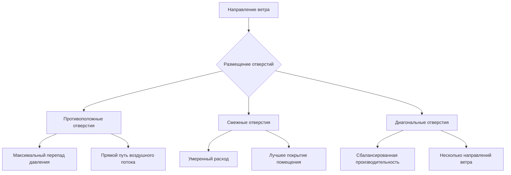
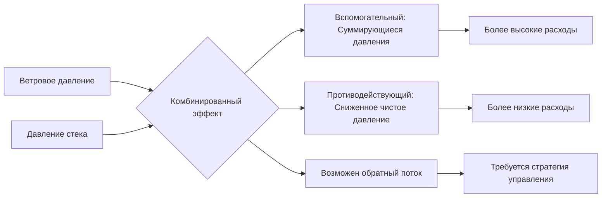

## Обзор

Перекрестная вентиляция использует индуцируемые ветром перепады давления на фасадах зданий для создания естественного воздушного потока через занятые помещения. Эта стратегия пассивной вентиляции обеспечивает охлаждение, подачу свежего воздуха и удаление загрязнений без механической энергии при надлежащем проектировании для локальных ветровых условий и геометрии здания.

Эффективная перекрестная вентиляция требует количественного анализа ветровых давлений, стратегического размещения отверстий и понимания внутренних картин воздушного потока для достижения целевых расходов вентиляции и теплового комфорта.

## Основы ветрового давления

### Динамическое давление ветра

Скорость ветра создает кинетическую энергию, которая преобразуется в давление на поверхностях зданий в соответствии с принципом Бернулли:

$$q = \frac{1}{2} \rho V^2$$

Где:
- $q$ = динамическое давление ветра (Па)
- $\rho$ = плотность воздуха (1,2 кг/м³ на уровне моря, 20°C)
- $V$ = скорость ветра (м/с)

Это динамическое давление формирует основу для всех расчетов вентиляции, вызванной ветром.

### Распределение давления на поверхности

Ветер создает неравномерные распределения давления на поверхностях зданий на основе моделей отделения и переприкрепления потока:

$$P_{surface} = C_p \cdot q$$

Где:
- $P_{surface}$ = манометрическое давление на поверхности (Па)
- $C_p$ = коэффициент давления ветра (безразмерный)

Коэффициент давления представляет отношение локального давления к эталонному динамическому давлению и изменяется в зависимости от геометрии здания, направления ветра и локальных условий потока.

## Коэффициенты давления ветра

### Типичные значения для прямоугольных зданий

| Поверхность | Угол ветра | Диапазон $C_p$ | Значение расчета |
|---------|-----------|-------------|--------------|
| Наветренный фасад | 0° (перпендикулярно) | +0,5 до +0,8 | +0,6 |
| Подветренный фасад | 180° (противоположно) | -0,3 до -0,5 | -0,4 |
| Боковые стены | 90° (параллельно) | -0,6 до -0,8 | -0,7 |
| Кровля наветренная | Уклон 0-15° | -0,7 до -0,3 | -0,5 |
| Кровля подветренная | Уклон 0-15° | -0,5 до -0,3 | -0,4 |

### Влияющие факторы

**Геометрия здания:**
Острые углы создают более высокие отрицательные давления (до $C_p = -1,2$), тогда как закругленные края смягчают вариации давления.

**Городской контекст:**
Окружающие здания снижают наветренные положительные давления на 20-40% и изменяют картины давления через эффекты экранирования и канализации.

**Конфигурация кровли:**
Скатные крыши смещают распределения давления по сравнению с плоскими крышами, причем более крутые уклоны генерируют более сильное подветренное всасывание.

**Местоположение отверстия:**
Коэффициенты давления изменяются вертикально из-за градиентов скорости и горизонтально из-за зон отделения потока. Значения возле углов значительно отличаются от значений в центре фасада.

## Расчет воздушного потока при перекрестной вентиляции

### Перепад давления при одном отверстии

Для здания с входными и выходными отверстиями, подвергаемыми различным ветровым давлениям:

$$\Delta P_{wind} = C_p \cdot \frac{1}{2} \rho V^2 = (C_{p,inlet} - C_{p,outlet}) \cdot \frac{1}{2} \rho V^2$$

Этот перепад давления вызывает воздушный поток через здание в соответствии с принципами истечения из отверстия.

### Объемный расход

Воздушный поток через перекрестно вентилируемые пространства с несколькими отверстиями:

$$Q = C_d \cdot A_{eff} \cdot \sqrt{\frac{2 \Delta P}{\rho}}$$

Для потока, вызванного ветром, с известными коэффициентами давления:

$$Q = C_d \cdot A_{eff} \cdot V_{ref} \sqrt{|C_{p,inlet} - C_{p,outlet}|}$$

Где:
- $Q$ = объемный расход (м³/с)
- $C_d$ = коэффициент расхода (0,6-0,65 для острых кромок, 0,8 для закругленных кромок)
- $A_{eff}$ = эффективная площадь отверстия (м²)
- $V_{ref}$ = эталонная скорость ветра на высоте здания (м/с)
- $\Delta P$ = перепад давления через отверстия (Па)

### Эффективная площадь отверстия

Когда несколько отверстий существуют в серии (типичная конфигурация перекрестной вентиляции):

$$A_{eff} = \frac{1}{\sqrt{\frac{1}{A_1^2} + \frac{1}{A_2^2} + \frac{1}{A_3^2} + \cdots}}$$

Для обычного случая с двумя отверстиями (входное и выходное):

$$A_{eff} = \frac{A_{inlet} \cdot A_{outlet}}{\sqrt{A_{inlet}^2 + A_{outlet}^2}}$$

Это соотношение демонстрирует, что меньшее отверстие доминирует сопротивление потоку. Когда площади входного и выходного отверстий равны, $A_{eff} = A/\sqrt{2} \approx 0,71A$.

## Стратегии конфигурации отверстий

### Позиционирование входа-выхода

**Противоположные отверстия (расположение под углом 0-180°):**
Максимизирует перепад давления ($\Delta C_p \approx 1,0$) и достигает наивысших расходов. Создает сфокусированный воздушный поток через пространство с возможностью мертвых зон вдали от пути потока.

**Смежные отверстия (расположение под углом 90°):**
Снижает перепад давления ($\Delta C_p \approx 0,6-0,8$), но улучшает распределение воздушного потока внутри пространства. Лучше для переменных направлений ветра.

**Диагональные отверстия (расположение под углом 120-150°):**
Компромисс между максимальным расходом и равномерностью распределения. Эффективно для зданий с несколькими преобладающими направлениями ветра.

### Соотношения размеров

| Конфигурация | Отношение площадей (Вход:Выход) | Эффективность потока | Применение |
|--------------|------------------------------|-----------------|-------------|
| Равные площади | 1:1 | 100% (базовое) | Максимальный расход вентиляции |
| Ограничение входа | 1:1,5 | 94% | Сниженная скорость входа, меньше сквозняков |
| Ограничение входа | 1:2 | 89% | Минимальные сквозняки на входе |
| Ограничение выхода | 1,5:1 | 94% | Более высокие внутренние скорости |
| Ограничение выхода | 2:1 | 89% | Улучшенное перемешивание, риск коротких замыканий |

ASHRAE Fundamentals рекомендует площади входа не менее площади выхода для поддержания адекватных расходов при ограничении чрезмерных скоростей входа.

### Вертикальное позиционирование

**Входы на уровне пола:**
Подача более холодного наружного воздуха на уровень занятой зоны, эффективно для теплого климата. Риск пыли и попадания воды требует защитной конструкции.

**Входы на уровне головы:**
Баланс между подачей свежего воздуха и избежанием сквозняков. Стандартно для офисных и жилых приложений.

**Высокоуровневые входы с низкоуровневыми выходами:**
Создают нисходящий вытесняющий поток, эффективно, когда наружный воздух холоднее внутреннего.

**Низкоуровневые входы с высокоуровневыми выходами:**
Естественный поток, вспомогательный за счет плавучести, удаляет теплый воздух и загрязнители. Комбинирует эффект стека с ветровым давлением.

## Внутренние картины воздушного потока

### Геометрия пути потока

Фактический путь воздушного потока через пространство отличается от прямой геометрической линии между отверстиями из-за:

1. **Эффекты инерции:** Воздух, входящий с скоростью, поддерживает направленное смещение
2. **Тепловая плавучесть:** Разности температур отклоняют поток вертикально
3. **Препятствия:** Мебель и перегородки перенаправляют и рассеивают поток
4. **Пограничные слои:** Трение стены снижает скорости вблизи поверхности

### Распределение скорости

Средняя скорость через занятую зону приблизительно:

$$V_{zone} = \frac{Q}{A_{cross-section}} \cdot k$$

Где:
- $V_{zone}$ = средняя скорость воздуха в занятой зоне (м/с)
- $A_{cross-section}$ = площадь поперечного сечения перпендикулярно потоку (м²)
- $k$ = коэффициент распределения (0,4-0,7 в зависимости от препятствий)

Пиковые скорости вблизи отверстий могут в 2-3 раза превышать среднюю скорость, в то время как стагнирующие зоны могут испытывать менее 20% средней скорости.

### Короткое замыкание

Прямые пути потока от входа к выходу, которые обходят значительный объем помещения, снижают эффективность вентиляции. Короткое замыкание происходит, когда:

- Отверстия выравниваются непосредственно с минимальным расстоянием разделения
- Большая площадь выхода относительно входа создает низкосопротивляемый путь
- Вертикальная температурная стратификация канализирует поток на уровне потолка

Стратегии смягчения включают смещенное размещение отверстий, внутренние перегородки или перегородки для перенаправления воздушного потока через занятые зоны.

## Эффективность смены воздуха

### Метрика эффективности вентиляции

Локальная эффективность смены воздуха в точке:

$$\varepsilon_a = \frac{C_{exhaust} - C_{supply}}{C_{point} - C_{supply}}$$

Где:
- $\varepsilon_a$ = эффективность смены воздуха (безразмерная)
- $C_{exhaust}$ = концентрация загрязнителя на выходе
- $C_{supply}$ = концентрация загрязнителя на входе
- $C_{point}$ = концентрация загрязнителя в точке измерения

При идеальном перемешивании $\varepsilon_a = 1,0$. Значения ниже 0,5 указывают на плохую эффективность вентиляции, тогда как значения выше 1,5 предполагают характеристики вытесняющей вентиляции.

### Возраст воздуха

Средний возраст воздуха определяет среднее время пребывания воздуха в помещении:

$$\bar{\tau}_p = \int_0^\infty [1 - F(t)] dt$$

Где:
- $\bar{\tau}_p$ = средний возраст воздуха в точке (секунды)
- $F(t)$ = кумулятивное распределение возраста воздуха

Для перекрестной вентиляции с хорошим перемешиванием, номинальная постоянная времени:

$$\bar{\tau}_n = \frac{V}{Q}$$

Где:
- $V$ = объем помещения (м³)
- $Q$ = расход вентиляции (м³/с)

Фактический возраст воздуха в плохо перемешиваемых пространствах может превышать номинальную постоянную времени в 2-4 раза в стагнирующих зонах.

## Выбор расчетной скорости ветра

### Коррекция эталонной высоты

Метеорологические скорости ветра, измеренные на стандартной высоте 10 метров, требуют корректировки на высоту здания:

$$V_h = V_{10} \left(\frac{h}{10}\right)^\alpha$$

Где:
- $V_h$ = скорость ветра на высоте $h$ (м/с)
- $V_{10}$ = скорость ветра на эталонной высоте 10 м (м/с)
- $h$ = высота здания (м)
- $\alpha$ = показатель шероховатости местности

| Категория местности | Описание | Показатель шероховатости $\alpha$ |
|-----------------|-------------|-------------------|
| I | Открытая вода, плоская местность | 0,10 |
| II | Сельская местность, разреженные препятствия | 0,15 |
| III | Пригородная, облесенные районы | 0,20 |
| IV | Городская, центры городов | 0,25-0,30 |

### Выбор расчетной скорости ветра

**Подход ASHRAE:**
Используйте 50-й процентиль скорости ветра (медиану) из исторических данных для анализа типичной работы. Используйте 10-й процентиль для проверки минимальной производительности.

**Лето vs. зима:**
Анализируйте отдельно, так как преобладающие направления и скорости ветра варьируются сезонно. Летние ветры обычно управляют проектированием охлаждающей вентиляции.

**Частота направления:**
Взвешивайте коэффициенты давления по частоте направления ветра для расчета эффективного среднего расхода вентиляции при переменных ветровых условиях.

## Комбинированные эффекты стека и ветра

### Одновременные компоненты давления

И эффект стека, и ветровое давление действуют одновременно при естественной вентиляции:

$$\Delta P_{total} = \Delta P_{wind} + \Delta P_{stack}$$

$$\Delta P_{total} = (C_{p,inlet} - C_{p,outlet}) \frac{\rho V^2}{2} + \rho g h \frac{\Delta T}{T_{avg}}$$

Где термины определены в предыдущих разделах.

### Анализ направления потока

Эффекты ветра и стека могут помогать или противодействовать друг другу в зависимости от конфигурации отверстий и температурных условий:

**Вспомогательная конфигурация:**
Наветренный вход на нижнем уровне, подветренный выход на верхнем уровне. И ветровое положительное давление, и эффект стека вызывают восходящий поток. Максимальный расход вентиляции.

**Противодействующая конфигурация:**
Наветренный вход на верхнем уровне, подветренный выход на нижнем уровне. Ветер вызывает нисходящий поток, а эффект стека вызывает восходящий поток. Чистый эффект зависит от доминирующей силы.

### Определение доминирующей силы

Относительная величина эффектов ветра и стека:

$$R = \frac{\Delta P_{wind}}{\Delta P_{stack}} = \frac{(C_{p,inlet} - C_{p,outlet}) V^2}{2 g h \Delta T / T_{avg}}$$

- $R > 3$: Ветер доминирует, эффект стека незначительный
- $0,3 < R < 3$: Оба эффекта значительны, требуется тщательный анализ
- $R < 0,3$: Эффект стека доминирует, ветровой эффект вторичный

Для типичных низконаселенных зданий (h = 3-5 м) с умеренными разностями температур (ΔT = 5 К) и скоростями ветра превышающими 2 м/с, ветровые эффекты доминируют в производительности перекрестной вентиляции.

## Валидация CFD и ограничения

### Когда анализ CFD оправдан

Вычислительная гидродинамика обеспечивает детальные прогнозы скорости и температуры для:

- Сложной геометрии зданий с нерегулярными моделями отверстий
- Городских контекстов с влияниями окружающих зданий
- Внутренних пространств со значительными препятствиями или перегородками
- Валидации упрощенных ручных расчетов
- Оптимизации размеров и расположений отверстий

### Требования к моделированию турбулентности

**Модели RANS:**
Усредненные по Рейнольдсу модели Навье-Стокса (k-ε, k-ω, SST) пригодны для анализа в установившемся режиме. Вычислительная эффективность позволяет проводить параметрические исследования.

**Модели LES:**
Моделирование крупных вихрей точнее захватывает переходные особенности потока и зоны отделения, но требует значительно больше вычислительных ресурсов.

**Размер области:**
Минимум 5H выше по потоку, 15H ниже по потоку и 5H сбоку от здания (где H = высота здания) для избежания влияния границ.

### Требования к данным валидации

Прогнозы CFD требуют валидации по отношению к:
- Испытаниям в аэродинамической трубе для распределений коэффициентов давления
- Полномасштабным измерениям в сравнимых зданиях
- Тестированию индикаторного газа для возраста воздуха и эффективности вентиляции

ASHRAE Standard 140 предоставляет тестовые случаи для валидации моделей естественной вентиляции.

## Практические ограничения проектирования

### Границы теплового комфорта

Ограничения скорости воздуха для комфорта жильцов:

| Уровень активности | Диапазон температур | Максимальная скорость | Применение |
|---------------|------------------|-----------------|-------------|
| Сидячий | 20-24°C | 0,15 м/с | Зима, механическое резервирование |
| Сидячий | 25-27°C | 0,5 м/с | Лето, естественная вентиляция |
| Легкая офисная работа | 20-24°C | 0,25 м/с | Стандартный диапазон комфорта |
| Легкая офисная работа | 25-28°C | 0,8 м/с | Повышенное движение воздуха приемлемо |

ASHRAE Standard 55 адаптивная модель комфорта допускает более высокие скорости при наличии у жильцов управления и температурах выше 25°C.

### Проблемы надежности

Производительность перекрестной вентиляции зависит от непредсказуемых ветровых условий:

- **Затишье:** Недостаточная движущая сила требует механического резервирования
- **Чрезмерный ветер:** Чрезмерная вентиляция вызывает дискомфорт, шум и проблемы с работой дверей
- **Переменное направление:** Ветер вне расчетного угла снижает перепады давления на 40-70%
- **Сезонные модели:** Летние периоды затишья часто совпадают с пиковым спросом на охлаждение

### Требования к интеграции

Эффективная перекрестная вентиляция требует:

- **Автоматизированное управление окнами/заслонками:** Реагирование на скорость ветра, направление и внутренние условия
- **Мониторинг погоды:** Датчики скорости и направления ветра в реальном времени, интегрированные с BMS
- **Механическое резервирование:** Поддержание минимальной вентиляции IAQ при неблагоприятных условиях (обычно 0,3 л/с/м² согласно ASHRAE 62.1)
- **Безопасность и защита от дождя:** Решение проблем, которые ограничивают открытие окон

## Структура процесса проектирования

1. **Анализ ветрового климата:**
   - Получить данные о направленной скорости ветра (роза ветров)
   - Определить преобладающие направления ветра для сезона охлаждения
   - Определить расчетные скорости ветра (медиана и 10-й процентиль)

2. **Установить стратегию отверстий:**
   - Расположить входы на наветренных фасадах на основе преобладающих ветров
   - Расположить выходы на подветренных или боковых фасадах для максимизации $\Delta C_p$
   - Рассмотреть несколько направлений ветра при отсутствии сильной преобладающей модели

3. **Рассчитать требуемые площади отверстий:**
   - Определить требуемый расход вентиляции из ASHRAE 62.1 или местных кодексов
   - Применить уравнение эффективной площади с целевой скоростью ветра
   - Размеры отверстий с надлежащим отношением входа-выхода (обычно 1:1 до 1:1,5)

4. **Проверить скорости воздуха:**
   - Рассчитать среднюю скорость зоны из расхода и поперечного сечения
   - Подтвердить скорости в пределах допусков комфорта для занятых зон
   - Оценить пиковые скорости вблизи отверстий на предмет потенциала сквозняков

5. **Оценить эффективность вентиляции:**
   - Оценить геометрию пути потока на предмет потенциала короткого замыкания
   - Рассмотреть анализ CFD для сложных пространств
   - Спланировать улучшение перемешивания при необходимости (потолочные вентиляторы, внутренние перегородки)

6. **Проектировать стратегию управления:**
   - Указать автоматизированные приводы для отзывчивого управления отверстиями
   - Определить критерии переходов для активации механического резервирования
   - Интегрировать с системой управления зданием для координированной работы

Перекрестная вентиляция обеспечивает энергоэффективную подачу свежего воздуха и охлаждение, когда наружные условия соответствуют требованиям комфорта и существуют достаточные ветровые ресурсы. Количественный анализ ветровых давлений, надлежащая конфигурация отверстий и реалистическая оценка картин воздушного потока позволяют осуществить эффективное проектирование пассивной вентиляции.

---

**Ссылки:**
ASHRAE Fundamentals Handbook, Глава 16: Вентиляция и инфильтрация
ASHRAE Standard 55: Условия теплового окружения для занятости человека
ASHRAE Standard 62.1: Вентиляция для приемлемого качества воздуха в помещении
CIBSE AM10: Естественная вентиляция в нежилых зданиях
