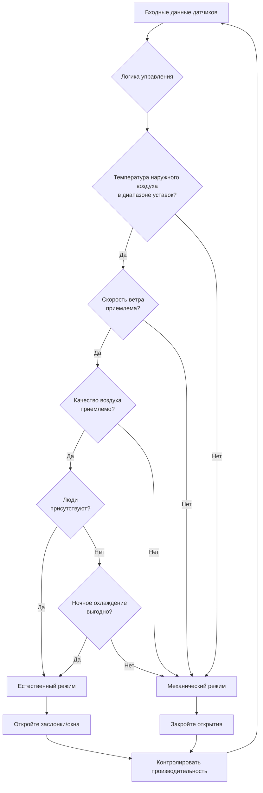
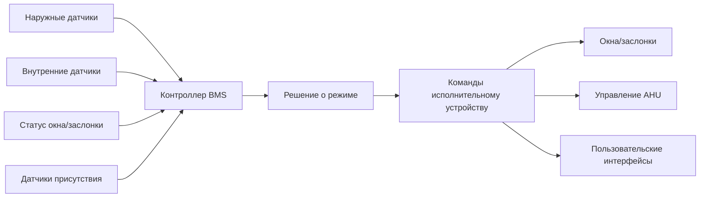

# Гибридные системы вентиляции

Гибридная вентиляция (также называемая смешанной вентиляцией) интегрирует стратегии естественной и механической вентиляции в единую систему здания, переключаясь между режимами или комбинируя их для оптимизации энергетических характеристик, качества воздуха в помещении и комфорта пользователей. Этот подход использует преимущества энергетически бесплатной естественной вентиляции при благоприятных наружных условиях, сохраняя механический резерв для периодов недостаточных естественных движущих сил или неблагоприятных наружных условий.

## Основные режимы работы

Системы гибридной вентиляции работают в трёх отдельных конфигурациях:

**Дополнительный режим**: Естественная и механическая вентиляция работают одновременно в разных зонах или в разное время. Например, периметральные зоны могут использовать открываемые окна, в то время как внутренние зоны полагаются на механическую подачу, или естественная вентиляция может функционировать во время присутствия людей с механической продувкой ночью.

**Режим переключения**: Система полностью переключается между естественной и механической вентиляцией на основе наружных условий, внутренних требований или режима присутствия людей. Алгоритмы управления определяют оптимальный режим и выполняют переход.

**Зонированный режим**: Разные зоны здания одновременно работают в разных режимах с пространственным разделением между естественно вентилируемыми и механически кондиционируемыми областями. Это обычно предполагает выделенные периметральные зоны с открываемыми фасадами и механически обслуживаемые внутренние зоны.

## Стратегии управления переключением

Эффективное управление переключением требует сложных алгоритмов, балансирующих множество конкурирующих факторов:

**Управление на основе температуры**: Наиболее распространённая стратегия переключается в естественный режим, когда температура наружного воздуха находится в диапазоне мёртвой зоны, обычно на 1-2°C уже, чем уставка механического охлаждения. ASHRAE рекомендует диапазон естественной вентиляции 18-26°C для типичных коммерческих приложений.

**Управление на основе энтальпии**: Более сложные системы сравнивают энтальпию наружного и внутреннего воздуха (комбинированная температура и влажность) для определения, когда наружный воздух обеспечивает термодинамическое преимущество. Это предотвращает подачу влажного наружного воздуха, который увеличивает скрытые охлаждающие нагрузки.

**Прогнозирующее управление**: Продвинутые системы включают прогнозы погоды и модели тепловой инерции здания для прогнозирования оптимального времени переключения. Предварительное охлаждение с ночной вентиляцией может позволить расширенную работу в естественном режиме на следующий день.

## Архитектура интеграции датчиков

Критические требования к датчикам включают:

**Наружные датчики**: Температура, влажность, скорость и направление ветра, обнаружение осадков и качество воздуха (PM2.5, CO2, NOx) в местах на периметре здания, репрезентативных для условий впуска вентиляции.

**Внутренние датчики**: Температура и влажность в репрезентативных зонах, концентрация CO2 для вентиляции по требованию, датчики летучих органических соединений (VOC) в приложениях с высокой чувствительностью и перепад давления по оболочке здания.

**Датчики статуса системы**: Обратная связь положения от моторизованных окон и заслонок, станции измерения расхода воздуха в каналах механической подачи, индикаторы статуса вентилятора и датчики присутствия для управления зонами.

## Баланс энергетических характеристик и комфорта

Гибридная вентиляция достигает экономии энергии тремя механизмами:

**Снижение энергии вентилятора**: Естественная вентиляция устраняет работу вентиляторов подачи и возврата, обычно снижая потребление электроэнергии HVAC на 30-50% в применимые часы. Система подачи 850 м³/ч с полным статическим давлением 6,2 мм вод. ст. требует примерно 35 кВт мощности вентилятора. Годовые часы работы в естественном режиме непосредственно преобразуются в экономию кВт⋅ч.

**Избежание нагрузки охлаждения**: Свободное охлаждение с наружным воздухом уменьшает или исключает механические нагрузки охлаждения при благоприятных наружных условиях. Величина зависит от климата, внутренних теплоизбыточностей и тепловой инерции здания. Климаты с смешанной влажностью обычно достигают снижения на 500-1000 градусо-часов охлаждения в год.

**Использование тепловой инерции**: Ночная вентиляция удаляет тепло, накопленное в тепловой инерции здания, снижая нагрузку охлаждения на следующий день. Бетонные конструкции с 10-15 см открытой толщины плиты могут накапливать 40-50 кДж/м² на изменение температуры на 1°C, обеспечивая существенную пассивную охлаждающую ёмкость.

## Проектные соображения

**Интеграция фасада**: Гибридные системы требуют согласованного проектирования открываемых элементов (окна, жалюзи, заслонки) с механическим распределением. Автоматизированные оконные системы должны интегрироваться с элементами управления BMS, включать датчики дождя для автоматического закрытия и предусматривать возможность ручного переопределения согласно исследованиям предпочтений пользователей.

**Акустические характеристики**: Открытия естественной вентиляции снижают акустическую изоляцию. Городские местоположения или площадки рядом с транспортными коридорами требуют стратегий акустического ослабления, включая звукоизолированные автоматические заслонки, акустические жалюзи с вносимым затуханием 15-25 дБ или временные ограничения, ограничивающие естественный режим периодами с низким уровнем шума.

**Управление качеством воздуха**: Естественная вентиляция подаёт нефильтрованный наружный воздух. Площадки с повышенным содержанием взвешенных частиц, озона или концентрациями аллергенов могут требовать вспомогательной фильтрации, ограниченных графиков работы или мониторинга качества воздуха в реальном времени с автоматическим переключением в механический режим, когда концентрации наружного воздуха превышают пороги.

**Органы управления и переопределение**: Управление пользователем значительно влияет на удовлетворённость комфортом, но может скомпрометировать оптимизацию системы. Успешные реализации предоставляют возможность локального переопределения в пределах заданных диапазонов (обычно продолжительность 15-30 минут), сохраняя централизованный контроль для функций здравоохранения и безопасности.

## Стандарты и руководящие принципы

**ASHRAE Standard 62.1** рассматривает гибридную вентиляцию в процедуре естественной вентиляции (раздел 6.4), требуя инженерных расчётов или аналитических методов, демонстрирующих адекватные скорости вентиляции. Стандарт разрешает комбинирование естественной и механической вентиляции при условии постоянного соблюдения минимальных требований к наружному воздуху.

**CIBSE Applications Manual AM13** (Смешанная вентиляция) предоставляет комплексное руководство по проектированию, включая стратегии управления, выбор компонентов и процедуры сдачи в эксплуатацию. CIBSE рекомендует ширину мёртвой зоны, расположение датчиков и протоколы времени переключения, основанные на типе здания и климате.

**CIBSE Applications Manual AM10** (Естественная вентиляция в нежилых зданиях) устанавливает методы проектирования естественной вентиляции, применимые к работе в естественном режиме гибридной системы, включая процедуры расчёта воздушного потока и критерии размера открытий.

## Проверка производительности

Ввод в эксплуатацию гибридных систем требует проверки как естественного, так и механического режимов, а также поведения переходов. Функциональные испытания производительности должны подтвердить калибровку датчиков, последовательности логики управления, времена отклика исполнительных устройств (обычно 2-5 минут для автоматизированных окон) и функциональность блокировки, предотвращающую одновременное механическое охлаждение и естественную вентиляцию.

Мониторинг после сдачи в эксплуатацию должен отслеживать закономерности выбора режима, потребление энергии по режимам, параметры качества внутренней среды и удовлетворённость пользователей. Непрерывная сдача в эксплуатацию может выявить возможности для расширения диапазонов работы в естественном режиме на основе фактических данных производительности и обратной связи от пользователей.

---

**Связанные темы**: Естественная вентиляция, Эффект дымохода, Ветроприводная вентиляция, Системы автоматизации зданий, Вентиляция с рекуперацией энергии, Вентиляция по требованию
