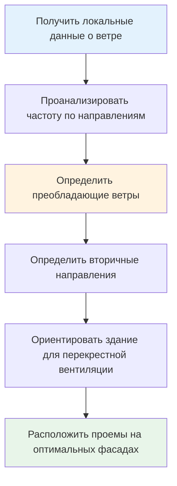

# Ветровая естественная вентиляция

Ветровая вентиляция использует разность давления на фасадах здания для создания воздушных потоков через проемы. Этот механизм основан на преобразовании кинетической энергии ветра в статическое давление на поверхностях здания, создавая градиенты давления, которые приводят в движение воздух.

## Физические принципы

Ветер, воздействующий на здание, создает положительное давление на наветренных поверхностях и отрицательное давление на подветренных и боковых поверхностях. Распределение давления зависит от скорости ветра, геометрии здания и окружающего рельефа.

Давление на поверхности в любой точке характеризуется следующим уравнением:

$$
P_s = P_{\infty} + C_p \cdot \frac{1}{2} \rho V^2
$$

Где:
- $P_s$ = давление на поверхности (Па)
- $P_{\infty}$ = опорное атмосферное давление (Па)
- $C_p$ = коэффициент давления (безразмерный)
- $\rho$ = плотность воздуха (кг/м³)
- $V$ = опорная скорость ветра (м/с)

Коэффициент давления $C_p$ изменяется в зависимости от положения на поверхности здания, направления ветра и геометрии здания. Значения типично варьируются от +0,8 на наветренных фасадах до -0,6 на подветренных фасадах.

## Коэффициенты давления

ASHRAE Fundamentals содержит рекомендации по значениям коэффициентов давления для проектирования вентиляции. Представительные значения для прямоугольных зданий:

| Расположение поверхности | Диапазон $C_p$ | Проектное значение |
|-------------------------|-------------|--------------|
| Наветренная стена (перпендикулярно потоку) | +0,5 до +0,8 | +0,6 |
| Подветренная стена | -0,3 до -0,5 | -0,4 |
| Боковые стены | -0,6 до -0,8 | -0,65 |
| Край крыши с наветренной стороны | -0,7 до -0,9 | -0,8 |
| Подветренная крыша | -0,3 до -0,5 | -0,4 |

Эти значения применяются к изолированным зданиям в открытой местности. Городская среда и скопления зданий значительно изменяют локальные распределения давления.

## Расчет воздушного потока

Для перекрестной вентиляции через два проема (вход и выход) объемный расход воздуха составляет:

$$
Q = C_d \cdot A_{eff} \cdot V \cdot \sqrt{C_{p1} - C_{p2}}
$$

Где:
- $Q$ = объемный расход (м³/с)
- $C_d$ = коэффициент расхода (типично 0,6-0,65)
- $A_{eff}$ = эффективная площадь проема (м²)
- $V$ = опорная скорость ветра (м/с)
- $C_{p1}$, $C_{p2}$ = коэффициенты давления на входе и выходе

Эффективная площадь учитывает несколько проемов последовательно:

$$
\frac{1}{A_{eff}^2} = \frac{1}{A_1^2} + \frac{1}{A_2^2}
$$

Для нескольких проемов входной проем обычно определяет расход, когда $A_{inlet} < A_{outlet}$.

## Проектирование перекрестной вентиляции

Эффективная перекрестная вентиляция требует тщательного рассмотрения расположения проемов, их размеров и внутренних путей потока воздуха.

### Рекомендации по проектированию

**Расположение проемов:**
- Расположите входные проемы на наветренном фасаде на высоте нахождения людей
- Разместите выходные проемы на подветренном или боковом фасаде, предпочтительно выше входных
- Максимизируйте расстояние между входом и выходом для повышения эффективности вентиляции
- Избегайте препятствий в пути потока между проемами

**Размеры проемов:**
- Площадь выхода должна быть равна или больше, чем площадь входа
- Минимум 4% площади пола для проемов в умеренном климате (исключение ASHRAE Standard 62.1)
- Учтите, что сетки от насекомых снижают эффективную площадь на 40-60%

**Внутренняя конфигурация:**
- Минимизируйте внутренние перегородки, препятствующие потоку воздуха
- Используйте коридоры или пленумные пространства для распределения воздуха
- Рассмотрите вариации высоты потолка для усиления эффектов плавучести

## Учет скорости ветра

Опорная скорость ветра изменяется с высотой и шероховатостью рельефа:

$$
V_z = V_{met} \cdot \left(\frac{z}{z_{met}}\right)^{\alpha}
$$

Где:
- $V_z$ = скорость ветра на высоте $z$ (м/с)
- $V_{met}$ = метеорологическая скорость ветра на высоте $z_{met}$ (м/с)
- $z$ = высота над землей (м)
- $z_{met}$ = высота метеорологических измерений (типично 10 м)
- $\alpha$ = показатель шероховатости рельефа

| Тип рельефа | Показатель шероховатости $\alpha$ |
|--------------|----------------------------|
| Открытая вода, плоская местность | 0,10 |
| Сельская местность, низкая растительность | 0,15 |
| Пригородная местность, разреженная застройка | 0,20 |
| Городская, плотная застройка | 0,25-0,30 |

## Сравнение с механической вентиляцией

| Параметр | Ветровая вентиляция | Механическая вентиляция |
|-----------|------------------------|----------------------|
| Энергопотребление | Нулевое рабочее потребление | 2-5 Вт/(м³/ч) мощность вентилятора |
| Управление расходом | Переменный, зависит от погоды | Точное, непрерывное |
| Техническое обслуживание | Минимальное (работа клапанов) | Регулярное (фильтры, двигатели) |
| Генерация шума | Бесшумно | 35-50 дBA типично |
| Стоимость установки | Низкая (проемы, управление) | Высокая (воздуховоды, оборудование) |
| Возможность фильтрации | Ограниченная (сетчатые экраны) | Комплексная (MERV 8-13) |

## Ограничения и вызовы

**Переменная производительность:**
Ветровая вентиляция полностью зависит от преобладающих ветровых условий. В периоды штиля вентиляция равна нулю, если не дополнена тепловой плавучестью. Проектирование должно учитывать наихудшие сценарии.

**Чувствительность к направлению:**
Ориентация здания относительно преобладающих ветров критически влияет на производительность. Изменение направления ветра на 90° может повернуть распределение давления вспять, потенциально вызывая обратный поток через предполагаемые выходы.

**Введение загрязнений:**
Нефильтрованный наружный воздух вносит твердые частицы, пыльцу и газообразные загрязнители. Это ограничивает применение в городских районах с плохим качеством окружающего воздуха.

**Тепловой контроль:**
Невозможность кондиционирования вентилируемого воздуха ограничивает использование в климатах, требующих значительного отопления или охлаждения. Гибридные системы, сочетающие естественную и механическую вентиляцию, решают эту проблему.

## Требования ASHRAE Standard 62.1

ASHRAE 62.1 разрешает естественную вентиляцию в качестве альтернативы механическим системам, когда:
- Площадь открываемых проемов составляет не менее 4% чистой площади занятого пола
- Проемы легко доступны для открытия/закрытия пользователями здания
- Качество наружного воздуха приемлемо согласно местным стандартам качества воздуха
- Климат позволяет адекватную вентиляцию без механического кондиционирования

Стандарт подчеркивает, что естественная вентиляция остается на усмотрение пользователей и не должна быть единственной стратегией вентиляции в зданиях, требующих непрерывной вентиляции для здоровья или безопасности.

## Односторонняя вентиляция

Когда перекрестная вентиляция невозможна, односторонняя вентиляция через проемы на одном фасаде обеспечивает ограниченный обмен воздуха. Поток приводится в движение турбулентными колебаниями давления и разностью температур.

Скорость вентиляции для односторонних проемов:

$$
Q = 0,025 \cdot A \cdot V + 0,0025 \cdot A \cdot \sqrt{H \cdot \Delta T}
$$

Где:
- $A$ = площадь проема (м²)
- $V$ = скорость ветра (м/с)
- $H$ = высота проема (м)
- $\Delta T$ = разность температур внутри и снаружи (К)

Эффективность односторонней вентиляции быстро снижается с расстоянием от проема, типично ограничиваясь глубинами, равными 2-2,5 кратной высоте помещения.

## Анализ розы ветров

Диаграммы роз ветров отображают частоту и скорость ветра по направлениям для конкретного местоположения. Эти данные направляют решения по ориентации здания и расположению проемов.

**Применение в проектировании:**
- Ориентируйте здание с длинной осью перпендикулярно преобладающим летним ветрам
- Разместите первичные проемы для захвата ветров наиболее высокой частоты
- Учтите сезонные вариации ветровых режимов
- Учтите эффект городских ветровых туннелей и локальную топографию

## Процесс проектирования

1. **Анализируйте локальные данные о ветре:** Получите розы ветров, показывающие распределение скорости и частоту по направлениям
2. **Определите коэффициенты давления:** Используйте таблицы ASHRAE или CFD-анализ для сложных геометрий
3. **Определите размеры проемов:** Рассчитайте требуемые площади для целевых скоростей вентиляции, используя статистику скоростей ветра
4. **Проверьте производительность:** Проведите анализ чувствительности для различных ветровых условий
5. **Интегрируйте управление:** Разработайте управление открываемыми окнами и датчики погодных условий для автоматизированной работы

Ветровая естественная вентиляция обеспечивает нулевое энергопотребление при смене воздуха при надлежащем проектировании для местного климата и использования здания. Успех требует детального понимания локальных ветровых режимов, тщательного внимания к расположению проемов и принятия переменной производительности, присущей пассивным системам.
