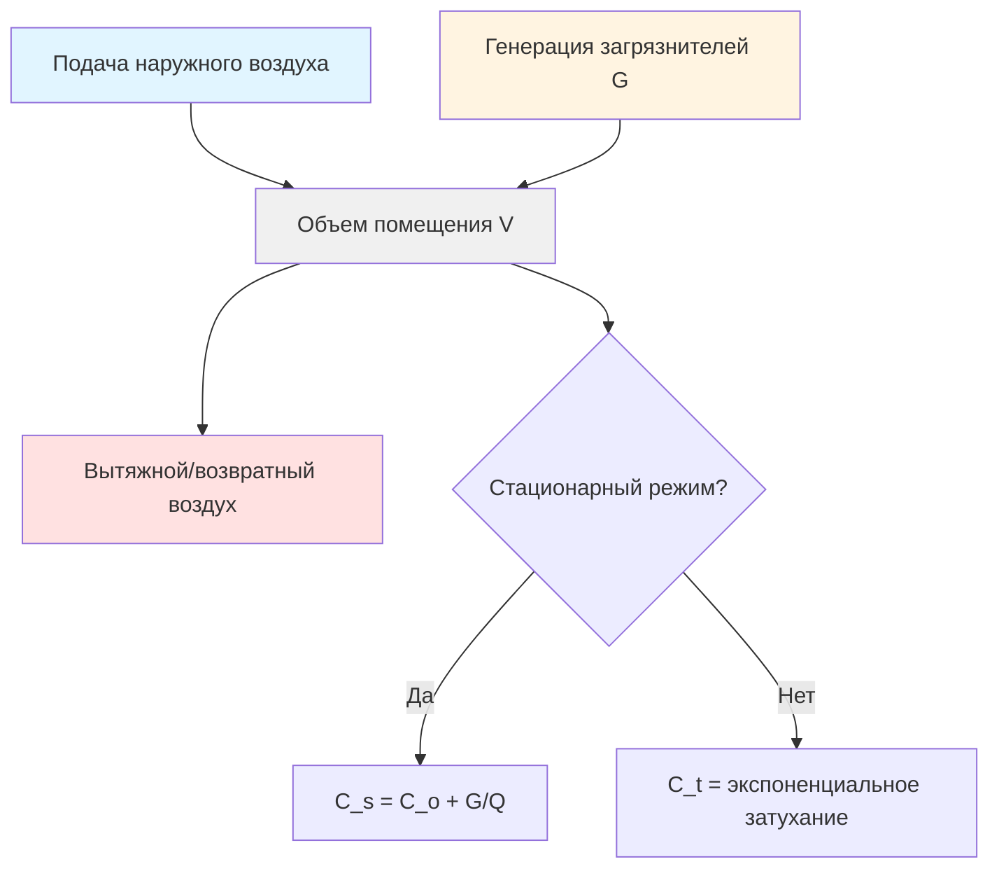

# Принципы и основы вентиляции

Вентиляция — это целенаправленная подача и удаление воздуха для контроля качества воздуха в помещении, температуры и влажности. Правильная вентиляция разбавляет и удаляет загрязнители воздуха, обеспечивая приемлемое качество воздуха в помещении при управлении энергопотреблением.

## Основные механизмы вентиляции

Вентиляция выполняет три основные функции:

- **Разбавление загрязнителей**, генерируемых людьми, материалами и процессами
- **Удаление тепла** от внутренних источников и солнечной радиации
- **Контроль влажности** для поддержания приемлемого уровня влажности

Эффективность вентиляции зависит от взаимодействия подачи наружного воздуха, схем распределения воздуха и скоростей генерации загрязнителей.

## Теория разбавляющей вентиляции

Уравнение стационарного разбавления связывает скорость вентиляции с концентрацией загрязнителей:

$$Q = \frac{G}{C_s - C_o}$$

Где:
- $Q$ = требуемая скорость вентиляции (л/с)
- $G$ = скорость генерации загрязнителей (масса/время)
- $C_s$ = стационарная концентрация в помещении (масса/объем)
- $C_o$ = концентрация наружного воздуха (масса/объем)

Для зависящего от времени затухания загрязнителей применяется экспоненциальная зависимость:

$$C(t) = C_o + (C_i - C_o) \cdot e^{-\frac{Qt}{V}}$$

Где:
- $C(t)$ = концентрация в момент времени $t$
- $C_i$ = начальная концентрация в помещении
- $V$ = объем помещения (м³)
- $t$ = время (часы или секунды)

Это уравнение демонстрирует, что концентрация загрязнителей асимптотически приближается к уровням наружного воздуха, при этом скорость определяется количеством воздухообменов в час ($ACH = Q/V$).

## Метод воздухообменов

Метод воздухообменов определяет вентиляцию как количество полных замен объема воздуха в час:

$$ACH = \frac{Q \times 3600}{V}$$

Для $Q$ в л/с и $V$ в м³.

**Типичные требования к воздухообмену:**

| Тип помещения | Диапазон ACH | Применение |
|------|-----------|---|
| Жилые помещения | 0.35-1.0 | Минимум по ASHRAE 62.2 |
| Офисные помещения | 3-6 | Общая вентиляция |
| Лаборатории | 6-12 | Работа вытяжных шкафов |
| Больницы | 6-15 | Контроль инфекций |
| Промышленные объекты | 4-30 | Зависит от процесса |

Метод воздухообменов прост, но не учитывает плотность людей, скорости генерации загрязнителей или эффективность вентиляции.

## Процедура расчета скорости вентиляции (ASHRAE 62.1)

Стандарт ASHRAE 62.1 устанавливает процедуру расчета скорости вентиляции (VRP), которая рассчитывает требования к наружному воздуху на основе occupancy и площади пола:

$$V_{oz} = R_p \times P_z + R_a \times A_z$$

Где:
- $V_{oz}$ = требование к наружному воздуху для зоны (л/с)
- $R_p$ = скорость подачи наружного воздуха на человека (л/с/чел)
- $P_z$ = население зоны (человеки)
- $R_a$ = скорость подачи наружного воздуха на единицу площади (л/с/м²)
- $A_z$ = площадь пола зоны (м²)

Для систем с несколькими зонами приток наружного воздуха системы должен учитывать эффективность вентиляции:

$$V_{ot} = \frac{\sum V_{oz}}{E_v}$$

Где:
- $V_{ot}$ = общий приток наружного воздуха системы (л/с)
- $E_v$ = эффективность вентиляции (обычно 0.6-1.0)

## Эффективность вентиляции

Эффективность вентиляции количественно определяет, насколько эффективно подаваемый наружный воздух достигает зоны дыхания:

$$\epsilon = \frac{C_e - C_s}{C_e - C_{bz}}$$

Где:
- $\epsilon$ = эффективность вентиляции (безразмерная величина)
- $C_e$ = концентрация вытяжного воздуха
- $C_s$ = концентрация подаваемого воздуха
- $C_{bz}$ = концентрация в зоне дыхания

Идеальное перемешивание обеспечивает $\epsilon = 1.0$. Вытесняющая вентиляция может обеспечивать $\epsilon > 1.0$, тогда как короткое замыкание снижает эффективность ниже 1.0.

## Паттерны распределения воздуха

Паттерны движения воздуха фундаментально влияют на эффективность вентиляции:

## Возраст воздуха и эффективность воздухообмена

Средний возраст воздуха характеризует время пребывания воздуха в помещении:

$$\tau_n = \frac{\int_0^\infty t \cdot C(t) \, dt}{\int_0^\infty C(t) \, dt}$$

Эффективность воздухообмена связывает фактическую производительность с идеальным поршневым потоком:

$$\epsilon_a = \frac{\tau_n^{ideal}}{\tau_n^{actual}} = \frac{V/(2Q)}{\tau_n}$$

Более высокая эффективность воздухообмена указывает на лучшую эффективность вентиляции при заданном расходе воздуха.

## Практические соображения проектирования

Эффективное проектирование вентиляции требует:

1. **Точные расчеты нагрузок** - Определение генерации загрязнителей и режимов occupancy
2. **Соответствующее распределение воздуха** - Выбор конфигураций подачи и возврата для обеспечения требуемой эффективности
3. **Балансировка системы** - Обеспечение достижения расчетных расходов воздуха во всем помещении
4. **Давление в помещениях** - Поддержание соответствующих перепадов давления между зонами
5. **Рекуперация энергии** - Внедрение рекуперации тепла/энергии там, где это экономически обосновано

Выбор между методом воздухообмена и процедурой расхода воздуха зависит от сложности применения, нормативных требований и характеристик загрязнителей. VRP обеспечивает превосходную точность для занятых помещений с переменными нагрузками, тогда как метод воздухообмена остается действительным для промышленных применений с известными скоростями эмиссии.

Понимание этих фундаментальных принципов позволяет обеспечить правильное проектирование систем, устранение проблем с качеством воздуха в помещении и оптимизацию энергоэффективности при поддержании приемлемых условий.
