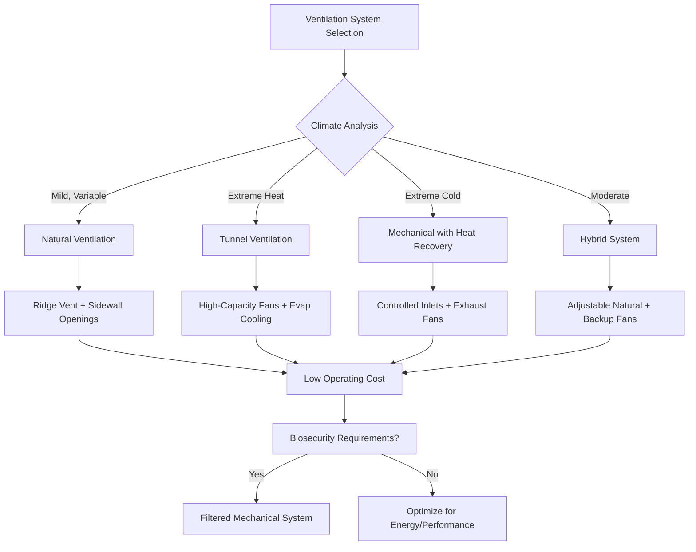

Agricultural ventilation systems maintain thermal comfort, air quality, and animal health through controlled air exchange in livestock housing. Unlike commercial HVAC applications, agricultural facilities face unique challenges including high sensible and latent heat loads from animal metabolism, moisture production from respiration and waste, elevated concentrations of ammonia and particulates, and wide variations in outdoor conditions. Proper ventilation design balances these competing demands while minimizing energy consumption and maintaining biosecurity.

## Fundamental Ventilation Requirements

Ventilation serves three primary functions in livestock facilities: temperature control, moisture removal, and contaminant dilution. Each function imposes different airflow requirements that vary with season, animal size, and housing configuration. The design must accommodate the most demanding condition while providing acceptable performance across all operating scenarios.

Temperature control dominates during warm weather when metabolic heat production exceeds building heat loss. Air exchange removes sensible heat by replacing warm interior air with cooler outdoor air. The required ventilation rate depends on the temperature rise acceptable between inlet and outlet:

$$Q_s = \frac{H_s}{\rho c_p \Delta T}$$

where $Q_s$ is the sensible heat ventilation rate (CFM), $H_s$ represents total sensible heat production (BTU/hr), $\rho$ denotes air density (0.075 lbm/ft³ at standard conditions), $c_p$ equals specific heat of air (0.24 BTU/lbm-°F), and $\Delta T$ is the allowable temperature rise (°F).

Moisture removal becomes critical when humidity control prevents condensation and respiratory disease. Animals produce substantial moisture through respiration and evaporation from wet surfaces. The moisture removal ventilation rate follows:

$$Q_m = \frac{W}{\rho (\omega_{out} - \omega_{in})}$$

where $Q_m$ is the moisture removal rate (CFM), $W$ represents total moisture production (lbm/hr), and $\omega$ denotes humidity ratio (lbm moisture/lbm dry air) for outlet and inlet conditions.

Contaminant dilution maintains acceptable air quality by replacing polluted air with fresh outdoor air. Carbon dioxide, ammonia, and dust concentrations must remain below thresholds that impair animal health and performance. Minimum ventilation rates based on animal mass or building volume ensure adequate dilution regardless of thermal conditions.

## Ventilation Rate Determination

Agricultural ventilation rates vary dramatically with season and animal growth stage. Design calculations must establish requirements for summer maximum, winter minimum, and transitional conditions.

| Season | Condition | Typical Rate | Controlling Factor |
|--------|-----------|--------------|-------------------|
| Summer | Maximum ventilation | 100-200 CFM/animal | Sensible heat removal |
| Winter | Minimum ventilation | 5-15 CFM/animal | Moisture and contaminant dilution |
| Spring/Fall | Transition | 30-60 CFM/animal | Variable thermal loads |

Summer ventilation rates depend on acceptable temperature rise above ambient. Conservative design limits indoor temperatures to 5-7°F above outdoor during peak conditions. Evaporative cooling systems allow higher ventilation rates and air velocities that increase effective temperature reduction through convective heat transfer from animal surfaces.

Winter ventilation provides minimum air exchange for moisture removal without excessive heat loss. Cold climate facilities require heated ventilation air or heat recovery systems to prevent condensation on building surfaces. Animals produce moisture at rates proportional to body mass and metabolic rate. A 150-pound market hog generates approximately 0.5-0.7 lbm/hr of moisture, while a 1,400-pound dairy cow produces 2.5-3.5 lbm/hr.

## Air Distribution Principles

Effective ventilation requires uniform air distribution that prevents dead zones, drafts, and temperature stratification. Air movement patterns depend on inlet design, outlet location, and the driving force (natural buoyancy or mechanical fans).

Inlet air velocity and direction determine initial mixing characteristics. High-velocity jets penetrate further into the building before losing momentum and dropping to animal level. The throw distance for a free jet follows:

$$L = V_0 \left(\frac{A_0}{K}\right)^{0.5}$$

where $L$ represents throw distance (ft), $V_0$ is initial velocity (ft/min), $A_0$ equals inlet area (ft²), and $K$ is an empirical coefficient (typically 5-7 for agricultural inlets).

Wall inlets should direct air upward along the ceiling during cold weather to allow warming before reaching animals. Summer operation directs air horizontally or downward for maximum mixing and velocity at animal level. Adjustable inlet louvers accommodate seasonal requirements.

Temperature stratification develops when buoyancy forces overcome mixing energy. Warm air accumulates near the ceiling while cold air settles at floor level. The temperature difference between ceiling and floor depends on heat source distribution and ventilation effectiveness:

$$\Delta T_{vertical} = \frac{H_s}{Q \rho c_p} \times \frac{h}{L_{mix}}$$

where $h$ is building height and $L_{mix}$ represents characteristic mixing length determined by inlet configuration.

## System Selection Methodology

Agricultural ventilation systems fall into three categories: natural ventilation utilizing wind and buoyancy forces, mechanical ventilation with powered fans, and hybrid systems combining both approaches. Selection depends on climate, building size, animal density, and operational preferences.

Natural ventilation suits moderate climates with manageable summer temperatures and adequate wind resources. Capital costs remain low, and no electrical consumption occurs during favorable weather. However, performance depends entirely on weather conditions, and precise environmental control proves impossible.

Mechanical ventilation provides reliable performance regardless of outdoor conditions. Fan capacity and staging accommodate widely varying airflow requirements. Negative pressure operation improves biosecurity by preventing unfiltered air entry. The primary disadvantages include higher capital and operating costs and total system failure during power outages.

Tunnel ventilation represents a specialized mechanical approach for high-density housing in hot climates. Large fans at one building end draw air through the entire length at 400-700 ft/min, creating significant wind chill effects. Evaporative cooling pads at the inlet further reduce incoming air temperature.

Hybrid systems use natural ventilation during favorable conditions and mechanical assistance when natural driving forces prove insufficient. Automated controls manage the transition between modes based on temperature, humidity, and ventilation effectiveness.

## Physical Principles Governing Performance

Natural ventilation relies on two driving forces: stack effect from temperature differences and wind pressure. These forces can work together or oppose each other depending on wind direction and building orientation.

Stack effect develops when indoor air temperature exceeds outdoor temperature, creating a density difference. Warm air rises and exits through upper openings while cool air enters through lower openings. The pressure difference driving this flow equals:

$$\Delta P_{stack} = h \times (\rho_{out} - \rho_{in}) \times g = h \times \rho_{out} \times g \times \left(1 - \frac{T_{out}}{T_{in}}\right)$$

where $h$ is the vertical distance between inlet and outlet (ft), $g$ represents gravitational acceleration (32.2 ft/s²), and temperatures are in absolute units (°R = °F + 460).

Wind pressure on building surfaces depends on wind velocity and direction relative to the building. Windward surfaces experience positive pressure while leeward surfaces see negative pressure:

$$\Delta P_{wind} = C_p \times \frac{\rho V^2}{2}$$

where $C_p$ is the pressure coefficient (-0.6 to +0.8 for agricultural buildings) and $V$ represents wind velocity (ft/min).

Mechanical ventilation systems create controlled pressure differences through fan operation. Negative pressure systems exhaust air from the building, creating suction that draws fresh air through designed inlets. Positive pressure systems force air into the building, creating internal pressure that pushes air out through outlets.

## Energy Efficiency Considerations

Ventilation energy consumption includes fan electrical power and thermal energy for heating or cooling ventilation air. Total annual energy costs depend on climate severity, system design, and control strategies.

Fan power requirements follow standard fan laws, with power proportional to airflow and pressure rise:

$$P_{fan} = \frac{Q \times \Delta P}{6356 \times \eta_{fan}}$$

where $P_{fan}$ is shaft power (HP), $Q$ is airflow (CFM), $\Delta P$ represents total pressure rise (in. w.g.), and $\eta_{fan}$ equals fan efficiency (typically 0.45-0.65 for agricultural fans).

Thermal energy for ventilation air heating dominates in cold climates:

$$Q_{heat} = 1.08 \times CFM \times (T_{in} - T_{out})$$

where $Q_{heat}$ is in BTU/hr and temperatures are in °F.

Effective control systems minimize energy consumption while maintaining acceptable conditions. Variable-speed fans adjust airflow to match instantaneous requirements rather than cycling on/off. Heat exchangers recover warmth from exhaust air to preheat cold incoming air, reducing supplemental heating needs.

Agricultural ventilation represents a specialized discipline requiring integration of animal science, building physics, and mechanical engineering principles. Successful designs accommodate extreme load variations, harsh environments, and stringent biosecurity requirements while maintaining economic viability for agricultural operations.
