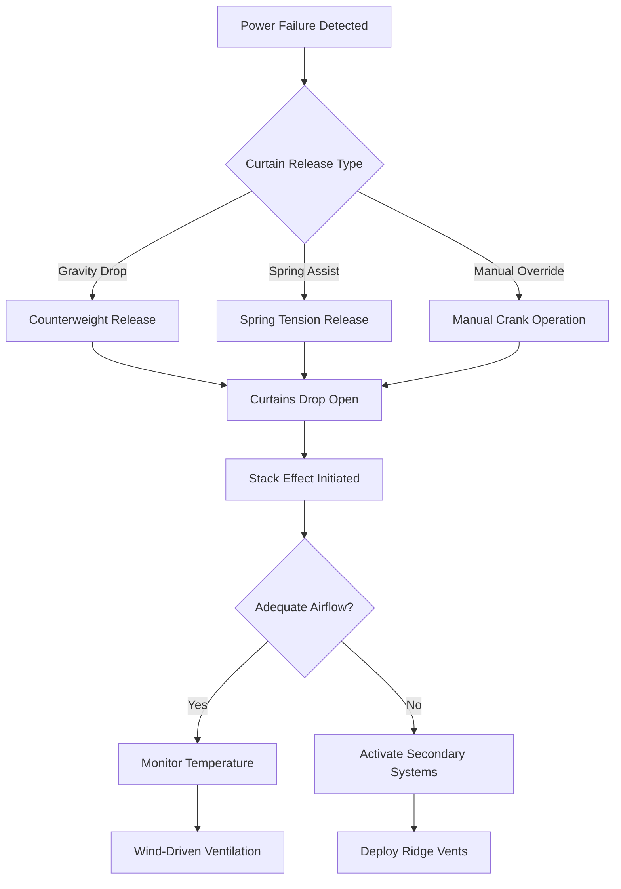
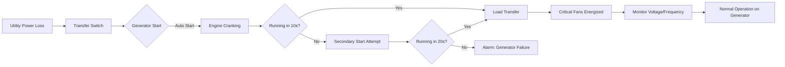

## Overview

Emergency ventilation systems provide life-critical airflow when primary mechanical ventilation fails in confined animal facilities. Power outages lasting just 15-30 minutes can result in catastrophic heat stress and mortality in modern high-density livestock operations. Emergency provisions must activate automatically and provide sufficient ventilation to prevent animal distress until power restoration or evacuation.

## Physics of Ventilation Failure

### Heat Accumulation Rate

When mechanical ventilation ceases, sensible heat from animals accumulates according to:

$$\frac{dT}{dt} = \frac{q_{sensible} \cdot N}{m_{air} \cdot c_p}$$

Where:
- $\frac{dT}{dt}$ = temperature rise rate (°F/min or °C/min)
- $q_{sensible}$ = sensible heat production per animal (BTU/hr or W)
- $N$ = number of animals
- $m_{air}$ = air mass in building (lb or kg)
- $c_p$ = specific heat of air (0.24 BTU/lb·°F or 1.005 kJ/kg·°C)

**Example Calculation:** A 40 ft × 200 ft poultry house with 8 ft ceiling height contains 64,000 ft³ of air (mass ≈ 4,800 lb at standard conditions). With 20,000 broilers each producing 15 BTU/hr sensible heat:

$$\frac{dT}{dt} = \frac{15 \times 20,000}{4,800 \times 0.24} = \frac{300,000}{1,152} = 260 \text{ °F/hr} \approx 4.3 \text{ °F/min}$$

This demonstrates how rapidly conditions become lethal without ventilation.

### Critical Time Window

The allowable time before animal distress depends on initial temperature and species thermal tolerance:

$$t_{critical} = \frac{T_{stress} - T_{initial}}{\frac{dT}{dt}}$$

For poultry at 75°F initial temperature with heat stress threshold at 90°F and the rate above, critical time is approximately 3.5 minutes.

## Emergency Ventilation Systems

### Natural Ventilation Fallback

#### Stack Effect Ventilation

Natural ventilation relies on thermal buoyancy:

$$Q_{stack} = C_d \cdot A \cdot \sqrt{2 \cdot g \cdot h \cdot \frac{\Delta T}{T_{avg}}}$$

Where:
- $Q_{stack}$ = volumetric airflow (CFM or m³/s)
- $C_d$ = discharge coefficient (0.6-0.65 typical)
- $A$ = effective opening area (ft² or m²)
- $g$ = gravitational acceleration (32.2 ft/s² or 9.81 m/s²)
- $h$ = vertical distance between inlet and outlet (ft or m)
- $\Delta T$ = indoor-outdoor temperature difference (°F or °C)
- $T_{avg}$ = average absolute temperature (°R or K)

**Design Requirement:** Size openings to provide minimum 25% of mechanical ventilation capacity under 10°F temperature differential.

### Curtain Drop Systems

| Component | Specification | Activation Time |
|-----------|---------------|-----------------|
| Gravity counterweight | 1.5:1 weight ratio | < 30 seconds |
| Spring-assisted release | 50-100 lb tension | < 15 seconds |
| Electromagnetic lock | 24V DC fail-safe | < 5 seconds |
| Manual override crank | 10:1 gear reduction | 2-3 minutes |
| Side curtain area | 15-25% wall area | N/A |
| Ridge vent opening | 1.5-2.5 ft width | < 60 seconds |

#### Curtain Sizing

Minimum curtain opening area:

$$A_{curtain} = \frac{Q_{min}}{V_{air} \cdot C_d}$$

For $Q_{min}$ = 25% of summer mechanical ventilation rate and $V_{air}$ = 200-400 FPM (1-2 m/s) natural air velocity.

### Backup Power Systems

#### Generator Sizing

Total load calculation:

$$P_{generator} = 1.25 \times (P_{fans} + P_{controls} + P_{lights} + P_{aux})$$

The 1.25 multiplier accounts for starting inrush current and reserves capacity.

**Minimum Fan Capacity:** Size backup generator to power sufficient fans for 1.0-1.5 CFM/lb animal live weight or 50% of summer ventilation capacity, whichever is greater.

| Animal Type | Emergency Ventilation (CFM/lb) | Generator Priority |
|-------------|--------------------------------|-------------------|
| Broiler chickens | 0.8-1.2 | High (< 5 min critical) |
| Layer hens | 0.9-1.3 | High (< 5 min critical) |
| Nursery pigs | 2-3 | High (< 10 min critical) |
| Finish hogs | 3-5 | High (< 8 min critical) |
| Dairy cattle | 50-200 CFM/animal | Medium (< 30 min critical) |

### Alarm Systems

Multi-stage alarm configuration:

**Stage 1: Power Failure**
- Activation: Immediate upon utility power loss
- Alert: Local audible alarm, auto-dialer notification
- Action: Curtain release initiated, generator start sequence

**Stage 2: High Temperature**
- Activation: Temperature exceeds setpoint + 5°F
- Alert: Escalated notifications, text/email alerts
- Action: Verify emergency systems deployed

**Stage 3: Critical Temperature**
- Activation: Temperature exceeds setpoint + 10°F
- Alert: Emergency contacts, continuous alarm
- Action: Manual intervention required, possible evacuation

### Temperature Monitoring

Deploy redundant temperature sensors:

$$\Delta T_{alarm} = \frac{q_{total} \cdot t_{response}}{m_{air} \cdot c_p}$$

Set alarm thresholds based on expected temperature rise during system response time.

**Sensor Placement:**
- Animal level (18-24 inches above floor)
- Exhaust airstream (verify fan operation)
- External reference (ambient conditions)
- Redundant sensors (2+ per zone)

## Animal Welfare Considerations

### Thermal Stress Progression

| Stage | Temperature Above Comfort | Physiological Response | Time to Onset |
|-------|---------------------------|------------------------|---------------|
| Mild stress | 5-8°F | Increased respiration | 5-10 minutes |
| Moderate stress | 8-12°F | Panting, reduced feed intake | 10-20 minutes |
| Severe stress | 12-18°F | Prostration, open-mouth breathing | 20-40 minutes |
| Life-threatening | >18°F | Organ failure, mortality | 40-90 minutes |

### Emergency Response Protocol

1. **Immediate (0-2 minutes):** Confirm curtain deployment and generator start
2. **Short-term (2-10 minutes):** Verify adequate airflow, monitor temperature trend
3. **Medium-term (10-30 minutes):** Assess animal behavior, prepare for evacuation if needed
4. **Extended (>30 minutes):** Implement water fogging, reduce stocking density, provide supplemental cooling

## Design Standards

**ASABE Standards:**
- EP270.5: Design of Ventilation Systems for Poultry and Livestock Shelters
- EP296.3: General Terminology for Tractor PTO Power Take-Off Drives
- S430: Heating, Ventilating and Cooling Greenhouses

**MWPS (Midwest Plan Service):**
- MWPS-1: Structures and Environment Handbook

**Minimum Requirements:**
- Automatic curtain release on power failure
- Backup power or natural ventilation for ≥50% summer capacity
- Alarm system with remote notification
- Monthly testing of emergency systems
- Annual inspection and maintenance

## Maintenance Protocol

**Weekly:**
- Test alarm system functionality
- Inspect curtain cables and pulleys

**Monthly:**
- Exercise generator under load (30 minutes minimum)
- Test automatic transfer switch
- Verify curtain release mechanisms

**Annually:**
- Generator oil/filter change and tune-up
- Replace batteries in alarm system
- Inspect and lubricate all mechanical linkages
- Calibrate temperature sensors

Emergency ventilation reliability directly determines livestock survival during power failures. Properly designed systems provide automatic, fail-safe protection with multiple redundant mechanisms to ensure animal welfare under all foreseeable failure scenarios.
