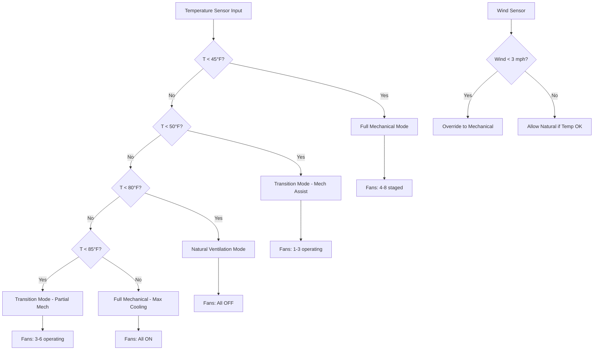

Hybrid ventilation systems combine natural ventilation during favorable weather conditions with mechanical fan assistance when natural driving forces prove insufficient. This approach optimizes energy consumption by eliminating fan operation during mild weather while ensuring reliable ventilation across all seasonal conditions through automated mode switching based on temperature, humidity, and ventilation effectiveness.

## System Architecture

Hybrid systems integrate components from both natural and mechanical approaches:

**Natural Ventilation Elements:**
- Adjustable sidewall curtains or inlet panels
- Ridge vents or gable end openings
- Eave inlets for stack effect operation

**Mechanical Ventilation Elements:**
- Exhaust fans (typically 4-8 units)
- Ceiling or sidewall mechanical inlets
- Variable speed drives for capacity modulation

**Control System:**
- Temperature sensors (multiple zones)
- Static pressure transducer
- Automated curtain winches or actuators
- Fan staging controller

## Mode Switching Criteria

The system operates in distinct modes based on outdoor conditions and ventilation requirements:

### Natural Ventilation Mode

**Activation Criteria:**
- Outdoor temperature: 50-80°F
- Wind speed: > 3 mph
- Indoor-outdoor temperature difference: > 10°F (winter)
- Ventilation requirement: < 60% of maximum

**Operation:**
- All fans OFF
- Curtains or inlets adjusted to achieve target airflow
- Ridge vents fully open
- Free cooling through buoyancy and wind

### Transition Mode

**Activation Criteria:**
- Outdoor temperature: 45-50°F or 80-85°F
- Variable wind conditions
- Ventilation requirement: 60-85% of maximum

**Operation:**
- Minimum fans operating (1-3 fans)
- Curtains partially open
- Supplemental mechanical assistance
- Hybrid natural + mechanical airflow

### Full Mechanical Mode

**Activation Criteria:**
- Outdoor temperature: < 45°F or > 85°F
- Calm conditions (wind < 3 mph)
- Ventilation requirement: > 85% of maximum
- Precise environmental control needed

**Operation:**
- Staged fan operation (4-8 fans)
- Curtains closed, mechanical inlets active
- Full environmental control
- Winter minimum ventilation or summer maximum cooling

## Control Sequence Logic

## Curtain Control Strategy

Automated curtain management optimizes opening area for current conditions:

**Curtain Position Algorithm:**

$$A_{opening} = \frac{Q_{required}}{9.4 \cdot \sqrt{h \cdot \Delta T + k \cdot V_{wind}^2}}$$

where:
- $A_{opening}$ = required opening area (ft²/ft of building)
- $Q_{required}$ = target ventilation rate (CFM per ft of length)
- $h$ = vertical opening separation (ft)
- $\Delta T$ = indoor-outdoor temperature difference (°F)
- $k$ = wind effect coefficient (0.1-0.2)
- $V_{wind}$ = wind velocity (mph)

**Position Control Table:**

| Temp (°F) | Wind (mph) | Curtain Drop | Fans Operating | Mode |
|-----------|-----------|--------------|----------------|------|
| < 40 | Any | 3-6 inches | 4-6 | Full Mechanical |
| 40-50 | < 5 | 1-2 ft | 2-4 | Transition |
| 40-50 | > 5 | 2-3 ft | 0-2 | Natural + Assist |
| 50-70 | < 5 | 3-4 ft | 1-2 | Transition |
| 50-70 | > 5 | 4-5 ft | 0 | Full Natural |
| 70-80 | Any | Fully open | 0-2 | Natural |
| > 80 | Any | Fully open | 4-8 | Mechanical Cooling |

## Energy Optimization

Hybrid systems reduce energy consumption by eliminating fan operation during favorable natural ventilation periods.

**Fan Energy Calculation:**

Annual fan energy (kWh) = $\sum_{i=1}^{n} P_i \cdot h_i \cdot 0.746$

where $P_i$ is fan power (HP) and $h_i$ is hours of operation for mode $i$.

**Comparative Analysis:**

| System Type | Annual Fan Operating Hours | Energy (kWh) | Cost @ $0.10/kWh |
|-------------|---------------------------|--------------|------------------|
| Full Mechanical | 6,500 | 32,500 | $3,250 |
| Hybrid (70% natural) | 1,950 | 9,750 | $975 |
| **Savings** | **4,550** | **22,750** | **$2,275** |

For a 10 HP total fan load in 500-head finishing barn: **$4.55 savings per pig annually**

## Minimum Ventilation Requirements

Cold weather operation maintains minimum air exchange for air quality while minimizing heat loss:

**Timer-Based Minimum Ventilation:**

Instead of continuous low-rate operation, intermittent cycling optimizes air exchange:

$$\text{Duty Cycle} = \frac{Q_{min}}{Q_{fan}}$$

where $Q_{min}$ is minimum ventilation requirement and $Q_{fan}$ is single fan capacity.

**Example:**

Minimum requirement: 15,000 CFM
Single fan capacity: 30,000 CFM
Duty cycle: 15,000 / 30,000 = 50%

Operating pattern: 2 minutes ON, 2 minutes OFF

**Advantages:**
- Higher air exchange effectiveness
- Reduced stratification
- Better moisture removal per CFM
- Prevents continuous draft

## Seasonal Transition Management

Hybrid systems excel during spring and fall when daily temperature swings are large:

**Daily Operating Pattern (Spring Day):**

| Time | Outdoor Temp | Mode | Curtain | Fans |
|------|--------------|------|---------|------|
| 6 AM | 45°F | Mechanical | Closed | 3 |
| 9 AM | 55°F | Transition | 1 ft | 1 |
| 12 PM | 65°F | Natural | 3 ft | 0 |
| 3 PM | 70°F | Natural | 4 ft | 0 |
| 6 PM | 62°F | Natural | 3 ft | 0 |
| 9 PM | 52°F | Transition | 1 ft | 1 |
| 12 AM | 48°F | Mechanical | 6 in | 2 |

**Energy Savings:** 12 hours natural operation eliminates 60 kWh daily fan energy (10 HP × 12 hr × 0.746 × 50% load).

## Building Design Considerations

Hybrid systems require building features accommodating both natural and mechanical modes:

**Critical Design Elements:**

1. **Adequate ridge vent capacity:** 150-250 in²/ft of building length
2. **Adjustable sidewall openings:** Motorized curtains or baffle panels
3. **Mechanical inlet integration:** Ceiling inlets for mechanical mode
4. **Fan placement:** End wall or sidewall for cross-flow capability
5. **Building orientation:** Long axis perpendicular to prevailing summer winds
6. **Ceiling height:** Minimum 10-12 ft for stack effect

**Opening Area Requirements:**

Total sidewall opening area:

$$A_{sidewall} = 1.5 \times A_{ridge}$$

For 200 in²/ft ridge vent:
Sidewall area = 300 in²/ft per side = 2.08 ft²/ft

## Performance Verification

**Commissioning Checklist:**

- [ ] Verify natural ventilation airflow rates at design conditions
- [ ] Measure static pressure in mechanical mode (-0.05 to -0.15 in. w.c.)
- [ ] Test curtain positioning accuracy (±3 inches)
- [ ] Validate temperature-based mode switching
- [ ] Confirm fan staging sequence
- [ ] Verify minimum ventilation timer operation
- [ ] Check humidity control performance
- [ ] Document transition mode performance

**Monitoring Parameters:**

1. Daily mode operating hours (natural vs mechanical)
2. Energy consumption by mode
3. Indoor temperature variation (target ±3°F)
4. Humidity levels (target 50-70% RH)
5. Air quality indicators (CO₂, NH₃)

## Economic Analysis

**Additional Investment vs Full Mechanical:**

- Motorized curtain system: +$15-25 per ft of building
- Automated controllers: +$2,000-4,000
- Ridge vent system: +$8-12 per ft
- **Total premium: $3,000-6,000 for 200 ft barn**

**Annual Savings:**

- Fan energy: $2,000-2,500
- Heating energy (reduced infiltration in winter): $500-800
- Maintenance (reduced fan wear): $200-400
- **Total savings: $2,700-3,700**

**Payback period: 1.2-2.2 years**

## Best Practices

**Successful Implementation:**

1. **Size mechanical capacity for worst case:** Design fans for peak cooling, not average
2. **Provide adequate natural openings:** Don't compromise natural mode for mechanical
3. **Use reliable sensors:** Temperature and wind measurement critical
4. **Smooth transitions:** Avoid abrupt mode changes that stress animals
5. **Regular calibration:** Verify curtain positions and fan performance
6. **Backup power:** Generator for mechanical mode during outages

**Common Pitfalls:**

- Insufficient ridge vent area (limits natural mode)
- Poor curtain maintenance (prevents proper positioning)
- Inadequate controls (erratic mode switching)
- Undersized mechanical capacity (inadequate backup)
- Improper building orientation (reduces natural ventilation effectiveness)

---

*Hybrid natural-mechanical ventilation systems optimize energy consumption and environmental control by intelligently switching between natural ventilation during favorable conditions and mechanical operation when required, achieving 60-70% energy savings while maintaining reliable livestock housing environmental performance.*
