Biosecurity HVAC systems represent specialized environmental control strategies designed to prevent airborne disease transmission in livestock facilities through controlled air pressure differentials, mechanical filtration, and building envelope management. These systems function as the primary barrier against viral and bacterial pathogens that can devastate animal populations, with particular emphasis on diseases such as Porcine Reproductive and Respiratory Syndrome (PRRS), Avian Influenza, and Porcine Epidemic Diarrhea Virus (PEDV).

```mermaid
graph TB
    subgraph "Positive Pressure Biosecurity System"
        A[Outdoor Air] -->|Pre-Filter MERV 8| B[Air Handler Unit]
        B -->|MERV 13 Filter| C[HEPA H13 Filter]
        C -->|Supply Fan| D[Pressurized Plenum]
        D -->|+0.05 in w.c.| E[Livestock Space]
        E -->|Leakage Flow| F[Building Envelope Gaps]
        F --> G[Exterior Environment]

        H[Pressure Transmitter] -.->|Monitor| E
        H -.->|Control Signal| C
    end

    subgraph "Negative Pressure Biosecurity System"
        I[Outdoor Air] -->|Filtered Inlet MERV 13| J[Livestock Space]
        J -->|Exhaust Fan| K[Exterior]
        J -->|Vacuum -0.03 in w.c.| L[Building Envelope]

        M[Differential Pressure Sensor] -.->|Monitor| J
        M -.->|Control Signal| J
    end

    style E fill:#e1f5e1
    style J fill:#ffe1e1
    style C fill:#fff4e1
    style I fill:#e1f0ff
```



## Airborne Disease Transmission Fundamentals

Pathogen transmission through air occurs via three primary mechanisms: aerosol transport of viral particles, dust-borne bacterial contamination, and bioaerosol droplet nuclei movement. The critical particle size range for viral transmission spans 0.3 to 10 micrometers, where particles remain suspended in airstreams long enough to travel significant distances while being small enough to penetrate deep into animal respiratory systems.

The Wells-Riley equation describes airborne infection probability:

```
P = 1 - e^(-Iqpt/Q)
```

Where:
- P = probability of infection
- I = number of infectious individuals
- q = quanta generation rate (quanta/hour)
- p = pulmonary ventilation rate (m³/hour)
- t = exposure time (hours)
- Q = room ventilation rate (m³/hour)

This relationship demonstrates why ventilation rate control remains fundamental to biosecurity protection, as doubling the air change rate proportionally reduces infection probability.

## Pressure Differential Control Theory

Biosecurity systems maintain controlled pressure differentials between livestock spaces and the external environment to govern airflow direction. The pressure differential across the building envelope follows:

```
ΔP = ρ × (v₂²- v₁²) / 2 + ρ × g × Δh + ΔP_friction
```

Where:
- ΔP = total pressure differential (Pa)
- ρ = air density (kg/m³)
- v = air velocity (m/s)
- g = gravitational acceleration (9.81 m/s²)
- Δh = height difference (m)
- ΔP_friction = frictional losses

Practical biosecurity applications maintain static pressure differentials between 0.02 and 0.08 inches water column (5 to 20 Pa). The specific target depends on building tightness and filtration strategy:

| Pressure Strategy | Target Differential | Application | Air Change Rate |
|------------------|---------------------|-------------|-----------------|
| Negative Pressure | -0.02 to -0.05 in. w.c. | Retrofit facilities | 0.5-2 cfm/ft² |
| Positive Pressure | +0.03 to -0.08 in. w.c. | New construction | 0.8-3 cfm/ft² |
| Neutral with Filtration | ±0.01 in. w.c. | Hybrid systems | 1-4 cfm/ft² |

### Negative Pressure Filtration Systems

Negative pressure biosecurity operates by creating building depressurization through mechanical exhaust, forcing all incoming air through filtered inlets. The air change rate calculation:

```
ACH = (Q × 60) / V
```

Where:
- ACH = air changes per hour
- Q = volumetric flow rate (CFM)
- V = building volume (cubic feet)

For a typical 40×200 foot swine facility with 12-foot ceiling height (96,000 ft³), achieving 24 ACH winter minimum requires:

```
Q = (24 × 96,000) / 60 = 38,400 CFM total exhaust capacity
```

This exhaust volume must enter through filtered inlets sized to maintain target negative pressure while providing adequate filtration area to prevent excessive velocity that would reduce filter efficiency.

### Positive Pressure Filtration Systems

Positive pressure systems force filtered air into the building, creating slight pressurization that prevents unfiltered air infiltration through envelope cracks and openings. The required supply airflow accounts for both ventilation needs and leakage compensation:

```
Q_supply = Q_ventilation + Q_leakage
```

Where leakage flow depends on building tightness and pressure differential:

```
Q_leakage = C × A × √(ΔP)
```

Where:
- C = air leakage coefficient (CFM/ft² at 1 in. w.c.)
- A = building envelope area (ft²)
- ΔP = pressure differential (in. w.c.)

For tight construction (C = 0.10), moderate construction (C = 0.25), and loose construction (C = 0.50), maintaining 0.05 in. w.c. positive pressure in a 10,000 ft² envelope facility requires:

- Tight: Q_leakage = 0.10 × 10,000 × √0.05 = 224 CFM
- Moderate: Q_leakage = 0.25 × 10,000 × √0.05 = 559 CFM
- Loose: Q_leakage = 0.50 × 10,000 × √0.05 = 1,118 CFM

This demonstrates why [building sealing strategies](building-sealing-strategies/) remain critical to positive pressure system efficiency.

## HEPA Filtration for Agricultural Biosecurity

High-Efficiency Particulate Air (HEPA) filters provide the highest level of pathogen removal for critical biosecurity applications. HEPA H13 filters capture 99.95% of particles at the Most Penetrating Particle Size (MPPS) of 0.3 micrometers, directly addressing viral aerosol transmission.

### Filtration Efficiency Requirements by Pathogen Type

| Pathogen Class | Particle Size Range | Minimum Filter Rating | Capture Efficiency | Pressure Drop |
|----------------|---------------------|----------------------|-------------------|---------------|
| Bacteria | 0.5 - 10 μm | MERV 13 | 85% @ 0.3-1.0 μm | 0.4 - 0.8 in. w.c. |
| Viruses (airborne) | 0.02 - 0.3 μm | MERV 16 / HEPA H13 | 95% / 99.95% | 0.8 - 1.5 in. w.c. |
| Fungal Spores | 2 - 20 μm | MERV 11 | 65% @ 1.0-3.0 μm | 0.3 - 0.6 in. w.c. |
| Bioaerosol Droplets | 1 - 100 μm | MERV 8 | 20% @ 3.0-10.0 μm | 0.2 - 0.4 in. w.c. |

HEPA filter selection balances pathogen capture against pressure drop penalties. A typical biosecurity air handler operating at 10,000 CFM with HEPA H13 filters requires:

```
Face Velocity = Q / A_filter
Target: 250 fpm for HEPA longevity

A_filter = 10,000 CFM / 250 fpm = 40 ft²
```

At 1.2 in. w.c. pressure drop per HEPA filter bank, fan power increases by:

```
Power = (Q × ΔP) / (6356 × η_fan)
Power = (10,000 × 1.2) / (6356 × 0.65) = 2.9 HP additional
```

### Multi-Stage Filtration Configuration

Multi-stage filtration systems achieve superior viral particle capture through sequential efficiency multiplication:

```
η_total = 1 - [(1 - η₁) × (1 - η₂) × (1 - η₃)]
```

For a three-stage system with MERV 8 (30%), MERV 13 (75%), and HEPA H13 (99.95%) filters:

```
η_total = 1 - [(1 - 0.30) × (1 - 0.75) × (1 - 0.9995)]
η_total = 1 - [0.70 × 0.25 × 0.0005] = 1 - 0.0000875 = 0.999912 or 99.99%
```

This demonstrates the advantage of multi-stage configurations over single-stage filtration for [virus filtration systems](virus-filtration-systems/). The pre-filters extend HEPA service life by capturing larger particulates and reducing dust loading.

## System Configuration Comparison

| Parameter | Negative Pressure | Positive Pressure |
|-----------|------------------|-------------------|
| Air Direction Control | Inward through filters | Outward through leaks |
| Building Tightness Requirement | Moderate | Critical |
| Retrofit Suitability | Excellent | Poor |
| Filter Location | Distributed inlets | Centralized AHU |
| Pressure Stability | Weather-dependent | Fan-controlled |
| Capital Cost | Lower | Higher |
| Maintenance Access | Multiple locations | Single location |
| Emergency Backup | Natural ventilation | Requires generator |

## Infiltration and Exfiltration Control

Uncontrolled air movement through the building envelope undermines biosecurity protection by allowing pathogen entry or creating unfiltered exit paths. The infiltration rate depends on crack geometry and pressure differential:

```
Q_crack = K × L × W × ΔP^n
```

Where:
- K = flow coefficient
- L = crack length
- W = crack width
- n = flow exponent (0.5-1.0)

A 1/8-inch crack around a 3×7 foot door (240 inches perimeter) at 0.05 in. w.c. differential allows approximately 180 CFM infiltration, equivalent to wasting the filtered air for 12 square feet of MERV 16 filter area. This emphasizes why [infiltration-exfiltration control](infiltration-exfiltration-control/) requires comprehensive envelope sealing.

## Air Change Rate Requirements

Biosecurity facilities must balance pathogen dilution against energy consumption and filtration capacity:

| Facility Type | Minimum ACH | Target ACH | Maximum ACH |
|---------------|-------------|------------|-------------|
| Swine Farrowing | 12 | 24 | 60 |
| Swine Nursery | 20 | 40 | 100 |
| Poultry Broiler | 24 | 48 | 120 |
| Poultry Layer | 18 | 36 | 80 |

Higher air change rates provide superior pathogen dilution but increase filtration system size, pressure drop, and fan energy consumption. The optimal balance depends on disease prevalence, animal density, and economic factors.

## Air Treatment Technologies for Pathogen Inactivation

Beyond mechanical filtration, supplementary air treatment technologies provide additional biosecurity layers:

| Technology | Mechanism | Pathogen Reduction | Application Point | Maintenance |
|------------|-----------|-------------------|-------------------|-------------|
| UV-C Irradiation (254 nm) | DNA/RNA disruption | 90-99.9% viruses/bacteria | Return air / exhaust | Lamp replacement 9-12 months |
| Bipolar Ionization | Reactive ion species | 70-95% airborne pathogens | Supply air stream | Annual electrode cleaning |
| Photocatalytic Oxidation | OH radical generation | 85-99% VOCs and bioaerosols | AHU section | Catalyst replacement 2-3 years |
| Thermal Treatment | Heat inactivation >160°F | 99.99% all pathogens | Dedicated heat chamber | Minimal |

UV-C systems sized for biosecurity applications require minimum dosage of 1,000 μW-s/cm² for viral inactivation. The required lamp wattage calculation:

```
UV_dose = (Lamp_power × Efficiency × Time) / (Q × Cross_section)

For 10,000 CFM and 1,000 μW-s/cm² target:
Lamp_power = 1,200 W minimum with 40% efficiency rating
```

UV-C treatment complements HEPA filtration by inactivating pathogens that penetrate filters and provides continuous disinfection of recirculated air.

## Agricultural Biosecurity Standards and Compliance

Biosecurity HVAC systems must align with regulatory frameworks and industry best practices:

### USDA APHIS Veterinary Services Guidelines
- Swine Health Protection Program requirements for filtered air in high-health herds
- Avian Influenza prevention protocols mandating controlled ventilation
- Foreign Animal Disease preparedness standards for containment ventilation

### National Pork Board Biosecurity Protocols
- Minimum MERV 13 filtration for replacement gilts and boar studs
- Pressure differential maintenance requirements (±0.02 in. w.c. continuous)
- Air exchange rate specifications based on animal density and health status

### Pressure Differential Monitoring Requirements

| Facility Type | Monitoring Frequency | Alarm Setpoint | Response Time | Documentation |
|---------------|---------------------|----------------|---------------|---------------|
| Nucleus/Multiplier | Continuous (digital) | ±0.01 in. w.c. deviation | Immediate alert | 15-minute intervals |
| Breeding Stock | Every 4 hours | ±0.015 in. w.c. deviation | 1 hour response | Daily logs |
| Production | Daily manual check | ±0.02 in. w.c. deviation | 24 hour response | Weekly records |

Continuous monitoring systems integrate with building automation to provide real-time biosecurity status verification and automated alarm notification when pressure differentials fall outside acceptable ranges.

## Building Envelope Sealing Requirements

Effective biosecurity demands envelope air leakage rates below 0.25 CFM/ft² at 0.3 in. w.c., achievable through:

- Continuous air barriers in wall and roof assemblies
- Sealed penetrations for utilities, equipment, and structural members
- Gasketed or weatherstripped doors and access panels
- Sealed electrical and plumbing penetrations
- Continuous foundation-to-wall sealing

Blower door testing verifies envelope tightness, with target values of ACH50 < 3.0 for biosecurity applications, compared to ACH50 of 15-25 for conventional livestock facilities. This 5-8 fold reduction in leakage rate directly improves filtration system effectiveness and reduces energy costs.

Comprehensive biosecurity HVAC protection integrates [positive pressure filtration](positive-pressure-filtration/) or [negative pressure filtration](negative-pressure-filtration/) with rigorous envelope sealing, continuous pressure monitoring, multi-stage particle removal, and supplementary air treatment to create pathogen-resistant livestock environments that protect animal health and agricultural productivity.
