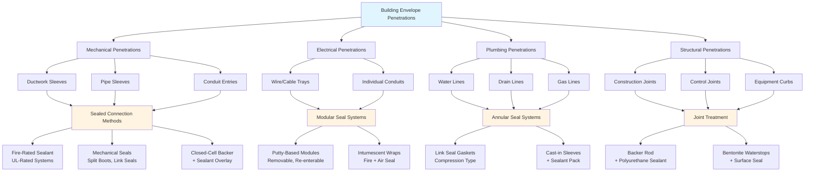

Building envelope integrity forms the foundation of biosecurity containment systems. Air leakage through unsealed penetrations, joints, and openings compromises pressure differentials, increases energy consumption, and creates pathways for pathogen transmission. Achieving and maintaining envelope tightness requires systematic sealing strategies across all building components.

## Building Envelope Air Leakage Requirements

Biosecurity facilities operate under strict air tightness specifications to maintain controlled pressure differentials and prevent uncontrolled air exchange.

### Air Leakage Limits by Biosecurity Level

| Biosecurity Level | Maximum Air Leakage Rate | Test Pressure Differential | Application |
|-------------------|-------------------------|---------------------------|-------------|
| BSL-1 / Low Risk | 0.40 cfm/ft² @ 0.3 in. w.g. | 0.3 in. w.g. (75 Pa) | General agricultural facilities |
| BSL-2 / Medium Risk | 0.25 cfm/ft² @ 0.3 in. w.g. | 0.3 in. w.g. (75 Pa) | Poultry production, swine facilities |
| BSL-3 / High Risk | 0.15 cfm/ft² @ 1.0 in. w.g. | 1.0 in. w.g. (250 Pa) | Research facilities, quarantine |
| BSL-4 / Maximum | 0.05 cfm/ft² @ 2.0 in. w.g. | 2.0 in. w.g. (500 Pa) | Maximum containment laboratories |

**Note:** Air leakage rates based on gross envelope area including roof, walls, and floor assemblies.

### Leakage Impact on System Performance

Air infiltration directly affects HVAC capacity requirements and pressure control. For a 10,000 ft² facility envelope:

**Leakage at 0.25 cfm/ft² × 10,000 ft² = 2,500 cfm uncontrolled air exchange**

This leakage rate requires:
- Additional exhaust capacity to maintain negative pressure
- Increased heating/cooling load (2,500 cfm × ΔT × 1.08)
- Higher filter loading from unfiltered infiltration

## Door Sealing Systems

Doors represent the highest-risk penetrations in biosecurity envelopes due to operational frequency and seal complexity.

### Door Seal Components

1. **Perimeter Compression Seals**: Continuous silicone or EPDM gaskets providing 0.25-0.50 inch compression when closed
2. **Threshold Seals**: Automatic drop seals or compression sweeps engaging at closure
3. **Vision Panel Sealing**: Glazing sealed with structural silicone, tested independently
4. **Hardware Penetrations**: All through-bolts sealed with gaskets and sealant

### Self-Closing Door Requirements

Biosecurity doors require controlled closure to prevent pressure loss during transitions:

- **Closing force**: 5-8 lbf at handle, adjustable hydraulic closers
- **Closing time**: 3-7 seconds from 90° open to latch engagement
- **Seal compression**: 25-40% of gasket original thickness
- **Latching force**: Minimum 50 lbf to ensure continuous compression

### Door Interlock Systems

Airlocks utilize interlocked door pairs to prevent simultaneous opening:

- **Electrical interlocks**: Magnetic locks preventing second door opening when first door unsealed
- **Mechanical interlocks**: Rod linkage systems for fail-safe operation during power failure
- **Override delay**: 15-30 second timer allowing emergency egress

## Penetration Sealing Methodology

Every envelope penetration creates a potential leak path requiring systematic sealing.

### Penetration Sealing Standards

| Penetration Type | Sealing Method | Air Seal Rating | Fire Rating Required |
|------------------|----------------|-----------------|---------------------|
| HVAC ductwork | Sleeve + fire-rated sealant | < 0.01 cfm @ 1 in. w.g. | 1-4 hour per wall rating |
| Electrical conduit | Putty modular seals | < 0.005 cfm per penetration | 2-hour typical |
| Plumbing pipes | Link seal + sealant | < 0.01 cfm @ 1 in. w.g. | 2-hour typical |
| Cable trays | Pillow/bag seal systems | < 0.1 cfm @ 1 in. w.g. | 2-hour typical |
| Control joints | Backer rod + sealant | Per envelope specification | Non-rated |

## Pressure Testing Protocols

Verification of envelope integrity requires systematic pressure testing before facility operation and periodically during service life.

### Pressure Decay Testing

**Test Procedure:**
1. Seal all intentional openings (supply/exhaust registers, drains with water traps)
2. Pressurize space to specified test pressure using temporary fan
3. Isolate space and monitor pressure decay over test duration
4. Calculate leakage rate from decay curve

**Acceptance Criteria:**

Pressure decay method: ΔP/Δt ≤ specified rate

For 1.0 in. w.g. initial pressure, maximum decay:
- **BSL-2**: 0.1 in. w.g. per 10 minutes
- **BSL-3**: 0.05 in. w.g. per 10 minutes
- **BSL-4**: 0.02 in. w.g. per 10 minutes

### Blower Door Testing

Blower door testing quantifies total envelope leakage at standardized pressure:

**Equipment:** Calibrated fan (50-6,000 cfm range), digital manometer (±0.1 Pa accuracy)

**Test Pressures:**
- Standard: 0.3 in. w.g. (75 Pa)
- High biosecurity: 1.0-2.0 in. w.g. (250-500 Pa)

**Result Interpretation:**

ACH₅₀ (Air Changes per Hour at 50 Pa) = (CFM₅₀ × 60) / Building Volume

Target values:
- Agricultural BSL-2: ACH₅₀ < 3.0
- Research BSL-3: ACH₅₀ < 1.5
- Maximum containment BSL-4: ACH₅₀ < 0.5

### Smoke Testing for Leak Location

After quantitative testing, smoke pencils or theatrical fog identify specific leak locations:

**Common leak points:**
- Door frame-to-wall joints
- Window perimeter seals
- Electrical box penetrations
- Duct/pipe sleeve interfaces
- Construction joints at floor-to-wall and wall-to-ceiling

## Vapor Barrier Integration

Continuous air barriers function as vapor retarders in biosecurity construction, preventing moisture-driven air transport.

**Vapor Barrier Continuity Requirements:**
- Minimum 6-mil polyethylene or equivalent permeance (< 0.1 perm)
- All seams lapped minimum 6 inches and sealed with compatible tape or mastic
- Penetrations sealed with acoustical sealant or tape flashing
- Transitions to foundations sealed to below-grade waterproofing

**Critical detail locations:**
- Wall-to-roof transitions: membrane continuity maintained through roof curbs
- Wall-to-floor transitions: membrane lapped to floor slab vapor barrier
- Window/door rough openings: membrane wrapped into opening and sealed to frame

## Construction Sequencing for Seal Integrity

Proper construction sequencing prevents seal damage and ensures accessibility:

1. **Rough-in phase**: Install all sleeves, penetration boots prior to air barrier
2. **Air barrier installation**: Apply continuous membrane with documented overlap and seal
3. **Penetration sealing**: Seal all penetrations as services installed, before concealment
4. **Interim testing**: Test envelope sections before finish installation prevents rework
5. **Final testing**: Commission complete envelope before HVAC startup

---

**References:**
- ASHRAE Standard 90.1, Energy Standard for Buildings (envelope requirements)
- ASTM E779, Standard Test Method for Determining Air Leakage Rate
- CDC/NIH Biosafety in Microbiological and Biomedical Laboratories (BMBL)
- USDA Agricultural Research Service Design Standards
- ANSI/AIHA Z9.5, Laboratory Ventilation Standard
