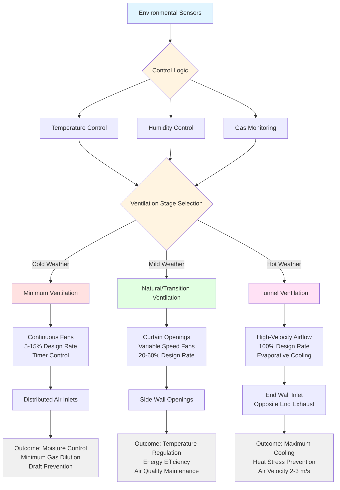

Environmental control in livestock facilities represents a critical application of HVAC engineering where thermal comfort, air quality, and moisture management directly impact animal health, productivity, and welfare. Unlike human-occupied spaces, animal housing systems must account for substantial sensible and latent heat loads generated by livestock metabolism, highly species-specific temperature requirements, and continuous contaminant generation that demands precise ventilation strategies.

## Heat and Moisture Generation from Livestock

Animal metabolism produces both sensible heat (temperature increase) and latent heat (moisture) that constitute the primary thermal loads in livestock facilities. The total heat production varies with animal mass, activity level, and environmental temperature.

### Metabolic Heat Production

Total heat production from livestock follows empirical relationships based on body mass:

**Total Heat Production:**

$$q_{total} = k \cdot M^{0.75}$$

Where:
- $q_{total}$ = total heat production (W)
- $M$ = animal body mass (kg)
- $k$ = species-specific coefficient (W/kg^0.75)

**Sensible vs. Latent Heat Distribution:**

$$q_{sensible} = q_{total} \cdot \left(1 - \frac{T_a - T_{lower}}{T_{upper} - T_{lower}}\right)$$

$$q_{latent} = q_{total} - q_{sensible}$$

Where $T_a$ is ambient temperature, and $T_{lower}$ and $T_{upper}$ define the thermoneutral zone boundaries. As ambient temperature increases, animals shift heat dissipation from sensible to latent mechanisms through increased respiration.

### Heat Production by Animal Type

| Animal Type | Body Mass (kg) | Total Heat (W/animal) | Sensible Heat at 20°C (W) | Latent Heat at 20°C (W) | Moisture Production (g/h) |
|-------------|----------------|----------------------|---------------------------|-------------------------|---------------------------|
| Dairy Cow (lactating) | 650 | 1800-2200 | 900-1100 | 900-1100 | 370-450 |
| Beef Cattle (finishing) | 450 | 850-1050 | 500-650 | 350-400 | 145-165 |
| Sow with litter | 200 | 650-850 | 350-450 | 300-400 | 125-165 |
| Finishing Pig (90 kg) | 90 | 250-320 | 140-180 | 110-140 | 45-58 |
| Broiler Chicken (2 kg) | 2.0 | 10-14 | 5-7 | 5-7 | 2.0-2.9 |
| Turkey (12 kg) | 12 | 45-60 | 22-30 | 23-30 | 9.5-12.4 |
| Laying Hen | 2.2 | 12-16 | 6-8 | 6-8 | 2.5-3.3 |

These values represent animals in thermoneutral conditions. Heat production increases 10-25% during feeding periods and varies with production stage.

## Thermoneutral Zone and Temperature Requirements

The thermoneutral zone (TNZ) defines the ambient temperature range where an animal maintains constant body temperature with minimal metabolic effort. Within this zone, heat production equals heat loss through non-evaporative mechanisms without requiring increased metabolism or evaporative cooling. Operating outside the TNZ forces animals to expend energy either generating additional heat (cold stress) or dissipating excess heat through increased respiration (heat stress), reducing feed conversion efficiency and production performance.

### Thermoneutral Zone Boundaries

The lower critical temperature (LCT) marks the point where metabolic heat production must increase to maintain body temperature. The upper critical temperature (UCT) indicates when evaporative cooling becomes necessary. Both boundaries shift with factors including body mass, insulation (fat, hair, feathers), air velocity, and floor type.

**Thermoneutral boundaries shift with:**
- Increased body mass: TNZ shifts lower (larger animals tolerate cold better)
- Increased air velocity: LCT increases by 2-3°C per 1 m/s above 0.2 m/s
- Wet conditions: LCT increases by 5-8°C compared to dry conditions
- Group housing: LCT decreases 2-4°C due to huddling behavior

### Thermal Comfort Zones by Species

| Species | Age/Stage | Optimal Temperature (°C) | Acceptable Range (°C) | Maximum Humidity (%) | Minimum Ventilation (m³/h per animal) |
|---------|-----------|--------------------------|----------------------|---------------------|--------------------------------------|
| Dairy Cattle | Adult | 5-20 | 0-25 | 80 | 170-250 |
| Beef Cattle | Finishing | 10-18 | 5-22 | 75 | 85-140 |
| Swine | Farrowing sow | 16-20 | 14-22 | 70 | 30-50 |
| Swine | Piglets (newborn) | 32-35 | 30-36 | 70 | 5-10 |
| Swine | Finishing (50-100 kg) | 15-20 | 12-23 | 75 | 25-85 |
| Poultry | Broilers (day 1) | 32-34 | 31-35 | 60-70 | 0.6-1.0 |
| Poultry | Broilers (week 6) | 18-21 | 16-24 | 60-70 | 4.5-6.5 |
| Poultry | Layers (adult) | 18-24 | 15-27 | 60-75 | 4.0-7.0 |
| Turkeys | Poults (day 1) | 35-37 | 34-38 | 60-70 | 0.8-1.2 |

Temperature deviations beyond acceptable ranges trigger heat stress (above) or cold stress (below), both reducing feed efficiency and growth performance.

## Ventilation System Design

Livestock facility ventilation serves three critical functions: thermal regulation, moisture removal, and contaminant dilution. Ventilation rates must satisfy the most demanding of these three requirements, which varies seasonally and with production stage.

### Ventilation Rate Determination

The required ventilation rate represents the maximum of three calculated values:

**Temperature control ventilation:**

$$\dot{V}_{temp} = \frac{q_{sensible}}{\rho_{air} \cdot c_p \cdot (T_{inside} - T_{outside})}$$

**Moisture control ventilation:**

$$\dot{V}_{moisture} = \frac{\dot{m}_{water}}{\rho_{air} \cdot (W_{inside} - W_{outside})}$$

**Contaminant control ventilation:**

$$\dot{V}_{contaminant} = \frac{G_{gas}}{C_{max} - C_{outside}}$$

Where $G_{gas}$ is the generation rate and $C_{max}$ is the maximum allowable concentration.

### Multi-Stage Ventilation Systems

Modern livestock facilities employ staged ventilation providing minimum, intermediate, and tunnel modes:

### Ventilation Rates by Season and Purpose

| Animal Type | Winter Minimum (m³/h) | Spring/Fall Moderate (m³/h) | Summer Maximum (m³/h) | Design Basis (Winter) | Design Basis (Summer) |
|-------------|----------------------|---------------------------|---------------------|---------------------|---------------------|
| Dairy Cow (650 kg) | 170-200 | 400-600 | 850-1200 | Moisture control | Temperature + heat stress |
| Finishing Pig (90 kg) | 25-35 | 60-100 | 170-250 | Ammonia dilution | Temperature control |
| Sow with litter | 30-50 | 75-125 | 200-300 | Moisture + ammonia | Temperature control |
| Broiler (6 weeks) | 4.5-6.0 | 8-12 | 15-22 | Moisture control | Heat removal |
| Layer (adult) | 4.0-5.5 | 8-11 | 14-20 | Ammonia dilution | Temperature control |

Winter ventilation rates maintain air quality while preserving heat. Summer rates provide maximum cooling and heat removal. ASHRAE Handbook - HVAC Applications Chapter 24 (Agricultural Facilities) provides detailed ventilation design procedures.

## Heat Stress Assessment

Heat stress occurs when environmental conditions exceed the animal's heat dissipation capacity. The Temperature-Humidity Index (THI) quantifies combined thermal and moisture stress:

**Temperature-Humidity Index (THI):**

$$THI = T_{db} + 0.36 \cdot T_{dp} + 41.2$$

Where:
- $T_{db}$ = dry-bulb temperature (°C)
- $T_{dp}$ = dew-point temperature (°C)

**Alternative formulation using relative humidity:**

$$THI = (1.8 \cdot T_{db} + 32) - [(0.55 - 0.0055 \cdot RH) \cdot (1.8 \cdot T_{db} - 26)]$$

Where RH = relative humidity (%).

### THI Threshold Values for Dairy Cattle

| THI Range | Stress Level | Milk Production Impact | Respiratory Rate (breaths/min) | Management Response |
|-----------|--------------|------------------------|--------------------------------|---------------------|
| < 68 | None | 0% reduction | 40-60 | Normal operation |
| 68-72 | Mild | 0-5% reduction | 60-75 | Increase ventilation |
| 72-80 | Moderate | 5-15% reduction | 75-90 | Evaporative cooling, provide shade |
| 80-90 | Severe | 15-30% reduction | 90-120 | Maximum cooling, reduce stocking density |
| > 90 | Emergency | > 30% reduction | > 120 | Emergency measures, possible mortality |

For swine, critical THI thresholds are generally 2-4 points lower. Heat stress mitigation strategies include increased air velocity, evaporative cooling systems, and sprinkler or drip cooling applications detailed in [heat stress mitigation](heat-stress-mitigation/).

## Heat Stress Management Strategies

Effective heat stress mitigation employs multiple cooling mechanisms that reduce effective temperature through convection, evaporation, and radiation reduction.

### Cooling System Selection by Animal Type

| Cooling Method | Application | Effective Temperature Reduction (°C) | Relative Humidity Impact | Energy Cost | Best For |
|----------------|-------------|-------------------------------------|-------------------------|-------------|----------|
| Increased air velocity (2-3 m/s) | Tunnel ventilation | 4-7 | No increase | Moderate | All species, first intervention |
| Evaporative pad cooling | Inlet air treatment | 5-12 | Increases to 80-90% | Moderate-High | Dairy, swine in dry climates |
| High-pressure fogging | Direct space treatment | 3-8 | Increases to 75-85% | Low-Moderate | Poultry, dairy in moderate humidity |
| Sprinkler/soaker systems | Direct animal wetting | 8-15 | Local only | Low | Dairy cattle only |
| Shade structures | Outdoor/semi-open facilities | 3-6 | No change | Low (capital) | Beef, outdoor dairy |
| Roof insulation + reflective coating | Radiant heat reduction | 2-4 | No change | Low (capital) | All enclosed facilities |

### Evaporative Cooling Effectiveness

Evaporative cooling efficiency depends on outdoor air humidity. Dry climates achieve greater temperature reduction:

**Evaporative pad temperature drop:**

$$\Delta T_{evap} = \eta_{pad} \cdot (T_{db} - T_{wb})$$

Where:
- $\eta_{pad}$ = pad efficiency (0.70-0.85 for cellulose pads)
- $T_{db}$ = dry-bulb temperature
- $T_{wb}$ = wet-bulb temperature

At 35°C and 40% RH (wet-bulb = 24°C), an 80% efficient pad provides approximately 8.8°C cooling. At 70% RH, the same conditions yield only 3.2°C reduction.

### Heat Stress Intervention Protocol

**Progressive cooling activation based on THI:**

1. THI 68-72: Increase ventilation rate to maximum, activate circulation fans
2. THI 72-76: Engage evaporative cooling systems, increase air velocity to 2.0 m/s
3. THI 76-80: Maximum evaporative cooling, activate animal wetting systems (dairy)
4. THI > 80: Emergency protocols including reduced feeding, increased water access, possible depopulation

Dairy operations frequently employ sprinkler-fan combinations in holding areas and feed lanes, applying water for 1-2 minutes every 10-15 minutes when THI exceeds 72.

## Gas Concentration Management

Livestock respiration, manure decomposition, and urine hydrolysis generate gases that accumulate in poorly ventilated facilities. Ammonia (NH₃), carbon dioxide (CO₂), and hydrogen sulfide (H₂S) represent primary air quality concerns.

### Contaminant Generation Rates

**Ammonia production from manure:**

$$\dot{m}_{NH_3} = k_{NH_3} \cdot N_{excreted} \cdot A_{surface}$$

Where:
- $k_{NH_3}$ = emission coefficient (mg/m²·h)
- $N_{excreted}$ = nitrogen excretion rate (g/animal·day)
- $A_{surface}$ = manure surface area (m²)

Emission coefficients vary from 5-20 mg/m²·h depending on manure management, temperature, and pH.

### Maximum Allowable Concentrations

| Gas | Formula | Continuous Exposure Limit | Short-term Limit (15 min) | Primary Sources | Health Effects |
|-----|---------|---------------------------|---------------------------|-----------------|----------------|
| Ammonia | NH₃ | 25 ppm | 35 ppm | Urine decomposition | Respiratory irritation, reduced growth |
| Carbon Dioxide | CO₂ | 5000 ppm | 15000 ppm | Animal respiration | Asphyxiation at high levels |
| Hydrogen Sulfide | H₂S | 10 ppm | 15 ppm | Manure decomposition | Toxicity, respiratory paralysis |
| Methane | CH₄ | 5000 ppm | N/A | Anaerobic decomposition | Explosion hazard above 50000 ppm |
| Carbon Monoxide | CO | 50 ppm | 200 ppm | Incomplete combustion | Toxicity, reduced oxygen transport |

Ventilation rates must provide sufficient dilution to maintain concentrations below these thresholds. Gas monitoring and automated control strategies are covered in [gas monitoring control](gas-monitoring-control/).

## Ammonia Control Strategies

Ammonia represents the most prevalent air quality concern in livestock facilities. Concentrations above 25 ppm reduce respiratory function, decrease growth rates, and damage respiratory epithelium, making animals more susceptible to disease.

### Ammonia Generation and Control Factors

Ammonia volatilization from manure increases exponentially with temperature and pH. Control strategies target reduction at the source and dilution through ventilation.

**Factors affecting ammonia emission rate:**

| Factor | Impact on Emission Rate | Control Strategy |
|--------|-------------------------|------------------|
| Manure surface area | Direct proportional relationship | Slatted floors, frequent removal |
| Temperature | 10°C increase = 1.7-2.2× emission | Building cooling, manure cooling |
| pH (above 7.0) | pH increase of 1.0 = 10× emission | Dietary manipulation, acidification |
| Air velocity over surface | Higher velocity = higher emission | Balance ventilation with surface exposure |
| Moisture content | Wet manure = higher emission | Drainage, bedding management |
| Microbial activity | Active decomposition = peak emission | Anaerobic storage, temperature control |

### Ammonia Reduction Technologies

**Primary control methods ranked by effectiveness:**

1. **Dietary nitrogen optimization**: Reduce crude protein 1-2% while maintaining amino acid balance reduces ammonia emission 15-30%. Requires precision feed formulation.

2. **Manure acidification**: Lower pH to 5.5-6.5 using sulfuric acid or alum reduces volatilization by 50-70%. Applied in slurry systems.

3. **Frequent manure removal**: Reduce surface area exposure time. Flush systems or mechanical scrapers operated 2-6 times daily reduce emissions 30-50%.

4. **Slatted floor systems**: Minimize manure contact with floor surface. Partial slats (50-60% coverage) reduce emissions 25-40% versus solid floors.

5. **Biofilters or scrubbers**: Treat exhaust air before release. Removal efficiency 50-90% but high capital and operational costs limit application to specialty facilities.

6. **Increased ventilation rate**: Dilutes concentration but increases total emission load. Required when other methods insufficient.

### Ventilation for Ammonia Control

Winter minimum ventilation rates are frequently determined by ammonia dilution requirements rather than temperature or moisture. The relationship:

$$\dot{V}_{NH_3} = \frac{G_{NH_3}}{C_{max} - C_{outdoor}}$$

For a finishing pig barn with 1000 head at 90 kg average weight:
- Ammonia generation: approximately 6-8 g/h per animal = 6000-8000 g/h total
- Maximum concentration: 25 ppm = 17 mg/m³
- Outdoor concentration: typically 0.1-0.5 ppm, assume 0
- Required ventilation: 6500 g/h ÷ 0.017 g/m³ = 382,000 m³/h ÷ 1000 animals = 382 m³/h per animal

This rate substantially exceeds winter minimum ventilation rates in the previous table, indicating ammonia control dominates winter ventilation design for swine finishing buildings. This ventilation demand creates significant heating loads in cold climates, driving heat recovery implementation.

## Moisture Control Requirements

Excessive humidity promotes pathogen growth, increases ammonia volatilization, and reduces animal heat dissipation capacity. Moisture balance requires:

**Moisture generation rate:**

$$\dot{m}_{water} = N_{animals} \cdot q_{latent,per\ animal} / h_{fg}$$

Where:
- $\dot{m}_{water}$ = total moisture generation (kg/h)
- $h_{fg}$ = latent heat of vaporization (2450 kJ/kg at 20°C)

**Required ventilation for humidity control:**

$$\dot{V}_{humidity} = \frac{\dot{m}_{water}}{\rho_{air} \cdot (W_{inside} - W_{outside})}$$

Where:
- $\dot{V}_{humidity}$ = ventilation rate (m³/h)
- $\rho_{air}$ = air density (kg/m³)
- $W$ = humidity ratio (kg water/kg dry air)

Winter ventilation often requires moisture control rather than temperature control, necessitating minimum ventilation rates even at low outdoor temperatures. Comprehensive moisture management strategies are discussed in [moisture control animal facilities](moisture-control-animal-facilities/).

## Zone Heating for Young Animals

Newborn and young animals have limited thermoregulatory capacity and require localized heating zones within facilities maintained at lower bulk temperatures. This approach reduces heating costs while providing optimal microclimates.

**Heat requirement for zone heating:**

$$q_{zone} = N_{young} \cdot q_{animal} + UA(T_{zone} - T_{building}) + \dot{V}_{local} \cdot \rho \cdot c_p \cdot (T_{zone} - T_{building})$$

Where the second term represents conductive losses and the third term represents convective losses from the heated zone.

Common zone heating applications include:
- Farrowing crates with heat lamps or mats (32-35°C for piglets vs. 18-20°C building temperature)
- Brooder zones in poultry houses (32-35°C for chicks vs. 24-27°C house temperature)
- Calf hutches with bedding and draft protection

Zone heating design and control strategies are detailed in [zone heating livestock](zone-heating-livestock/).

## ASHRAE Design Guidelines

The ASHRAE Handbook - HVAC Applications, Chapter 24 (Agricultural Facilities) provides comprehensive design data for livestock environmental control systems. Key design parameters include:

**Critical ASHRAE recommendations:**

- Design ventilation systems for three operational modes: minimum (winter), transition (spring/fall), and maximum (summer)
- Size heating systems for maintaining minimum building temperature during minimum ventilation operation
- Calculate cooling capacity based on peak heat generation plus solar load minus minimum ventilation heat removal
- Design air distribution to prevent drafts on animals during minimum ventilation (air velocity < 0.25 m/s in animal zone)
- Locate air inlets to provide mixing length of 3-5 m before air reaches animals
- Provide supplemental heating zones for young animals with independent thermostatic control
- Install emergency backup ventilation and alarm systems for mechanical ventilation facilities
- Design mechanical systems for continuous operation with staged backup

**Typical design conditions (ASHRAE Applications Ch. 24):**

- Winter design: Maintain 5-10°C above lower critical temperature during minimum ventilation
- Summer design: Prevent indoor temperature from exceeding outdoor temperature by more than 1-2°C
- Static pressure: Negative pressure systems at -12.5 to -37.5 Pa for biosecurity and odor control
- Air exchange rate: 0.5-4.0 building volumes per hour depending on season and animal density
- Insulation: R-3.5 to R-5.3 m²·K/W walls, R-5.3 to R-7.0 m²·K/W ceiling in cold climates

## System Integration

Effective livestock environmental control requires integrated management of ventilation, heating, cooling, and monitoring systems. Modern facilities employ:

- Temperature and humidity sensors with species-specific setpoints
- Multi-stage ventilation with minimum, intermediate, and tunnel modes
- Evaporative cooling pads or high-pressure fogging systems
- Supplemental heating with zone-specific control
- Continuous gas monitoring with alarm systems
- Building automation systems coordinating all environmental parameters

The design objective centers on maintaining optimal conditions across varying outdoor weather, seasonal production cycles, and changing animal populations while minimizing energy consumption and ensuring biosecurity requirements are met.

## Design Implementation Summary

Successful livestock environmental control system design requires:

1. **Load calculation**: Quantify sensible heat, latent heat, and contaminant generation for design population
2. **Thermoneutral zone analysis**: Establish species and age-specific temperature setpoints
3. **Multi-mode ventilation sizing**: Calculate minimum (gas/moisture), transition (temperature), and maximum (cooling) rates
4. **Cooling system selection**: Choose evaporative cooling, increased air velocity, or direct animal wetting based on climate
5. **Heat stress monitoring**: Implement THI calculation and automated cooling response protocols
6. **Ammonia control strategy**: Design source reduction and ventilation dilution appropriate to manure management system
7. **Zone heating design**: Provide supplemental heat for young animals independent of main building control
8. **Controls integration**: Coordinate all systems with temperature, humidity, and gas sensors driving staged responses
9. **Backup systems**: Install emergency ventilation, alarm systems, and power backup for critical facilities
10. **Energy optimization**: Balance ventilation requirements with heat recovery opportunities in cold climates

This comprehensive approach ensures animal welfare, maximizes production efficiency, and maintains environmental compliance across all operating conditions.
