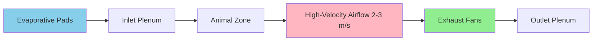
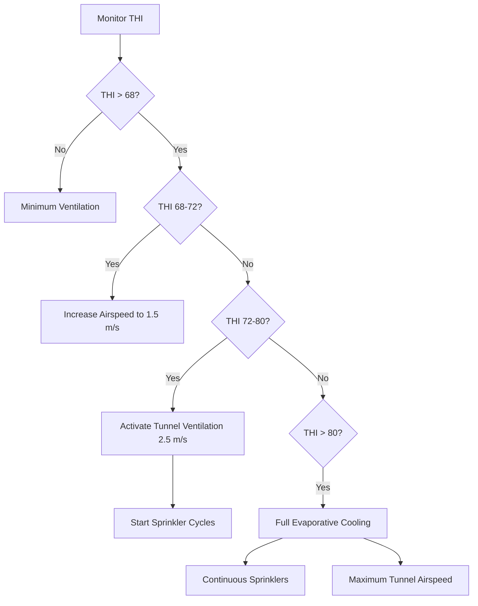

## Heat Stress Fundamentals

Heat stress occurs when livestock cannot dissipate metabolic and environmental heat gains at sufficient rates to maintain homeostasis. The thermal balance equation governs animal heat exchange:

$$Q_{metabolic} = Q_{sensible} + Q_{latent} + Q_{storage}$$

Where sensible heat transfer includes convection ($Q_{conv}$), radiation ($Q_{rad}$), and conduction ($Q_{cond}$), while latent heat transfer occurs through respiratory evaporation and cutaneous moisture loss. When environmental conditions prevent adequate heat dissipation, core body temperature rises, triggering physiological stress responses that reduce feed intake, growth rates, milk production, and reproductive performance.

## Temperature-Humidity Index

The Temperature-Humidity Index (THI) quantifies the combined thermal load from ambient temperature and humidity. For livestock applications:

$$THI = T_{db} + 0.36T_{dp} + 41.2$$

Where $T_{db}$ is dry-bulb temperature (°C) and $T_{dp}$ is dew point temperature (°C). Alternative formulations use relative humidity:

$$THI = (1.8T_{db} + 32) - [(0.55 - 0.0055 \times RH) \times (1.8T_{db} - 26)]$$

| Species | THI Threshold | Physiological Response |
|---------|---------------|------------------------|
| Dairy Cattle | 68-72 | Mild stress, reduced feed intake |
| Dairy Cattle | 72-79 | Moderate stress, 10-15% production loss |
| Dairy Cattle | >80 | Severe stress, respiratory distress |
| Swine | >74 | Reduced growth, increased mortality |
| Poultry | >70 | Panting, wing spreading, reduced egg production |

THI fails to account for airspeed effects, which significantly enhance convective cooling. Adjusted THI formulations incorporate wind speed corrections but are less widely standardized.

## Metabolic Heat Production

Animal heat production varies with body mass, activity level, and production stage. For dairy cattle:

$$Q_{metabolic} = 5.6 \times M^{0.75} + 22 \times DMI + 0.4 \times (MP - MP_{maintenance})$$

Where $M$ is body mass (kg), $DMI$ is dry matter intake (kg/day), and $MP$ represents milk production (kg/day). A 680 kg lactating cow produces approximately 2000-2500 W of metabolic heat. Swine generate 10-20 W/kg body mass depending on growth stage, while poultry produce 8-12 W/kg.

## Evaporative Cooling Strategies

### Direct Evaporative Pad Systems

Evaporative cooling pads leverage the enthalpy of water vaporization (2442 kJ/kg at 20°C) to reduce air temperature. The psychrometric process follows a constant wet-bulb temperature line as dry-bulb temperature decreases and humidity increases.

Cooling effectiveness:

$$\eta = \frac{T_{db,in} - T_{db,out}}{T_{db,in} - T_{wb,in}}$$

Properly maintained cellulose pads achieve 80-90% efficiency. Air temperature reduction:

$$\Delta T = \eta \times (T_{db} - T_{wb})$$

At 35°C dry-bulb and 24°C wet-bulb temperature with 85% pad efficiency:

$$\Delta T = 0.85 \times (35 - 24) = 9.35°C$$

Pad specifications for tunnel ventilation systems:

| Parameter | 100mm Cellulose | 150mm Cellulose |
|-----------|-----------------|-----------------|
| Face Velocity | 1.0-1.5 m/s | 1.5-2.0 m/s |
| Pressure Drop | 12-25 Pa | 25-40 Pa |
| Efficiency | 80-85% | 85-90% |
| Water Flow | 3-5 L/min per m² | 4-6 L/min per m² |

### Water Sprinkling Systems

Low-pressure sprinkling systems apply water directly to animal surfaces, enhancing evaporative cooling from skin and hair. The latent heat of vaporization removes substantial thermal energy:

$$Q_{evap} = \dot{m}_{water} \times h_{fg}$$

For effective cooling, sprinkler cycles must allow sufficient time for water evaporation before re-wetting. Typical dairy cattle systems operate 1-2 minute wetting cycles followed by 5-10 minute drying intervals when THI exceeds 68.

Flow rates: 4-8 L/hr per cow at 140-210 kPa pressure.

## Tunnel Ventilation Systems

Tunnel ventilation creates uniform high-velocity airflow through the length of livestock facilities, enhancing convective heat transfer. Airspeed cooling effect follows:

$$\Delta T_{effective} = -1.14 + 0.877v - 0.0574v^2$$

Where $v$ is air velocity (m/s) and $\Delta T_{effective}$ represents the effective temperature reduction perceived by the animal.

### Design Parameters

**Airspeed requirements by species:**

- Dairy cattle: 2.0-2.5 m/s at animal level
- Swine finishing: 1.5-2.0 m/s
- Poultry broilers: 2.5-3.0 m/s

**Ventilation rate calculation:**

$$Q = \frac{A \times v}{1000}$$

Where $Q$ is flow rate (m³/s), $A$ is cross-sectional area (m²), and $v$ is target velocity (m/s).

For a 15m wide × 4m high cattle barn targeting 2.5 m/s airspeed:

$$Q = \frac{15 \times 4 \times 2.5}{1} = 150 \text{ m}^3\text{/s}$$

Fan selection must account for static pressure from pads, building length, and outlet restrictions. Typical tunnel systems operate at 25-75 Pa static pressure.

## Fan Placement and Configuration

Exhaust fan placement determines airflow uniformity. ASHRAE Agricultural Facilities guidelines recommend:

- Fan spacing: Maximum 7-8 times building width
- Fan coverage: Each fan affects 1.5-2.0 times its diameter
- Staging: Multiple fan banks with variable speed control
- Minimum ventilation fans: Separate from tunnel fans for cold weather operation

**Fan efficiency considerations:**

$$P_{fan} = \frac{Q \times \Delta P}{\eta_{fan} \times \eta_{motor}}$$

Where $P_{fan}$ is electrical power (W), $Q$ is flow rate (m³/s), $\Delta P$ is static pressure (Pa), and efficiencies are decimal fractions. High-efficiency fans achieve total efficiencies of 0.50-0.65.

## Shade Structures and Radiant Heat Control

Radiant heat load from solar exposure adds significantly to animal thermal burden. A black-coated surface under direct sun can reach 60-70°C surface temperature. Shade structures intercept solar radiation before it reaches animals.

**Radiant heat reduction:**

$$Q_{rad} = \epsilon \sigma A (T_{surface}^4 - T_{skin}^4)$$

Where $\epsilon$ is emissivity (0.95 for animal surfaces), $\sigma$ is Stefan-Boltzmann constant (5.67×10⁻⁸ W/m²K⁴), $A$ is surface area, and temperatures are in Kelvin.

| Roofing Strategy | Solar Reflectance | Thermal Emittance | Surface Temp Reduction |
|------------------|-------------------|-------------------|------------------------|
| Bare Metal | 0.25-0.35 | 0.25 | Baseline |
| White Coating | 0.70-0.85 | 0.90 | 20-30°C |
| Radiant Barrier | 0.05 (underside) | 0.03 | 15-25°C |
| Insulation R-19 | Varies | Varies | 10-15°C |

Shade structures should provide minimum 3.0-4.5 m² per mature dairy cow with 3.0-3.5m height clearance for adequate air circulation.

## Conductive Cooling Surfaces

Conductive cooling mats transfer heat directly from animal contact surfaces. Heat flux through contact:

$$q = \frac{k \cdot A \cdot (T_{animal} - T_{surface})}{L}$$

Where $k$ is thermal conductivity, $A$ is contact area, $L$ is material thickness, and $T$ represents temperatures. Concrete surfaces (k = 1.4 W/m·K) conduct heat more effectively than rubber mats (k = 0.3 W/m·K) or straw bedding (k = 0.05 W/m·K).

## Integrated Cooling System Design

Effective heat stress mitigation requires integrated control strategies that progressively deploy cooling mechanisms as thermal load increases. System design must account for local climate patterns, animal density, building geometry, and operational constraints to maintain thermal comfort across production cycles.

## References

ASHRAE Handbook—HVAC Applications, Chapter 24: Animal Environments
MWPS-1: Structures and Environment Handbook
Livestock Environment VIII, ASABE Standards