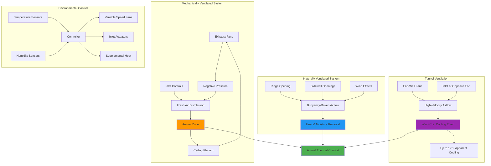

## Livestock Housing Ventilation Fundamentals

Livestock housing ventilation systems control temperature, humidity, and air quality to optimize animal health, productivity, and welfare. Properly designed systems remove metabolic heat, moisture, and gaseous contaminants while providing adequate fresh air supply. The ASHRAE Agricultural Handbook provides comprehensive design criteria for all livestock facility types.

### Critical Design Parameters

Ventilation system design depends on four primary factors:

- **Animal heat production** - metabolic heat generation varies by species, weight, and production level
- **Moisture production** - respiratory and evaporative moisture must be removed to prevent condensation
- **Gas removal** - ammonia, hydrogen sulfide, and carbon dioxide concentration limits
- **Temperature control** - maintaining optimal thermal environment across seasonal variations

## Ventilation Rate Calculations

### Heat and Moisture Production Formula

The required ventilation rate for heat removal is calculated using:

**Q = SH / (ρ × Cp × ΔT)**

Where:
- Q = volumetric airflow rate (CFM)
- SH = sensible heat production (BTU/hr)
- ρ = air density (0.075 lb/ft³ at standard conditions)
- Cp = specific heat of air (0.24 BTU/lb·°F)
- ΔT = allowable indoor-outdoor temperature difference (°F)

For moisture removal:

**Q = W / (ρ × Δω)**

Where:
- W = moisture production rate (lb/hr)
- Δω = humidity ratio difference between indoor and outdoor air (lb moisture/lb dry air)

### Minimum Ventilation for Air Quality

During cold weather, minimum ventilation rates are determined by:

**Q_min = (NH₃_production) / (NH₃_limit - NH₃_outdoor)**

Typical ammonia limit: 25 ppm for continuous exposure.

## Ventilation Rates by Animal Type

### Poultry Housing

| Bird Type | Weight (lb) | Heat Production (BTU/hr/bird) | Moisture (lb/hr/bird) | Winter CFM/bird | Summer CFM/bird |
|-----------|-------------|-------------------------------|----------------------|----------------|----------------|
| Broiler | 4.0 | 19.5 | 0.014 | 0.25 | 5.0 |
| Layer | 4.0 | 16.0 | 0.012 | 0.30 | 4.5 |
| Turkey (hen) | 16.0 | 46.0 | 0.035 | 1.5 | 15.0 |
| Turkey (tom) | 30.0 | 75.0 | 0.058 | 2.5 | 25.0 |

### Swine Housing

| Animal Category | Weight (lb) | Heat Production (BTU/hr/animal) | Moisture (lb/hr/animal) | Winter CFM | Summer CFM |
|-----------------|-------------|--------------------------------|------------------------|-----------|-----------|
| Nursery pig | 30 | 85 | 0.060 | 3 | 35 |
| Growing pig | 100 | 230 | 0.165 | 7 | 75 |
| Finishing pig | 200 | 380 | 0.275 | 12 | 125 |
| Sow with litter | 400 | 950 | 0.690 | 20 | 500 |
| Gestation sow | 400 | 480 | 0.345 | 12 | 150 |

### Dairy Cattle Housing

| Animal Type | Weight (lb) | Heat Production (BTU/hr/animal) | Moisture (lb/hr/animal) | Winter CFM | Summer CFM |
|-------------|-------------|--------------------------------|------------------------|-----------|-----------|
| Lactating cow | 1400 | 3150 | 2.30 | 100 | 1000 |
| Dry cow | 1400 | 1500 | 1.10 | 50 | 500 |
| Heifer (growing) | 800 | 1200 | 0.87 | 40 | 400 |
| Calf | 150 | 420 | 0.30 | 15 | 75 |

### Beef Cattle Housing

| Animal Type | Weight (lb) | Heat Production (BTU/hr/animal) | Moisture (lb/hr/animal) | Winter CFM | Summer CFM |
|-------------|-------------|--------------------------------|------------------------|-----------|-----------|
| Finishing cattle | 1000 | 1850 | 1.35 | 50 | 600 |
| Cow-calf pair | 1200 | 2100 | 1.53 | 60 | 650 |

*Note: Values based on moderate environmental conditions. Summer rates assume 10°F temperature differential; winter rates assume 15-20°F differential.*

## Livestock Ventilation System Architecture

## Ventilation System Design Strategies

### Cold Weather Ventilation

Winter operation prioritizes minimum ventilation for air quality while conserving heat:

1. **Minimum ventilation mode** - intermittent fan operation maintains 15-25% of design capacity
2. **Inlet velocity control** - air inlet sizing achieves 800-1200 FPM to project fresh air into occupied zone
3. **Heat recovery** - heat exchangers can recover 50-70% of exhaust heat energy
4. **Supplemental heat** - required when ventilation heat loss exceeds animal heat production

### Warm Weather Ventilation

Summer operation focuses on maximum heat removal and evaporative cooling:

1. **Maximum airflow rates** - full fan capacity operation with large inlet openings
2. **Tunnel ventilation** - longitudinal airflow at 400-600 FPM provides wind-chill cooling
3. **Evaporative cooling** - pad systems or foggers can reduce inlet air temperature 10-15°F
4. **Radiant barrier insulation** - reduces solar heat gain through roof assemblies

### Transition Season Management

Spring and fall conditions require modulating ventilation between extremes:

- Variable speed fan control provides proportional capacity adjustment
- Multi-stage ventilation systems activate fans sequentially based on temperature
- Automated inlet controllers maintain static pressure at -0.02 to -0.10 inches water column

## Species-Specific Considerations

### Poultry Systems

Broiler and turkey houses typically employ tunnel ventilation for high-density production. Brooding areas require supplemental heat with minimum ventilation. Egg layer facilities often use cross-ventilation with manure belt drying systems.

### Swine Facilities

Nursery and farrowing rooms demand precise environmental control with 2-5°F temperature bands. Finishing barns commonly use pit ventilation with pull-plug manure storage. Gestation facilities increasingly employ natural ventilation with mechanical backup.

### Dairy Housing

Modern freestall barns predominantly use natural cross-ventilation enhanced by circulation fans. Hot weather cooling combines high-velocity fans (400+ CFM/cow) with low-pressure soakers in the feed line. Calf housing requires individual or group hutches with natural ventilation until weaning.

### Beef Confinement

Beef finishing facilities range from open-front buildings with bedded packs to fully enclosed mechanical ventilation. Monoslope designs with open south walls provide weather protection while maintaining natural ventilation benefits. Winter conditions may require only 1-2 air changes per hour.

## Design Reference Standards

Critical design parameters and detailed calculation methods are provided in:

- **ASHRAE Handbook - HVAC Applications, Chapter 24**: Agricultural Facilities
- **MWPS-32**: Mechanical Ventilating Systems for Livestock Housing
- **NRCS Agricultural Waste Management Field Handbook**: Ventilation requirements by species

Proper livestock housing ventilation design requires integrating animal physiology, psychrometrics, and building science to create optimal production environments while managing energy consumption and environmental impacts.

