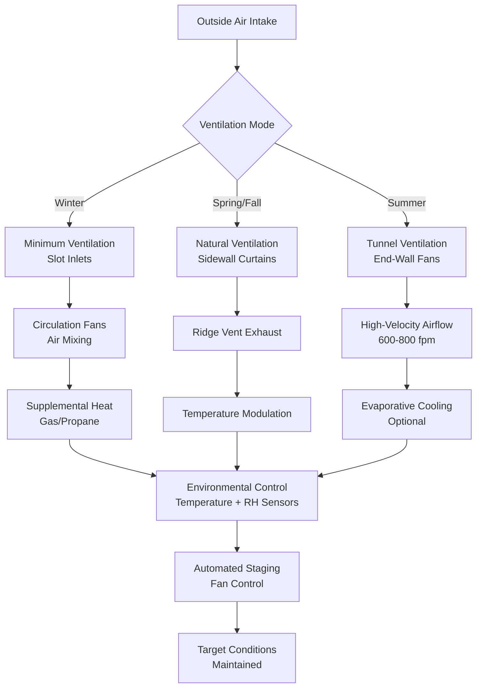

## Fundamental Environmental Requirements

Swine facilities demand precise environmental control due to the narrow thermoneutral zones of pigs at different life stages and their high sensitivity to air quality. Unlike other livestock, pigs cannot regulate body temperature through sweating, making ventilation and cooling systems critical for thermal management. The physics of heat transfer in swine buildings involves balancing sensible heat production from animals with latent heat from respiration and evaporation from wet surfaces.

The total heat production from a pig follows:

$$Q_{total} = Q_{sensible} + Q_{latent} = m \cdot q_s + m \cdot q_l$$

where $m$ is animal mass (kg), $q_s$ is specific sensible heat production (W/kg), and $q_l$ is specific latent heat production (W/kg). These values vary significantly with animal weight, ambient temperature, and activity level.

## Ventilation Requirements by Production Stage

### Farrowing Rooms

Farrowing facilities present the most challenging environmental control scenario in swine production, requiring simultaneous maintenance of 90-95°F (32-35°C) for newborn piglets while keeping sows comfortable at 60-65°F (15-18°C). This 30°F differential demands zone-specific heating using creep areas with heat lamps or radiant panels.

Minimum ventilation rates for farrowing:

| Condition | Rate per Sow-Litter Unit | Air Changes per Hour |
|-----------|-------------------------|---------------------|
| Winter minimum | 20 CFM | 3-4 ACH |
| Mild weather | 35 CFM | 6-8 ACH |
| Summer maximum | 500 CFM | 75-100 ACH |

The ventilation system must remove moisture from manure, urine, and waterer spillage while maintaining temperature stratification. The buoyancy-driven flow in farrowing rooms follows:

$$\Delta P = \rho g h \frac{\Delta T}{T_{avg}}$$

where $\Delta P$ is pressure differential (Pa), $\rho$ is air density, $g$ is gravitational acceleration, $h$ is vertical height difference, and $\Delta T$ is temperature difference between zones. Positive pressure prevents cold air infiltration into creep areas.

### Nursery Buildings

Weaned pigs (10-15 lb to 50-60 lb) require 75-85°F (24-29°C) initially, decreasing 2-3°F weekly. High stocking densities generate substantial sensible heat, requiring careful ventilation staging.

Ventilation rates for nursery pigs:

$$Q_{nursery} = N \cdot \left[CFM_{min} + \left(CFM_{max} - CFM_{min}\right) \cdot \frac{T_{ambient} - T_{setpoint-low}}{T_{setpoint-high} - T_{setpoint-low}}\right]$$

where $N$ is number of pigs, $CFM_{min}$ is 2-3 CFM per pig, and $CFM_{max}$ is 20-25 CFM per pig at summer conditions. The equation provides linear staging between minimum and maximum ventilation.

### Finishing Buildings

Grow-finish pigs (60 lb to 280 lb market weight) have lower thermoneutral zones (60-75°F) and produce 700-1500 BTU/hr sensible heat per animal. Summer heat stress is the primary concern, requiring high-capacity ventilation or evaporative cooling.

Tunnel ventilation velocity requirements:

| Pig Weight (lb) | Air Velocity for Cooling (fpm) | Equivalent Wind Chill (°F reduction) |
|----------------|--------------------------------|-------------------------------------|
| 60-100 | 400-500 | 5-7 |
| 100-150 | 500-600 | 7-9 |
| 150-280 | 600-800 | 9-12 |

The convective heat transfer coefficient increases with air velocity:

$$h_c = 10.45 - v + 10\sqrt{v}$$

where $h_c$ is convective coefficient (W/m²·K) and $v$ is air velocity (m/s). This relationship explains the wind-chill effect that provides thermal relief during heat stress.

## Ammonia and Hydrogen Sulfide Control

Swine buildings generate ammonia (NH₃) from bacterial decomposition of urea in urine and hydrogen sulfide (H₂S) from anaerobic decomposition of manure. Both gases pose health risks and reduce growth performance.

Ammonia generation rate:

$$G_{NH_3} = k \cdot A \cdot [NH_4^+] \cdot \left(1 + 10^{pH-pK_a}\right)^{-1}$$

where $k$ is mass transfer coefficient, $A$ is wetted surface area, $[NH_4^+]$ is ammonium concentration, and $pK_a = 9.25$ for the ammonia-ammonium equilibrium. Higher pH shifts equilibrium toward gaseous ammonia.

Target gas concentrations:

| Gas | Maximum Continuous | Short-term Exposure | Control Method |
|-----|-------------------|-------------------|----------------|
| NH₃ | 25 ppm | 35 ppm | Ventilation, pit additives |
| H₂S | 10 ppm | 20 ppm | Pit ventilation, oxidation |
| CO₂ | 1500 ppm | 5000 ppm | Fresh air exchange |

Dilution ventilation required:

$$Q_{dilution} = \frac{G \cdot 10^6}{C_{max} - C_{inlet}}$$

where $Q_{dilution}$ is ventilation rate (CFM), $G$ is gas generation rate (CFM of pure gas), and $C$ values are concentrations in ppm. For ammonia control, this typically requires 4-8 CFM per 100 lb animal weight during cold weather.

## Ventilation System Design

### Minimum Ventilation Strategy

Cold-weather ventilation requires continuous air exchange to control moisture and gases while minimizing heat loss. The minimum ventilation rate operates on a timer cycle, typically 5 minutes on per 30-minute period at the coldest conditions, increasing duration as temperature rises.

Heat loss from minimum ventilation:

$$Q_{vent} = \dot{m} \cdot c_p \cdot \Delta T = 1.08 \cdot CFM \cdot \Delta T$$

where the factor 1.08 combines air density, specific heat, and unit conversions (BTU/hr per CFM·°F). A 10,000 CFM building at 40°F temperature differential loses 432,000 BTU/hr from ventilation alone, requiring substantial supplemental heating.

Inlet design prevents cold air dumping on animals. Ceiling inlets create a high-velocity jet that entrains warm room air:

$$\frac{v_2}{v_1} = \sqrt{\frac{A_1}{A_2}}$$

where $v_1$ is inlet velocity and $v_2$ is jet velocity at animal level. A 4:1 area ratio reduces velocity to 50%, preventing drafts while mixing fresh air with warm room air before reaching animals.

### Tunnel Ventilation Configuration

Summer cooling requires tunnel configuration with exhaust fans at one end and evaporative cooling pads at the opposite end. Air velocities of 600-800 fpm provide wind-chill cooling equivalent to 10-12°F temperature reduction.

Static pressure design:

$$\Delta P_{total} = \Delta P_{inlet} + \Delta P_{building} + \Delta P_{evap}$$

Typical values: evaporative pads (0.10-0.15 in. w.g.), building resistance (0.02-0.05 in. w.g.), total system (0.12-0.20 in. w.g.). Fans must overcome this pressure at design airflow rates.

Evaporative cooling effectiveness:

$$T_{supply} = T_{db} - \eta \cdot (T_{db} - T_{wb})$$

where $\eta$ is pad efficiency (75-85% for CELdek media), $T_{db}$ is dry-bulb temperature, and $T_{wb}$ is wet-bulb temperature. At 95°F and 60% RH (78°F wet-bulb), cooling to 81°F is achievable.

## Heat Stress Prevention

Pigs experience heat stress when environmental temperature exceeds the upper critical temperature (UCT) of their thermoneutral zone. Market-weight pigs have UCT of 75-80°F; above this temperature, feed intake decreases and respiration rate increases dramatically.

Temperature-Humidity Index for swine:

$$THI = T_{db} - [0.55 - 0.0055 \cdot RH] \cdot (T_{db} - 58)$$

where $T_{db}$ is in °F and $RH$ is relative humidity as percentage. THI values above 74 indicate heat stress risk; above 78 indicates dangerous conditions requiring immediate intervention.

Heat stress mitigation strategies comparison:

| Strategy | Temperature Reduction | Installation Cost | Operating Cost | Limitations |
|----------|----------------------|------------------|----------------|-------------|
| Increased airflow (800 fpm) | 10-12°F apparent | Low | Low | Requires building length |
| Evaporative cooling | 12-18°F actual | Medium | Medium | Ineffective in humid climates |
| Sprinkling/drip cooling | 5-8°F effective | Low | Low | Increases manure moisture |
| Mechanical chilling | 15-25°F actual | Very high | Very high | Limited applications |

Sprinkling systems apply water directly to pigs, utilizing evaporative cooling from skin surface. Water application rate of 0.25-0.5 gal/pig/hour removes:

$$Q_{evap} = \dot{m}_{water} \cdot h_{fg}$$

where $h_{fg}$ = 1050 BTU/lb at 80°F. For a 250-lb pig producing 1200 BTU/hr, 0.5 gal/hr (4.2 lb/hr) removes 4400 BTU/hr, exceeding heat production and providing effective cooling.

## Air Quality Monitoring and Control

Modern swine facilities employ continuous monitoring of temperature, humidity, ammonia, and carbon dioxide concentrations. Controller algorithms adjust ventilation rates to maintain optimal conditions while minimizing energy consumption.

Controller proportional band:

$$Fan_{speed} = Fan_{min} + (Fan_{max} - Fan_{min}) \cdot \frac{T_{actual} - T_{setpoint}}{T_{band}}$$

Typical proportional bands: 5-8°F for staging fans sequentially. This prevents simultaneous operation of all fans, reducing electrical demand and maintaining stable conditions.

Dead-band control between heating and cooling prevents simultaneous operation:

| Temperature Range | Action | Typical Setpoints |
|------------------|--------|------------------|
| Below setpoint - 2°F | Maximum heat | — |
| Setpoint ± 2°F | Minimum ventilation only | 65-70°F finishing |
| Setpoint + 2°F to + 5°F | Staged fans 1-4 | — |
| Above setpoint + 5°F | Tunnel mode + cooling | — |

## Building Envelope Considerations

Swine building insulation requirements exceed typical agricultural structures due to precise temperature control needs and high moisture generation.

Heat transfer through building envelope:

$$Q_{envelope} = U \cdot A \cdot \Delta T$$

Recommended U-values (BTU/hr·ft²·°F):

- Walls: 0.05-0.08 (R-12 to R-20)
- Ceiling: 0.03-0.05 (R-20 to R-33)
- Floors: 0.10-0.15 (R-7 to R-10 under farrowing)

Vapor barriers prevent moisture migration into insulation. The dew point location within a wall assembly:

$$x_{dewpoint} = \frac{k \cdot L \cdot (T_{inside} - T_{dewpoint})}{T_{inside} - T_{outside}}$$

where $x_{dewpoint}$ is distance from inside surface, $k$ is thermal conductivity, and $L$ is wall thickness. Vapor barriers must be placed on the warm (interior) side to prevent condensation within the insulation.

## System Integration and Economics

Complete swine facility environmental control integrates ventilation, heating, cooling, and monitoring into a coordinated system. Energy costs represent 8-12% of total production costs in finishing facilities.

Annual heating energy requirement:

$$E_{heat} = \sum_{i=1}^{12} \left[\frac{1.08 \cdot CFM \cdot DD_i \cdot 24}{\eta_{furnace}}\right]$$

where $DD_i$ is degree-days per month and $\eta_{furnace}$ is heating efficiency (0.80-0.85 for direct-fired). A 1000-head finishing barn in Iowa requires 800-1200 million BTU annually for heating.

Controller sophistication ranges from simple thermostats to networked systems providing remote monitoring and data logging. Advanced systems optimize between competing objectives: animal comfort, air quality, and energy efficiency. The economic optimum typically maintains temperature within 3-5°F of ideal setpoint while minimizing ventilation rates during cold weather.

Modern precision livestock farming integrates weight monitoring, feed intake tracking, and health surveillance with environmental control, enabling data-driven management decisions that improve both animal welfare and production efficiency.
