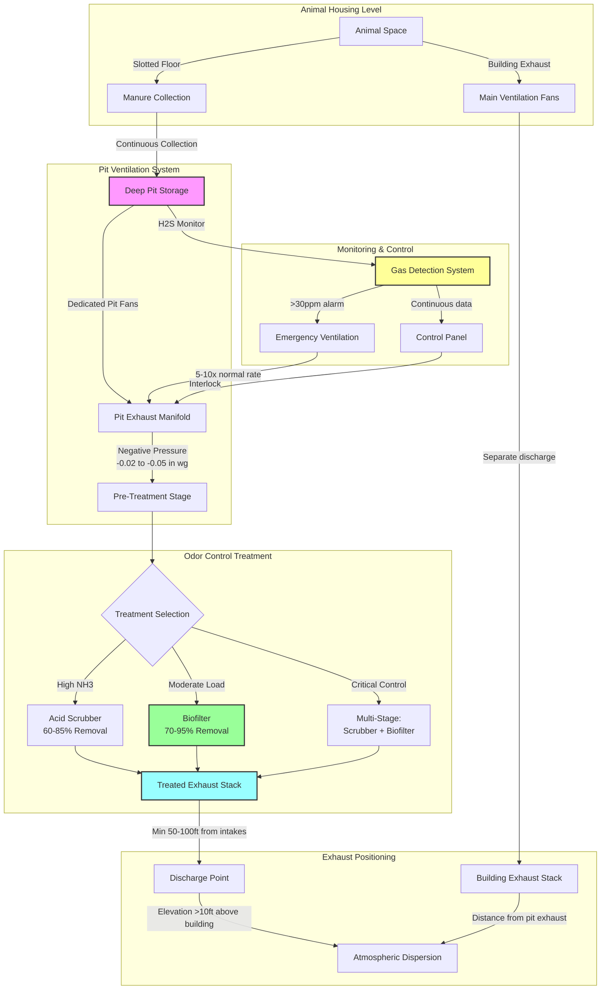

Agricultural waste management systems represent critical interfaces between biological processes and HVAC design, where manure storage ventilation, odor control, and gas dilution requirements directly influence facility air quality and safety. Integration of waste handling systems with environmental control strategies requires understanding mass transport phenomena, gas generation kinetics, and dilution ventilation principles to maintain safe atmospheric conditions while controlling odor emissions.

## Manure Storage Ventilation Fundamentals

Waste management integration encompasses the coordination of manure collection, storage, and treatment systems with building ventilation to control odor, dilute hazardous gases, and maintain worker safety. The primary challenge involves managing volatile compound emissions from decomposing organic matter while preventing accumulation of toxic gases in occupied and storage spaces.

### Gas Generation from Manure Storage

Anaerobic decomposition in manure storage produces multiple gaseous species requiring ventilation control. Generation rates depend on temperature, storage depth, agitation, and manure composition:

**Ammonia Generation Rate:**

$$G_{NH_3} = k_a \cdot A_s \cdot (T-T_{ref}) \cdot C_N$$

Where:
- $G_{NH_3}$ = ammonia generation rate (g/h)
- $k_a$ = ammonia volatilization coefficient (0.001-0.005 g/m²·h·°C)
- $A_s$ = manure surface area (m²)
- $T$ = manure temperature (°C)
- $T_{ref}$ = reference temperature, typically 10°C
- $C_N$ = nitrogen concentration factor (1.0-2.5)

**Hydrogen Sulfide Generation:**

$$G_{H_2S} = k_s \cdot V_m \cdot f_{sulfur} \cdot e^{0.07(T-20)}$$

Where:
- $G_{H_2S}$ = H₂S generation rate (mg/h)
- $k_s$ = sulfur reduction coefficient (0.5-2.0 mg/m³·h at 20°C)
- $V_m$ = manure volume (m³)
- $f_{sulfur}$ = sulfur content factor (0.8-1.5 for typical livestock diets)
- Temperature adjustment follows exponential relationship

### Dilution Ventilation Requirements

Ventilation for gas control follows dilution principles where exhaust airflow must maintain concentrations below hazardous thresholds:

**Required Dilution Ventilation:**

$$Q_{dilution} = \frac{G \cdot 10^6}{(C_{max} - C_{ambient}) \cdot \rho_{air} \cdot 60}$$

Where:
- $Q_{dilution}$ = required ventilation rate (CFM)
- $G$ = gas generation rate (g/h or mg/h)
- $C_{max}$ = maximum allowable concentration (ppm)
- $C_{ambient}$ = incoming air concentration (ppm, typically 0)
- $\rho_{air}$ = air density (1.2 kg/m³)
- Conversion factors adjust for units consistency

**Safety Factor Application:**

$$Q_{design} = Q_{dilution} \cdot SF \cdot F_{agitation}$$

Where:
- $Q_{design}$ = design ventilation rate (CFM)
- $SF$ = safety factor (2.0-3.0 for occupied spaces, 1.5 for storage)
- $F_{agitation}$ = agitation factor (1.0 quiescent, 5.0-50.0 during pumping)

## Gas Concentration Limits and Hazards

| Gas Species | Time-Weighted Average (TWA) | Short-Term Exposure Limit (STEL) | Immediately Dangerous (IDLH) | Typical Pit Concentration |
|-------------|----------------------------|----------------------------------|------------------------------|---------------------------|
| Ammonia (NH₃) | 25 ppm | 35 ppm | 300 ppm | 50-200 ppm |
| Hydrogen Sulfide (H₂S) | 10 ppm | 15 ppm | 100 ppm | 200-5000 ppm |
| Methane (CH₄) | - | - | 50,000 ppm (5% LEL) | 1,000-10,000 ppm |
| Carbon Dioxide (CO₂) | 5,000 ppm | 30,000 ppm | 40,000 ppm | 10,000-50,000 ppm |
| Carbon Monoxide (CO) | 35 ppm | - | 1,200 ppm | Variable with equipment |

**Critical Safety Consideration:** Manure pit agitation can release accumulated H₂S at concentrations exceeding 1,000 ppm within seconds, creating immediately lethal atmospheric conditions requiring emergency ventilation protocols.

## Slotted Floor Systems and Pit Ventilation

Slotted floor configurations allow manure to fall through openings into below-floor storage pits, requiring dedicated pit ventilation separate from animal space ventilation to control gas migration and odor.

### Pit Ventilation Rate Design

**Continuous Pit Ventilation:**

$$Q_{pit} = A_{floor} \cdot q_{specific}$$

Where:
- $Q_{pit}$ = pit ventilation rate (CFM)
- $A_{floor}$ = slotted floor area (ft²)
- $q_{specific}$ = specific pit ventilation rate (CFM/ft²)

**Typical Pit Ventilation Rates:**

| Livestock Type | Continuous Ventilation | Minimum Ventilation | Pre-Agitation Ventilation |
|----------------|----------------------|--------------------|--------------------------:|
| Swine finishing | 0.1-0.2 CFM/ft² | 0.05 CFM/ft² | 0.5-1.0 CFM/ft² |
| Swine farrowing | 0.15-0.25 CFM/ft² | 0.08 CFM/ft² | 0.75-1.5 CFM/ft² |
| Dairy freestall | 0.08-0.15 CFM/ft² | 0.04 CFM/ft² | 0.4-0.8 CFM/ft² |
| Poultry high-rise | 0.2-0.3 CFM/ft² | 0.1 CFM/ft² | 1.0-2.0 CFM/ft² |

### Pressure Relationship Control

Pit ventilation systems must maintain negative pressure relative to animal space to prevent gas migration upward through slotted floors:

$$\Delta P_{pit} = P_{animal} - P_{pit} \geq 0.02 \text{ in. w.g.}$$

Minimum pressure differential of 0.02-0.05 inches water gauge prevents reverse flow during wind effects or building ventilation system cycling.

## Manure Storage System Configurations

| Storage Type | Typical Volume | Ventilation Method | Gas Hazard Level | Odor Control Strategy |
|--------------|----------------|-------------------|-----------------|----------------------|
| Deep pit (below floor) | 6-12 months capacity | Dedicated pit fans | Very High | Separate exhaust, biofilters |
| Shallow pit (6-12 in.) | Weekly/bi-weekly removal | Building exhaust | Moderate-High | Frequent removal, scrubbers |
| Pull-plug gutters | 1-7 days | Building exhaust | Moderate | Daily flushing |
| External liquid storage | 6-12 months | Natural convection | High (during agitation) | Distance, stack height, covers |
| Composting systems | Continuous batch | Forced aeration | Low-Moderate | Aerobic process control |

## Odor Control and Dispersion

Odor generation from agricultural waste management follows mass transfer principles where volatile organic compounds (VOCs) and reduced sulfur compounds transfer from liquid/solid phases to air:

**Odor Dilution Requirement:**

$$D = \frac{C_e}{C_t}$$

Where:
- $D$ = dilution-to-threshold ratio
- $C_e$ = emission concentration (odor units/m³)
- $C_t$ = odor threshold concentration (typically 1 OU/m³)

**Atmospheric Dispersion Distance:**

$$x_{min} = h_s \cdot \left(\frac{D \cdot u}{Q_e}\right)^{0.5}$$

Where:
- $x_{min}$ = minimum distance to dilute to threshold (m)
- $h_s$ = effective stack height (m)
- $u$ = wind speed (m/s)
- $Q_e$ = exhaust flow rate (m³/s)
- Simplified Gaussian dispersion approximation

### Waste-HVAC Integration Architecture

### Odor Control Technology Specifications

| Control Technology | Removal Efficiency | Capital Cost | Operating Cost | Pressure Drop | Best Application |
|-------------------|-------------------|--------------|----------------|---------------|------------------|
| Biofilter | 70-95% | Medium | Low | 1-4 in. w.g. | Steady-state exhaust |
| Wet scrubber (acid) | 60-85% NH₃ | High | Medium-High | 2-6 in. w.g. | High ammonia loads |
| Chemical scrubber | 85-99% | High | High | 3-8 in. w.g. | Critical odor control |
| UV oxidation | 40-70% | Medium | Medium | 0.5-2 in. w.g. | VOC control |
| Activated carbon | 80-95% | Low-Medium | High (replacement) | 1-3 in. w.g. | Low flow, high concentration |
| Thermal oxidation | >99% | Very High | Very High | 4-10 in. w.g. | Industrial-scale only |

### Biofilter Design Parameters

Biofilters represent the most cost-effective odor control technology for agricultural waste exhaust, utilizing biological oxidation of odorous compounds through organic filter media.

**Biofilter Sizing Equation:**

$$A_{biofilter} = \frac{Q_{exhaust}}{v_{superficial}}$$

Where:
- $A_{biofilter}$ = required biofilter surface area (ft²)
- $Q_{exhaust}$ = exhaust flow rate (CFM)
- $v_{superficial}$ = superficial velocity through media (CFM/ft²)

**Biofilter Design Specifications:**

| Parameter | Typical Value | Optimal Range | Design Impact |
|-----------|--------------|---------------|---------------|
| Superficial velocity | 50-100 CFM/ft² | 40-120 CFM/ft² | Higher = smaller footprint, lower efficiency |
| Media depth | 36-48 inches | 30-60 inches | Deeper = better removal, higher pressure drop |
| Empty bed residence time | 30-60 seconds | 20-90 seconds | Longer = higher removal efficiency |
| Media moisture content | 40-60% | 35-65% | Critical for biological activity |
| pH range | 6.5-8.0 | 6.0-8.5 | Outside range reduces performance |
| Operating temperature | 60-100°F | 50-110°F | Below 40°F significantly reduces activity |
| Pressure drop (clean) | 1.5-3.0 in. w.g. | 1-4 in. w.g. | Increases with media compaction over time |
| Media replacement interval | 3-5 years | 2-7 years | Depends on loading and maintenance |

**Biofilter Media Selection:**

| Media Type | Bulk Density | Void Fraction | Lifespan | NH₃ Removal | H₂S Removal | Cost |
|------------|--------------|---------------|----------|-------------|-------------|------|
| Compost/wood chips | 25-35 lb/ft³ | 55-70% | 3-5 years | Good | Excellent | Low |
| Bark/mulch | 20-30 lb/ft³ | 60-75% | 4-6 years | Good | Good | Low |
| Peat moss | 15-25 lb/ft³ | 70-85% | 2-4 years | Excellent | Good | Medium |
| Synthetic media | 5-15 lb/ft³ | 80-95% | 7-10 years | Fair | Fair | High |
| Engineered ceramic | 30-40 lb/ft³ | 50-65% | 10+ years | Good | Good | Very High |

### Wet Scrubber Systems

Wet scrubbers utilize liquid-phase mass transfer to remove soluble contaminants, particularly ammonia, through acid-base reactions.

**Scrubber Efficiency:**

$$\eta = 1 - e^{-\frac{k \cdot A \cdot L}{Q}}$$

Where:
- $\eta$ = removal efficiency (fraction)
- $k$ = overall mass transfer coefficient (CFM/ft²)
- $A$ = scrubber packing surface area (ft²)
- $L$ = liquid flow rate (GPM)
- $Q$ = gas flow rate (CFM)

**Acid Scrubber Design Parameters:**

| Parameter | Swine | Dairy | Poultry | Design Criteria |
|-----------|-------|-------|---------|-----------------|
| Liquid/gas ratio | 3-5 GPM/1000 CFM | 2-4 GPM/1000 CFM | 4-6 GPM/1000 CFM | Higher for higher NH₃ |
| Acid concentration | 0.5-2% H₂SO₄ | 0.5-1.5% H₂SO₄ | 1-3% H₂SO₄ | Maintain pH 2-4 |
| Pressure drop | 3-5 in. w.g. | 2-4 in. w.g. | 4-6 in. w.g. | Function of packing |
| Packing height | 6-10 ft | 5-8 ft | 8-12 ft | Greater for higher efficiency |
| Empty tower velocity | 200-400 FPM | 200-400 FPM | 200-400 FPM | Higher = smaller diameter |
| NH₃ removal efficiency | 70-85% | 65-80% | 75-90% | Single-stage performance |

### Exhaust Positioning and Stack Design

Proper exhaust positioning prevents re-entrainment of contaminated air into building intakes and maximizes atmospheric dilution.

**Stack Height Calculation:**

$$h_{effective} = h_{physical} + \frac{v_s \cdot d_s}{u_{wind}}$$

Where:
- $h_{effective}$ = effective stack height (ft)
- $h_{physical}$ = physical stack height above roof (ft)
- $v_s$ = stack exit velocity (ft/s)
- $d_s$ = stack diameter (ft)
- $u_{wind}$ = wind speed at stack height (ft/s)

**Exhaust Stack Positioning Requirements:**

| Facility Component | Minimum Separation Distance | Elevation Requirement | Discharge Velocity |
|-------------------|----------------------------|----------------------|-------------------|
| Building air intakes | 50-100 ft downwind | >10 ft above intake | 2,000-3,000 FPM |
| Property lines | 200-500 ft (code dependent) | Variable | Per dispersion modeling |
| Occupied buildings (non-farm) | 500-1,000 ft | >20 ft above roofline | >2,500 FPM |
| Neighboring farms | 300-800 ft | >15 ft above adjacent structures | >2,000 FPM |
| Water supply wells | 100-200 ft | Not applicable | - |
| Public roads | 100-300 ft | >15 ft above road surface | >2,500 FPM |

**Stack Exit Velocity:**

$$v_{exit} = \frac{Q \cdot 144}{A_{stack}}$$

Where:
- $v_{exit}$ = stack exit velocity (FPM)
- $Q$ = exhaust flow rate (CFM)
- $A_{stack}$ = stack cross-sectional area (in²)
- Factor 144 converts ft² to in²

**Minimum exit velocity:** 2,000 FPM prevents downdraft and ensures plume rise. Velocities exceeding 3,500 FPM may generate excessive noise and increase fan power requirements.

## Ammonia Emissions Control

Ammonia represents the dominant odor and air quality concern in livestock waste management, with emissions proportional to surface area and pH:

**Ammonia Mass Transfer:**

$$J_{NH_3} = k_L \cdot (C_{liquid} - C_{air}/H)$$

Where:
- $J_{NH_3}$ = ammonia flux (g/m²·h)
- $k_L$ = liquid-phase mass transfer coefficient (0.5-2.0 m/h)
- $C_{liquid}$ = ammonia concentration in manure (g/m³)
- $C_{air}$ = air-phase concentration (g/m³)
- $H$ = Henry's law constant for NH₃ (temperature dependent)

**Mitigation Strategies:**
- **pH reduction:** Acidification to pH <6.5 reduces volatilization by 50-80%
- **Surface area minimization:** Covers reduce emissions by 40-90%
- **Temperature control:** Each 10°C reduction decreases emissions approximately 30%
- **Frequent removal:** Reduces accumulation time and total volatile nitrogen

## Integration with Building Ventilation

Waste management system ventilation must coordinate with animal space environmental control to prevent interference and maintain proper pressure relationships:

**Exhaust Coordination:**
- Separate pit exhaust fans operate independently from building ventilation
- Pit fan discharge locations prevent re-entrainment into building air intakes
- Minimum separation distance: 50-100 ft downwind, elevation difference >10 ft

**Control Integration:**
- Pit fans operate continuously or on timers independent of building temperature control
- Pre-agitation ventilation increases 5-10× normal rates for 30-60 minutes before pumping
- Emergency ventilation activates on H₂S detection >30 ppm or CH₄ >1%

**Pressure Management:**
- Building operates at slight negative pressure (-0.02 to -0.05 in. w.g.)
- Pit operates at additional negative pressure relative to building (-0.02 to -0.05 in. w.g.)
- Total outdoor-to-pit differential: -0.04 to -0.10 in. w.g.

## Agricultural Waste Management Standards and Compliance

Integration of waste management with HVAC systems must comply with multiple regulatory frameworks governing air quality, worker safety, and environmental protection.

### Applicable Standards and Guidelines

**ASHRAE Standards:**
- ASHRAE Standard 62.1: Ventilation for Acceptable Indoor Air Quality (industrial spaces)
- ASHRAE Handbook - HVAC Applications, Chapter 24: Environmental Control for Animals and Plants
- ASHRAE Design Guide for Agricultural Facilities

**ASABE Standards (American Society of Agricultural and Biological Engineers):**
- ASABE EP470.2: Manure Production and Characteristics
- ASABE D384.2: Manure Production and Characteristics (standard practice)
- ASABE S607: Ventilation Design for Livestock Housing

**OSHA Regulations:**
- 29 CFR 1910.146: Permit-Required Confined Spaces
- 29 CFR 1910.1000: Air Contaminants (PEL values)
- 29 CFR 1910.134: Respiratory Protection

**EPA Guidelines:**
- Clean Air Act: National Emission Standards for Hazardous Air Pollutants (NESHAP)
- National Pollutant Discharge Elimination System (NPDES) permits for AFOs/CAFOs
- EPA AgSTAR Program: Biogas recovery and utilization

**NRCS Standards (Natural Resources Conservation Service):**
- Conservation Practice Standard 313: Waste Storage Facility
- Conservation Practice Standard 360: Waste Facility Closure
- Conservation Practice Standard 367: Roofs and Covers

### Ventilation Rate Requirements by Standard

| Standard/Source | Application | Minimum Ventilation Rate | Design Basis | Compliance Metric |
|-----------------|-------------|-------------------------|--------------|-------------------|
| ASABE EP470.2 | Swine deep pit | 20-50 CFM/animal | Gas dilution + odor | H₂S <10 ppm TWA |
| ASABE EP470.2 | Dairy freestall | 0.08-0.15 CFM/ft² pit | Surface area basis | NH₃ <25 ppm TWA |
| ASHRAE Chapter 24 | Poultry high-rise | 0.2-0.3 CFM/ft² floor | Floor area + bird density | CO₂ <5,000 ppm |
| OSHA 1910.146 | Confined space entry | 100% air changes/5 min | Complete displacement | O₂ >19.5%, <23.5% |
| State regulations | Variable by state | 0.5-2.0 CFM/ft² | Odor control at property line | Odor setback compliance |

### Emission Control Performance Standards

**Odor Setback Distances (State-Dependent):**

| State Category | Residential Setback | Commercial Setback | Treatment Requirement | Enforcement Method |
|----------------|--------------------|--------------------|----------------------|-------------------|
| Strict regulation | 1,500-2,500 ft | 800-1,500 ft | Mandatory for >500 AU | Dispersion modeling |
| Moderate regulation | 800-1,500 ft | 500-1,000 ft | Required for new construction | Fixed distance compliance |
| Minimal regulation | 300-800 ft | 200-500 ft | Voluntary best practices | Complaint-driven enforcement |

*Note: AU (Animal Unit) = 1,000 lb live animal weight*

**Treatment System Performance Requirements:**

| Regulated Parameter | Typical Limit | Monitoring Frequency | Compliance Demonstration |
|---------------------|--------------|---------------------|-------------------------|
| NH₃ reduction efficiency | >60% | Quarterly inlet/outlet testing | Mass balance calculation |
| H₂S concentration at property line | <30 ppb (30-min avg) | Continuous during agitation | Ambient monitoring |
| VOC emissions | <50% baseline | Annual testing | Emission factor methodology |
| Particulate matter (PM₁₀) | Site-specific BACT | Semi-annual | EPA Method 5 testing |

### Multi-Stage Treatment System Design

For facilities requiring maximum odor and emission control, multi-stage treatment combines complementary technologies:

**Treatment Train Configuration:**

| Stage | Technology | Target Compounds | Removal Efficiency | Cumulative Reduction |
|-------|-----------|------------------|-------------------|---------------------|
| Stage 1 | Acid scrubber | NH₃, soluble VOCs | 70-85% NH₃ | 70-85% |
| Stage 2 | Biofilter | H₂S, reduced sulfur, residual VOCs | 80-95% odor | 94-99% overall |
| Stage 3 (optional) | Activated carbon polish | Residual VOCs, mercaptans | 85-95% | 99.5%+ overall |

**Combined System Performance:**

$$\eta_{total} = 1 - \prod_{i=1}^{n} (1 - \eta_i)$$

Where:
- $\eta_{total}$ = overall removal efficiency
- $\eta_i$ = individual stage efficiency
- $n$ = number of treatment stages

**Example:** Two-stage system with 75% scrubber efficiency and 90% biofilter efficiency achieves 97.5% overall removal.

## Safety Protocols and Monitoring

Agricultural waste management integration requires continuous monitoring and emergency response protocols:

**Mandatory Gas Monitoring:**
- Continuous H₂S monitoring in pit exhaust or building when pit ventilation operates
- Alarm setpoints: 10 ppm warning, 30 ppm evacuation, 50 ppm emergency ventilation
- Portable multi-gas detectors required for confined space entry
- Calibration verification quarterly minimum

**Ventilation System Reliability:**
- Redundant pit fans or alarm on fan failure
- Emergency backup power for critical ventilation
- Visual/audible alarms for ventilation system failure
- Lockout/tagout procedures for maintenance during agitation

**Compliance Documentation:**
- Ventilation system design calculations sealed by licensed professional engineer
- As-built drawings showing exhaust locations relative to intakes and property lines
- Treatment system performance testing reports (quarterly to annually)
- Gas monitoring records maintained for minimum 3 years
- Maintenance logs for biofilter media replacement, scrubber solution changes
- Emergency response procedure documentation and training records

### Treatment System Maintenance Requirements

| System Component | Maintenance Task | Frequency | Performance Impact if Neglected |
|------------------|------------------|-----------|--------------------------------|
| Biofilter media | Moisture content check | Weekly | 50-80% efficiency loss if dry |
| Biofilter media | pH testing and adjustment | Monthly | 30-60% efficiency loss outside range |
| Biofilter media | Replacement/renewal | 3-5 years | Progressive efficiency degradation |
| Acid scrubber | Solution pH monitoring | Daily | Complete loss of NH₃ removal |
| Acid scrubber | Pump and nozzle inspection | Monthly | Reduced contact, lower efficiency |
| Acid scrubber | Packing cleaning | Semi-annually | Increased pressure drop, channeling |
| Exhaust fans | Belt tension and bearing lubrication | Monthly | Reduced airflow, premature failure |
| Exhaust fans | Motor amp draw verification | Quarterly | Performance verification |
| Gas monitors | Sensor calibration | Quarterly | False readings, safety compromise |
| Ductwork | Leak inspection and sealing | Annually | Loss of negative pressure control |

The integration of agricultural waste management with HVAC systems demands rigorous application of dilution ventilation principles, continuous gas monitoring, and multi-layered safety protocols to protect animal welfare, worker health, and environmental quality. Proper design accounts for normal operation, agitation events, and emergency scenarios with appropriate safety factors and redundancy while meeting federal, state, and local regulatory requirements for air quality and odor control.
