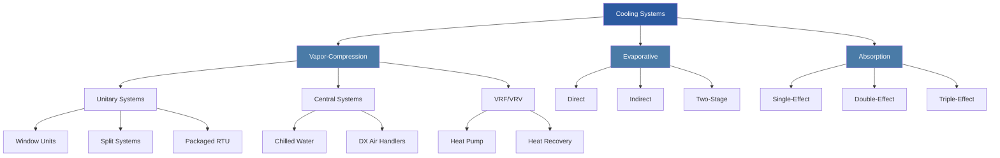

## Overview of Air Conditioning and Cooling

Air conditioning systems remove sensible and latent heat from conditioned spaces to maintain thermal comfort and indoor air quality. The fundamental principle underlying most cooling technologies is the second law of thermodynamics: heat flows from higher to lower temperature regions, requiring energy input to reverse this natural direction.

ASHRAE defines air conditioning as the process of treating air to control its temperature, humidity, cleanliness, and distribution simultaneously. Cooling represents the primary load in most climate-controlled environments, particularly in commercial buildings where internal gains from occupants, lighting, and equipment dominate the thermal balance.

### Fundamental Cooling Mechanisms

**Vapor-Compression Refrigeration** forms the backbone of modern air conditioning. The cycle exploits the thermodynamic properties of refrigerants, which absorb heat during evaporation at low pressure and reject heat during condensation at high pressure. The coefficient of performance (COP) for cooling is defined as:

COP = Qevap / Wcomp

Where Qevap is the cooling capacity and Wcomp is the compressor work input. Typical air-cooled systems achieve COP values of 2.5-3.5, while water-cooled chillers reach 4.5-6.5 under design conditions.

**Evaporative Cooling** leverages the enthalpy of vaporization of water, providing sensible cooling through the adiabatic saturation process. Direct evaporative coolers add moisture while reducing dry-bulb temperature along a constant wet-bulb line on the psychrometric chart. Indirect systems use a heat exchanger to provide cooling without humidification. Effectiveness ranges from 70-90% for direct systems and 50-80% for indirect configurations.

**Absorption Cooling** substitutes thermal energy for mechanical compression, utilizing a binary fluid pair (typically lithium bromide-water or ammonia-water). The absorption cycle proves advantageous when waste heat or low-cost thermal energy is available. COP values range from 0.6-1.2 for single-effect machines and 1.0-1.4 for double-effect units.

### System Classification

### Heat Rejection Methods

Cooling systems require heat rejection to complete the thermodynamic cycle. Common methods include:

| Rejection Method | Temperature Approach | Water Usage | Efficiency | Applications |
|------------------|---------------------|-------------|------------|--------------|
| Air-Cooled Condensers | 15-25°F above ambient | None | Lower COP | Small-medium systems, water-scarce regions |
| Cooling Towers (Open) | 7-10°F approach to WB | High (evaporation) | Higher COP | Large central plants |
| Cooling Towers (Closed) | 10-15°F approach to WB | Medium | Medium COP | Process cooling, glycol systems |
| Evaporative Condensers | 10-15°F above WB | Medium | Medium-High COP | Industrial refrigeration |
| Ground-Source | Stable ground temp | None | Highest COP | Heat pumps, sustainable designs |

### Psychrometric Considerations

Air conditioning processes must account for both sensible heat ratio (SHR) and the moisture content of air. The sensible heat ratio is:

SHR = Qs / (Qs + Ql)

Where Qs is sensible cooling and Ql is latent cooling. Typical comfort cooling applications exhibit SHR values of 0.70-0.80, though this varies significantly based on occupancy density, ventilation rates, and climate. Equipment selection must match the space load profile to avoid humidity control issues.

ASHRAE Standard 62.1 mandates minimum ventilation rates, introducing outdoor air that often represents 20-40% of the total cooling load in humid climates. Energy recovery ventilators (ERV) and dedicated outdoor air systems (DOAS) address this load component efficiently.

### System Selection Criteria

Choosing the appropriate cooling technology requires analysis of:

- **Capacity requirements** (block load calculations per ASHRAE Fundamentals)
- **Load diversity** (simultaneous usage factors)
- **Energy costs** (electric rates, demand charges, time-of-use pricing)
- **Water availability** (drought restrictions, discharge regulations)
- **Space constraints** (equipment rooms, vertical shafts, rooftop capacity)
- **Maintenance access** (service agreements, in-house capabilities)
- **First cost vs. lifecycle cost** (15-25 year analysis horizon)

## Content Navigation

| Category | Description | Key Topics |
|----------|-------------|------------|
| **Unitary Systems** | Self-contained cooling units | Window AC, split systems, packaged rooftop units, ductless mini-splits |
| **Central Systems** | Large-scale chilled water plants | Water-cooled chillers, air-cooled chillers, primary-secondary pumping |
| **VRF/VRV Systems** | Variable refrigerant flow | Heat pump mode, heat recovery, simultaneous heating/cooling |
| **Cooling Towers** | Heat rejection equipment | Counterflow, crossflow, hybrid towers, water treatment |
| **Specialized Cooling** | Application-specific systems | Data center cooling, process cooling, thermal storage |

*Version: 3.0_comprehensive*

