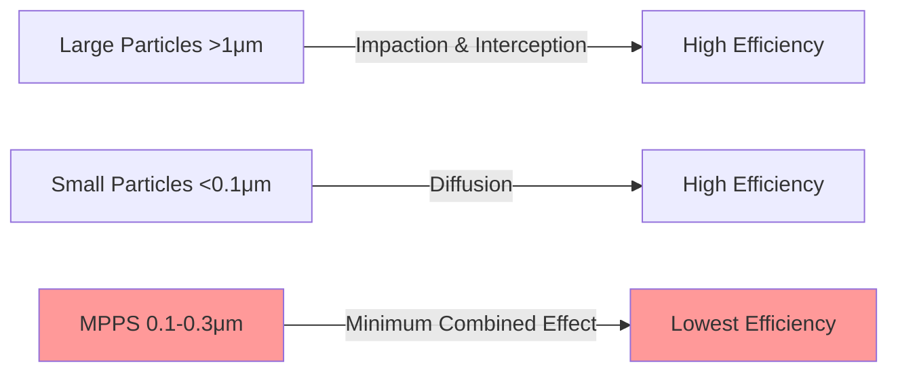

Air filtration represents a critical component of modern HVAC systems, serving to remove particulate matter, biological contaminants, and gaseous pollutants from indoor air. The effectiveness of filtration directly impacts occupant health, equipment longevity, and process requirements in specialized applications.

## Fundamental Filtration Mechanisms

Air filtration operates through multiple physical mechanisms that capture particles of varying sizes. The dominant capture mechanism depends on particle size, air velocity, and filter media characteristics.

### Interception

Particles following airflow streamlines come within one particle radius of a filter fiber and adhere to the fiber surface. Interception efficiency increases with:

$$\eta_R = \frac{R}{R + r}$$

where $R$ is the particle radius and $r$ is the fiber radius. This mechanism dominates for particles in the 0.1-1.0 μm range.

### Impaction

Larger particles with sufficient inertia deviate from airflow streamlines and impact filter fibers directly. The Stokes number characterizes impaction probability:

$$Stk = \frac{\rho_p d_p^2 U}{18 \mu d_f}$$

where $\rho_p$ is particle density, $d_p$ is particle diameter, $U$ is approach velocity, $\mu$ is air viscosity, and $d_f$ is fiber diameter. Impaction efficiency increases dramatically for $Stk > 0.2$, making this the primary mechanism for particles larger than 1 μm.

### Diffusion

Submicron particles undergo Brownian motion due to random molecular collisions, increasing their probability of contacting filter fibers. Diffusion efficiency relates to the Peclet number:

$$\eta_D \propto \frac{1}{Pe} = \frac{D}{U d_f}$$

where $D$ is the particle diffusion coefficient. Diffusion dominates for particles smaller than 0.1 μm and increases with decreasing particle size.

### Electrostatic Attraction

Charged particles experience coulombic forces toward oppositely charged filter media. Electrostatic filtration enhances collection efficiency across all particle sizes:

$$F_e = q E = q \frac{V}{d}$$

where $q$ is particle charge, $E$ is electric field strength, $V$ is applied voltage, and $d$ is electrode spacing.

## Most Penetrating Particle Size

The combination of filtration mechanisms creates a minimum efficiency point typically between 0.1-0.3 μm, known as the Most Penetrating Particle Size (MPPS):

Filter efficiency ratings typically test at or near the MPPS to represent worst-case performance. HEPA filters, for example, must demonstrate 99.97% efficiency at 0.3 μm, which approximates the MPPS for most HEPA media.

## Filter Types Overview

### Panel Filters

Panel filters provide economical primary filtration with MERV 1-4 ratings:

- Simple fibrous media supported by rigid frame
- Initial pressure drop: 25-75 Pa (0.1-0.3 in. w.g.)
- Dust holding capacity: 100-300 g/m²
- Typical service life: 1-3 months

Applications include residential furnaces and prefilters for commercial systems.

### Pleated Filters

Pleated filters increase media area through accordion-style folds, achieving MERV 5-14:

- Synthetic or electret media in pleated configuration
- Initial pressure drop: 75-250 Pa (0.3-1.0 in. w.g.)
- Dust holding capacity: 400-1200 g/m²
- Service life: 3-12 months

The pleat geometry determines effective filter area:

$$A_{media} = A_{face} \times \left(1 + 2\frac{h_{pleat}}{w_{pleat}}\right) \times n_{pleats}$$

### HEPA Filters

High Efficiency Particulate Air (HEPA) filters provide maximum particulate removal:

- Minimum efficiency: 99.97% @ 0.3 μm (US standard)
- Submicron glass fiber media with deep pleating
- Initial pressure drop: 250-500 Pa (1.0-2.0 in. w.g.)
- Critical applications: cleanrooms, healthcare, laboratories

### Activated Carbon Filters

Activated carbon filtration removes gaseous contaminants through adsorption:

- Surface area: 500-1500 m²/g
- Pore volume: 0.4-1.2 cm³/g
- Applications: VOC removal, odor control, acid gases

Adsorption capacity follows the Freundlich isotherm:

$$q_e = K_F C_e^{1/n}$$

where $q_e$ is mass of adsorbate per unit adsorbent, $C_e$ is equilibrium concentration, and $K_F$ and $n$ are empirical constants.

## MERV Ratings (ASHRAE 52.2)

Minimum Efficiency Reporting Value (MERV) ratings provide standardized filter performance metrics:

| MERV | Particle Size Range | Typical Efficiency |
|------|-------------------|-------------------|
| 1-4  | 3.0-10 μm        | 20-80%            |
| 5-8  | 1.0-3.0 μm       | 20-70%            |
| 9-12 | 0.3-1.0 μm       | 40-85%            |
| 13-16| 0.3-1.0 μm       | 75-95%            |

MERV ratings derive from minimum efficiency across the entire dust loading cycle, ensuring consistent performance throughout filter service life.

## ISO 16890 Global Standard

ISO 16890 focuses on health-relevant particle sizes:

- **ePM1** (≤1 μm): Alveolar deposition
- **ePM2.5** (≤2.5 μm): Tracheobronchial deposition
- **ePM10** (≤10 μm): Upper respiratory tract

Classification example: **ISO ePM2.5 65%** indicates minimum 65% efficiency for particles ≤2.5 μm after electrostatic discharge conditioning.

## Pressure Drop and Energy Consumption

Pressure drop through filter media results from viscous drag forces:

$$\Delta P = K \rho \frac{v^2}{2} + \mu v t$$

where $K$ is geometry-dependent resistance, $\rho$ is air density, $v$ is face velocity, $\mu$ is air viscosity, and $t$ is media thickness.

Fan energy consumption increases with filter loading:

$$\dot{W}_{fan} = \frac{\dot{V} \Delta P}{\eta_{fan}}$$

Economic optimization balances filter replacement costs against energy costs:

$$Cost_{total} = Cost_{filter} + \int_0^{t_{service}} \frac{\dot{V} \Delta P(t) C_{energy}}{\eta_{fan}} dt$$

## System Integration Considerations

### Filter Location

Strategic filter placement affects system performance:

- **Upstream of coils**: Protects heat exchangers from fouling
- **After coils**: Required for very high efficiency applications
- **Mixed air section**: Filters outdoor air plus return air
- **Dedicated outdoor air**: Separate filtration for ventilation air

### Face Velocity Limits

Recommended face velocities by filter type:

- Panel filters: 2.0-2.5 m/s (400-500 fpm)
- Pleated filters: 2.5-3.8 m/s (500-750 fpm)
- HEPA filters: 1.3-2.5 m/s (250-500 fpm)
- Activated carbon: 1.0-2.0 m/s (200-400 fpm)

### Bypass Leakage

Air bypassing the filter reduces system efficiency:

$$\eta_{system} = \eta_{filter} \times (1 - f_{bypass})$$

where $f_{bypass}$ is the fraction of air bypassing the filter. Proper gasketing and frame sealing minimize bypass.

## Applications by Indoor Air Quality Requirements

### Commercial Buildings

MERV 8-13 filtration typically provides adequate protection:

- Removes most pollen, mold spores, dust
- Controls visible dust accumulation
- Balances efficiency with energy consumption
- Typical filter life: 3-6 months

### Healthcare Facilities

Higher efficiency filtration protects vulnerable populations:

- MERV 14-16 for general areas
- HEPA (MERV 17-20) for critical spaces
- Bacteria and virus removal
- ASHRAE 170 compliance requirements

### Industrial Cleanrooms

ISO 14644-1 cleanroom classifications require HEPA or ULPA filtration:

- ISO Class 5: 99.999% @ MPPS
- ISO Class 6: 99.97% @ 0.3 μm
- Validated performance testing
- Continuous monitoring

## Maintenance and Monitoring

### Pressure Drop Monitoring

Differential pressure across filters indicates loading status:

$$\Delta P_{replacement} = 1.5 \text{ to } 2.5 \times \Delta P_{clean}$$

Magnehelic gauges or electronic transducers provide continuous monitoring.

### Performance Testing

Aerosol photometry verifies installed system efficiency:

$$\eta_{installed} = \left(1 - \frac{C_{downstream}}{C_{upstream}}\right) \times 100\%$$

In-situ testing ensures no bypass and proper installation, particularly critical for HEPA installations.

## Energy Efficiency Considerations

Filter selection impacts HVAC energy consumption significantly. Life cycle cost analysis should include:

$$LCC = C_{initial} + \sum_{i=1}^{n} \frac{C_{replacement,i} + C_{energy,i}}{(1+r)^i}$$

where $r$ is the discount rate and $n$ is the analysis period in years.

Low-energy filter designs incorporate:

- Synthetic media with larger fiber diameters
- Increased filter area through pleating or extended surface
- Graded density media with coarse upstream layers
- Electret charging for enhanced capture without increased resistance

## Standards and Regulations

Filter performance, testing, and application are governed by multiple standards:

- **ASHRAE 52.2**: MERV rating test method for US market
- **ISO 16890**: Global filter testing standard replacing EN 779
- **ASHRAE 170**: Healthcare facility filtration requirements
- **ISO 14644**: Cleanroom classification and testing
- **NFPA 90A**: Installation requirements for air conditioning systems

Understanding these standards ensures proper filter selection, installation, and verification of performance in critical applications. Effective air filtration protects occupant health, extends equipment life, and maintains process quality across diverse HVAC applications.
