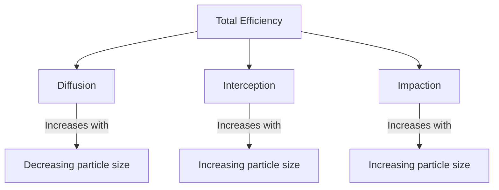

Particulate filtration removes airborne solid and liquid particles from HVAC airstreams, protecting both occupants and equipment. Understanding particle behavior and capture mechanisms enables effective filter selection for diverse applications.

## Airborne Particle Characteristics

### Particle Size Distribution

Indoor and outdoor air contains particles spanning several orders of magnitude in size:

| Size Range | Examples | Health Relevance |
|------------|----------|------------------|
| <0.1 μm | Viruses, combustion nuclei | Deep lung penetration |
| 0.1-1 μm | Bacteria, smoke, smog | Alveolar deposition |
| 1-10 μm | Pollen, mold spores | Bronchial deposition |
| >10 μm | Dust, plant fragments | Nasal filtering |

### Particle Sources

**Outdoor Origin**:
- Traffic emissions (ultrafine particles)
- Industrial processes
- Construction activities
- Natural sources (pollen, dust)

**Indoor Generation**:
- Human activity (skin cells, fibers)
- Cooking and combustion
- Printers and copiers
- HVAC system components

### Health Impact by Size

Particle deposition in the respiratory system depends on size:

$$Deposition\ Fraction = f(d_p, breathing\ rate, physiology)$$

- **PM10**: Particles ≤10 μm penetrate lower respiratory tract
- **PM2.5**: Particles ≤2.5 μm reach alveoli
- **Ultrafine (<0.1 μm)**: May enter bloodstream

## Filtration Mechanisms

### Interception

Particles following airflow streamlines contact filter fibers when passing within one particle radius:

$$\eta_R \propto \left(\frac{d_p}{d_f}\right)^2$$

Interception dominates for particles in the 0.1-1.0 μm range traveling at moderate velocities.

### Inertial Impaction

Larger particles with sufficient inertia deviate from streamlines and impact fibers:

$$\eta_I \propto Stk^n$$ where $n \approx 2$

The Stokes number characterizes impaction behavior:

$$Stk = \frac{\rho_p d_p^2 U C_c}{18 \mu d_f}$$

Impaction is the primary mechanism for particles >1 μm.

### Diffusion (Brownian Motion)

Submicron particles undergo random motion due to molecular collisions:

$$D = \frac{k_B T C_c}{3 \pi \mu d_p}$$

Diffusion collection efficiency increases with decreasing particle size:

$$\eta_D \propto \left(\frac{D}{U d_f}\right)^{2/3}$$

### Electrostatic Effects

Charged particles experience attraction to filter fibers:

**Coulombic Force** (charged particle, charged fiber):
$$F_c = \frac{q_p q_f}{4 \pi \epsilon_0 r^2}$$

**Image Force** (charged particle, neutral fiber):
$$F_i = \frac{q_p^2}{16 \pi \epsilon_0 r^2} \cdot \frac{\epsilon_f - 1}{\epsilon_f + 1}$$

Electret filters exploit permanent electrostatic charges for enhanced efficiency at low pressure drop.

### Gravitational Settling

Large particles may settle onto horizontal filter surfaces:

$$v_s = \frac{\rho_p d_p^2 g C_c}{18 \mu}$$

Significant only for particles >10 μm at low face velocities.

## Most Penetrating Particle Size (MPPS)

The combination of mechanisms creates a minimum efficiency point:

The MPPS typically occurs between 0.1-0.3 μm, where neither diffusion nor impaction dominates. This worst-case size forms the basis for HEPA testing standards.

### MPPS Shift with Velocity

Face velocity affects MPPS location:

- Higher velocity → MPPS shifts smaller (reduced diffusion time)
- Lower velocity → MPPS shifts larger (reduced impaction)

$$MPPS \propto \left(\frac{d_f \mu}{U \rho_p}\right)^{0.5}$$

## Single Fiber Efficiency

Filter efficiency builds from individual fiber collection:

$$\eta_{fiber} = \eta_R + \eta_I + \eta_D - \eta_R \cdot \eta_I - \eta_R \cdot \eta_D - \eta_I \cdot \eta_D + \eta_R \cdot \eta_I \cdot \eta_D$$

For typical conditions, mechanisms act independently:

$$\eta_{fiber} \approx \eta_R + \eta_I + \eta_D$$

### Filter Efficiency from Single Fiber

Overall filter efficiency relates to single fiber efficiency:

$$\eta_{filter} = 1 - exp\left(\frac{-4 \alpha \eta_{fiber} t}{\pi d_f (1-\alpha)}\right)$$

Where:
- $\alpha$ = filter solidity
- $t$ = filter thickness
- $d_f$ = fiber diameter

## Particle Loading Effects

### Filter Loading Stages

1. **Clean Filter**: Particles deposit on fiber surfaces
2. **Transition**: Dendrite structures form on fibers
3. **Dust Cake**: Surface accumulation dominates capture

### Efficiency Changes with Loading

Most filters show improved efficiency as particles accumulate:

$$\eta(t) = 1 - (1-\eta_0) \cdot exp(-k \cdot m_d)$$

However, electret filters may lose efficiency as charge neutralization occurs.

### Pressure Drop Progression

$$\Delta P(t) = \Delta P_0 + K_2 \cdot m_d$$ (surface loading)

$$\Delta P(t) = \Delta P_0 \cdot exp(\beta \cdot m_d)$$ (depth loading)

## Application Guidelines

### Residential and Light Commercial

**Target Particles**: Dust, pollen, mold spores
**Recommended Efficiency**: MERV 8-11
**Considerations**: Balance IAQ improvement with system compatibility

### Commercial Buildings

**Target Particles**: PM2.5, biological aerosols
**Recommended Efficiency**: MERV 11-14
**Considerations**: Energy impact, maintenance access, code requirements

### Healthcare Facilities

**Target Particles**: Bacteria, fungal spores, droplet nuclei
**Recommended Efficiency**: MERV 14-16 (HEPA for critical areas)
**Considerations**: ASHRAE 170 requirements, pressure relationships

### Cleanrooms

**Target Particles**: Submicron particles affecting processes
**Recommended Efficiency**: HEPA (H13-H14) or ULPA
**Considerations**: ISO 14644 classification, leak testing requirements

## Testing and Verification

### Fractional Efficiency Testing

ASHRAE 52.2 measures efficiency across particle size ranges:

1. Generate test aerosol (KCl)
2. Size-segregate with optical counter
3. Measure upstream/downstream concentrations
4. Calculate efficiency for each size bin

### Aerosol Photometry (HEPA)

DOP or PAO challenge verifies HEPA performance:

$$Penetration = \frac{C_{downstream}}{C_{upstream}} \times 100\%$$

### In-Situ Verification

Installed filter testing ensures system performance:

- Scan leak testing for HEPA installations
- Particle count verification downstream
- Pressure drop monitoring

Effective particulate filtration requires matching filter capabilities to specific particle removal requirements while considering system constraints and lifecycle economics.