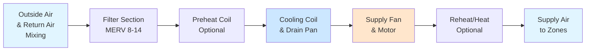

# Air Handling Units: Design and Configuration

Air handling units (AHUs) form the central air distribution equipment in commercial HVAC systems, conditioning and delivering supply air to occupied spaces. Understanding AHU configurations, component arrangement, and sizing methodology is fundamental to effective system design.

## AHU Component Arrangement

A properly designed AHU sequences components to optimize thermal performance, minimize pressure drop, and ensure serviceability. The standard airflow path proceeds through these sections:

The supply fan location determines the system classification: draw-through units (fan after coil) provide superior humidity control, while blow-through configurations (fan before coil) offer better mixing and are more compact.

## AHU Sizing Calculations

### Airflow Determination

The required supply airflow depends on the dominant load type. For sensible-dominated spaces:

$$Q_s = \frac{q_s}{1.08 \times \Delta T}$$

Where:
- $Q_s$ = supply airflow (CFM)
- $q_s$ = sensible cooling load (Btu/h)
- $\Delta T$ = supply-to-room temperature difference (°F)
- 1.08 = constant for air at standard conditions (0.24 Btu/lb·°F × 4.5 lb/CFM)

For latent-dominated applications:

$$Q_l = \frac{q_l}{4,840 \times (W_r - W_s)}$$

Where:
- $Q_l$ = supply airflow (CFM)
- $q_l$ = latent cooling load (Btu/h)
- $W_r$ = room humidity ratio (lb/lb)
- $W_s$ = supply air humidity ratio (lb/lb)
- 4,840 = constant (1,076 Btu/lb × 4.5 lb/CFM)

The larger of $Q_s$ or $Q_l$ establishes the design airflow.

### Cooling Coil Capacity

Total coil capacity accounts for both sensible and latent heat removal:

$$q_t = 4.5 \times Q \times (h_e - h_l)$$

Where:
- $q_t$ = total cooling capacity (Btu/h)
- $Q$ = airflow (CFM)
- $h_e$ = entering air enthalpy (Btu/lb)
- $h_l$ = leaving air enthalpy (Btu/lb)
- 4.5 = air density factor (lb/CFM at standard conditions)

### External Static Pressure

Fan selection requires calculating total system pressure drop per ASHRAE Fundamentals and SMACNA HVAC Systems Duct Design:

$$ESP = \Delta P_{filter} + \Delta P_{coil} + \Delta P_{duct} + \Delta P_{fittings} + \Delta P_{terminal}$$

Typical pressure drop allocations:
- Filters: 0.3–0.8 in. w.g. (increasing with dust loading)
- Cooling coil: 0.4–0.8 in. w.g.
- Heating coil: 0.2–0.5 in. w.g.
- Ductwork and fittings: 0.08–0.15 in. w.g. per 100 ft

## AHU Configuration Comparison

| Configuration | Application | Control Method | Energy Efficiency | Humidity Control | Installation Cost |
|---------------|-------------|----------------|-------------------|------------------|-------------------|
| **Single Zone** | Small buildings, constant load | On/off or staged | Moderate | Good | Low |
| **Multizone** | Multiple zones, simultaneous heating/cooling | Hot/cold deck mixing | Poor (mixing losses) | Fair | Moderate |
| **VAV** | Large buildings, variable loads | Airflow modulation | Excellent | Requires reheat for humidity | High |
| **Dual Duct** | Critical environments, precise control | Hot/cold duct mixing at terminal | Poor (mixing losses) | Excellent | Very High |

### Single Zone Systems

Single zone AHUs serve one thermostat and control space conditions by modulating supply air temperature. These units excel in applications with uniform loads across the served area: small office buildings, retail spaces, and warehouses. The entire airflow receives identical conditioning, making them simple to control but inefficient for diverse load profiles.

### Variable Air Volume (VAV) Systems

VAV systems maintain space temperature by varying airflow while holding supply air temperature relatively constant (typically 55°F). Terminal units with dampers modulate zone airflow in response to local thermostats. This configuration delivers superior energy performance in buildings with diverse or time-varying loads, as the supply fan reduces speed during partial load conditions.

ASHRAE 90.1 mandates VAV systems include fan speed control and economizer capability for most commercial applications over 5,000 CFM. The primary challenge involves maintaining adequate ventilation and humidity control at minimum airflow conditions, often requiring reheat or dual-maximum control sequences.

### Multizone and Dual Duct Configurations

Multizone AHUs generate simultaneous hot and cold airstreams, mixing them at zone dampers within the unit. Dual duct systems extend this concept by distributing separate hot and cold ducts throughout the building, mixing at terminal units. Both configurations provide excellent zone-level control but suffer significant energy penalties from mixing losses and constant-volume operation.

Modern applications of these systems are limited to laboratories, hospitals, and mission-critical facilities where precise temperature control justifies the energy cost. ASHRAE 90.1 restricts their use due to inherent inefficiency.

## Design Standards and Compliance

ASHRAE Standard 90.1 establishes minimum efficiency requirements for AHU components:
- Fan motor efficiency per NEMA Premium or IE3 standards
- Maximum fan power limitation: 1.0–1.2 hp/1,000 CFM depending on system pressure class
- Economizer requirements for systems exceeding 54,000 Btu/h cooling capacity
- Minimum filter efficiency: MERV 8 per ASHRAE 52.2

SMACNA standards govern AHU construction and ductwork connections:
- Casing leakage: Class 2 or better (≤6 CFM/ft² at 4 in. w.g.)
- Thermal performance: R-10 minimum casing insulation
- Access panel locations per maintenance requirements

## Selection Considerations

Critical factors in AHU selection include:
- **Capacity margins**: Size cooling coils for 115–125% of calculated load to accommodate future growth and safety factor
- **Face velocity limits**: Maintain 400–500 FPM across cooling coils to prevent moisture carryover
- **Turndown ratio**: Ensure fans can modulate to 30–40% of design flow while maintaining stable operation
- **Sound levels**: Specify discharge sound power levels per NC curves, typically NC 35–45 for occupied spaces
- **Service access**: Provide 36 in. clearance on service side per IMC requirements

Proper AHU design balances first cost, operating efficiency, controllability, and maintainability. VAV systems represent the current best practice for most commercial applications, offering optimal energy performance while maintaining acceptable comfort control across diverse load conditions.

