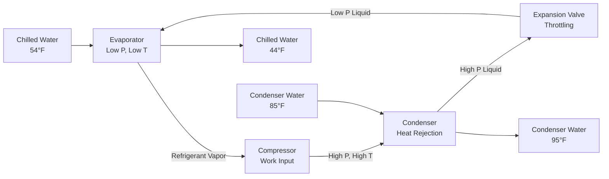
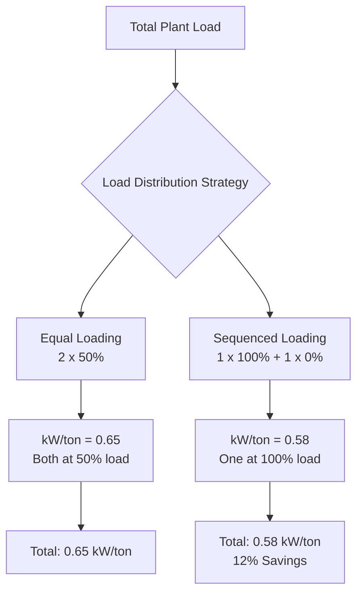

Chillers represent the workhorse of large-scale air conditioning systems, converting electrical or thermal energy into cooling capacity through thermodynamic refrigeration cycles. These machines provide chilled water (typically 42-48°F) to air handling units, fan coil units, and process equipment throughout commercial, institutional, and industrial facilities.

## Fundamental Operating Principles

### Vapor Compression Chillers

Vapor compression chillers operate on the reversed Carnot cycle, utilizing phase change of refrigerant to absorb heat at low temperature and reject it at elevated temperature. The thermodynamic relationship governing chiller performance is expressed through the coefficient of performance (COP):

$$\text{COP} = \frac{Q_{\text{evap}}}{W_{\text{comp}}} = \frac{h_1 - h_4}{h_2 - h_1}$$

where $h_1$, $h_2$, and $h_4$ represent refrigerant enthalpies at evaporator outlet, compressor discharge, and expansion valve inlet respectively.

The theoretical maximum efficiency follows Carnot limitations:

$$\text{COP}_{\text{Carnot}} = \frac{T_{\text{evap}}}{T_{\text{cond}} - T_{\text{evap}}}$$

with temperatures in absolute scale (Rankine or Kelvin). Real chillers achieve 40-60% of Carnot efficiency due to irreversibilities in compression, heat transfer, and expansion processes.

### Absorption Chillers

Absorption chillers replace mechanical compression with thermal energy-driven absorption/desorption cycles. The solution circuit uses lithium bromide-water or ammonia-water pairs, where the absorbent exhibits strong affinity for refrigerant vapor at low temperatures.

The heat balance for single-effect absorption systems:

$$\text{COP}_{\text{abs}} = \frac{Q_{\text{evap}}}{Q_{\text{gen}} + W_{\text{pump}}} \approx 0.65 - 0.75$$

Double-effect absorption chillers achieve COP values of 1.0-1.2 by cascading generator stages, though requiring higher input temperatures (300-380°F vs 230-250°F for single-effect).

## Chiller Configuration Comparison

### Water-Cooled vs Air-Cooled Systems

| Parameter | Water-Cooled | Air-Cooled |
|-----------|--------------|------------|
| **Typical Efficiency** | 0.50-0.65 kW/ton | 0.85-1.15 kW/ton |
| **Condenser Temperature** | 85-105°F | 100-130°F |
| **Footprint** | Compact | Larger |
| **Water Consumption** | 2-3 gpm/100 tons | None |
| **Maintenance** | Cooling tower required | Coil cleaning |
| **Initial Cost** | Higher (tower + piping) | Lower |
| **Capacity Turndown** | Excellent (10-100%) | Good (25-100%) |
| **Noise Level** | Lower | Higher |

The efficiency advantage of water-cooled systems derives directly from reduced lift requirements. Using the log-mean temperature difference (LMTD) approach, the required heat transfer area scales inversely with approach temperature:

$$Q = UA \cdot \text{LMTD} = UA \cdot \frac{\Delta T_1 - \Delta T_2}{\ln(\Delta T_1/\Delta T_2)}$$

Lower condensing temperatures reduce compression ratios exponentially per the Clausius-Clapeyron relationship, directly improving efficiency.

### Compressor Technologies

| Compressor Type | Capacity Range | Efficiency | Part-Load Performance | Typical Applications |
|----------------|----------------|------------|----------------------|---------------------|
| **Scroll** | 2-60 tons | Good | Fair (stepped) | Small commercial |
| **Screw** | 50-750 tons | Very Good | Excellent | Medium commercial |
| **Centrifugal** | 100-10,000+ tons | Excellent | Good (surge limits) | Large central plants |
| **Magnetic Bearing** | 75-2,000 tons | Superior | Excellent (0.1% turndown) | High-performance plants |

Centrifugal compressors dominate large installations due to oil-free operation and efficiency. The Euler turbomachinery equation governs their performance:

$$\Delta h = U_2 C_{u2} - U_1 C_{u1}$$

where $U$ represents impeller tip speed and $C_u$ denotes tangential velocity components. Variable speed drives optimize performance across load ranges by modulating impeller speed rather than inlet vane position.

## Capacity Ranges and Selection Criteria

### Sizing Methodology

Chiller capacity must satisfy peak cooling load with appropriate safety factor while maintaining acceptable part-load efficiency. The fundamental heat balance:

$$Q_{\text{chiller}} = \dot{m} c_p \Delta T = \frac{\text{gpm} \times 500 \times \Delta T}{12,000}$$ (tons)

Standard design parameters:
- **Chilled water flow rate**: 2.4 gpm/ton (10°F ΔT) or 3.0 gpm/ton (8°F ΔT)
- **Condenser water flow rate**: 3.0 gpm/ton (10°F ΔT)
- **Evaporator approach**: 2-4°F
- **Condenser approach**: 2-5°F

### Multiple Chiller Configurations

Central plants typically employ 2-4 chillers for redundancy and part-load optimization. The energy consumption profile demonstrates why staging matters:

ASHRAE 90.1 mandates sequencing controls that minimize total plant power (chillers + pumps + towers) rather than individual chiller efficiency.

## Performance Metrics and Standards

### Efficiency Ratings

**IPLV (Integrated Part Load Value)** per AHRI Standard 550/590 provides realistic efficiency assessment:

$$\text{IPLV} = 0.01A + 0.42B + 0.45C + 0.12D$$

where A, B, C, D represent efficiency (kW/ton) at 100%, 75%, 50%, and 25% load respectively. Modern water-cooled centrifugal chillers achieve IPLV values of 0.40-0.50 kW/ton.

### Condenser Water Temperature Impact

Chiller efficiency varies dramatically with condensing temperature. Empirical relationships show:

$$\frac{\text{kW/ton}_2}{\text{kW/ton}_1} \approx \left(\frac{T_{\text{cond,2}}}{T_{\text{cond,1}}\right)^{1.5}$$

Reducing condenser water from 85°F to 75°F typically improves efficiency by 8-12%, demonstrating the value of low approach cooling towers and free cooling integration.

## Central Plant Applications

Chilled water systems offer advantages over distributed DX equipment in facilities exceeding 50,000 ft² or requiring cooling capacities above 150 tons:

- **Energy efficiency**: Central plant efficiencies of 0.50-0.60 kW/ton vs 0.85-1.1 kW/ton for rooftop units
- **Equipment life**: 20-30 years vs 15-20 years for distributed systems
- **Maintenance centralization**: Single location vs distributed rooftop access
- **Thermal storage compatibility**: Ice or chilled water storage for demand management
- **Free cooling potential**: Waterside economizers when ambient conditions permit

District cooling systems extend the central plant concept to multiple buildings, leveraging diversity factors and economies of scale. Distribution losses (typically 2-5% per 1000 ft of piping) must be evaluated against equipment efficiency gains.

## References

AHRI Standard 550/590: Performance Rating of Water-Chilling and Heat Pump Water-Heating Packages Using the Vapor Compression Cycle

ASHRAE Handbook—HVAC Systems and Equipment, Chapter 43: Liquid Chilers

ASHRAE Standard 90.1: Energy Standard for Buildings Except Low-Rise Residential Buildings
