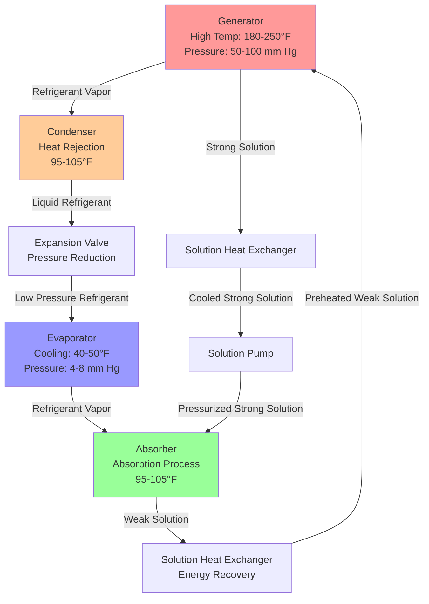

Absorption chillers produce cooling by leveraging thermal energy rather than mechanical compression, utilizing a thermochemical cycle that enables waste heat recovery and integration with renewable energy sources. These systems achieve refrigeration through the absorption and desorption of refrigerant vapor in a working fluid pair, most commonly lithium bromide-water (LiBr-H₂O) or ammonia-water (NH₃-H₂O).

## Thermodynamic Principles

The absorption refrigeration cycle replaces the mechanical compressor with a thermal compressor consisting of an absorber, solution pump, and generator. The fundamental energy balance for the generator shows:

$$Q_g = \dot{m}_r h_{fg} + Q_{loss}$$

where $Q_g$ represents generator heat input, $\dot{m}_r$ is refrigerant mass flow rate, and $h_{fg}$ is the latent heat of vaporization.

The coefficient of performance (COP) for absorption chillers is defined as:

$$COP_{abs} = \frac{Q_e}{Q_g + W_p}$$

where $Q_e$ is evaporator cooling capacity, $Q_g$ is generator heat input, and $W_p$ represents solution pump work (typically negligible, 1-2% of total energy input).

Single-effect absorption chillers achieve COP values of 0.6-0.7, while double-effect configurations reach 1.0-1.2 by utilizing high-temperature heat sources. In contrast, vapor compression systems deliver COP values of 3.0-6.0 based on electric input. However, when evaluating primary energy consumption, absorption systems powered by waste heat or solar thermal energy demonstrate superior overall efficiency.

## Lithium Bromide-Water Cycle

The LiBr-H₂O system uses water as refrigerant and lithium bromide as absorbent, making it ideal for air conditioning applications (evaporator temperatures above 32°F). The cycle operates under deep vacuum conditions (4-10 mm Hg absolute) to enable water evaporation at low temperatures.

The concentration difference between weak solution (leaving generator, 55-60% LiBr) and strong solution (entering generator, 60-65% LiBr) drives the absorption process. The Dühring relationship governs the equilibrium between solution concentration, temperature, and pressure:

$$\log P = A - \frac{B}{T + C}$$

where $P$ is vapor pressure, $T$ is temperature, and $A$, $B$, $C$ are concentration-dependent constants.

## System Components and Heat Transfer

### Generator

The generator receives heat input to boil refrigerant from the weak LiBr solution. Heat transfer rates depend on the overall heat transfer coefficient and log mean temperature difference:

$$Q_g = UA \cdot LMTD_g$$

Direct-fired generators use natural gas burners (80-85% efficiency), while indirect generators accept hot water (180-250°F), steam (12-15 psig low-pressure or 115-150 psig high-pressure for double-effect), or exhaust gases from cogeneration systems.

### Absorber

The absorber facilitates the exothermic absorption of refrigerant vapor into strong LiBr solution. The heat of absorption must be rejected to maintain low temperature:

$$Q_a = \dot{m}_r \left( h_{fg} + h_{dil} \right)$$

where $h_{dil}$ represents the heat of dilution (approximately 80-100 Btu/lb for LiBr-H₂O). Absorber tubes require cooling water at 85-95°F, with heat rejection equal to:

$$Q_a + Q_c \approx Q_e + Q_g$$

This relationship demonstrates that absorption chillers reject 2.5 times the cooling load to condenser/absorber cooling water, compared to 1.3 times for vapor compression systems.

### Solution Heat Exchanger

The solution heat exchanger recovers sensible heat from hot strong solution leaving the generator to preheat weak solution, improving cycle efficiency by 10-15%. Effectiveness typically ranges from 0.6-0.75:

$$\varepsilon = \frac{T_{ws,out} - T_{ws,in}}{T_{ss,in} - T_{ws,in}}$$

## Performance Comparison and Applications

| Parameter | Single-Effect Absorption | Double-Effect Absorption | Vapor Compression |
|-----------|-------------------------|--------------------------|-------------------|
| COP (Cooling/Input) | 0.6-0.7 | 1.0-1.3 | 3.0-6.0 (electric) |
| Heat Source Temperature | 180-250°F | 280-380°F | N/A |
| Electrical Input | 20-40 W/ton | 70-100 W/ton | 0.5-0.8 kW/ton |
| Chilled Water Range | 40-55°F | 40-55°F | 35-55°F |
| Cooling Tower Load | 2.4-2.5 × cooling | 1.8-2.0 × cooling | 1.25-1.35 × cooling |
| Part-Load Efficiency | Poor (COP drops) | Moderate | Excellent |
| Minimum Load | 10-15% | 20-30% | 10-25% |
| Refrigerant | Water (ODP=0, GWP=0) | Water (ODP=0, GWP=0) | HFCs (GWP varies) |

According to ASHRAE Handbook—HVAC Systems and Equipment (2020), absorption chillers excel in applications with available low-cost thermal energy:

**Combined Heat and Power (CHP) Integration**: Recovering engine jacket water (180-220°F) or exhaust heat (800-1200°F) to drive absorption chillers achieves overall system efficiencies exceeding 80%. The electrical-to-thermal ratio (E/T) of 0.5-0.8 for most CHP systems aligns well with building loads requiring simultaneous power and cooling.

**District Energy Systems**: Campus and industrial complexes with central steam plants utilize absorption chillers to balance heating and cooling demands, reducing peak electrical loads by 0.5-0.8 kW per ton of cooling.

**Solar Thermal Cooling**: Single-effect absorption chillers pair effectively with evacuated tube or parabolic trough collectors producing 180-250°F fluid. Solar cooling fractions of 0.4-0.7 are achievable in favorable climates, with fossil fuel backup ensuring continuous operation.

**Process Waste Heat Recovery**: Industrial facilities with continuous waste heat streams (exhaust gases, cooling water, condensate) achieve rapid payback periods (2-5 years) by converting rejected thermal energy into useful cooling.

## Operational Considerations

Crystallization represents the primary operational concern for LiBr systems. If solution concentration exceeds 65-68% or temperature drops below the crystallization curve, solid LiBr precipitates, blocking flow passages. Dilution cycles and solution heaters prevent crystallization during shutdown and low-load conditions.

Corrosion inhibitors (typically lithium chromate or lithium nitrate at 0.5-1.0% concentration) protect steel tubes and shells from corrosive attack by concentrated LiBr solutions under heat and vacuum conditions. Proper inhibitor concentration and system tightness (air in-leakage must be purged) ensure 20-30 year equipment life.

The vacuum environment requires hermetic sealing and automatic purge units to remove non-condensable gases that accumulate in the system, reducing heat transfer coefficients by 30-50% if not removed.

## Design Methodology

ASHRAE Standard 90.1 requires absorption chillers to meet minimum energy efficiency ratios when calculating baseline building performance. Selection procedures account for:

1. Available heat source temperature and flow rate
2. Required chilled water temperature and capacity
3. Cooling water temperature and availability
4. Part-load operating profile
5. Space and weight constraints
6. Economic analysis including energy costs, demand charges, and incentives

The thermal energy input calculation considers source-to-generator approach temperatures:

$$Q_{source} = \frac{Q_g}{\varepsilon_{HX} \cdot \eta_{gen}}$$

where $\varepsilon_{HX}$ is heat exchanger effectiveness (0.7-0.85) and $\eta_{gen}$ accounts for shell losses (0.95-0.98).

Absorption chiller technology enables effective utilization of thermal energy that would otherwise be wasted, providing economically viable cooling in appropriate applications while reducing electrical demand and environmental impact through natural refrigerant use.
