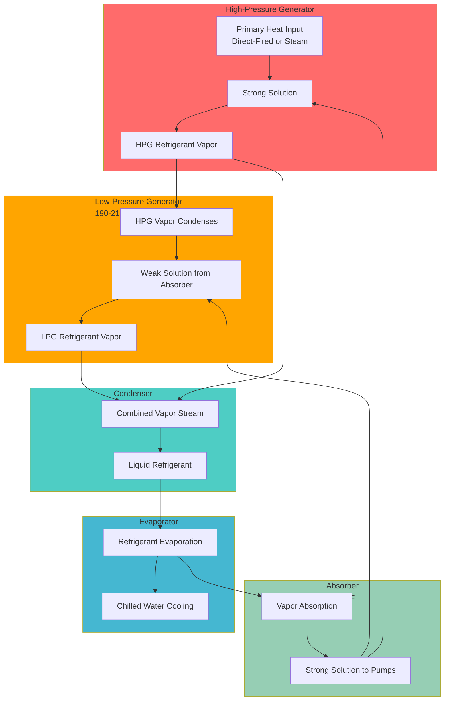

## Operating Principle

Double-effect absorption chillers employ a two-stage generation process that recovers and reuses thermal energy, achieving coefficient of performance (COP) values approximately 1.2—roughly 60% higher than single-effect machines. The fundamental advantage derives from cascading thermal energy through two generator stages operating at different pressure levels.

The high-pressure generator (HPG) operates at 350-400°F (177-204°C), receiving primary heat input from direct combustion or high-pressure steam. Refrigerant vapor generated in the HPG flows to the low-pressure generator (LPG), where it condenses and releases its latent heat. This recovered thermal energy drives additional refrigerant generation in the LPG, effectively utilizing the same heat input twice.

The thermodynamic efficiency gain results from the Carnot relationship applied across two temperature lifts rather than one:

$$\text{COP}_{\text{double}} = \frac{Q_{\text{evap}}}{Q_{\text{HPG}}} = \frac{T_{\text{evap}}(T_{\text{HPG}} - T_{\text{cond}})}{T_{\text{HPG}}(T_{\text{cond}} - T_{\text{evap}})} \times \eta_{\text{cascade}}$$

where $\eta_{\text{cascade}}$ represents the effectiveness of heat recovery between generator stages, typically 0.85-0.92.

## Two-Stage Generation Process

## Flow Configurations

### Series Flow Configuration

In series flow, solution circulates sequentially: absorber → HPG → LPG → absorber. A single solution pump supplies both generators.

**Advantages:**
- Simplified piping and controls
- Single solution pump reduces parasitic power
- Lower first cost
- Easier to balance and commission

**Thermodynamic characteristics:**
- HPG receives strongest solution (highest LiBr concentration)
- Greater concentration change in HPG
- Solution heat exchanger effectiveness critical to performance

### Parallel Flow Configuration

Parallel flow uses separate solution circuits for HPG and LPG, each with dedicated pumps and heat exchangers.

**Advantages:**
- Independent control of each generator
- Better part-load efficiency
- Optimized solution flow rates for each stage
- Improved turndown capability

**Thermodynamic characteristics:**
- Each generator receives solution at optimal concentration
- More stable operation at varying load conditions
- Higher COP at part-load (10-15% improvement at 50% load)

| Parameter | Series Flow | Parallel Flow |
|-----------|-------------|---------------|
| **Full-Load COP** | 1.15-1.20 | 1.18-1.25 |
| **Part-Load COP (50%)** | 0.90-1.00 | 1.05-1.15 |
| **Solution Pumps** | 1 | 2 |
| **Parasitic Power** | 8-12 kW/1000 tons | 12-18 kW/1000 tons |
| **Control Complexity** | Low | Medium |
| **First Cost** | Baseline | +15-20% |
| **Turndown Ratio** | 3:1 | 4:1 to 5:1 |

## Heat Source Options

### Direct-Fired Configuration

Direct-fired double-effect chillers combust natural gas or fuel oil in an integral burner to heat the HPG. Burner firing rates modulate from 25-100% to match cooling load.

**Performance characteristics:**
- Heat input: 12,000-13,000 Btu/ton-hr
- Gas consumption: 12-13 cubic feet/ton-hr (natural gas)
- Flue gas temperature: 350-450°F
- Exhaust heat available for recovery: 20-25% of input

The combustion energy balance:

$$Q_{\text{fuel}} \times \text{LHV} \times \eta_{\text{combustion}} = Q_{\text{HPG}} + Q_{\text{flue loss}} + Q_{\text{jacket loss}}$$

where lower heating value (LHV) for natural gas = 1,000 Btu/ft³ and combustion efficiency $\eta_{\text{combustion}}$ = 0.82-0.85.

**Applications:**
- Facilities without steam infrastructure
- Peak-shaving to avoid electric demand charges
- Combined cooling and power (CHP) systems
- District energy plants

### Steam-Fired Configuration

Steam-fired machines utilize high-pressure steam (85-115 psig) in the HPG heat exchanger. Steam consumption varies with load and entering steam conditions.

**Performance characteristics:**
- Steam pressure: 85-115 psig (saturated)
- Steam consumption: 16-18 lb/ton-hr
- Condensate return temperature: 190-210°F
- COP: 1.18-1.25 (based on steam enthalpy)

Steam consumption calculation:

$$\dot{m}_{\text{steam}} = \frac{Q_{\text{cooling}}}{\text{COP} \times h_{\text{fg}}}$$

where $h_{\text{fg}}$ is the latent heat of vaporization at supply pressure (approximately 880 Btu/lb at 100 psig).

**Applications:**
- Industrial facilities with process steam
- Cogeneration plants
- Campus central plants
- Hospitals with sterilization steam systems

### Hot Water Configuration

Some double-effect designs operate on hot water (320-380°F) from thermal storage, solar thermal collectors, or waste heat recovery.

**Performance characteristics:**
- Supply temperature: 320-380°F
- Flow rate: 25-35 gpm/100 tons
- Temperature drop: 20-30°F
- COP: 1.05-1.15 (lower than steam due to sensible heat transfer)

## High-Efficiency Heat Recovery Applications

### Exhaust Heat Recovery

Direct-fired chillers reject substantial thermal energy through flue gases. Heat recovery equipment captures this energy for beneficial use.

**Recovery options:**
- Hot water generation (140-180°F) for domestic use or space heating
- Pool/spa heating
- Process hot water
- Desiccant regeneration
- Absorption humidity control

Recoverable energy:

$$Q_{\text{recovery}} = \dot{m}_{\text{flue}} \times c_p \times (T_{\text{flue}} - T_{\text{stack}}) \times \eta_{\text{HX}}$$

Typical recovery: 2,500-3,500 Btu/ton-hr at 60-70% heat exchanger effectiveness, yielding combined COP (cooling + recovered heat) of 1.5-1.7.

### Turbine Exhaust Integration

Double-effect absorption chillers integrate efficiently with gas turbine cogeneration systems. Turbine exhaust (850-1,000°F) provides more than sufficient thermal energy for the HPG.

**System configuration:**
- Heat recovery steam generator (HRSG) produces 100-125 psig steam
- Steam feeds double-effect absorber HPG
- Electrical generation + cooling maximizes fuel utilization
- Combined system efficiency: 75-85%

Overall energy utilization factor (EUF):

$$\text{EUF} = \frac{E_{\text{electric}} + Q_{\text{cooling}} + Q_{\text{heating}}}{Q_{\text{fuel input}}}$$

### Condensing Boiler Integration

Modern condensing boilers operating at 95% efficiency provide excellent thermal sources for double-effect machines when heating and cooling loads occur simultaneously.

**Integration benefits:**
- Boiler operates at high efficiency during cooling season
- Minimal boiler cycling
- Reduced electric demand charges
- Load diversity between heating and cooling

## Performance Characteristics

Actual COP varies with operating conditions according to ASHRAE Standard 90.1 rating points:

**Standard Rating Conditions (ARI 560):**
- Chilled water: 44°F leaving, 54°F entering
- Cooling water: 85°F entering, 95°F leaving
- Heat input: Per manufacturer specifications

**Expected performance:**

| Load | Entering Cooling Water Temp | COP (Direct-Fired) | COP (Steam) |
|------|----------------------------|-------------------|-------------|
| 100% | 85°F | 1.15-1.20 | 1.20-1.25 |
| 75% | 85°F | 1.10-1.15 | 1.15-1.20 |
| 50% | 85°F | 0.90-1.00 | 1.00-1.10 |
| 100% | 75°F | 1.22-1.28 | 1.28-1.35 |
| 75% | 75°F | 1.18-1.24 | 1.24-1.30 |

Cooling water temperature profoundly affects performance. For every 1°F reduction in entering cooling water temperature, COP improves approximately 2-3%.

## Capacity Range and Applications

Double-effect absorption chillers range from 300 to 1,500 tons per unit, with multiple units serving larger facilities.

**Optimal applications:**
- University/hospital central plants: 800-2,000 tons total capacity
- Industrial facilities with process steam: 500-1,500 tons
- District cooling plants: Multiple units, 2,000-10,000+ tons
- Data centers with CHP: 400-1,200 tons
- Commercial buildings with thermal storage: 300-800 tons

**Economic considerations:**
- First cost: $600-$900/ton (steam), $750-$1,100/ton (direct-fired)
- Operating cost advantage when gas:electric rate ratio < 3.5-4.0
- Demand charge reduction provides significant value
- Maintenance cost: $8,000-$15,000/year (300-500 ton unit)

## Design Considerations

**Heat rejection:**
Double-effect machines reject more heat than electric chillers—approximately 1.8-1.9 times cooling capacity versus 1.25 for electric centrifugals. Cooling tower sizing must account for:

$$Q_{\text{rejection}} = Q_{\text{cooling}} + Q_{\text{heat input}}$$

For 1,000 tons cooling: rejection = 1,000 + (1,000/1.2) = 1,833 tons, requiring cooling tower capacity of 1,900-2,000 tons.

**Crystallization protection:**
Lithium bromide solution crystallizes if concentration becomes too high or temperature too low. Controls monitor solution concentration and temperature, initiating dilution cycles when approaching crystallization boundaries.

**Purge systems:**
Non-condensable gases (air, hydrogen) accumulate and reduce performance. Automatic purge systems extract gases while minimizing refrigerant loss—critical for maintaining design COP.

## References

ASHRAE Handbook—HVAC Systems and Equipment, Chapter 18: Sorption Cooling and Dehumidification
ASHRAE Standard 90.1: Energy Standard for Buildings Except Low-Rise Residential Buildings
ARI Standard 560: Absorption Water Chilling and Water Heating Packages
