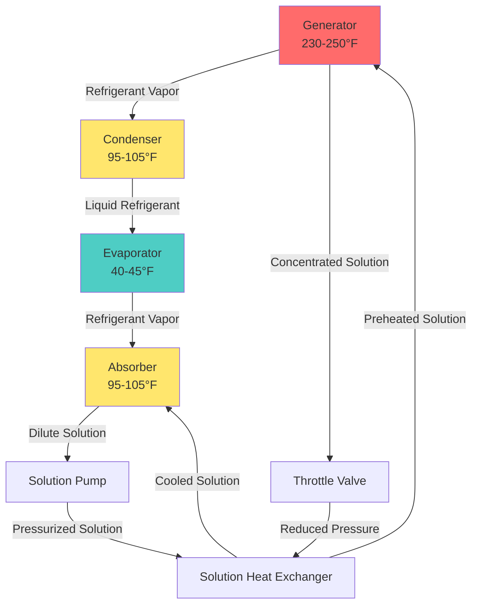

Single-effect absorption chillers represent the most common configuration of absorption cooling technology, utilizing low-grade thermal energy to produce refrigeration with minimal electrical input. These systems operate on a single stage of heat addition, making them ideal for applications where waste heat, solar thermal energy, or low-pressure steam is available.

## Thermodynamic Cycle Fundamentals

The single-effect absorption cycle operates through four primary heat transfer processes occurring in distinct components. The fundamental energy balance follows the first law of thermodynamics:

$$Q_g + Q_e = Q_a + Q_c + W_p$$

where $Q_g$ represents generator heat input, $Q_e$ evaporator cooling load, $Q_a$ absorber heat rejection, $Q_c$ condenser heat rejection, and $W_p$ solution pump work (typically negligible).

The coefficient of performance for single-effect systems is defined as:

$$\text{COP} = \frac{Q_e}{Q_g + W_p} \approx \frac{Q_e}{Q_g}$$

For single-effect lithium bromide-water systems, COP values typically range from 0.65 to 0.75, significantly lower than double-effect configurations but sufficient when low-grade heat sources are available at no cost.

## Cycle Process Description

The cycle operates through distinct phases:

**Generator Phase**: Hot water or low-pressure steam (230-250°F) heats the lithium bromide-water solution, driving refrigerant vapor from the solution. The remaining concentrated solution contains approximately 60-65% LiBr by mass.

**Condensation Phase**: Refrigerant vapor flows to the condenser where it rejects heat to cooling water (typically 85°F entering), condensing at approximately 100°F and corresponding saturation pressure of 0.95 psia.

**Evaporation Phase**: Liquid refrigerant passes through an expansion device, reducing pressure to approximately 0.12 psia (corresponding to 45°F saturation temperature). In the evaporator, refrigerant absorbs heat from chilled water, producing the desired cooling effect.

**Absorption Phase**: Low-pressure refrigerant vapor flows to the absorber where it contacts concentrated lithium bromide solution. The strong affinity between LiBr and water drives rapid absorption, releasing heat that must be removed by cooling water. The diluted solution (approximately 55% LiBr) returns to the generator via the solution pump.

## Heat Source Requirements

Single-effect absorption chillers accommodate various low-grade heat sources:

| Heat Source | Temperature Range | Typical Application |
|-------------|------------------|---------------------|
| Hot water | 230-250°F | District heating, solar thermal |
| Low-pressure steam | 12-15 psig | Industrial waste heat, CHP systems |
| Direct-fired | 230-260°F | Natural gas combustion |
| Waste heat | 220-250°F | Process cooling, engine jacket water |

The generator heat input requirement follows:

$$Q_g = \frac{Q_e}{\text{COP}} = \dot{m}_g c_p \Delta T$$

For a 500-ton chiller operating at COP 0.70, the generator requires approximately 857 tons (10,284,000 BTU/hr) of heat input. With hot water as the heat source and a 20°F temperature drop, the flow rate calculates as:

$$\dot{m}_g = \frac{10,284,000}{1.0 \times 20} = 514,200 \text{ lbm/hr} = 1,029 \text{ gpm}$$

## Solar Thermal Integration

Single-effect absorption chillers represent the optimal match for solar thermal collectors due to their moderate temperature requirements. The relationship between solar collector area and cooling capacity depends on collector efficiency and available insolation:

$$A_c = \frac{Q_g}{\eta_c \times I}$$

where $A_c$ represents collector area, $\eta_c$ collector efficiency (typically 0.40-0.55 for evacuated tubes at 240°F), and $I$ available solar insolation (BTU/hr-ft²).

For a 100-ton system in a location receiving 250 BTU/hr-ft² peak insolation, with evacuated tube collectors at 50% efficiency:

$$A_c = \frac{1,714,000}{0.50 \times 250} = 13,712 \text{ ft}^2$$

Thermal storage tanks buffer the intermittent nature of solar radiation, typically sized for 2-4 hours of full-load operation at design conditions.

## Performance Characteristics

Single-effect chiller performance exhibits strong dependence on operating temperatures:

| Parameter | Design Condition | Impact on COP |
|-----------|------------------|---------------|
| Generator inlet temp | 240°F | Baseline (0.70) |
| Generator temp +10°F | 250°F | +0.03 to 0.04 |
| Generator temp -10°F | 230°F | -0.03 to 0.04 |
| Cooling water temp +5°F | 90°F | -0.05 to 0.07 |
| Chilled water temp -5°F | 39°F | -0.04 to 0.06 |

The temperature lift between evaporator and condenser directly affects solution concentration requirements and crystallization risk. ASHRAE Handbook - HVAC Systems and Equipment (Chapter 18) provides detailed performance maps for various operating conditions.

## Crystallization Prevention

Lithium bromide solution crystallizes when concentration exceeds saturation limits for the operating temperature. The crystallization boundary depends on solution temperature and concentration:

$$C_{max} = f(T_{solution})$$

Three primary mechanisms prevent crystallization:

1. **Dilution Cycle**: Temporarily reducing generator heat input to decrease solution concentration
2. **Solution Heating**: Maintaining minimum solution temperatures throughout the system
3. **Reduced Load Operation**: Limiting turndown ratio to maintain safe concentration levels

Crystallization typically occurs during:
- Low cooling water temperatures (below 55°F)
- Very low chilled water temperatures (below 40°F)
- Extended low-load operation
- Abnormal shutdown conditions

Modern controls implement protection algorithms that monitor solution temperature and concentration, initiating protective measures before crystallization occurs.

## Capacity Control and Turndown

Single-effect chillers achieve capacity modulation through generator heat input control. The relationship between heat input and cooling capacity is nearly linear within the operating range:

$$Q_e = \text{COP} \times Q_g$$

Practical turndown typically ranges from 10% to 100% of nominal capacity, limited by:
- Minimum solution circulation flow
- Crystallization boundaries at low loads
- Heat exchanger effectiveness at reduced flows

Hot water systems control capacity via three-way valves modulating hot water flow. Steam systems employ pressure-regulating valves or on-off control with hot water storage for thermal buffering.

## System Sizing and Selection

Capacity selection follows standard chiller sizing procedures with consideration for heat source availability:

$$\text{Chiller Capacity} = \frac{\text{Peak Cooling Load}}{\text{Plant Diversity Factor}}$$

For solar thermal applications, the ratio of solar collector capacity to peak cooling load typically ranges from 1.2:1 to 1.5:1, accounting for collector efficiency variations and partial load operation.

## Purge System Requirements

Water absorption chillers operate at sub-atmospheric pressure, requiring continuous removal of non-condensable gases that enter through:
- Air infiltration through seals and flanges
- Gases released from solution
- Decomposition products

The purge system extracts gases from the evaporator (lowest pressure point) and processes approximately 1-3 cfm of vapor mixture, separating refrigerant for return while venting non-condensables. Proper purge operation maintains system efficiency, as non-condensables increase condenser and absorber pressure, reducing temperature lift and capacity.

## Applications and Economics

Single-effect absorption chillers provide economic advantages when:

1. **Waste Heat Available**: Industrial processes, CHP systems, or data centers with excess low-grade heat
2. **Solar Thermal Integration**: Climates with high cooling loads coincident with solar availability
3. **Electric Demand Reduction**: Peak demand charge reduction through thermal cooling
4. **District Heating Interface**: Utilizing summer heat from district systems

Operating cost analysis compares electrical consumption of vapor-compression systems against fuel cost and electrical parasitic loads:

$$\text{Annual Cost}_{abs} = (Q_g \times \text{Hours} \times \text{Fuel Cost}) + (W_{parasitic} \times \text{Hours} \times \text{Electric Cost})$$

$$\text{Annual Cost}_{vc} = (Q_e/\text{COP}_{vc} \times \text{Hours} \times \text{Electric Cost})$$

Payback periods typically range from 5-15 years depending on utility rates, heat source availability, and system sizing.

## Maintenance Considerations

Single-effect absorption systems require specific maintenance protocols:

- **Solution Chemistry**: Annual analysis of lithium bromide concentration and inhibitor levels
- **Tube Cleaning**: Condenser and absorber tubes require periodic cleaning to maintain heat transfer
- **Purge Operation**: Verify purge system function and refrigerant recovery
- **Leak Detection**: Vacuum decay testing annually
- **Control Calibration**: Verify temperature sensors and control sequences

Service life typically exceeds 25 years with proper maintenance, comparing favorably to vapor-compression equipment longevity.
